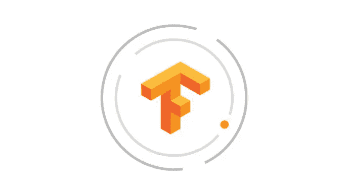
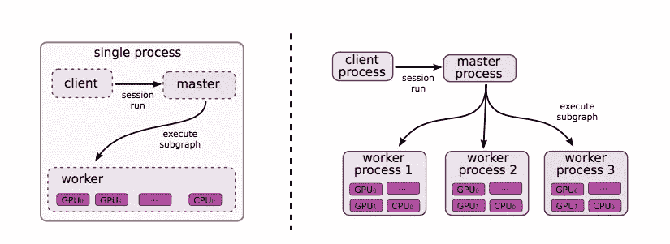
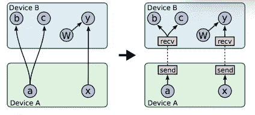
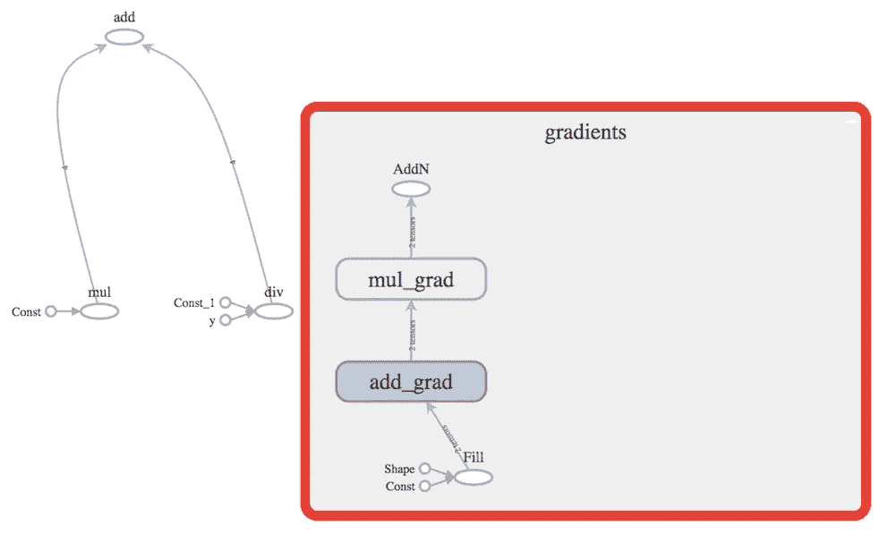

# 张量流:分布式系统中大规模 ML 的新范式

> 原文：<https://medium.com/coinmonks/tensorflow-a-new-paradigm-for-large-scale-ml-in-distributed-systems-fc45458e0c5?source=collection_archive---------4----------------------->



## 介绍

[TensorFlow](https://arxiv.org/pdf/1603.04467.pdf) 是谷歌内部开发的用于机器学习的编程范式。从那以后，他们开源了它，并且有相当多的社区在使用这个新的范例。我打算在这里介绍 TensorFlow 的主要构件和架构。

TensorFlow 是为从强大的 GPU 到轻量级移动设备的异构环境开发的。它既可以用于推理，也可以用于在各种设备上学习。TensorFlow 是谷歌开发的第二代 ML 基础设施——借鉴了[dist faith](http://papers.nips.cc/paper/4687-large-scale-distributed-deep-networks.pdf)的经验

对 DistBelief 的核心改进似乎如下。在这一点上，其中一些可能看起来有点抽象，但随着我们深入细节，就会变得清晰。

1.  用类似数据流的范例描述计算
2.  能够在高度异构的系统中训练和运行模型—从移动设备到强大的服务器群。
3.  以更好的方式表达并行性，允许一组节点更新共享参数
4.  统一的接口，而不是大规模部署用于训练，然后小规模部署用于推理，这通常会导致系统中不希望的抽象。
5.  性能改进

## 张量流编程范式

TensorFlow 程序由程序员使用他们选择的前端语言编写，如 python 或 c++。这些程序被转换成一个有向图。该图表示数据流计算，其中数据从节点经由图边流动。每个节点有多个输入和输出，它代表一个特定的操作。图中流动的大部分数据都表示为张量。张量是任意维数的类型化数组——当你处理矩阵或方程组时，这种构造非常有用。

还有一些控制和循环结构可以重叠，插入到图形中以便更好地控制。让我们定义张量流系统的一些基本元素。

**运算:**运算是一些类似矩阵乘法的运算，可以在图构造的时候推断出来。

**内核:**内核是给定操作的设备特定实现，例如特定于 GPU 的实现。

大多数程序创建一个会话，并使用它来运行数据流计算。Run interface 可以计算图形依赖性，然后可以将节点放置在适当的设备上。想法是设置图表一次，然后通过它运行数据计算多次。还可以通过设置适当的输入和输出来运行子图。

**变量:**变量可用于存储图形多次运行的数据。大多数张量是临时的，在给定的运行过程中会被释放。模型的参数是存储在变量中的良好候选者，因为它们通常在每次运行子图之后被更新。

**张量:**张量是任意维的数组。它们表示在系统中流动的数据，并充当图节点的输入和输出。

**设备:**设备在上面执行给定的任务。使用设备类型(例如 CPU 与 GPU)来识别设备。设备管理它们自己的存储器，并且还调度在给定设备上执行的各种任务。根据设备的类型，可以使用特殊的分配器为张量分配内存。

# 张量流架构

在系统组件方面，TensorFlow 由主机、工作机和客户端组成，用于分布式协调和执行。上一节描述的会话接口充当与*主进程和*工作进程*通信的*客户端*。工人*仲裁对*设备的访问。主人*在提出正确的方案供工人执行的过程中扮演着重要的角色。TensorFlow 可以在完全本地的环境中执行，也可以在分布式环境中执行，这三个实体可以驻留在不同的机器上。

## 在单个或多个设备上执行



LHS — Single GPU device. RHS — Heterogeneous devices each working on part of the subgraph

在单个设备上执行是最简单的情况，只有一个工作人员和一个设备。它可以利用图中内置的图依赖关系。独立节点可以利用设备的并行性。如果给定的节点依赖于其他节点，那么该节点的执行将一直等待，直到所有的依赖都被执行完。

在*多个设备*的情况下，这个问题看起来像是一个调度问题。哪个图节点应该落在哪个设备上？需要跨越设备边界的所有数据怎么办？TensorFlow 中使用的试探法之一是将放置成本建模为以字节为单位的输入/输出张量大小和计算时间的函数。计算时间可以静态估计或基于先前的执行时间。使用这些，调度程序从输入节点开始运行模拟。它考虑给定节点的所有可行设备，然后使用贪婪启发式算法将节点放置在设备上。这考虑了字节传输的成本以及设备所需的计算时间。选择节点执行最早完成的设备。

## 生成的节点:发送、接收、保存、恢复、获取和馈送

一旦建立了节点布局，图形的一些边将不得不穿过器件边界。这是通过在每个设备中放置合成发送和接收存根节点来实现的。(显然，系统用户不必担心这一点，TensorFlow 系统可以在幕后组合这些节点。)所有的通信都由这些节点处理。这些节点将张量作为输入。



Placing subgraphs on two devices, with tensors a and x crossing device boundaries using generated send and receive nodes

这些以通信为中心的节点有助于抽象所有通信和进一步优化。一个这样的优化是，相同的张量获得单个下游接收节点进行通信，以避免额外的复制(在上图中，考虑设备 B 上的*张量 a* recv 节点)。发送和接收节点的另一个优点是，它们可以用于跨设备同步，并且工作人员可以相互通信，而不必成为每个调度依赖项的主节点。这些节点的另一个优点是，在内部它们可以针对 TCP/RDMA 进行优化。

前面我们描述了用于保存状态的变量。由于系统中可能存在故障，TensorFlow 提供了一种检查点机制。这是通过使用保存和恢复节点来完成的，在构建图形时，变量会连接到这些节点。有时值可以被持久地写入文件系统。相反，Restore 节点在重启后的第一次迭代中用于填充给定的变量。

在数据繁重的环境中，执行子图通常很有用。TensorFlow 通过命名图形节点和提供输入/输出端口来实现这一点。缺失的输入/输出可以通过让用户指定输入来填充。子图的输入由*馈送*节点代替，输出由*获取*节点代替。

## 分布式执行

发送和接收节点显然有助于不同子图的分布式执行。如果其中一个节点由于某种原因失败，那么整个执行就会中止。对于故障检测，定期健康检查由主和工人一起执行。发送和接收节点还可以检测彼此之间的通信错误和响应失败。在这种情况下，他们可以再次实例化图形执行的整体中止。

# 高级 TensorFlow 功能

到目前为止，我们已经介绍了张量流的基本范式。这里有一些在机器学习环境中有用的高级功能。

## 梯度计算

ML 中最常见的算法之一是梯度下降。该算法背后的中心思想是对特征的(猜测-实际)误差进行偏导数，然后尝试最小化该误差。导数——给定点的斜率给出了误差最小化的方向。因此 tensorflow 提供了一种内置的方法来计算图形的梯度。图形数据流非常符合现实世界中使用链式法则计算导数的方式。

请参见下面的示例。在此，我们尝试对 *z* w.r.t *x* 取偏导数，即 dz/dx。z，x 和 y 是一维张量。给定 *z* w.r.t *x* 的偏导数为 2x，这个程序的输出为***【array([20，40，60，80]，dtype=int32】)。*** 对于 y 等其他张量也可以做类似的梯度计算。

```
import tensorflow as tf
x = tf.constant([10, 20, 30, 40])
y = tf.constant([1, 2, 3, 4])
z = x * x + y/5
s = tf.Session()
g = tf.gradients(z, x)
print(s.run(g))
```

见 TensorFlow 生成的图结构。它在左侧创建了一个操作树来表示函数。然后，它还通过探索 z 对 x 的依赖性来创建相应的梯度树。这可以通过跟踪依赖于 x 的张量 z 来完成，然后添加前向链接并计算沿路径的梯度。



LHS is the graph for Z = X*X + Y/5 and RHS is the derivative computation for the partial derivative dz/dx i.e. tf.gradients(z,x). See how gradient graph traverses in the opposite direction like the chain rule of composite functions.

这种梯度计算会占用大量内存。除了通过使用高效排序快速释放临时变量的基本启发之外，更多未来的想法围绕着将内存从 GPU 转移到 CPU 等。

## 设备限制

可以使用约束来指定节点，例如在 GPU 上运行此节点。另一个有用的约束是:将一个变量放在具有特定节点的同一设备上，以获得更好的数据局部性。这会影响上面的节点放置算法。节点到设备放置算法首先为图节点找到可行的设备。然后，第二遍计算出哪些节点需要协同定位，然后是该集合的交集，以及前面描述的贪婪试探法，最终确定节点在设备上的放置

## 控制流语句

我们之前简单提到过用控制语句来扩充图数据流。TensoreFlow 提供了类似开关、中断、for 循环的结构。值得注意的是，因为循环中的不同节点可以放置在不同的设备上，所以类似 for-loop 的结构成为分布式循环控制和终止的问题。因此，图结构包括控制节点，并且这些控制节点在每次迭代的开始和迭代的结束以及最终循环的终止期间相互通信。

## 行列

TensorFlow 中的队列结构可用于异步计算。当一个图节点完成生成其输出时，它可以将该数据排队，消费者节点可以在以后准备好时将其出队。类似地，可以将一些数据预取到队列中，以便设备可以在完成之前的计算后立即开始处理这些数据。队列也可用于批量梯度计算。除了标准 FIFO 队列之外，混排队列对于数据的随机化也很有用——这是 ML 中的另一个常见需求。

## 容器

容器内部成为持久状态的后备存储，就像变量所使用的那样。容器的范围被绑定到流程的开始和结束。但是命名容器可以用于长期状态和跨设备。

# 最佳化

在某些模型上，Tensorflow 比 dist faith 快大约 6 倍。TensoreFlow 中的整体优化侧重于:

1.  消除执行相同操作并具有相同数据副本的公共子图，然后使这些子图指向公共节点。
2.  通信相关的改进集中在延迟接收节点的执行，直到它们准备好接收一些数据
3.  与其他异步系统类似，异步内核提供了一种在计算完成时调用回调的方法，而不是等待计算完成。
4.  TensorFlow 主要使用 Eigen 等优化库进行线性代数相关计算。
5.  许多最大似然算法允许近似浮点运算。当浮点数跨设备边界传输时，TensorFlow 在尾数部分使用较少的位数。

## 结论

总的来说，我发现基于数据流的方法非常有趣。图形结构和一些梯度计算和相关的见解是非常强大的 IMO。总的来说，这种范式对于像 ML 中流行的数据丰富的应用程序来说似乎非常强大。

> [在您的收件箱中直接获得最佳软件交易](https://coincodecap.com/?utm_source=coinmonks)

[](https://coincodecap.com/?utm_source=coinmonks)