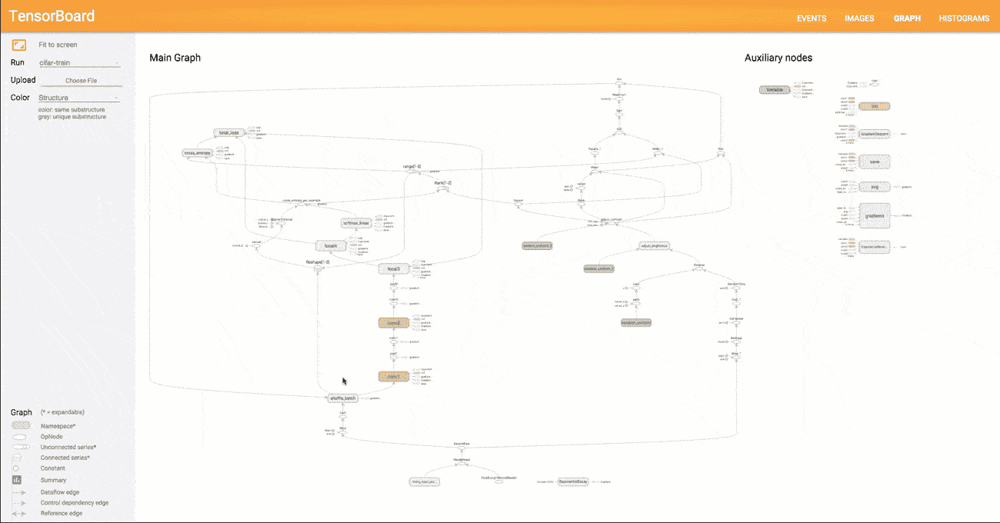
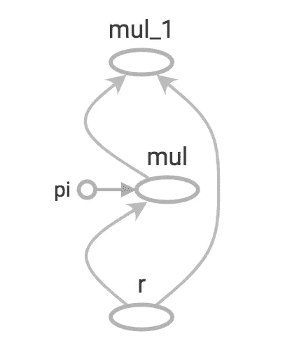

# 张量流-图形和会话

> 原文：<https://medium.com/coinmonks/tensorflow-graphs-and-sessions-c7fa116209db?source=collection_archive---------2----------------------->

Image courtesy: tensorflow.org

Tensorflow 一直是最受欢迎的高性能数值计算开源软件库，自谷歌开源以来，它在机器学习从业者中非常受欢迎。它已经成为深度学习项目的首选框架之一，因为它具有丰富的特性，能够在不降低灵活性和可伸缩性的情况下抽象大量样板代码和配置。然而，本文将尝试讨论一些底层的基本原则，这些原则在使用像 Keras 或 Tensorflow 估算器这样的高级 API 时是不必要的。

***什么是图？***

Tensorflow 有一个惰性评估，换句话说，Tensorflow 将首先创建一个计算图形，将操作作为图形的节点，并对其边缘进行张量，当图形在会话中执行时，执行就会发生。这就是通常所说的专用于并行计算的[数据流](https://en.wikipedia.org/wiki/Dataflow_programming)编程模型。

例如在普通 python 中

将打印出的 ***Hello World*** 输入到输出中但是用 Tensorflow、

将打印出的 ***张量(" Const:0 "，shape=()，dtype=string)*** 输出到输出。这是因为我们还没有在会话中运行计算图形，所以 Tensorflow 仍然只创建了图形。

***那么，使用图表有什么好处呢？***

*   **排比。**通过使用显式边来表示操作之间的依赖关系，系统很容易识别可以并行执行的操作。
*   **分布式执行。**通过使用显式边缘来表示在操作之间流动的值，TensorFlow 可以将您的程序划分到连接到不同机器的多个设备(CPU、GPU 和 TPU)上。TensorFlow 在设备之间插入了必要的通信和协调。
*   **编译。TensorFlow 的 XLA 编译器可以使用数据流图中的信息来生成更快的代码，例如，通过融合相邻的操作。**
*   **便携性。**数据流图是模型中独立于语言的代码表示。你可以在 Python 中建立一个数据流图，存储在 SavedModel 中，在 C++程序中恢复，实现低延迟推理。

***让我们构建一个简单的图形并执行它***

让我们创建一个计算图来计算圆的面积。计算圆的面积的数学函数是:a = πr^2

首先让我们定义我们的图表:

我们有一个称为“pi”的常数和一个占位符“r ”,它将作为一个输入馈入到这个图形中。

让我们检查节点的图形和值。默认情况下，Tensorflow 会为您创建一个图表，但您也可以创建自己的图表。

输出将类似于这样:[ <tf.operation type="Const">，<tf.operation type="Placeholder">，<tf.operation type="Mul">，<tf.operation type="Mul"></tf.operation></tf.operation></tf.operation></tf.operation>

Graph generated by Tensorboard

要运行此图，让我们创建一个 Tensorflow 会话，并以 r = 5 作为输入运行该会话。

您可以将之前在会话中定义的占位符值作为 python 字典提供，其中关键字是占位符名称，值可以是列表。

这是 Tensorflow 的图表和会话中的一个秘密峰值。如何将这些用于神经网络将在以后的文章中讨论。然而，有了像 Keras 和 Tensorflow Estimators 这样的新的高级 API，开发人员不再需要担心这些底层概念，但从长远来看，了解内部工作方式确实是有益的。

请在下面留下您的评论，如果您认为这将是有用的，请鼓掌并分享。谢谢！

***原帖可在***[***Keshan . github . io***](https://keshan.github.io/graphs-sessions/)找到