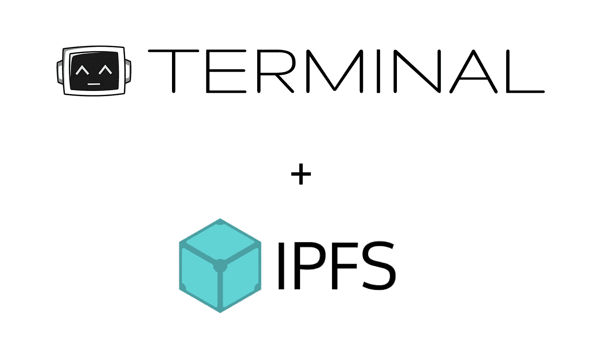
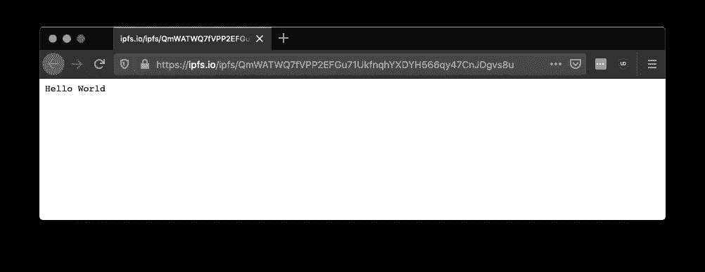
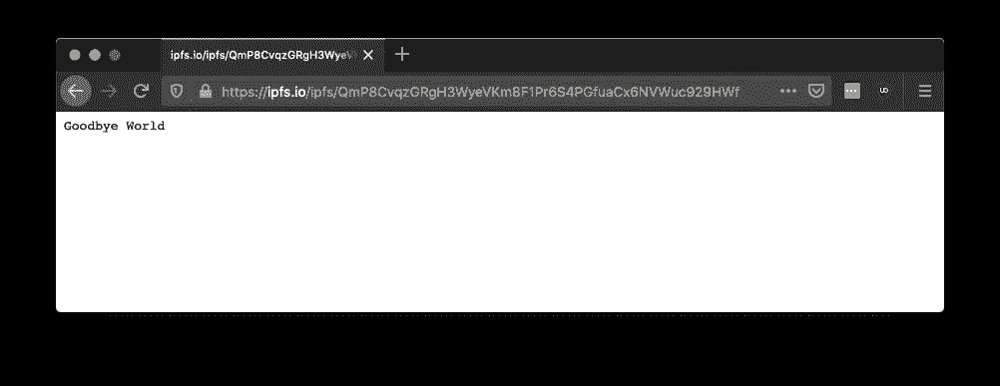
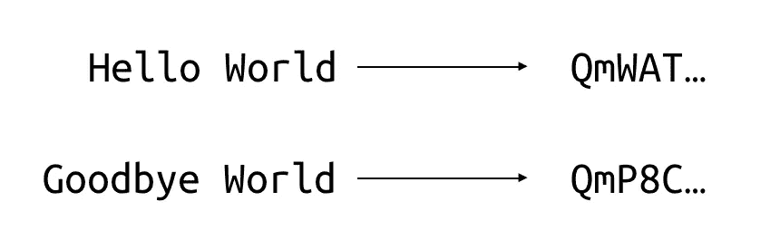
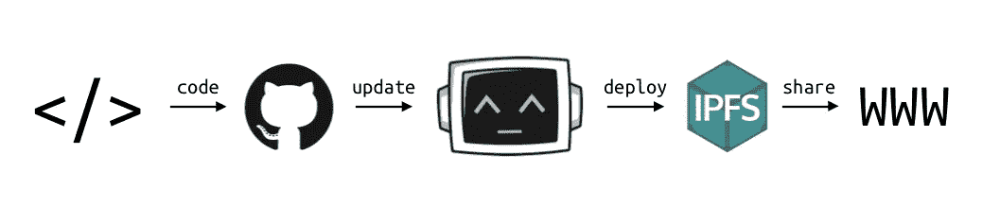
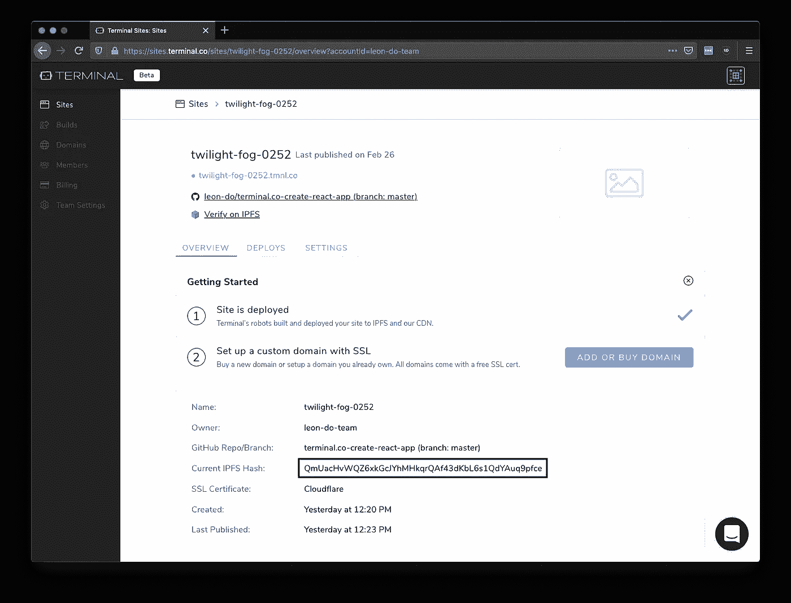

# Terminal.co+IPFS:简化了 Web3 部署

> 原文：<https://medium.com/coinmonks/terminal-co-ipfs-web3-deployment-simplified-da70efee7e74?source=collection_archive---------2----------------------->

# 概述:终端系统

[终端](https://terminal.co/?utm_source=coincodecap.com)提供无缝工作流程。它提供了在 IPFS 部署和管理站点所需的所有工具。关注内容和代码。[终端](https://terminal.co/?utm_source=coincodecap.com)处理剩下的。

# IPFS 和数据完整性

IPFS 代表星际文件系统。这是一个分布式文件系统，用于存储和共享文件、数据和网站。该系统具有独特的优势，如分散化和数据完整性。更多信息[点击这里](https://docs.ipfs.io/introduction/overview/)。

Photo by [Nicolas Picard](https://unsplash.com/@artnok?utm_source=medium&utm_medium=referral) on [Unsplash](https://unsplash.com?utm_source=medium&utm_medium=referral)

IPFS 通过创建一个可以在任何地方托管的对等网络来实现去中心化。它通过链接到它的内容而不是位置来提供数据完整性*。例如:*

[https://ipfs . io/ipfs/qmwatwq 7 fvpp 2 efgu 71 ukfnqhyxdyh 566 QY 47 cnjdgvs 8 u](https://ipfs.io/ipfs/QmWATWQ7fVPP2EFGu71UkfnqhYXDYH566qy47CnJDgvs8u)

QmWAT…是内容“Hello World”的散列。

如果有人将“Hello World”改为“Goodbye World ”,哈希**和链接**都会改变。

[https://ipfs . io/ipfs/qmp 8 cvqzgrgh 3 wyevkm 8 f1 pr 6s 4 pguacx 6 nvwuc 929 hwf](https://ipfs.io/ipfs/QmP8CvqzGRgH3WyeVKm8F1Pr6S4PGfuaCx6NVWuc929HWf)

如果不改变链接，就不可能改变内容，这对于数据完整性来说是非常好的。但是…

# 内容变了怎么办？

如果内容改变了，哈希也会改变，链接也会改变。

new content -> new hash -> new link

如果你正在添加/更新内容，这可能是一个令人头痛的问题。想象一个每天都有新文章的博客。每次有变化时，你都必须生成一个新的散列。

下游的一切也会被改变。如果您有一个域名(myawesomeipfswebsiteblog.com)，那么您必须将[值](/coinmonks/how-to-host-a-website-on-ipfs-with-dns-82f1f2fe6361)更新为新的散列。

Photo by [Aditya Chinchure](https://unsplash.com/@adityachinchure?utm_source=medium&utm_medium=referral) on [Unsplash](https://unsplash.com?utm_source=medium&utm_medium=referral)

# Terminal.co

终端旨在将 web 开发简化为一个无缝的工作流程。只需将更改推送到 Git，终端就会自动更新、锁定和部署下游的更改。

一些功能:

*   终端支持许多框架，如 gatsby、jekyll、create-react-app 等。
*   终端也处理 DNS 记录。要么从他们那里购买一个域名，要么将它指向您在其他地方购买的域名。
*   无需手动更新哈希值、TXT 值等。
*   终端提供了一个 [CID](https://docs.ipfs.io/guides/concepts/cid/) (内容标识符)用于更多的 IPFS 功能，如验证和自托管。

# 更多信息

*   如需提前访问，请访问[终端 Beta](https://terminalbeta.typeform.com/to/kionHH) 。
*   更多细节，请查看他们的[文档](https://docs.terminal.co/)。(不久将有更多内容)
*   更多问题和 24/7 支持，加入他们的[松弛](https://app.slack.com/client/TT3NZ3XDY)。

> [直接在您的收件箱中获得最佳软件交易](https://coincodecap.com/?utm_source=coinmonks)

