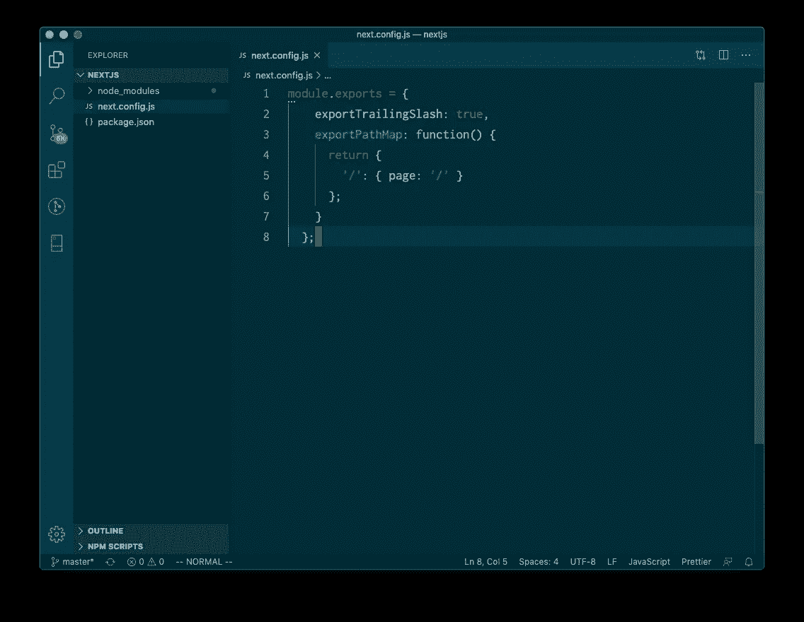

# Terminal.co+next . js

> 原文：<https://medium.com/coinmonks/terminal-co-next-js-a44cae8350f8?source=collection_archive---------0----------------------->

## 使用 Terminal.co 和 IPFS 部署 Nextjs 应用程序


# 概观

我们将使用创建一个 Next.js 应用程序，并用[Terminal.co](http://Terminal.co)部署它。整个过程需要 10 分钟。

工具:

*   Terminal.co 账户
*   GitHub 帐户
*   node.js/npm

# 步骤 1:在 Github 上建立一个回购协议

创建一个空存储库并克隆它。


使用以下内容创建 Next.js 应用程序:

```
$ mkdir nextjs && cd nextjs
$ npm init --y
$ npm install next react react-dom
```


打开`package.json`并添加以下脚本

```
"scripts": {
    "dev": "next",
    "build": "next build",
    "start": "next start",
    "export": "next export"  
}
```


在根目录下创建一个`next.config.js`文件

```
module.exports = {
  exportTrailingSlash: true,
  exportPathMap: function() {
    return {
      '/': { page: '/' }
    };
  }
};
```



让我们创建一些页面:

创建一个名为`pages`的文件夹

内页，创建`index.js`

```
// index.js
import Link from "next/link";export default function Index() {
  return (
    <div>
      <h1> Index </h1>
      <Link href="/about">
        <a> About </a>
      </Link>
    </div>
  );
}
```

还有`about.js`

```
// about.js
export default function About() {
  return (
    <div>
      <h1> About </h1>
    </div>
  );
}
```

它应该看起来像这样


要进行测试，运行`npm run dev`并访问 localhost:3000


git 添加、提交、推送


[https://github.com/Terminal-Systems-Example/nextjs](https://github.com/Terminal-Systems-Example/nextjs)

# 步骤 2:设置 Terminal.co

签到:[https://sites.terminal.co/](https://sites.terminal.co/)

使用 Github 登录


添加新网站


用 Github 连接。


选择 Next.js 存储库。


要创建新站点:

构建命令:`npm install && npm run build && npm run export`

发布目录:`out`

部署网站


完成后，查看您的网站。


您可以使用提供的域名查看网站。

`https://<your-custom-domain>.tmnl.co`

或者向 CID 核实。

`https://ipfs.io/ipfs/<CID>`


# 第三步:更新

每当您对 GitHub 进行更改时,“终端”会自动重新部署您的网站。确保提供的域名将保持不变，并将指向新的 CID。这使你能够在 IPFS 上建立快速的现代网站。

[](https://coincodecap.com)

> [直接在您的收件箱中获得最佳软件交易](https://coincodecap.com/?utm_source=coinmonks)

[](https://coincodecap.com/?utm_source=coinmonks)