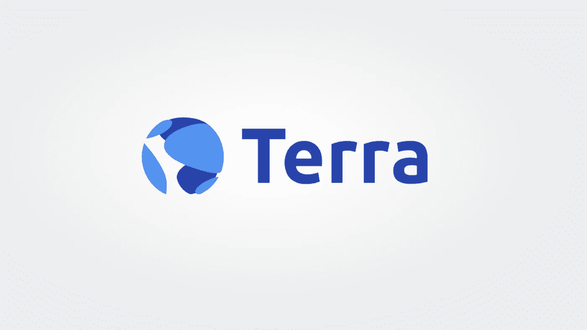

# 特拉区块链和戴普斯详细解释道

> 原文：<https://medium.com/coinmonks/terra-blockchain-and-dapps-explained-in-detail-3fcf9aa1a8bb?source=collection_archive---------4----------------------->



Terra 是一个 PoS 区块链，使用宇宙 SDK 建造。Cosmos SDK 使用由 Cosmos 团队开发的开源平台 [Tendermint BFT](https://docs.tendermint.com/master/introduction/what-is-tendermint.html) 共识机制。Terra 是一个稳定的硬币平台，它使用 Luna 作为稳定货币价格的基本令牌。Terra 的目标是将真实世界的资产、货币和用例引入去中心化经济。

*此贴仅用于教育目的。不是投资建议。*

露娜是 Terra 中的本土符号。总共有 9 . 85 亿 Luna 在流通中，其中近 32%被套牢。目前的赌注回报是 11.2%的 APY。(来源: [Terra 站](https://station.terra.money))

Terra 有一个连锁治理，要求 Luna 持有者通过存放一些 Luna 来提交一个提议。提案至少需要 512 卢纳才能有效投票。如果更改任何区块链参数的建议获得通过，该建议将自动实施。参数更改不需要任何编码更改。
更复杂的提议需要社区以某种方式来实现。复杂的提议需要改变编码。Terra 核心团队将率先实施。

Terra 支持使用 [CosmWasm](https://docs.cosmwasm.com) (WebAssembly)的[智能合约](https://docs.terra.money/contracts/#developer-tools)平台。Terra 智能联系人是用铁锈写的。

Top dApps:
- [镜像](https://mirror.finance)合成资产
- [锚](https://anchorprotocol.com)稳定收益借贷
- [TerraSwap](https://terraswap.io) DEX

# 稳定的硬币

Terra 有一个内置的自动做市商来维持稳定的货币挂钩。Terra 有验证器神谕，它从交易所报告了 stablecoin vs Luna 的真实世界价格。这些价格用于做市算法。

TerraSDR (SDT)是 Terra 中默认的 stablecoin 硬编码。SDT 盯住 [SDR](https://www.investopedia.com/terms/s/sdr.asp) 。在 Terra 还有许多其他稳定的货币，如美元，韩元，MNT 等。而其他的也可以被引入 Terra。

Terra 使用[常数乘积](https://docs.terra.money/dev/spec-market.html#market-making-algorithm)市场标记算法。市场由相等的 Luna 和 SDR 池初始化。这些资金池的特别提款权价值相等，资金池的大小由称为"基础资金池"的参数决定。这些是[虚拟流动性池](https://docs.terra.money/dev/spec-market.html#virtual-liquidity-pools)，用于防止先知先觉。虚拟意味着这些池不存在，并且没有令牌存放在其中。这是一种算法，是 Terra 码的一个组成部分。

```
# set by the BASE_POOL paramter
POOL_BASE = 1000
# initially equal to POOL_BASE
POOL_SDR = 1000
# this price is reported by oracles
PRICE_LUNA_PER_SDR = 0.5
# With the price changes POOL_LUNA will keep changing
POOL_LUNA = 2000 # 1000 / 0.5
CP = POOL_SDR * POOL_LUNA * PRICE_LUNA_PER_SDR
```

每次铸造交易后，池的大小都会改变。该协议将池大小的变化存储在一个名为“TerraPoolDelta”的参数中。每次交换后，更新“TerraPoolDelta ”,它是 stablecoin 池与 BasePool 大小的偏差。

创建 SDT 后，池的新大小将为:

```
POOL_SDR = POOL_BASE + TERRA_POOL_DELTA
POOL_LUNA = POOL_BASE² / (POOL_SDR * PRICE_LUNA_PER_SDR)
```

“TerraPoolDelta”在一个称为“PoolRecoveryPeriod”的周期内减少。这样做是为了减少池之间的传播，使铸币可以再次经济。

当露娜被转换成大地稳定币时，它被协议捕获并烧毁，这被称为[铸币](https://docs.terra.money/dev/spec-market.html#seigniorage)。被烧毁的露娜通过给予一部分给验证者神谕作为投票的奖励而被重新生成到系统中，其余的被添加到[社区池](https://docs.terra.money/dev/spec-distribution.html#community-pool)。社区基金是为土地开发提供资金的代币储备。铸造了价值低于此值的硬币。

```
offered Luna — spread fees
```

[价差费](https://docs.terra.money/dev/spec-market.html#swap-fees)也称为掉期费，用于防止抢先攻击。Terra 的最低硬编码价差费用为 [0.5%](https://agora.terra.money/t/proposal-to-decrease-poolrecoveryperiod-to-8hour-4800-block/261) 。传播费用可以根据上面讨论的 CP 算法而变化。

当 Terra stablecoin 转化为 LUNA 时，所有提供的 stablecoin 都会被烧掉，并铸造与该值相当的 Luna。

一个用户总是有两个选择，使用公开市场交换卢娜和 UST，或者使用协议的铸造机制铸造 UST。当用户想要 UST 的 Luna 时，这也是有效的。选择取决于铸造价格和购买价格之间的差价。铸造是一种协议级活动，它需要与区块链直接交互。而互换是在交易所进行交易。

UST 是与美元挂钩的稳定货币之一。1 美元的价格是由神谕报告的。神谕报出了每月 10 美元的价格，而铸造 UST 的价格是每月 11 UST。如果 1 UST 的市场价格是 1 美元，那么对用户来说，铸造来自露娜的 UST 并以 1 美元的利润出售是有意义的。这是一次前跑攻击。这将导致 UST <>美元的价格下跌。Terra 使用虚拟流动性池来防止此类攻击。

另一种情况是，汇率为 1.1 UST 兑 1 美元，但 10 美元兑 1 月的汇率与 10 UST 兑 1 月的铸造汇率相匹配。用户可以从交易所购买 1 UST，然后铸造价值 1 UST 的月神。最后在交易所出售铸造的月神，以美元赚取利润。从逻辑上讲，从交易所购买 UST 的行为将推动 UST 的价格上涨，并缩小差距。

在 Terra 上的每一笔 stablecoin 交易中，都会收取一笔[稳定费](https://docs.terra.money/dev/spec-auth.html#stability-fee)。该费用在验证者之间分配。可以是交易额的 0.1%到 1%不等。Luna 交易免除稳定费。

上面讨论的许多参数和概念将在下一次更新[哥伦布-5](https://agora.terra.money/t/terra-core-priorities-for-q1-q2-2021/388) 中改变。

# 镜像金融

[镜像](https://mirror.finance)是 Terra 上推出的一个成功项目。它允许创造被称为[群体](https://docs.mirror.finance/protocol/mirrored-assets-massets)的合成资产。合成资产不是衍生品，它只是真实资产价格的镜像。要形成一个集合，你必须以 UST 或另一个集合的形式提供被称为债务抵押头寸(CDP)的抵押品。目前抵押率是 150%。例如，你可以给 UST 300 英镑作为抵押，来铸造 UST 200 英镑的大批量生产。过程与 [MakerDao](https://makerdao.com/en/) 非常相似。

Mirror 从[波段协议](https://bandprotocol.com)得到大众的市场价格，这是一个预言。价格每 30 秒更新一次。如果大量股票的价格上涨，比率低于 150%，你的 CDP 将被清算。为了防止这种情况，你必须要么存入更多的抵押品，要么存回大量抵押品，使比率高于 150%。

在镜像上铸造资产是针对该资产的空头头寸。例如，你决定铸造一只价值 UST 200 的苹果股票，用 UST 300 作为抵押。这使得抵押品比率正好是 150%。如果苹果股票增值，你的 CDP 将被清算。所以你本质上希望苹果股票贬值。你总是做空你正在创造的大量抵押品。另一个例子是将 UST 存入铸币厂的脸书股票。这让你做空脸书兑美元(不是投资建议)。

Mirror 维持着大量的交易池。对于将 mAsset 存入流动性池，您可以根据您对池的贡献获得一定百分比的交易费。点击阅读更多关于提供流动性的信息。

镜像只允许制造[白名单中的](https://docs.mirror.finance/protocol/mirrored-assets-massets#whitelisting)资产。目前[1.92 亿英镑的 UST](https://terra.mirror.finance) 已经被抵押成价值 4 亿英镑的债券。在 Terra 上铸造的资产可以使用 [Terra Shuttle](https://github.com/terra-money/shuttle) 转移到以太坊区块链。

# 锚

[Anchor](https://docs.anchorprotocol.com) 是一个储蓄协议，提供由 Terra staking 回报驱动的收益。主播当前 APY[17.95%](https://app.anchorprotocol.com/earn)。

贷方将稳定的硬币(UST)存入锚中，以获得稳定的收益(UST)。贷方根据他们的存款得到一个 aTerra(解释如下)代币。

借款人使用名为 [bAssets](https://docs.anchorprotocol.com/protocol/bonded-assets-bassets) (本例中为 bLuna)的债券资产开立 CDP。借款人希望以 CDP 为抵押从 Anchor 借入稳定的资金。他们还将获得 ANC 代币(如下所述)作为额外奖励。

bAssets 是为在 PoS 链中标记代币而接收的可替换代币。它们为抵押资产提供流动性，可以进一步用于金融应用，甚至可以在公开市场出售。持有低音提琴的用户获得赌注奖励。

[bLuna](https://docs.anchorprotocol.com/protocol/bonded-assets-bassets/bonded-luna-bluna) 是 Terra 链中的 bAssets。bLuna 在主播里可以当 CDP。用户必须从白名单验证者列表中委派 Luna 才有资格获得 bLuna。bLuna 率根据砍杀事件进行调整。

```
bLuna redemtion rate = amount of Luna delegated / amount of bLuna minted
```

由于砍杀事件，Luna 委派的数量可能会减少。例如，你委派 1 个露娜，得到 1 个布鲁娜。因为砍杀只剩下点 96 露娜。当你取消删除露娜时，你可以通过放回 1 个 bLuna 来获得 0.96 露娜。所以布鲁纳的汇率降低了。

贷方从 bLuna 抵押品池中获得赌注回报。贷款人会得到一个代币来兑换他们存入的本金。产生的新 aTerra 代币的交换价值等于存款的价值。随着存款产生利息，存款价值增加。阿特拉可以兑换成稳定的硬币。

```
aTerra_exchange_rate = (total_deposits + total_interest) / total_aTerra
```

在 T0 时，存款总额为 100 UST 和 0 利息。赎回率为 1 (100/100)。在 T1 总存款仍然是 UST 100 和 UST 2 利息已经产生。总存款额保持不变，因为没有新的存款。现在赎回率是 1.2 (100 + 2 / 100)。随着利息的增加，aTerra 的价值增加。

[ANC 代币](https://docs.anchorprotocol.com/protocol/anchor-token-anc)按照借款金额的比例发放给借款人。这是一个额外的借款动机，因为 ANC 代币可以用来下注和投票。

锚协议中产生的收益的 10%用于从 TerraSwap 上的 ANC <> UST 对购买 ANC 令牌。购买的代币作为奖励分发给 ANC 赌注者。这种购买机制赋予代币[值](https://docs.anchorprotocol.com/protocol/anchor-token-anc#value-accrual)。为 TerraSwap 上的 ANC < > UST 对提供流动性的用户，也给予 ANC 作为[奖励](https://docs.anchorprotocol.com/protocol/anchor-token-anc#distribution-to-anc-liquidity-providers)。整个生态系统旨在赋予 ANC 代币价值，从而鼓励用户持有它们。

主播用户投票设定目标收益率，称为主播率。ANC 令牌持有者可以投票设置锚定率。而抵押品根据赌注回报赚取实际收益。

当锚定利率低于实际收益率时，超额收益率存储在收益率储备中。此外，ANC 对借款人的象征性激励每周减少 15%。

当锚定利率大于实际收益率时，保留收益率被加到实际收益率上，直到它耗尽。此外，ANC 象征性奖励每周增加 50%。

锚定收费[利息](https://docs.anchorprotocol.com/protocol/money-market)受[复合](https://compound.finance)协议的启发，对借来的马币收取。有一个动态借款限额，它取决于 oracle 报告的 bLuna 对 Stablecoin 的价格。如果达到借款限额，CDP 可以[清算](https://docs.anchorprotocol.com/protocol/loan-liquidation)。

> 加入 [Coinmonks 电报频道](https://t.me/coincodecap)，了解加密交易和投资

## 另外，阅读

*   [网格交易机器人](https://blog.coincodecap.com/grid-trading) | [加密交易机器人](/coinmonks/cryptohopper-review-a388ff5bae88) | [加密交易机器人](https://blog.coincodecap.com/best-crypto-trading-bots)
*   [加密复制交易平台](/coinmonks/top-10-crypto-copy-trading-platforms-for-beginners-d0c37c7d698c) | [如何在 WazirX 上购买比特币](/coinmonks/buy-bitcoin-on-wazirx-2d12b7989af1)
*   [CoinLoan 点评](/coinmonks/coinloan-review-18128b9badc4)|[Crypto.com 点评](/coinmonks/crypto-com-review-f143dca1f74c) | [火币保证金交易](/coinmonks/huobi-margin-trading-b3b06cdc1519)
*   [尤霍德勒 vs 考尼洛 vs 霍德诺特](/coinmonks/youhodler-vs-coinloan-vs-hodlnaut-b1050acde55a) | [Cryptohopper vs 哈斯博特](https://blog.coincodecap.com/cryptohopper-vs-haasbot)
*   [顶级付费加密货币和区块链课程](https://blog.coincodecap.com/blockchain-courses) | [币安评论](/coinmonks/binance-review-ee10d3bf3b6e)
*   [MXC 交易所评论](/coinmonks/mxc-exchange-review-3af0ec1cba8c) | [Pionex vs 币安](https://blog.coincodecap.com/pionex-vs-binance) | [Pionex 套利机器人](https://blog.coincodecap.com/pionex-arbitrage-bot)
*   [如何在印度购买比特币？](/coinmonks/buy-bitcoin-in-india-feb50ddfef94) | [WazirX 评论](/coinmonks/wazirx-review-5c811b074f5b) | [BitMEX 评论](https://blog.coincodecap.com/bitmex-review)