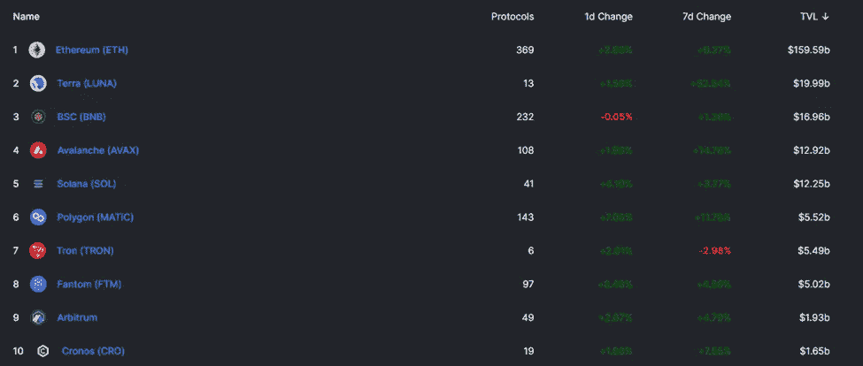
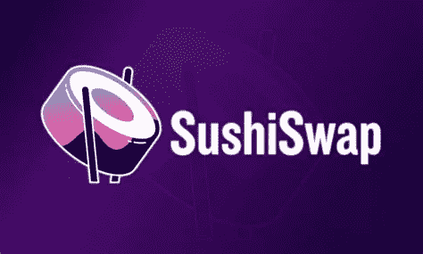
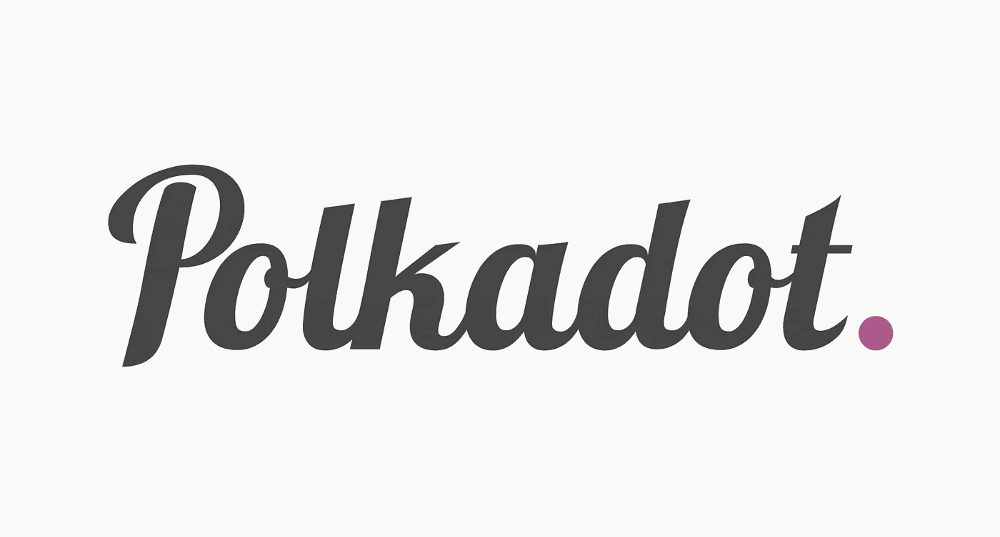
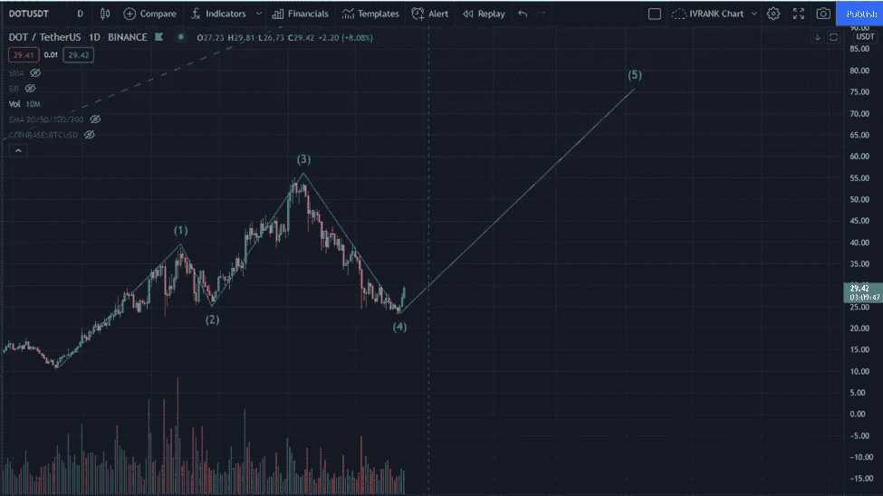
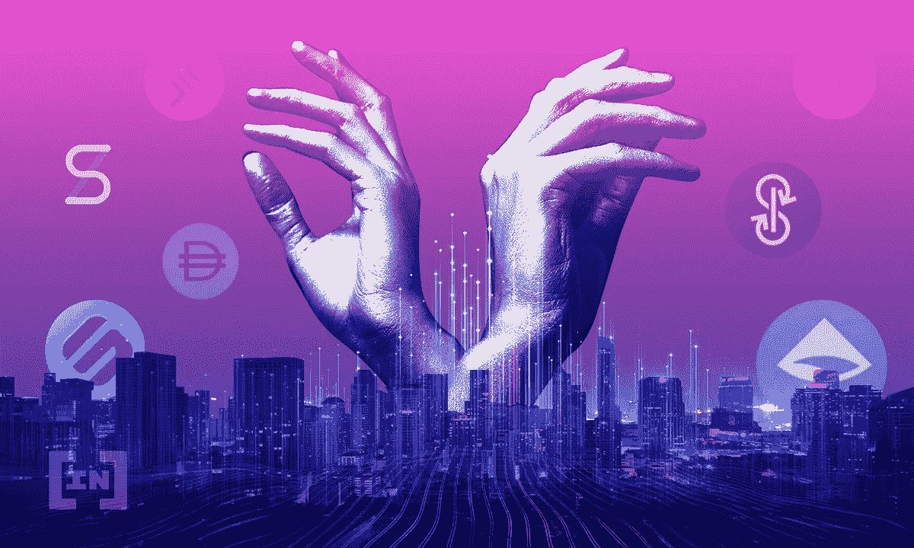

# Terra 时代|加密市场更新 12.23

> 原文：<https://medium.com/coinmonks/terra-era-crypto-market-update-12-23-f576a14d43fe?source=collection_archive---------2----------------------->

## terra | Crypto Market Update | Trade setup DOT | News |新手每日一课:什么是 TVL？

# 概观

*   Terra 时代
*   加密市场更新
*   贸易建立点
*   重大新闻
*   新手每日一课:什么是 TVL？

# Terra 时代

我们正在进入 Terra 时代！是的，这是我自己创造的，但是欢迎你使用。

从一开始就在简讯中提到的 Terra (LUNA)已经上涨了 96%，目前为 95 美元。今天，它在 TVL 超过了币安。它的 TVL 在上周增长了 56%!如果你不知道 TVL 是什么意思，滚动到下面的新手部分。Terra 现在拥有 200 亿美元的资产，仅次于以太坊。为了让你了解这个链条增长有多快，2021 年 1 月 1 日，Terra 在 TVL 仅持有 5300 万美元。

Top Ten TVL rankings

生长的主要催化剂是月神对薄荷 UST 的燃烧机制。我在之前的一篇报道中写道。另一个是锚协议，它在 UST 稳定币上给出了高达 20%的 APY。起锚前，稳定收入的典型 APY 为 5-10%。那么，为什么要继续把美元存在一家给你不到 1% APY 的贪婪银行里呢？像这样的方面有助于支持未来的加密理论。

> 另一个是锚协议，它在 UST 稳定币上给出了高达 20%的 APY

Terra 是一个年轻的网络，11 月初哥伦布 5 号的升级打开了 200 多个协议的大门。它的重点仍然是 DeFi，但 Terra 正在集成专注于 NFTs、支付、元数据甚至游戏的协议。

保持对 Terra 的关注，在价格下跌时找到好的进场点。

# 加密市场更新

**比特币(BTC)** 在昨天的平静一天之后，今天是非常看涨的一天。自今日早间以来，一些交易员一直在利用低流动性推动 BTC 越过 49k 阻力。因此， **BTC 上涨了 5%，至 50.9 万英镑**。

**比特币的统治地位(BTC。D** )持平，表明投资者正在进入所有加密空间，而不仅仅是比特币。

领导层重组的消息传出后，寿司正从 11 个月的低点稳步突破。Sushiswap 是加密中使用最多的指数之一，在 TVL 排名第四，锁定了 55.1 亿美元。有传言称，新董事希望将掉期交易现代化，使其看起来像一个集中的交易所。Sushiswap 在 13 个不同的连锁店都可以买到，在过去的六个月里，内心的骚动已经损害了 Sushiswap 的价格。我预计寿司价格会出现强劲反弹。寿司目前的价格为 7.29 美元，远低于 2021 年 3 月 23 美元的高点。

**近协议(Near)****上涨 26%，至 13.60 美元。**12 月 21 日与 **Terra (LUNA)** 合作后，成交量即将进入。

**著名的推动者**

> ADA +8.9%
> 
> 氩+7%
> 
> 圆点+7%
> 
> 露娜+9.2%
> 
> 马蒂奇+6.7%
> 
> 溶胶+6.9%
> 
> FTM 15.8%

**元宇宙和游戏代币开始苏醒。**

> 法力值+8%
> 
> 沙子+17.3%
> 
> NTVRK +14.9%
> 
> AXS 5.08%
> 
> *比特币恐惧和贪婪指数:* 41 恐惧
> 
> *谷歌趋势 35*
> 
> *最大疼痛(12 月 30 日选项)48k*

[*如何利用恐惧和贪婪指数进行投资*](/@TraderGabi/when-can-we-start-buying-again-c3ffc2a1cd3b)

# 贸易建立点

Polkadot (DOT)自 11 月 5 日以来表现不佳，尽管有 Parachain 拍卖和所有宣传，其股价仍下跌了 56%。前五场拍卖现已完成，经过五年的研发，Polkadot 于 12 月 17 日上线。尽管如此，DOT 仍然是我最喜欢的项目之一，它的多链架构有可能在区块链的未来发挥重要作用。

如果密码市场明年继续攀升，我相信 DOT 将是一个强劲的表现者，现在是以高折扣价收购它的时候了。

我仍然不相信技术分析是预测未来价格的好工具。然而，它仍然是可视化过去价格行为和模式的一个有价值的工具。然而，在日线图上，DOT 开始了艾略特波浪形态的最后一段。前三天显示了点价格的牛市突破，RSI 在 50 是健康的。

如果该模式保持不变，并在第四波的基础上达到 0.618 的 fib 水平，我们可以看到 DOT 在 3 月底或 4 月初达到 75 美元。这一时期恰逢 FOMC 会议，该会议将对 crypto 在 2022 年爬多远产生重大影响。我在以前的报告中写过这个问题。

我建议在 20-22 美元范围内设置止损，以防市场继续下跌。在上涨过程中获利，在上涨 20-30%后将止损归零

# 主要秘密新闻

*   一项有可能通过的 Sushiswap(寿司)提案将 SushiSwap 与 Bancor Network 合并。
*   [**Crypto.com(CRO)**](https://cryptopotato.com/cryptocom-buys-ad-space-super-bowl-2022/)**已经购买了 2022 年超级碗的广告位**
*   **[Lummis 参议员，他的目标是将加密技术“完全整合”到美国金融系统中，以在 2022 年的一项法案中提出一个新的加密监管机构和明确的指导方针](https://www.coindesk.com/policy/2021/12/23/lummis-to-propose-new-crypto-regulator-clear-guidance-in-2022-bill/)。**
*   **[**【BNB】**币安宣布，将根据生成的区块公式和 BNB 价格，用自动刻录系统取代其季度刻录协议。](https://cointelegraph.com/news/binance-introduces-bnb-auto-burn-to-replace-quarterly-burn-protocol)**
*   **[SEC 否决了瓦尔基里和 Kryption 提出的另外两个现货价格比特币交易所交易基金](https://decrypt.co/89144/sec-rejects-valkyrie-kryptoin-spot-bitcoin-etf-applications)。**
*   **潘迪拉的保罗·维拉迪特塔基特对 2022 年的预测。**

# **新手每日一课**

****什么是 TVL？****

****

**TVL 是“锁定总值”的缩写，是加密特有的指标。它表示存放在分散协议中的资产总量。这些资产可能用于流动性开采、赌注、赚取利息，或用于其他智能合同设施。在 crypto 中，资产通常是各种类型的硬币或代币，但也包括 NFT。**

**如果你把一个协议看做一个银行，那么银行里所有的钱和资产就是 TVL。因此，资产将不断地流入和流出协议，但多年内不会移动。**

**包含锁定资产的加密协议类型:**

*   ***链条***
*   ***指标***
*   ***贷款人/借款服务***
*   ***收益提供商***
*   ***保险***
*   ***期权交易***
*   ***打桩***

**整个加密的总 TVL 目前为 2561.2 亿美元。**

**为了让您了解 crypto 的发展速度，2020 年 12 月 30 日，TVL 总额为 191.8 亿美元。市场上锁定在协议中的资产价值超过 10 倍。**

**观看 TVL 的最佳地点是 Defi Llama。**

**现在你已经了解了 TVL，下周一，我将解释它如何作为一个有用的工具来评估协议和整个加密市场。**

**如果你喜欢这篇时事通讯，并且认为它值 20 satoshis(0.01 美分)，请点击下面的按钮，支持我的写作。(最多 50 次！)***

**感谢阅读！多吃点，多睡点，多喝点，开心点。祝我在西班牙的朋友们圣诞快乐。**

# ****加比****

***在* [*上关注我【推特】*](https://twitter.com/TraderGabi) *和* [*中*](/@TraderGabi) *或在* [*上订阅本刊快讯*](https://tradergabi.substack.com/)**

***为了从这份简讯中获益，建议每天阅读，以便与加密市场保持同步。它将把读者放在消息灵通的 2%的市场参与者中。读者将开始看到对大多数人来说不明显的机会，并将打开更多的机会。时事通讯由许多小时的图表、链上指标、新闻和发展叙述组成，浓缩为 5 分钟的更新。这是我对一个对我贡献良多的密码社区的贡献。***

> **加入 Coinmonks [电报频道](https://t.me/coincodecap)和 [Youtube 频道](https://www.youtube.com/c/coinmonks/videos)了解加密交易和投资**

## **另外，阅读**

*   **[霍比评论](https://blog.coincodecap.com/huobi-review) | [OKEx 保证金交易](https://blog.coincodecap.com/okex-margin-trading) | [期货交易](https://blog.coincodecap.com/futures-trading)**
*   **[Godex.io 审核](/coinmonks/godex-io-review-7366086519fb) | [邀请审核](/coinmonks/invity-review-70f3030c0502) | [BitForex 审核](https://blog.coincodecap.com/bitforex-review)**
*   **[Crypto.com 费用](/coinmonks/binance-fees-8588ec17965) | [僵尸加密审查](/coinmonks/botcrypto-review-2021-build-your-own-trading-bot-coincodecap-6b8332d736c7) | [替代品](https://blog.coincodecap.com/crypto-com-alternatives)**
*   **[交易信号是什么？](https://blog.coincodecap.com/trading-signal) | [Bitstamp vs 比特币基地](https://blog.coincodecap.com/bitstamp-coinbase) | [买索拉纳](https://blog.coincodecap.com/buy-solana)**
*   **[ProfitFarmers 回顾](https://blog.coincodecap.com/profitfarmers-review) | [如何使用 Cornix 交易机器人](https://blog.coincodecap.com/cornix-trading-bot)**
*   **[MyConstant 点评](https://blog.coincodecap.com/myconstant-review) | [8 款最佳摇摆交易机器人](https://blog.coincodecap.com/best-swing-trading-bots)**
*   **[MXC 交易所评论](/coinmonks/mxc-exchange-review-3af0ec1cba8c) | [Pionex vs 币安](https://blog.coincodecap.com/pionex-vs-binance) | [Pionex 套利机器人](https://blog.coincodecap.com/pionex-arbitrage-bot)**
*   **[我的加密副本交易经历](/coinmonks/my-experience-with-crypto-copy-trading-d6feb2ce3ac5) | [比特币基地评论](/coinmonks/coinbase-review-6ef4e0f56064)**
*   **[CoinFLEX 评论](https://blog.coincodecap.com/coinflex-review) | [AEX 交易所评论](https://blog.coincodecap.com/aex-exchange-review) | [UPbit 评论](https://blog.coincodecap.com/upbit-review)**
*   **[AscendEx 保证金交易](https://blog.coincodecap.com/ascendex-margin-trading) | [Bitfinex 赌注](https://blog.coincodecap.com/bitfinex-staking) | [bitFlyer 审核](https://blog.coincodecap.com/bitflyer-review)**
*   **[麻雀交换评论](https://blog.coincodecap.com/sparrow-exchange-review) | [纳什交换评论](https://blog.coincodecap.com/nash-exchange-review)**
*   **[维护卡审核](https://blog.coincodecap.com/uphold-card-review) | [信任钱包 vs 元掩码](https://blog.coincodecap.com/trust-wallet-vs-metamask)**
*   **[Exness 评测](https://blog.coincodecap.com/exness-review)|[moon xbt Vs bit get Vs Bingbon](https://blog.coincodecap.com/bingbon-vs-bitget-vs-moonxbt)**
*   **[如何开始通过加密贷款赚取被动收入](https://blog.coincodecap.com/passive-income-crypto-lending)**