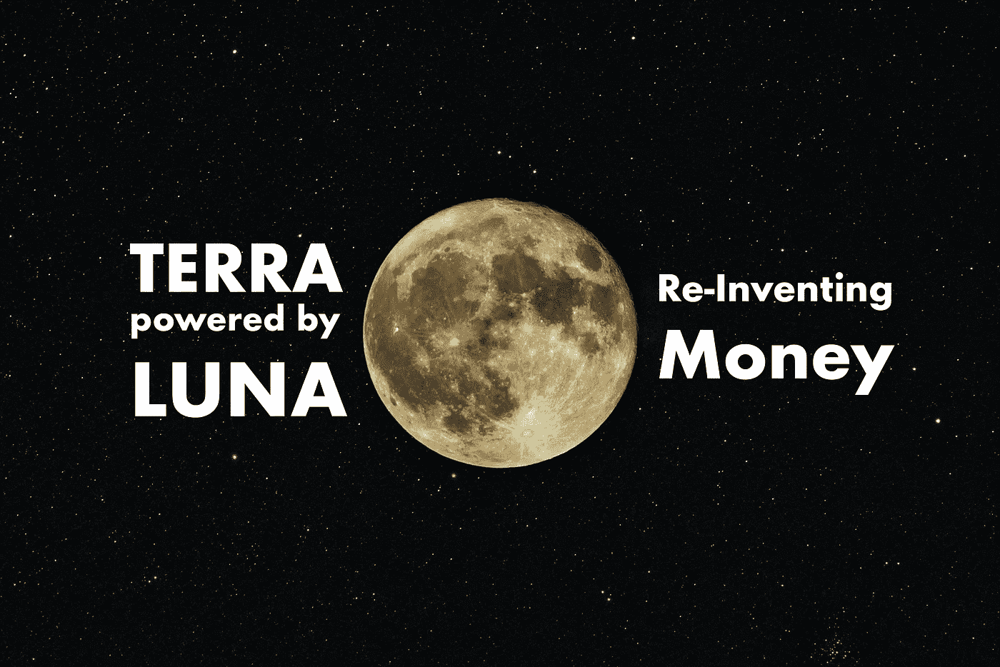

# TERRA & LUNA:互联网可编程货币

> 原文：<https://medium.com/coinmonks/terra-luna-programmable-money-for-the-internet-3eda444b250e?source=collection_archive---------1----------------------->

稳定币是一种加密货币，与美元等价值不会发生太大变化的资产挂钩。与传统的法定货币相比，**用稳定的货币转移资金更快，更便宜，也更容易集成到软件中**。此外，智能合约可以与 stablecoins 一起使用。因此，一个全新的 dApps 和稳定的 coin-integration 宇宙出现了。在这方面，Terra 肯定是一个有趣的玩家。

🌎 -> 🌑 — Photo by [Neven Krcmarek](https://unsplash.com/@nevenkrcmarek?utm_source=unsplash&utm_medium=referral&utm_content=creditCopyText) on [Unsplash](https://unsplash.com/s/photos/moon?utm_source=unsplash&utm_medium=referral&utm_content=creditCopyText), edited by the author