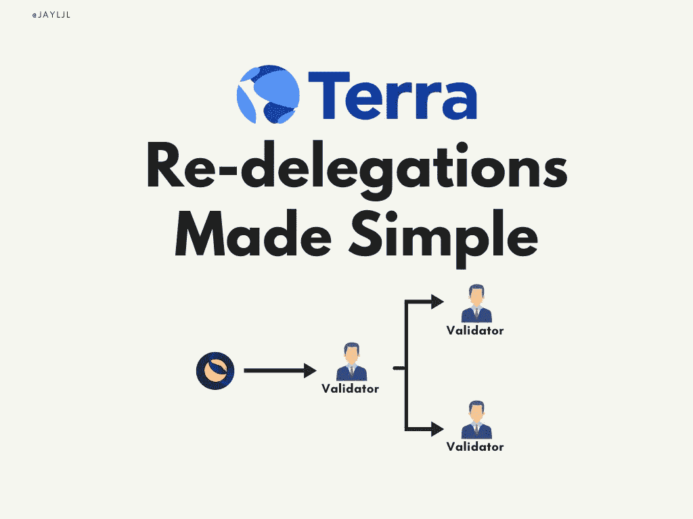
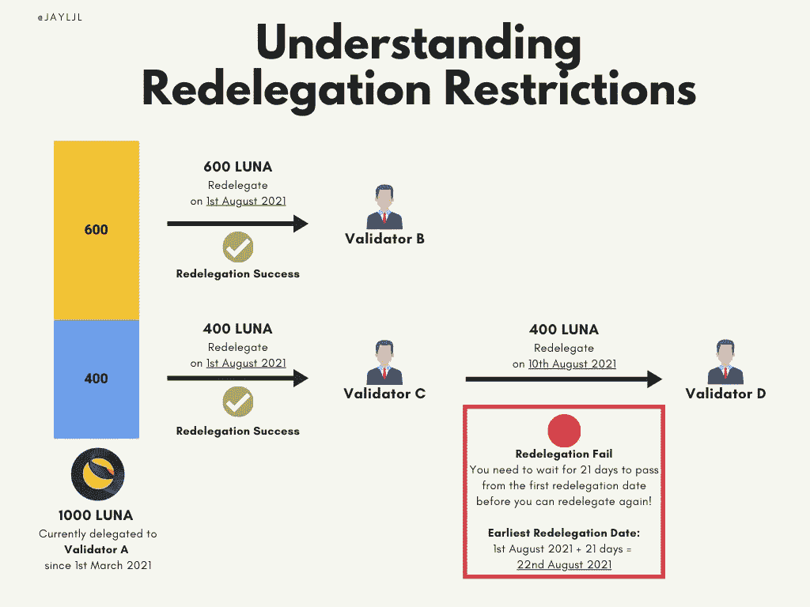
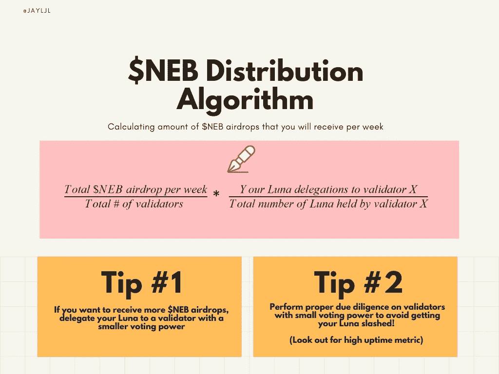
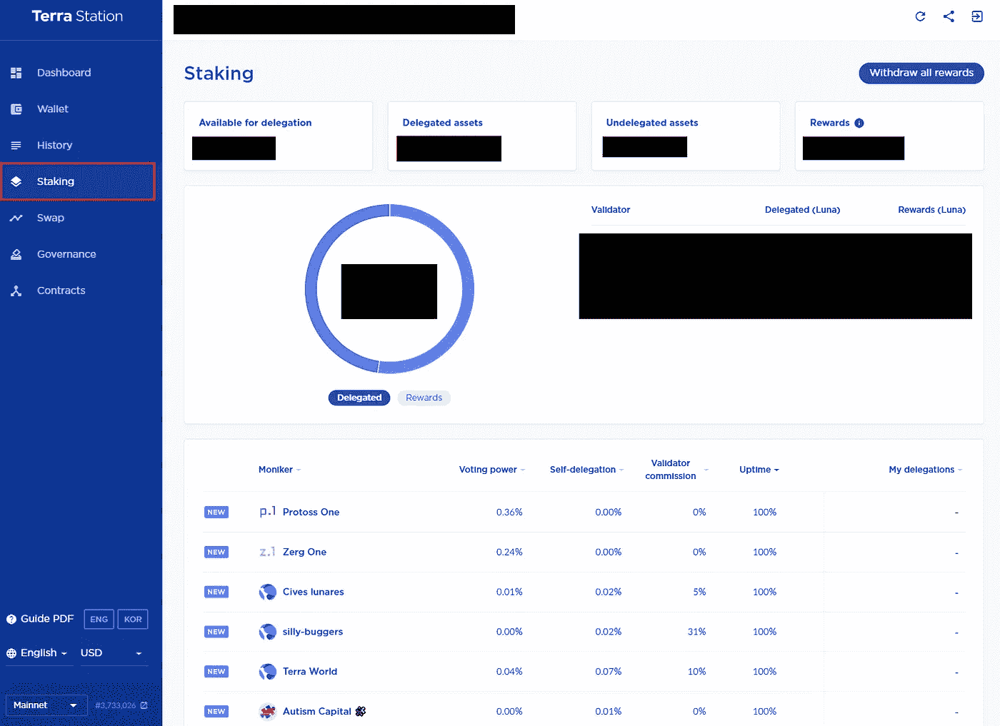
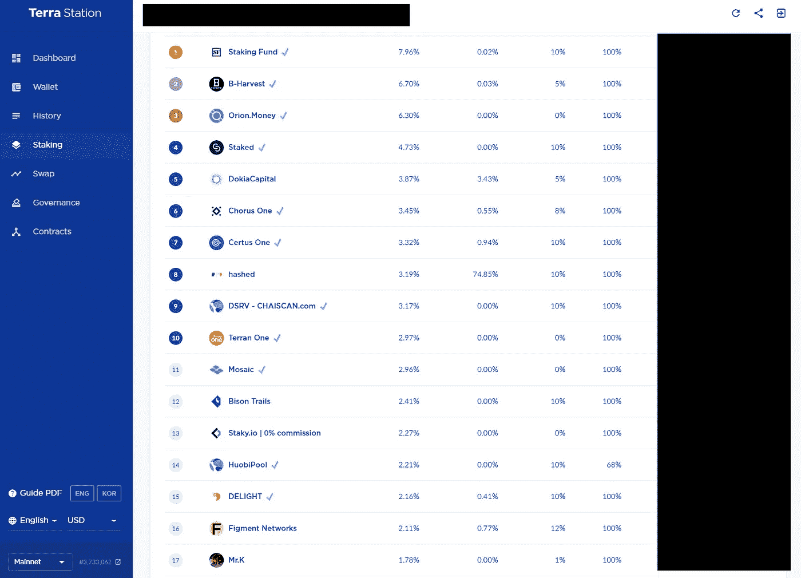
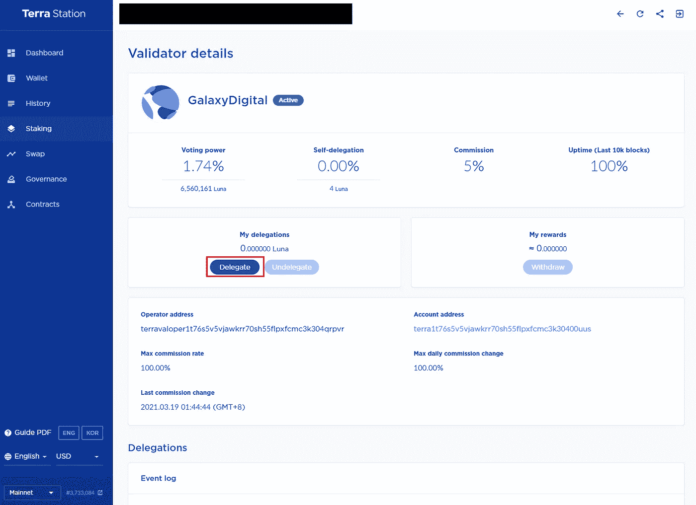
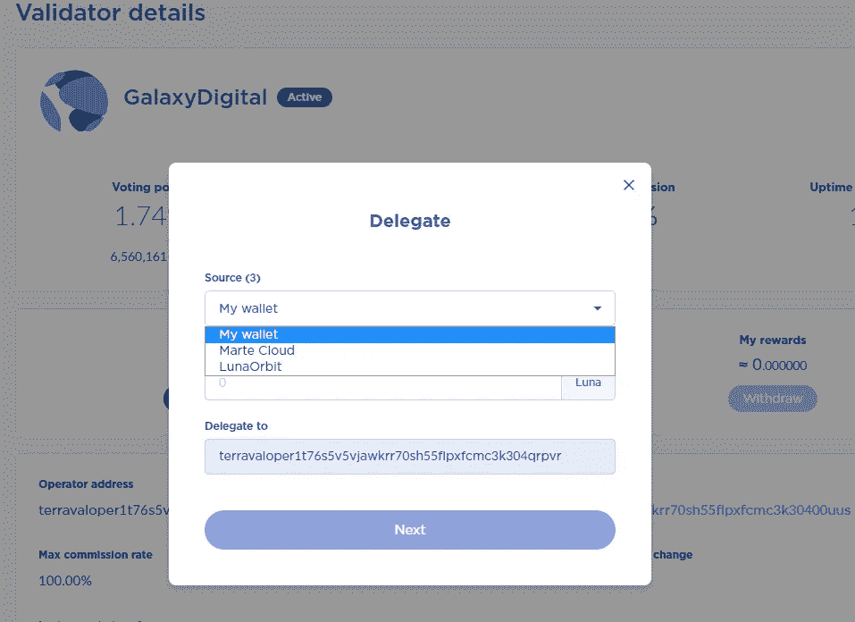
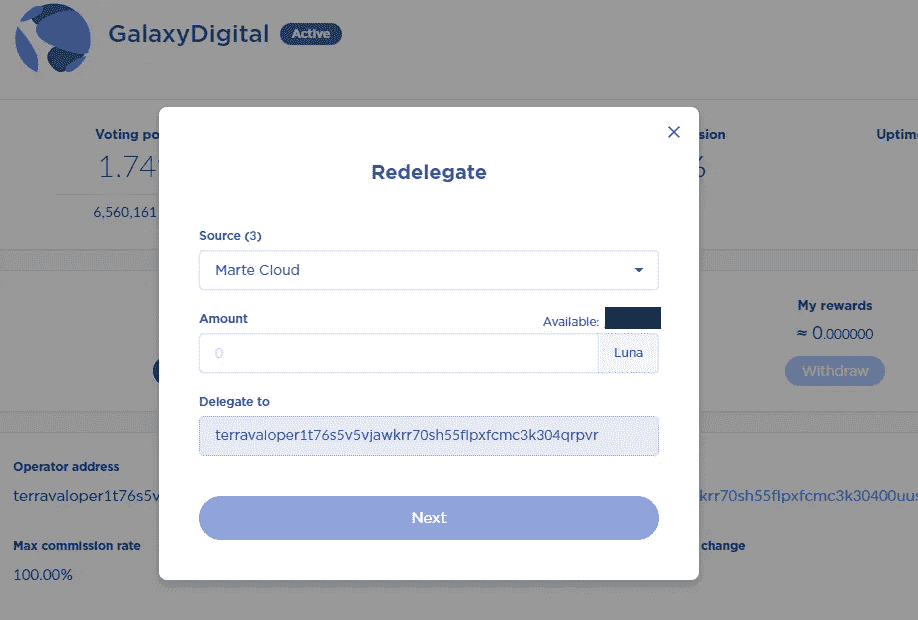
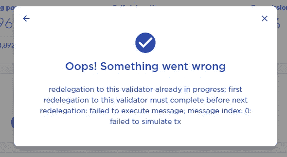

# Terra 重新授权变得简单

> 原文：<https://medium.com/coinmonks/terra-re-delegations-made-simple-a33f1dd6261f?source=collection_archive---------2----------------------->

如果你是 Terra 的新用户，对整个授权和重新授权过程感到困惑，不要烦恼！本文旨在通过解释以下内容来消除您的所有困惑:

*   **如何选择合适的验证器**
*   **在您重新委派之前需要考虑的因素**
*   **为什么你可能想重新授权**
*   **5 个简单的步骤来重新分配你宝贵的$LUNA**

如果您已经是选择验证器的专家，但是仍然不确定重新委托的过程，那么您可以跳过第一部分，直接跳到下一个关于重新委托的部分。

# 如何选择正确的验证器

## 首先，谁是验证者？

验证器在保护 Terra 的委托利益证明(PoS)网络中起着重要的作用。验证者负责通过参与 Oracle 流程来维护系统效率，在区块链形成新的区块，并通过对治理提案进行投票来参与 Terra 的治理。

## 授权过程

你可能听说过下注$LUNA 赚取赌注奖励的概念。将您的$LUNA 委托给验证器将允许您获得这些赌注奖励。

***但是验证器那么多，我该怎么决定委托给谁呢？***

有许多文章深入解释了选择正确的验证器需要注意的因素。我在下面包含了这些文章的链接。概括来说，这里有 6 个关键决策因素:

## 指标#1:验证者佣金

> 你将向验证者支付多少佣金(费用)

## 指标 2:正常运行时间

> 在过去的 10，000 个块中，验证程序的服务器运行了多久

## 衡量标准 3:自我授权

> 验证器在游戏中有多少皮肤——潜在地减少你暴露于砍杀的风险

## 衡量标准#4:潜在的赌注回报

> 你会从验证者那里得到多少赌注奖励

*   注 1:你不再能在 Terra Station 上看到赌注回报，但你可以通过使用“正常运行时间”作为代理(最大赌注回报的百分比)来计算。
*   注 2:验证者可能会提供额外的奖励，我会在下面的重新授权部分详细介绍。

## 指标 5:沟通和专门支持

> 验证者通过其社交媒体渠道(Telegram、Twitter、Discord 等)与用户交流的活跃程度如何。)

## 指标#6:对 Terra 的贡献

> 验证器为 Terra 执行的附加增值服务是什么

现在记住这个决策框架，选择对你来说最重要的前 2-3 个因素，并委托给满足这些标准的验证者！

 [## 加密赌注-加密赌注终极指南[2021]

### 这篇文章将会给你一个关于加密的基本概述，加密是如何进入加密世界的，以及它是如何…

blog.coincodecap.com](https://blog.coincodecap.com/staking-crypto) 

# 重新委派前要考虑的因素

1.  重新委托给一个新的验证者**并不需要你放弃你的 Luna**——在重新委托过程中，你仍然可以继续获得赌注奖励。
2.  重新授权有一个 **21 天的冷却期**——这意味着一旦你重新授权了你的 Luna，你将需要等待 21 天才能再次重新授权这部分。请参见下面的信息图，以便更好地理解:

Understanding why your re-delegations might fail

# 为什么你想重新授权

有些情况可能会导致您想要将您的$LUNA 资产重新委托给一个新的验证者。

**重新委派场景 1:您已经将您的$LUNA 委派给**的验证器的某个指标发生了变化

*   验证器将佣金提高到超出您舒适区的比率。
*   验证器显示出[行为不当](https://docs.terra.money/validator/faq.html#what-are-the-slashing-conditions)的迹象(双重签名、停机、不投票)，导致你的委托$LUNA 被削减。
*   验证器在社交媒体上的通信中一直处于非活动状态，您无法获得您需要的任何支持。

如果这种情况发生在您身上，您应该考虑将您的 Luna 重新委托给一个新的验证器，该验证器具有您满意的度量标准。

**重新授权场景 2:一个新的特定于协议的验证程序宣布，如果你授权给他们，你将获得额外的奖励(空投)**

*   最近有一个趋势，Terra 上的某些新协议启动了它们自己的验证器。将 Luna 委托给这些特定协议验证器的用户将获得额外的空投。

一些例子是:

*   [**Orion Money Validator**](https://finder.extraterrestrial.money/columbus-4/validator/terravaloper1259cmu5zyklsdkmgstxhwqpe0utfe5hhyty0at)**——**在 Orion Money Validator 下注将使您赢得奖金 Genesis Airdrops 和 future $ORION airdrops。猎户座的[报纸](https://orion-money.medium.com/orion-money-litepaper-release-7e98bb3acb6f)报道了这一空投分配过程。
*   [**Talis Validator**](https://finder.extraterrestrial.money/columbus-4/validator/terravaloper1qd0uk3wrw73x662y2gx4kaulrzlcky6275gl5s)**——**一个类似的奖金起源和未来空投的模型将给予与 Talis Validator 下注的用户。他们发表了一篇推特帖子解释这种奖金激励。
*   随着时间的推移，我们可能会看到验证者提供增值激励(空投、促销、免费赠品等)。)这可能是你适应重新授权流程的一个关键原因。

本着最大化堆栈产出的精神，您可以考虑将 Luna 重新委托给新的特定于协议的验证器。但是，在这样做之前，请注意场景 3！

**重新授权场景 3:您希望最大化您将获得的$NEB 空投数量**

*   这个场景与场景 2 略有不同。为了促进验证器的去中心化，Do Kwon 最近[引入了](https://twitter.com/d0h0k1/status/1410116854798983172?s=20)一种激励机制，奖励持有较小投票权的验证器的用户。这种机制很可能首先通过[星云](https://twitter.com/nebula_protocol)的$NEB 空投的分发算法引入。

Apply this distribution algorithm to determine the # of $NEB airdrop you will get

如果你授权给有较小投票权的验证者，你可以得到更多的$NEB 空投。但是，请对您再次委托的验证人进行彻底的尽职调查。一般的经验法则是确保验证器有一个强大的正常运行时间度量，因为您不希望由于验证器的不当行为而削减您的委托 Luna！

# **5 个简单的步骤来重新分配你宝贵的$LUNA**

第一步:打开 Terra Station 的“Staking”页面。

步骤 2:滚动并选择您想要重新委托的新验证器。

第三步:点击“委托”。

第四步:点击“源”下拉列表。

第 5 步:选择您想要重新授权的当前验证者，插入您想要重新授权的金额，并批准交易。

一旦您批准了交易，重新授权几乎会立即发生。

**如果您收到此错误消息**

如果您收到此错误消息，这意味着您必须等待 21 天的重新授权期，然后才能再次重新授权。但不要担心，你的露娜仍然是债券，并正在赚取赌注奖励。

就是这样，再委托快乐！

**有用链接:**

*   [Nacho 的赌注&重新授权推文线程](https://twitter.com/nachoscrypto/status/1412842869988102145)
*   [Smart Stake 的重新委派推文线程](https://twitter.com/SmartStake/status/1365481093147803654)
*   [Terra Validator 文档](https://docs.terra.money/validators.html#delegations)
*   [Fynn 的 Terra 验证器概述](https://fynnlikesluna.medium.com/terra-validator-overview-3bb73133740)
*   [AuraStake 的如何在 Terra 上选择验证器](https://fynnlikesluna.medium.com/terra-validator-overview-3bb73133740)

 [## 比特币基地赌注——在您的密码上赢取赌注奖励[2021]

### 本文将讨论比特币基地上可用的赌注选项和比特币基地赌注的其他重要方面…

blog.coincodecap.com](https://blog.coincodecap.com/coinbase-staking)  [## AscendEx 打桩指南[2021]

### AscendEx，以前被称为 Bitmax，是全球加密交换平台，它支持超过 100…

blog.coincodecap.com](https://blog.coincodecap.com/ascendex-staking)  [## Bitfinex 赌注——2021 年赚取被动收入

### 本文将讨论 Bitfinex 交易所提供的 staking 服务。我们也将经历所有的…

blog.coincodecap.com](https://blog.coincodecap.com/bitfinex-staking)  [## CEX。木卫一赌注-赚取被动收入的最佳方式？

### CEX。IO 是一个值得信赖的安全加密交易平台，提供高达 50%的加密赌注回报。在这里，我们将…

blog.coincodecap.com](https://blog.coincodecap.com/cex-io-staking)  [## 币安 ETH 2.0 打桩-你需要知道的一切[2021]

### 无论你是一个完全的初学者还是一个挥霍的交易者，币安都是你开始下注的最佳地点…

blog.coincodecap.com](https://blog.coincodecap.com/binance-eth2-staking)