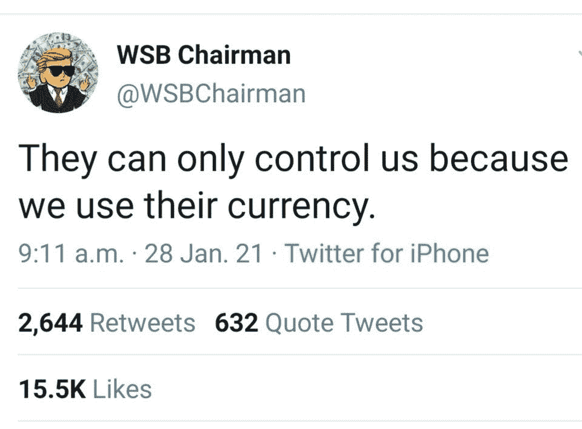
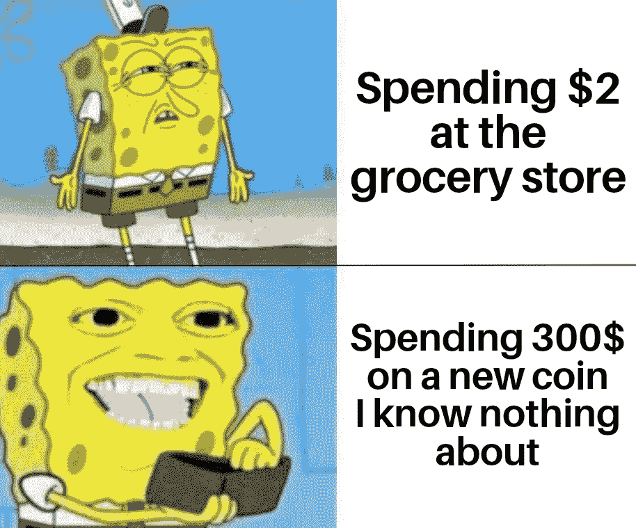
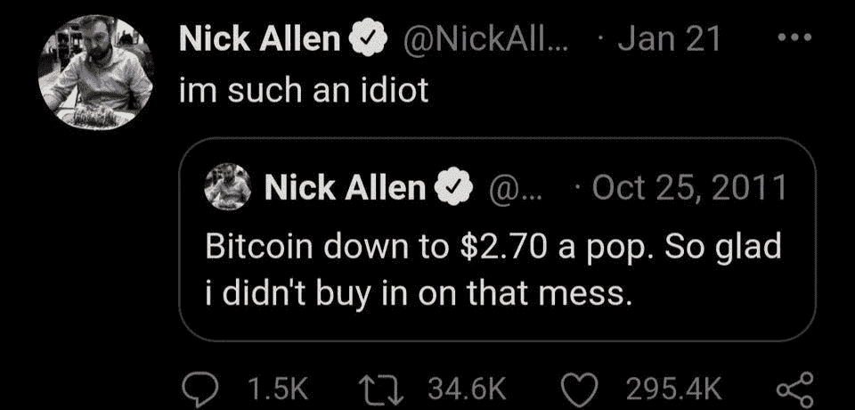

# 特斯拉投资比特币|尼日利亚禁止加密

> 原文：<https://medium.com/coinmonks/tesla-invests-in-bitcoin-nigeria-bans-crypto-a8f4b0ccd154?source=collection_archive---------6----------------------->

[Mood this week](https://www.reddit.com/r/CryptoCurrency/comments/ldrk4k/what_it_feels_like_when_im_upvoting_on_this_sub/)

## Visa 开放 API 供银行客户购买比特币| CME 推出以太期货

*   这家电动汽车制造商周一在提交给美国证券交易委员会的年度报告中表示，根据一项新的投资政策，它已经向比特币投入了总计 15 亿美元，该公司可能“不时或长期收购并持有数字资产”
*   尼日利亚中央银行已下令银行和其他金融机构关闭用于交易加密货币和其他相关交易的客户账户。
*   [铬/铬零时差发现](https://threatpost.com/google-chrome-zero-day-windows-mac/163688/)。立即更新您的浏览器。

## [Bitsgap](https://blog.coincodecap.com/go/bitsgap) 交易报价:

> “成功交易者的目标是做最好的交易。钱是次要的。”—亚历山大·艾尔德

## [Pionex](http://blog.coincodecap.com/go/pionex)

试试专业的加密交易所 Pionex，它有免费的加密交易机器人来自动完成你的交易。阅读我们的 [Pionex 评论](/coinmonks/pionex-review-exchange-with-crypto-trading-bot-1e459d0191ea)并查看我们的 [**加密交易机器人**](/coinmonks/crypto-trading-bot-c2ffce8acb2a) 列表。

## 最新消息📰

*   特斯拉[向比特币](https://www.coindesk.com/tesla-invests-1-5b-in-bitcoin-plans-to-accept-crypto-payments)投资 15 亿美元，计划接受加密支付
*   [CBN 禁止尼日利亚人买卖比特币和其他密码](https://gazettengr.com/breaking-cbn-bans-nigerians-from-buying-selling-bitcoin-other-cryptos/)
*   看些什么，说些什么在线行为惩罚大型科技公司不告发
*   [向往财经](https://www.coindesk.com/yearn-finance-dai-vault-exploit)戴金库“遭了剥削”；流失 1100 万美元
*   怀俄明州的立法者提议让 DAOs 在该州正式注册
*   Visa 标志着进一步的加密野心，为银行客户购买比特币进行 API 试点
*   警方查获[6000 万美元](https://www.reuters.com/article/us-crypto-currency-germany-password-idUSKBN2A511T)的比特币！现在，密码在哪里？
*   加密交易所 Bitfinex 表示，它已经偿还了剩余的 5 . 5 亿美元贷款余额
*   芝加哥商品交易所[推出](https://www.cmegroup.com/trading/ether-futures.html)乙醚期货
*   韩国男孩 I[investor 以 43%的涨幅](https://www.reuters.com/article/us-retail-trading-southkorea-student-inv-idUSKBN2A90YL)成为新的零售交易偶像
*   内华达州的一项法案将允许科技公司创建政府
*   尼克·卡特:彭博对比特币的气候足迹有什么误解
*   以太坊上的加密艺术品销售额达到创纪录的 8000 万美元

> *报税季即将来临，使用最好的* [***加密报税软件***](/coinmonks/best-crypto-tax-tool-for-my-money-72d4b430816b) *来申报你的加密报税吧。*

[Source](https://www.reddit.com/r/Bitcoin/comments/leycab/truer_words_were_never_written/)

> BlockFi 首次推出加密奖励信用卡。在日常购物中获得 1.5%的比特币奖励。现在加入等候名单。

## 好的读物📑

*   杠杆代币的终极指南
*   密码[读取](https://danromero.org/crypto-reading/)
*   为什么印度应该[购买比特币](https://balajis.com/why-india-should-buy-bitcoin/)
*   MEV 和我
*   [莱特币估值](https://bitcoinvalueresearch.substack.com/p/litecoin-valuation)
*   比特币亿万富翁的兴衰[亚瑟·海斯](https://www.vanityfair.com/news/2021/02/the-rise-and-fall-of-bitcoin-billionaire-arthur-hayes)
*   [超比特币化](/coinmonks/hyperbitcoinization-winner-takes-all-69ab59f9695f):赢家通吃
*   [比特币的主根升级](https://www.coindesk.com/taproot-bitcoin-upgrade-improve-technology-software)将如何改进比特币软件栈的技术
*   分散金融:基于区块链和智能合约的金融市场
*   [数字上升](/etherscan-blog/20-charts-of-numba-go-up-2439addf3d02)的 20 个图表
*   Aave vs . Compound:DeFi 贷款巨头之战
*   来自[比特币未来的故事](/@beautyon_/a-tale-from-bitcoins-future-6b9cc2ba3b8d)？
*   [比特币分析](https://bitquery.io/blog/bitcoin-analysis):追踪比特币交易和地址
*   简单的投资指南|人们如何真正致富？
*   比特币将于 2021 年被大规模采用
*   快闪贷款:为什么快闪攻击会成为新常态
*   DataDAOs 的[未来](https://filecoin.io/blog/posts/the-future-of-datadaos/)
*   一个不完整的[加密应用领域指南](https://danny.mirror.xyz/qVp4ob8Skrrq4-TVlRiDvdxrJACt4s6fnVb3uarantQ)
*   为什么比特币是华尔街的答案
*   不，[比特币的所有权](https://insights.glassnode.com/bitcoin-supply-distribution/)并不高度集中——但巨鲸正在积累

> *买一个* [***硬件钱包***](/coinmonks/the-best-cryptocurrency-hardware-wallets-of-2020-e28b1c124069) *和* [*保护你的加密货币*](/coinmonks/how-to-prevent-cryptocurrency-hacking-and-theft-from-your-wallet-65c8ff767766) *。*

[Source](https://www.reddit.com/r/Bitcoin/comments/kmof53/the_8_laws_of_bitcoin_updated/)

> Eth2 核心团队在线[研讨会](https://hackmd.io/@hww/workshop_feb_2021)，2021 年 2 月

## 开发商

*   区块链[开发者](https://outlierventures.io/research/blockchain-developer-trends-2021/)趋势
*   EEA 以太坊[开发者工具调查](https://entethalliance.org/eea-ethereum-developer-tool-survey-results/)结果
*   捐赠代币——支持社区项目的新方式
*   [端到端 Mongodb Graphql 数据库](/coinmonks/end-to-end-mongodb-graphql-database-chainlink-external-adapter-and-oracle-contract-on-ethereum-2f2c5b8df6ce)，Chainlink 外部适配器，以太坊上的 Oracle 契约
*   如何[使基于可靠性的](/@CaptainJS_v2/how-to-make-solidity-based-smart-contracts-async-dapps-less-complex-within-the-tron-network-d32acee6d25b)智能合同异步&dapp 在 TRON 网络中变得不那么复杂
*   [小团体(PoA)私人](/nethermind-eth/clique-poa-private-network-with-nethermind-6cfa21e43a51)幽冥网络
*   [什么是安全审计](https://our.status.im/what-is-a-security-audit-when-you-should-get-one-and-how-to-prepare/)，什么时候应该进行安全审计，如何准备？
*   [利用](https://blog.zkga.me/artifact-minting-exploit) DF v0.5 神器铸造
*   在没有源代码的情况下黑掉一个 [DeFi 服务](/dedaub/look-ma-no-source-hacking-a-defi-service-with-no-source-code-available-c40a6583f28f)
*   [固态状态变量的应用存储](https://dev.to/mudgen/appstorage-pattern-for-state-variables-in-solidity-3lki)模式
*   以太坊 2.0 [mainnet](https://dev.to/q9/ethereum-2-0-mainnet-clients-3and) 客户端

> 想成为一名以太网和 **Web3 开发者**？[从这里开始](http://blog.coincodecap.com/go/learn)。

## 多方面的

*   丹佛联邦理工学院时间表
*   比特币[全节点](https://scarce.city/products/full-node-sculpture)雕塑
*   [历史气价](https://www.gasnow.org/)
*   [scaffold-eth](https://github.com/austintgriffith/scaffold-eth/tree/flash-loans-intro) — Aave 闪贷
*   [OpenZeppelin](https://blog.openzeppelin.com/openzeppelin-contracts-3-4/) 合同 3.4
*   [分光镜](https://github.com/neukind/spectroscope):以太坊 2.0 验证器监控
*   Eth2 核心[团队研讨会](https://www.youtube.com/watch?t=512&v=uGeIDNEwHjs&feature=youtu.be)

## 播客和视频💽

*   MIT 区块链[视频讲座](https://ocw.mit.edu/courses/sloan-school-of-management/15-s12-blockchain-and-money-fall-2018/video-lectures/)
*   丹持有的比特币标准之路
*   秘密货币、监管和定义杰里米·阿莱尔
*   以太坊[推送通知](https://epicenter.tv/episodes/377)服务——分散通知协议
*   [DeFi](https://coincenter.simplecast.com/episodes/defi-and-the-sec) 和 SEC

[Source](https://www.reddit.com/r/CryptoCurrency/comments/ldqu13/who_needs_real_sushi_when_you_got_coin/)

## 加密交易和折扣🔖

*   注册参加[**by bit**](/coinmonks/bybit-exchange-review-dbd570019b71)exchange，赢取高达 625 美元的奖金。
*   在 [**Bityard**](https://blog.coincodecap.com/go/bityard) 获得 258 美元的交易费折扣

## 产品评论和其他加密软件📙

*   [Phemex 评论](https://blog.coincodecap.com/phemex-review) |零费用，无 KYC
*   [免费赚取比特币](https://blog.coincodecap.com/earn-bitcoin)
*   [最佳加密交易所](https://blog.coincodecap.com/crypto-exchange)
*   [CoinSpot 审查](https://blog.coincodecap.com/coinspot-review)

想让我们展示你的产品吗？请通过 Twitter @coinmonks 联系我们

[Source](https://www.reddit.com/r/CryptoCurrency/comments/ldm0kj/hindsight_is_always_2020/)

## 乔布斯👷

*   MetaMask 正在招聘工程师。在这里应用。
*   [DevOps 工程师](https://remoteok.io/remote-jobs/100451-remote-devops-engineer-district0x)，0x 区，远程
*   NFT 社交网络 Showtime 正在招聘一名创始工程师
*   小道消息位正在寻找一位[技术编辑/撰稿人](https://jobs.lever.co/trailofbits/8bf936ff-b86c-462e-80b2-4d58004bc68d) & [安全工程师](https://jobs.lever.co/trailofbits/4f459855-3299-462f-9e73-299a840d5baf)
*   Reddit: [高级后端/以太坊工程师](https://boards.greenhouse.io/reddit/jobs/2419120)
*   [动作设计师](https://cryptocurrencyjobs.co/design/kraken-digital-asset-exchange-motion-designer/) —北海巨妖
*   [全栈工程师](https://cryptocurrencyjobs.co/engineering/zapper-full-stack-engineer/) —扎珀
*   高级前端工程师 —乌玛
*   SigmaPrime，[区块链安全工程师](https://blog.sigmaprime.io/blockchain-security-engineer.html)
*   小道消息位是找[技术编辑/撰稿人](https://jobs.lever.co/trailofbits/8bf936ff-b86c-462e-80b2-4d58004bc68d) & [安全工程师](https://jobs.lever.co/trailofbits/4f459855-3299-462f-9e73-299a840d5baf)
*   Nexus Mutual: [在欧洲时区经历了稳健发展](https://angel.co/company/nexus-mutual-1/jobs/967538-smart-contract-engineer)

## 在 Coinmonks 上发布

如果你喜欢在 crypto/区块链空间上写教育文章，并且想在 Coinmonks 出版物上发表。只需在***【gaurav@coincodecap.com】****或者 DM 我**[***推特***](https://twitter.com/coinmonks)*