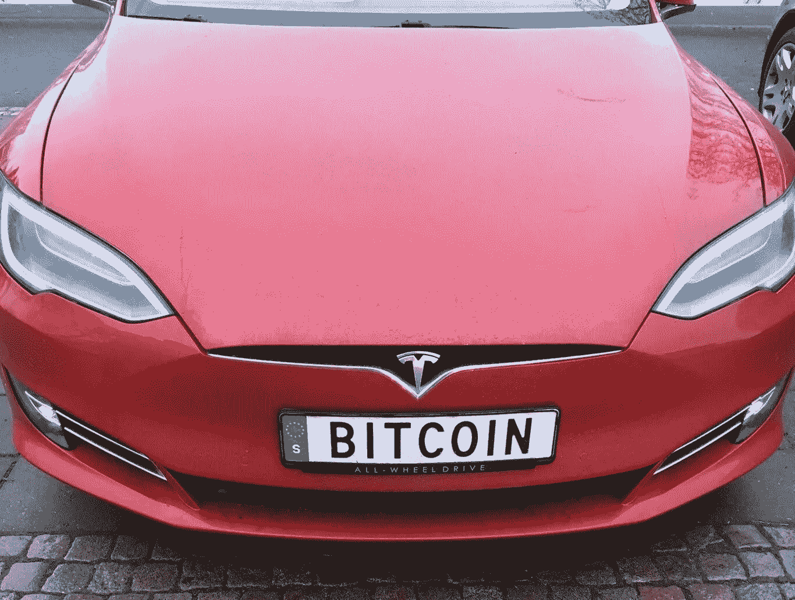

# 特斯拉在卖比特币。是时候离开了？

> 原文：<https://medium.com/coinmonks/tesla-is-selling-bitcoin-time-to-get-out-1e71556a3200?source=collection_archive---------0----------------------->

…或者是时候购买更多了？

Image from xataka.com

至少可以说，埃隆·马斯克是一个相当有个性的人。一条推文可以创造或打破一个趋势，改变人们的想法，或者让一家公司陷入螺旋式下降。

他在比特币每枚 33000 美元时买入，将价格推至历史新高。现在，特斯拉已经出售了 10%的股份，以便获得一些现金，增加利润，并证明它是一个高产…