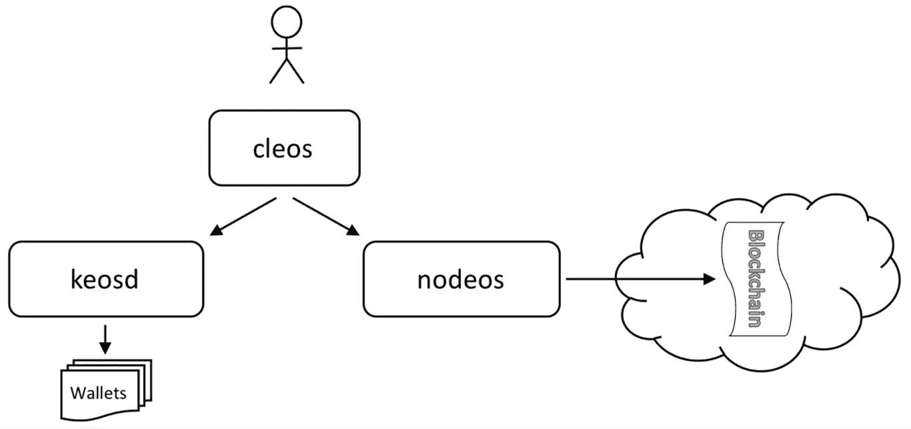
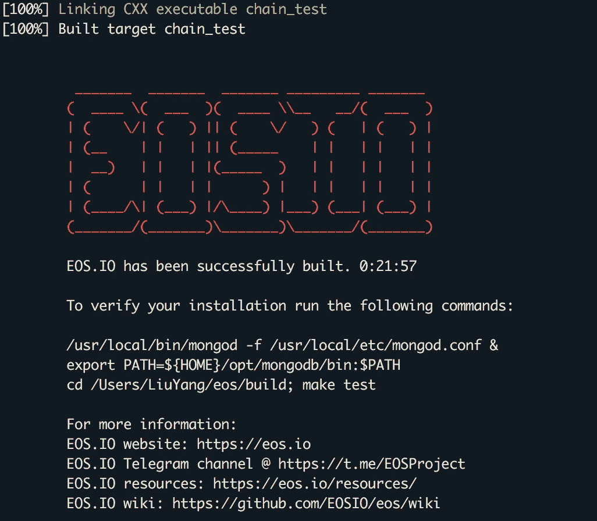
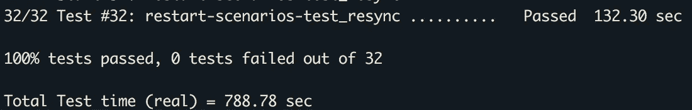
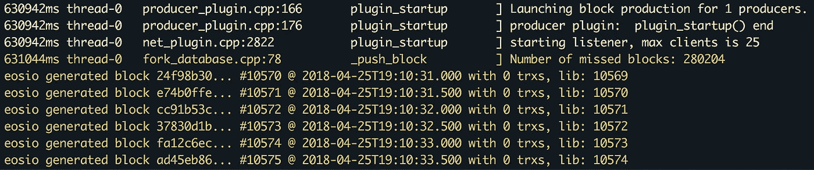

# EOSIO 单节点测试网络设置

> 原文：<https://medium.com/coinmonks/test-4fbd38fdc4e8?source=collection_archive---------2----------------------->

# 1.概观

EOSIO 附带了许多程序。主要的有:

*   nodeos:服务器端区块链节点组件
*   cleos:与区块链交互和管理钱包的命令行界面
*   keosd:管理 EOSIO 钱包的组件

下图说明了这些组件之间的基本关系。



# 2.获取代码

要下载所有代码，克隆`eos`存储库及其子模块。

```
git clone [https://github.com/EOSIO/eos](https://github.com/EOSIO/eos) --recursive
```

# 3.建筑 EOSIO

有一个自动化的构建脚本，可以安装所有的依赖项并构建 EOSIO。构建将内容放在`eos/build`文件夹中。可执行文件可以在`eos/build/programs`文件夹的子文件夹中找到。

## 3.1.系统需求

*   需要 8GB 可用内存
*   需要 20GB 可用磁盘空间

## 3.2.运行构建脚本

```
cd eos
./eosio_build.sh
```

结果:



## 3.3.构建验证

或者，可以针对您的构建运行一组测试来执行一些基本的验证。为了在构建之后运行测试套件，启动`mongod`并运行`make test`。

```
/usr/local/bin/mongod -f /usr/local/etc/mongod.conf &
cd build
make test
```



## 3.4.安装可执行文件

```
sudo make install
```

# 4.创建和启动单节点测试网

成功构建项目后，`nodeos`二进制文件应该出现在`build/programs/nodeos`文件夹中。`nodeos`可以使用`programs/nodeos/nodeos`直接从`build`文件夹运行，或者您可以`cd build/programs/nodeos`切换到该文件夹并从那里运行`nodeos`命令。

您可以使用以下命令启动自己的单节点区块链:

```
cd build/programs/nodeos
./nodeos -e -p eosio --plugin eosio::wallet_api_plugin --plugin eosio::chain_api_plugin --plugin eosio::account_history_api_plugin
```

运行`nodeos`时，您应该会得到类似下面的日志消息。这意味着积木已经制作成功。



此时，`nodeos`正在运行一个单独的生成器，`eosio`。可以按`ctr + c`停止生产。

## 4.1.高级步骤

`nodeos`使用自定义配置文件夹。该文件夹的位置由您的系统决定。

对于 Mac OS: `~/Library/Application Support/eosio/nodeos/config`

为了做有意义的工作，`nodeos`将需要一个正确配置的`config.ini`文件。启动时，`nodeos`在配置文件夹中查找`config.ini`。如果没有找到，就会创建一个默认的`config.ini`文件。如果您还没有准备好使用的`config.ini`文件，运行`nodeos`，然后使用 Ctrl-C 键立即关闭它。config 文件夹中会创建一个默认配置(`config.ini`)。编辑`config.ini`文件，将以下设置添加/更新到已有的默认值中:

```
# Load the testnet genesis state, which creates some initial block producers with the default key. E.g. genesis-json = "/Users/LiuYang/Library/Application Support/eosio/nodeos/config/genesis.json"
genesis-json = /path/to/eos/source/genesis.json
​
# Enable production on a stale chain, since a single-node test chain is pretty much always stale
enable-stale-production = true
​
# Enable block production with the testnet producers
producer-name = eosio
​
# Load the block producer plugin, so you can produce blocks
plugin = eosio::producer_plugin
​
# Wallet plugin
plugin = eosio::wallet_api_plugin
​
# As well as API and HTTP plugins
plugin = eosio::chain_api_plugin
plugin = eosio::http_plugin
​
# This will be used by the validation step below, to view account history
plugin = eosio::account_history_api_plugin
```

现在应该可以运行`/eos/programs`文件夹或`eos/build/programs`文件夹中的`nodeos`，并看到它开始生成程序块。