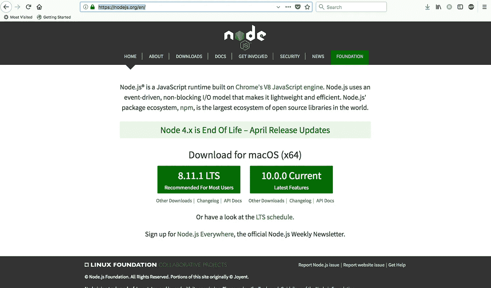
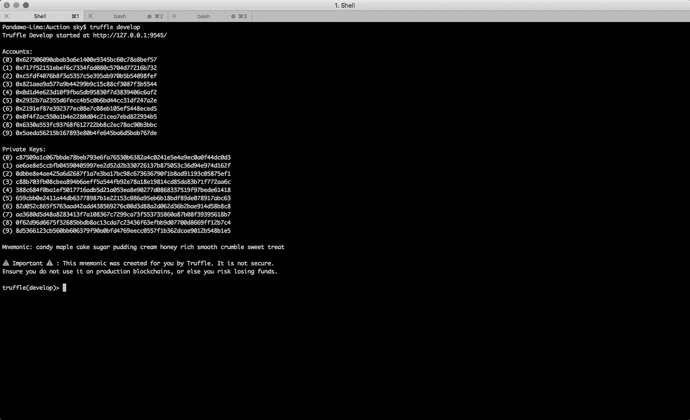
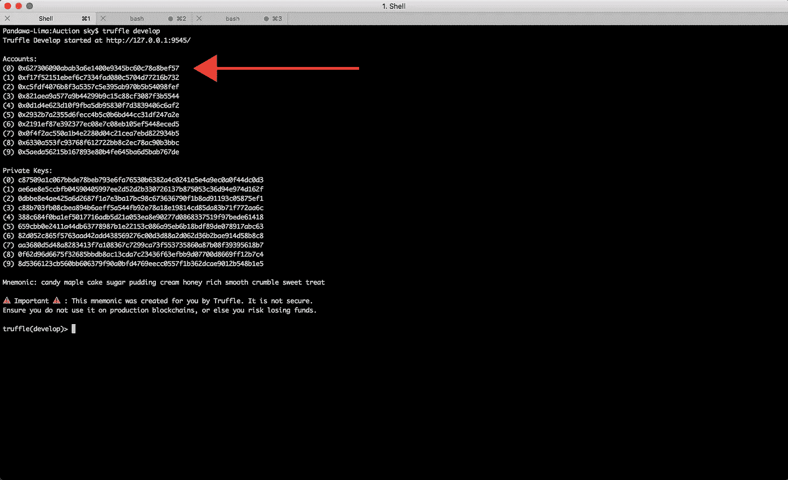
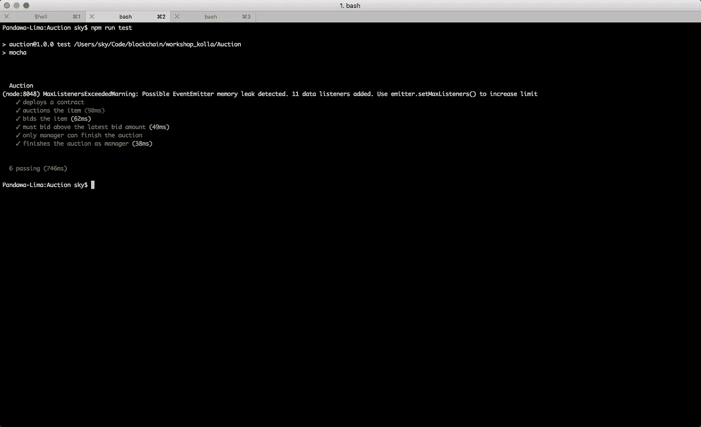

# 用松露测试智能合同

> 原文：<https://medium.com/coinmonks/test-a-smart-contract-with-truffle-3eb8e1929370?source=collection_archive---------0----------------------->

在[之前的文章](/coinmonks/write-a-simple-contract-on-top-of-ethereum-92b543594e84)中，我向您展示了如何在 Remix 编辑器中编写智能契约。但是把智能合同直接写在 web 上不太方便。出于学习的目的，直接在网上写代码是可以的。对于博客来说，直接在网上写文章是可以的。但是当你为严肃的目的编码时，它通常是离线的。因此，我将向您展示如何使用普通文本编辑器编写智能合同。

Truffle 就像一个构建智能合约的框架。你不必用松露来写智能合同。但是 Truffle 对于编写智能合约就像 Ruby on Rails 对于 web 编程一样。

首先，你需要 NodeJs。去它的主页，安装推荐的版本(写这篇文章的时候，版本是 8)。



NodeJs homepage

安装 NodeJs 给你*节点*和 *npm* 程序。Node 是类似 java，python，ruby 的程序。它运行 JavaScript 应用程序。Npm 是包管理器。它类似于 pip，apt-get，gem。

然后你需要安装松露:

```
npm install -g truffle
```

如果您在 MacOSX 或 Ubuntu Linux 中，您可能需要在命令前面添加 *sudo* 来获得在系统范围内安装 truffle 命令的权限。


Truffle homepage

我们创建一个目录并用 Truffle 初始化它。

```
mkdir Auctioncd Auctiontruffle init
```

在目录中，您将智能合同放在合同目录中。

```
edit contracts/Auction.sol
```

您可以用命令替换 *edit* 来启动您喜爱的文本编辑器，如 vim、code、sublime、emacs 或 atom。

将此代码复制到 Auction.sol。

```
pragma solidity ^0.4.19;contract Auction {
  address public manager;
  address public seller;
  uint public latestBid;
  address public latestBidder;

  constructor() public {
    manager = msg.sender;
  }

  function auction(uint bid) public {
    latestBid = bid * 1 ether; //1000000000000000000;
    seller = msg.sender;
  }

  function bid() public payable {
    require(msg.value > latestBid);

    if (latestBidder != 0x0) {
      latestBidder.transfer(latestBid);
    }
    latestBidder = msg.sender;
    latestBid = msg.value;
  }

  function finishAuction() restricted public {
    seller.transfer(address(this).balance);
  }

  modifier restricted() {
    require(msg.sender == manager);
    _;
  }
}
```

如果你想知道这段代码是做什么的，可以查看我的[上一篇文章](/coinmonks/write-a-simple-contract-on-top-of-ethereum-92b543594e84)。

您可以通过启动此命令来编译智能合约。

```
truffle compile
```

默认情况下，编译过程的输出在*build/contracts/auction . JSON*文件中。你可以打开看看里面是什么。这是一个 json 文件。这个 json 对象有两个键非常重要，分别是 *abi* 和*字节码*。

*字节码*是以太坊虚拟机理解的内容。这就像二进制文件。abi 是我们可以与智能合同交互的接口。所以如果*字节码*是房子， *abi* 就是房子的地图(门所在的位置)。

你不能就这样执行这个字节码。这与你编译 C/C++代码并能够直接执行二进制代码是不同的。你必须先把智能合同放在区块链里。

为简单起见，您将把这个智能合约部署到本地区块链。向真实以太坊所在的以太坊主网发起智能合约的方式类似。但首先你要用松露推出当地的区块链。

```
truffle develop
```



Truffle develop

你知道默认情况下它在本地主机的 9545 端口启动服务吗？记住这一点。

在部署您心爱的智能合约之前，您需要告诉 Truffle 项目在哪里可以找到区块链。编辑 truffle 配置文件。

```
edit truffle.js
```

将该内容复制到该文件中。

```
module.exports = {
  // See <[http://truffleframework.com/docs/advanced/configuration](http://truffleframework.com/docs/advanced/configuration)>
  // to customize your Truffle configuration!
  networks: {
    “development”: {
      network_id: 2,
      host: “localhost”,
      port: 9545
    },
  }
};
```

然后我们需要写迁移。对于一些熟悉 Ruby on Rails 等框架的人来说，这种情况下的迁移不同于数据库迁移。这里，迁移意味着部署特定智能合约的过程。

```
edit migrations/2_deploy_contracts.js
```

将该内容复制到该文件中。

```
var Auction = artifacts.require(“Auction”);module.exports = function(deployer) {
  deployer.deploy(Auction);
};
```

现在，您可以部署智能合约了。打开一个新的终端，进入项目目录。不要破坏你启动*松露开发*的终端。我们以后会用到它。

```
truffle migrate
```

您将得到如下输出:

```
Using network ‘development’.Running migration: 1_initial_migration.js
 Replacing Migrations…
 … 0x3a8f8c4379f1d7269b9d931a088984f4ccfeec797bbb6e128582e2915c8f3ea1
 Migrations: 0x8cdaf0cd259887258bc13a92c0a6da92698644c0
Saving successful migration to network…
 … 0xd7bc86d31bee32fa3988f1c1eabce403a1b5d570340a3a9cdba53a472ee8c956
Saving artifacts…
Running migration: 2_deploy_contracts.js
 Replacing Auction…
 … 0xf0b10908aeb415b8b13fe60aeed8ade6769679572a44cf679b5616e38670329d
 Auction: 0x345ca3e014aaf5dca488057592ee47305d9b3e10
Saving artifacts…
```

你的输出不会和我的 100%一样。地址会有所不同。看看部署的地址。这很重要。在我的例子中，部署的拍卖智能合约的地址是 0x 345 ca 3 e 014 AAF 5 DCA 488057592 ee 47305d 9 B3 e 10。

现在，去松露控制台。就是在你启动*松露开发*的航站楼。看看第一个公钥。注意这一点。



Look at the first account

让我们找出这个智能合同的经理。在 Truffle 开发控制台中键入此内容。

```
Auction.at(“0x345ca3e014aaf5dca488057592ee47305d9b3e10”).manager.call();
```

随机数 0x 345 ca 3 e 014 AAF 5 DCA 488057592 ee 47305d 9 B3 e 10 来自*松露迁移*命令的输出。您刚才在 Truffle develop 控制台中输入的这条语句的输出是我要求您注意的第一个帐户地址。看起来 *truffle migrate* 命令将使用 Truffle develop 中的第一个帐户部署智能合同。

现在，让我们执行拍卖方法，但使用不同的帐户。

```
Auction.at(“0x345ca3e014aaf5dca488057592ee47305d9b3e10”).auction(3, {from: “0x2932b7a2355d6fecc4b5c0b6bd44cc31df247a2e” });
```

你可以检查这个方法是否有效。

```
truffle(develop)> Auction.at(“0x345ca3e014aaf5dca488057592ee47305d9b3e10”).seller.call();
‘0x2932b7a2355d6fecc4b5c0b6bd44cc31df247a2e’
```

顺便说一句，你这样做可以使它变得更简单。

```
truffle(develop)> Auction.at(“0x345ca3e014aaf5dca488057592ee47305d9b3e10”).seller();
‘0x2932b7a2355d6fecc4b5c0b6bd44cc31df247a2e’
```

现在，让我们为智能契约编写单元测试。坏消息是。我无法在 Truffle 框架内成功编写测试。我必须手动操作。要么是我做错了，要么是松露框架有 bug。一旦我想通了，我会把它写在以后的文章里。现在，我们只需要手动编写测试。先用 *npm* 装一些东西。

```
npm install --save ganache-cli mocha web3@1.0.0-beta.34
```

这是本地安装。它会将这些库保存到这个项目中，但不是系统范围的。Ganache 就像 Truffle develop，一个用于智能合约单元测试的本地区块链。Mocha 是单元测试框架。web3 是我们连接到已部署的智能合同的方式。这里，web3 的 1.0 版本还没有准备好投入生产。生产版本低于 1.0 版，但我们需要 1.0 版，因为有一些方法我们非常需要。因此，我们使用测试版。

将测试文件放在测试目录中，并将其命名为 Auction.test.js。

写下这几行。

```
const assert = require(‘assert’);const ganache = require(‘ganache-cli’);const Web3 = require(‘web3’);const web3 = new Web3(ganache.provider());const json = require(‘./../build/contracts/Auction.json’);
```

在这里，我们从刚刚安装的库中导入重要的东西。*断言*是检查该方法是否正常工作。*加纳切*是我们当地的区块链。 *web3* 是我们联系当地区块链的方式。 *json* 是一个 Auction.sol 文件的编译输出。

在那下面，写下这几行。

```
let accounts;let auction;let manager;const interface = json[‘abi’];const bytecode = json[‘bytecode’];
```

我们初始化一些变量。如上所述，我们只关心输出 json 文件的两个部分，字节码和接口(abi)。

继续说这些台词。

```
beforeEach(async () => { accounts = await web3.eth.getAccounts(); manager = accounts[0]; auction = await new web3.eth.Contract(interface) .deploy({ data: bytecode }) .send({ from: manager, gas: ‘1000000’ });});
```

单元测试中的 beforeEach 意味着每次执行单元测试时都要运行此方法。连接到区块链是一个异步过程，所以我们必须声明我们的函数 async。我们要做的第一件事是得到所有的客户。加纳切给了我们一些可玩的账户。但是我们在进行其他步骤之前需要这些帐户，所以我们在这里使用*wait*来同步语句。我们使用第一个帐户作为经理。然后我们部署合同。为了部署契约，我们需要接口、字节码、地址和一些 gas(部署契约不是免费的)。

```
describe(‘Auction’, () => { it(‘deploys a contract’, async () => { const auctionManager = await auction.methods.manager().call(); assert.equal(manager, auctionManager, “The manager is the one who   launches the smart contract.”); }); //Continue from this line from now on...});
```

这是我们的第一次测试。*描述*是分组测试的一种方式。第一个测试是检查部署契约的地址是否保存到智能契约内的 manager 变量中。在这里，我们正在与智能合同进行交互，而不是与可靠性进行交互。因此，访问智能协定的方法或属性存在一些差异。要访问智能合约的 manager 属性，可以使用以下语句。

```
auction.methods.manager().call()
```

我们继续我们的另一个测试。

```
it(‘auctions the item’, async () => { seller = accounts[1]; await auction.methods.auction(2).send({ from: seller }); auctionSeller = await auction.methods.seller().call(); assert.equal(auctionSeller, seller,“The seller is the one who called the auction method.”); auctionBid = await auction.methods.latestBid().call(); assert.equal(auctionBid, web3.utils.toWei(‘2’, ‘ether’),“The latest bid is the argument sent to auction method converted into wei.”);});
```

在这个测试中，我们对卖家使用不同的账户。若要使用特定地址执行智能协定的方法，请使用以下语句:

```
auction.methods.auction(2).send({ from: seller });
```

我们继续进行其他测试。

```
it(‘bids the item’, async () => { bidder = accounts[2]; await auction.methods.bid().send({ from: bidder, value: web3.utils.toWei(‘3’, ‘ether’) }); auctionBid = await auction.methods.latestBid().call(); assert.equal(auctionBid, web3.utils.toWei(‘3’, ‘ether’),“The latest bid is the payment sent to bid method converted into wei.”);});
```

这里，在这个测试中，我们在执行智能合约的方法时测试发送付款。我们使用*值*关键字自变量。默认情况下，它接受魏数。但是我们正在处理以太数字，所以我们必须用 web3 辅助函数来转换它。

```
auction.methods.bid().send({ from: bidder, value: web3.utils.toWei(‘3’, ‘ether’) });
```

我们继续进行其他测试。

```
it(‘must bid above the latest bid amount’, async () => { bidder = accounts[2]; try { await auction.methods.bid().send({ from: bidder, value: web3.utils.toWei(‘1’, ‘ether’) }); assert(false); } catch (err) { assert(err); }});
```

这里，在这个测试中，我们测试当我们在智能契约中的 *require* 语句失败时抛出的异常。还记得智能合约里的这个方法吗？

```
function bid() public payable {
  require(msg.value > latestBid);

  if (latestBidder != 0x0) {
    latestBidder.transfer(latestBid);
  }
  latestBidder = msg.sender;
  latestBid = msg.value;
}
```

我们必须支付高于上次出价的金额。所以在这个测试中，我们想要测试失败的情况。我们使用 try catch 来测试失败案例。

```
try { await auction.methods.bid().send({ from: bidder, value: web3.utils.toWei(‘1’, ‘ether’) }); assert(false);} catch (err) { assert(err);}
```

我们继续最后的测试。

```
it(‘only manager can finish the auction’, async () => { nonmanager = accounts[1]; try { await auction.methods.finishAuction().send({ from: nonmanager }); assert(false); } catch (err) { assert(err); }});it(‘finishes the auction as manager’, async () => { manager = accounts[0]; await auction.methods.finishAuction().send({ from: manager }); assert(true);});
```

完整的测试文件代码在这里。

```
const assert = require(‘assert’);const ganache = require(‘ganache-cli’);const Web3 = require(‘web3’);const web3 = new Web3(ganache.provider());const json = require(‘./../build/contracts/Auction.json’);let accounts;let auction;let manager;const interface = json[‘abi’];const bytecode = json[‘bytecode’];beforeEach(async () => { accounts = await web3.eth.getAccounts(); manager = accounts[0]; auction = await new web3.eth.Contract(interface) .deploy({ data: bytecode }) .send({ from: manager, gas: ‘1000000’ });});describe(‘Auction’, () => { it(‘deploys a contract’, async () => { const auctionManager = await auction.methods.manager().call(); assert.equal(manager, auctionManager, “The manager is the one who launched the smart contract.”); }); it(‘auctions the item’, async () => { seller = accounts[1]; await auction.methods.auction(2).send({ from: seller }); auctionSeller = await auction.methods.seller().call(); assert.equal(auctionSeller, seller, “The seller is the one who called the auction method.”); auctionBid = await auction.methods.latestBid().call(); assert.equal(auctionBid, web3.utils.toWei(‘2’, ‘ether’), “The latest bid is the argument sent to auction method converted into wei.”); }); it(‘bids the item’, async () => { bidder = accounts[2]; await auction.methods.bid().send({ from: bidder, value: web3.utils.toWei(‘3’, ‘ether’) }); auctionBid = await auction.methods.latestBid().call(); assert.equal(auctionBid, web3.utils.toWei(‘3’, ‘ether’), “The latest bid is the payment sent to bid method converted into wei.”); }); it(‘must bid above the latest bid amount’, async () => { bidder = accounts[2]; try { await auction.methods.bid().send({ from: bidder, value: web3.utils.toWei(‘1’, ‘ether’) }); assert(false); } catch (err) { assert(err); } }); it(‘only manager can finish the auction’, async () => { nonmanager = accounts[1]; try { await auction.methods.finishAuction().send({ from: nonmanager    }); assert(false); } catch (err) { assert(err); } }); it(‘finishes the auction as manager’, async () => { manager = accounts[0]; await auction.methods.finishAuction().send({ from: manager }); assert(true); });});
```

这就是你执行测试的方式。

```
npm run test
```

你会得到这样的输出。



> 加入 Coinmonks [电报频道](https://t.me/coincodecap)和 [Youtube 频道](https://www.youtube.com/c/coinmonks/videos)获取每日[加密新闻](http://coincodecap.com/)

## 另外，阅读

*   [复制交易](/coinmonks/top-10-crypto-copy-trading-platforms-for-beginners-d0c37c7d698c) | [加密税务软件](/coinmonks/crypto-tax-software-ed4b4810e338)
*   [网格交易](https://coincodecap.com/grid-trading) | [加密硬件钱包](/coinmonks/the-best-cryptocurrency-hardware-wallets-of-2020-e28b1c124069)
*   [密码电报信号](http://Top 4 Telegram Channels for Crypto Traders) | [密码交易机器人](/coinmonks/crypto-trading-bot-c2ffce8acb2a)
*   [最佳加密交易所](/coinmonks/crypto-exchange-dd2f9d6f3769) | [印度最佳加密交易所](/coinmonks/bitcoin-exchange-in-india-7f1fe79715c9)
*   开发人员的最佳加密 API
*   最佳[密码借贷平台](/coinmonks/top-5-crypto-lending-platforms-in-2020-that-you-need-to-know-a1b675cec3fa)
*   杠杆代币的终极指南
*   [7 个最佳零费用加密交易平台](https://coincodecap.com/zero-fee-crypto-exchanges)
*   [最佳网上赌场](https://coincodecap.com/best-online-casinos) | [期货交易机器人](/coinmonks/futures-trading-bots-5a282ccee3f5)
*   [分散交易所](https://coincodecap.com/what-are-decentralized-exchanges) | [比特 FIP](https://coincodecap.com/bitbns-fip)
*   [用信用卡购买密码的 10 个最佳地点](https://coincodecap.com/buy-crypto-with-credit-card)
*   [加拿大最佳加密交易机器人](https://coincodecap.com/5-best-crypto-trading-bots-in-canada) | [Bybit vs 币安](https://coincodecap.com/bybit-binance-moonxbt)