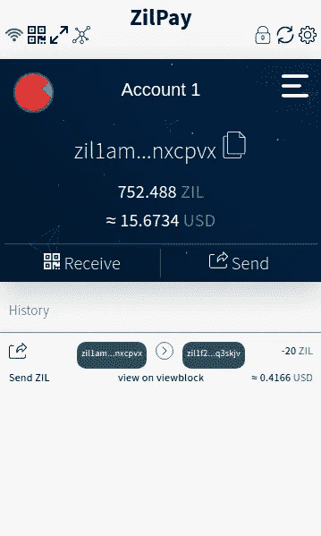
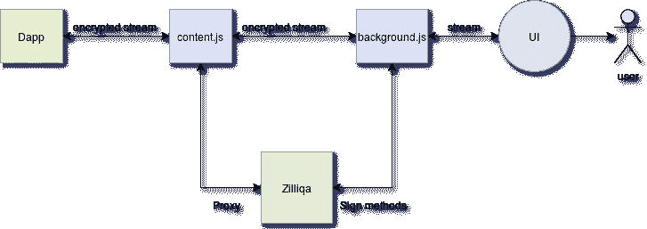
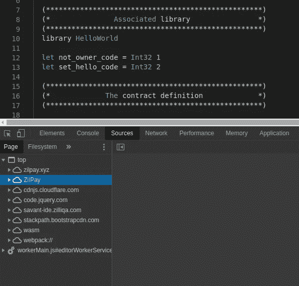
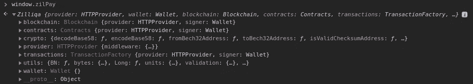
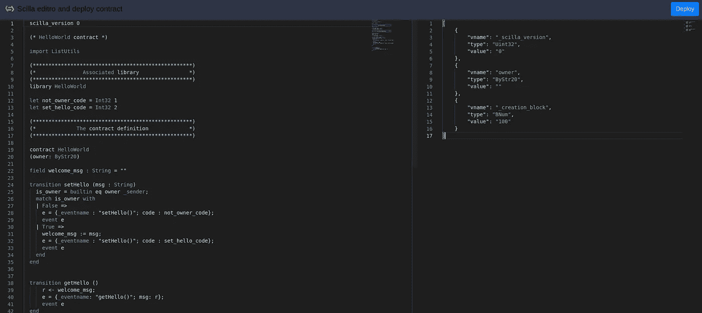
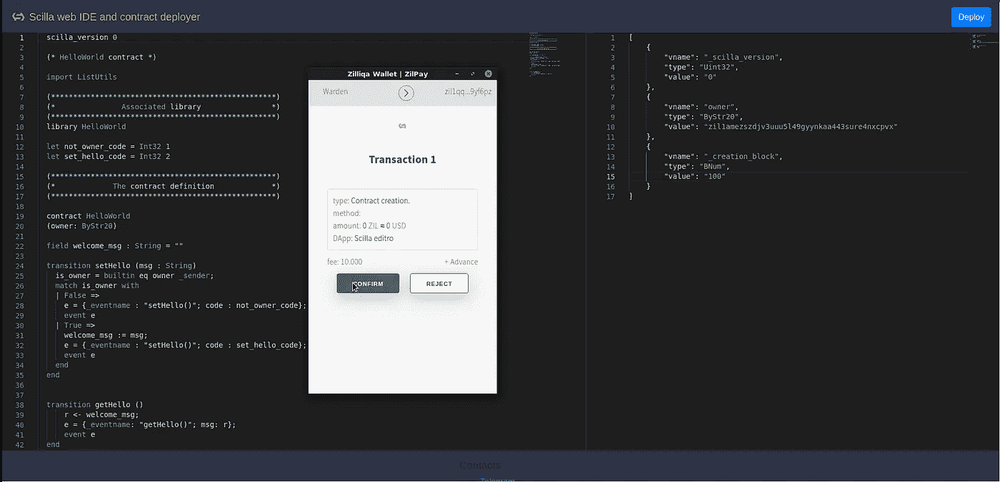
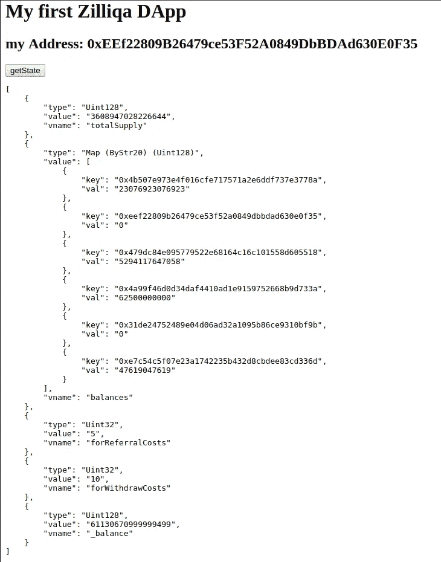

# 使用 ZilPay 在 Zilliqa 上测试和开发 DApps

> 原文：<https://medium.com/coinmonks/test-and-develop-dapps-on-zilliqa-with-zilpay-52b165f118bf?source=collection_archive---------1----------------------->

前途无量的区块链 Zilliqa 终于发布了他们特定领域的函数式语言 Scilla 的稳定版本。然而，正如你可能知道的，并不是每个人都理解智能合约编程的复杂性，因此采用智能合约存在一定的障碍。但是！别担心，ZilPay 是来救援的。

ZilPay 允许您轻松部署基于 Zilliqa 的智能合约，并使用 web 与它们进行交互。自己测试，在你的浏览器上创建你自己的分散式应用程序。

如果你曾经使用过以太坊或者基于 Tron 的 dApps，这个钱包界面对你来说会非常熟悉。

# 它是如何工作的？

来自 dApp 的调用约定方法示例。

让我们一步一步来看:

*   首先，dApp 将创建包含调用契约方法规范的事务有效负载，并通过加密流将其发送到 content.js。
*   其次，content.js 会将这个事务有效负载转发给 background.js，以提示一个 ZilPay 弹出窗口供用户确认。
*   如果用户检查并确认 ZilPay 钱包上的交易有效负载。该交易将被签署并在 Zilliqa 网络上播出。

如果 dApp 询问合同的状态，则请求代理的 content.js。

# 用于测试的样本 dApps。

您可以访问 [DApps](https://zilpay.xyz/#dapps) 页面了解更多信息。

# 有趣的事情开始了…

为以下项目安装 ZilPay 钱包:

*   c[chrome](https://chrome.google.com/webstore/detail/zilpay/klnaejjgbibmhlephnhpmaofohgkpgkd)
*   福 [irefox](https://addons.mozilla.org/en-GB/firefox/addon/zilpay)
*   或者手动通过 [GitHub 释放](https://github.com/lich666dead/zil-pay/releases)

ZilPay wallet 安装完成后，注入脚本将打包在其中。要查看后台发生了什么，请打开浏览器的开发人员控制台。

ZilPay 将创建一个全局对象，即“window.zilPay”。

*   ` window.zilPay '显示了修改后的[Zilliqa-JavaScript-Library](https://github.com/Zilliqa/Zilliqa-JavaScript-Library)对象。并显示钱包的当前状态。

# 从 Scilla 编辑器部署合同。

*   访问基于网络的编辑器。

左侧选项卡是 IDE，您可以在其中自由修改“. scilla”智能合同代码。右边的选项卡由“init.json”表单组成，它包含智能合同中不可变变量的初始化参数。在这种情况下，有 2 个固有的和 1 个用户定义的不可变变量:

*   ` _scilla_version `表示本合同适用的 scilla 的当前版本。
*   ` _creation_block `表示将在其中部署智能合约的当前块。
*   “所有者”是用户定义的参数，表示合同所有者的帐户地址。

单击“部署”按钮。

恭喜您，您已经在 developer testnet 上部署了您的第一个 Scilla 智能合约。

# 前端

当你写完契约后，你必须调用这些方法。DApp 的前端由传统的 web 技术组成(如 javascipt、html、css)。当您在网络(主网络或测试网络)上部署协定时，您会获得一个能够调用它的地址。

创造 index.html

*   标签“h2 id = "address "”将显示您的默认地址
*   标记' button onclick="getState()" '将获取我们合同的当前状态。
*   标记' pre id="state " '将显示我们合同的提取状态。

让我们从获取契约状态开始，好吗？

JavaScript 代码:

我们现在可以发现用户。

现在，让我们尝试通过创建一个新函数“getState”来获取智能合约的状态。

现在，如果点击按钮“getstate ”, TEG 会显示智能合同的当前状态。

这不是很好吗？就这么简单。现在，让我们尝试在智能契约中调用一个转换方法，好吗？

在下面的演示中，我们将尝试从“HelloWorld.scilla”示例契约中调用转换方法“setHello”。

为此，我们只需创建一个名为“setHello”的新函数。

一旦你自己创建了这个按钮，试着点击它并调用这个函数！

这个合同部署事务将被广播，我们将等待 Zilliqa 网络接受和确认它。

恭喜你！🎉你已经在 Zilliqa 上创建了你自己的 dApp，这只是你的第一次尝试。

## 测试用 DApps:

*   dApp 允许你通过一个简单的表单轻松创建一个类似 ERC 20 的令牌。
*   [不可停止的域名](https://zilpay.xyz/app/unstoppabledomains) dApp 你可以通过 ZilPay 管理你的域名。
*   [ROL](https://zilpay.xyz/app/roll) 是一款简单的竞技游戏，你可以和朋友一起玩:)
*   scilla-editor 是一个简单的基于 web 的 IDE，允许用户创建和部署 scilla 智能合同

# 摘要

ZilPay wallet 是为简化去中心化应用程序的创建而创建的。代码是[开源的](https://github.com/lich666dead/zil-pay)，所以请不要客气，只要你能贡献！

> [直接在您的收件箱中获得最佳软件交易](https://coincodecap.com/?utm_source=coinmonks)

