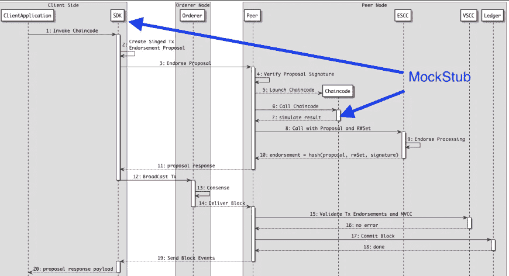
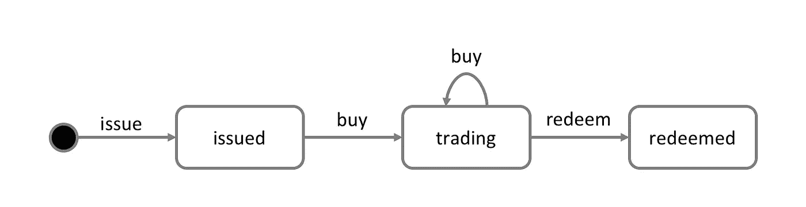

# 超级分类帐结构链代码单元测试:智能契约测试驱动开发(TDD)

> 原文：<https://medium.com/coinmonks/test-driven-hyperledger-fabric-golang-chaincode-development-dbec4cb78049?source=collection_archive---------1----------------------->

## 如何通过单元测试快速连续地检查智能契约逻辑:区块链事务、触发事件和链码许可

测试阶段是软件质量保证的关键要求，不管是这个 web 应用程序还是一个智能合同。测试必须足够快，以便在每次提交到存储库时运行。 [CCKit](https://github.com/s7techlab/cckit/) ，用于开发和测试 Hyperledger Fabric Golang chaincode 的编程工具包，通过扩展版本的 MockStub 增强了用于 chain code 测试的开发体验。

## 链码开发过程中的步骤

智能合约定义了业务对象的不同状态，并控制在这些不同状态之间移动对象的流程。智能合同允许架构师和智能合同开发人员定义业务流程和数据结构，这些数据在区块链网络中的不同组织间共享。

智能合同开发人员的工作是获取现有的业务流程，并将其表达为编程语言中的代码。链码开发的步骤:

*   为状态条目、输入负载和事件定义链码模型— [模式](/coinmonks/hyperledger-fabric-smart-contract-data-model-protobuf-to-chaincode-state-mapping-191cdcfa0b78)
*   定义链码[接口](/coinmonks/routing-and-middleware-for-developing-hyperledger-fabric-chaincode-written-in-go-90913951bf08)
*   实现链代码实例化方法
*   用业务逻辑实现链代码方法
*   创建测试

> 测试驱动开发(TDD)或行为驱动开发(BDD)，可能是开发智能合约的单一方式。

## 链码(智能合约)测试

测试必须确保链码按预期工作:

*   特定的输入负载导致特定的业务对象状态变化
*   特定的(无效的)输入有效负载会导致验证或其他错误
*   特定对象状态允许状态转换子集(状态机)

任何软件测试(例如链码或 web 应用程序)可能是手工的，也可能是自动化的过程。手动软件测试由团队或个人领导，他们将手动操作软件产品，并确保它的行为符合预期。如果是链码测试，您可以通过`peer` cli 工具手动调用链码。

自动化软件测试是对单个代码单元进行输入和输出正确性检查的实践。在自动化测试过程中，代码在模拟输入的测试环境中执行。

## 运行链码

将 chaincode 部署到区块链网络并不是世界上最快的事情，通过测试可以节省很多时间。此外，更重要的是，由于区块链是不可变的，而且因为代码在网络上，所以应该是安全的，所以我们不希望在代码中留下缺陷。

在链代码开发和部署到实时网络的过程中，我们可以将测试分为多个阶段——快速阶段(仅测试智能合约逻辑)和更复杂的阶段(使用实时区块链网络、多个对等点、部署的链上代码(智能合约)和链外应用程序进行集成测试，使用 SDK 连接区块链网络对等点)。

## 链码开发模式

部署 Hyperledger Fabric 区块链网络，安装和初始化链码，设置起来相当复杂，而且是一个漫长的过程。使用[链码开发模式](https://hyperledger-fabric.readthedocs.io/en/latest/peer-chaincode-devmode.html)，可以减少重新安装/升级智能合约代码的时间。通常链码由对等体启动和维护。在“开发”模式下，链码由用户构建和启动。在链代码开发阶段，这种模式对于快速编码/构建/运行/调试周期周转非常有用。然而，更新代码的过程仍然会很慢。

## 模拟存根—模拟链代码存根

模仿是一种单元测试现象，它通过用具有预定义/模拟行为的测试对象替换具有复杂行为的依赖对象来帮助测试孤立的对象。这些测试对象被称为模拟对象。

[shim](https://github.com/hyperledger/fabric/tree/master/core/chaincode/shim) 包包含一个 [MockStub](https://github.com/hyperledger/fabric/tree/master/core/chaincode/shim/mockstub.go) 实现，该实现将调用包装到一个 chaincode，模拟它在 HLF 对等环境中的行为。`MockStub`不需要启动多个 docker 容器与对等体、世界状态数据库、链码，并允许几乎立即获得测试结果。

> 真正的单元测试通常运行得非常快，因为不需要设置运行时基础设施。

`MockStub`本质上取代了 SDK 和 peer 环境，允许在不实际启动区块链网络的情况下测试 chaincode。它实现了实际存根所做的几乎所有功能，但是是在内存中。

`MockStub`来自[https://github.com/hyperledger/fabric/](https://github.com/hyperledger/fabric/)库包括了大部分`shim.ChaincodeStubInterface`功能的实现，但是直到当前版本的 Hyperledger Fabric (1.4)，`MockStub`还没有实现一些重要的方法，例如`GetCreator`或处理私有状态范围的方法。由于 chaincode 将使用`GetCreator`方法来获取访问控制的事务创建者证书，因此能够存根化该方法以便对 chaincode 进行完整的单元测试是非常关键的。

## CCKit 模拟存根

[CCKit](https://github.com/s7techlab/cckit) [测试](https://gist.github.com/vitiko/)包包含:

*   [MockStub](https://github.com/s7techlab/cckit/blob/master/testing/mockstub.go) 具有实现的`GetTransient`和其他方法以及事件订阅功能
*   测试[身份](https://github.com/s7techlab/cckit/blob/master/testing/identity.go)创建助手
*   链码响应[期望](https://github.com/s7techlab/cckit/blob/master/testing/expect/matcher.go)助手

## 示例:“商业票据”链代码

## 方案

官方 hyperledger 结构文档包含详细的[链码示例](https://hyperledger-fabric.readthedocs.io/en/release-1.4/developapps/scenario.html) — `Commercial Paper`智能合同，该合同定义了商业票据的有效状态，以及将票据从一种状态转换到另一种状态的交易逻辑。我们将用 [chaincode 方法 routing](/coinmonks/routing-and-middleware-for-developing-hyperledger-fabric-chaincode-written-in-go-90913951bf08) 和 [protobuf 状态](/coinmonks/hyperledger-fabric-smart-contract-data-model-protobuf-to-chaincode-state-mapping-191cdcfa0b78)测试基于 CCKit 库的[商业票据扩展 chaincode 示例](https://gist.github.com/examples/cpaper_extended)。

我们可以使用状态转换图来表示商业票据的生命周期:商业票据通过发行、购买和赎回交易在发行、交易和赎回状态之间转换。

## 要求

为了产生测试，我们首先需要定义测试应用程序的需求。让我们首先列出我们对商业票据链代码的要求:

*   它应该允许发行人发行商业票据
*   它应该允许参与者购买商业票据
*   它应该允许所有者赎回商业票据

在文件 [chaincode.go](https://gist.github.com/examples/cpaper_extended/chaincode.go) 中描述了链码接口函数，因此我们可以看到链码数据的所有可能的操作(事务):

## 入门指南

开始之前，请确保获得`CCKit`:

`git clone git@github.com:s7techlab/cckit.git`

这将获取并安装带有[示例的 CCKit 包。](https://github.com/s7techlab/cckit/tree/master/examples)之后，我们需要使用命令安装依赖项:

`go mod vendor`

## 创建测试套件

## Go 中的测试

Go 有一个名为`go test`的内置测试命令和包`testing`，它提供了一个最小但完整的测试体验。在我们的例子中，我们使用[银杏](https://github.com/onsi/ginkgo) - BDD 风格的 go 测试框架，构建在 Go 的测试包之上，并允许以有效的方式编写可读的测试。它最好与 [Gomega](https://github.com/onsi/gomega) matcher 库配对，但是被设计成与匹配器无关。

与其他语言中流行的 BDD 框架一样，`Ginkgo`允许您在`Describe`和`Context`容器块中分组测试。`Ginkgo`提供了能够保存您的断言的`It`和`Specify`块。它还附带了便利的结构化工具，例如`BeforeSuite`、`AfterSuite`等，允许您将测试配置从测试创建中分离出来，并提高代码重用。

`Ginkgo`还支持编写异步测试。这使得测试使用带有 chaincode 事件的通道的代码与测试同步代码一样容易。

## 测试包

为了编写一个新的测试套件，创建一个名为 ends _test.go 的文件，它包含了`TestXxx`函数，在我们的例子中是[cpaper _ extended/chain code _ test . go](https://github.com/s7techlab/cckit/blob/master/examples/cpaper_extended/chaincode_test.go)

> 使用单独的测试包 **cpaper_extended_test** 而不是 **cpaper_extended** 允许我们尊重链码包的封装:您的测试将需要导入链码并从外部访问它。您不能摆弄内部，而是要关注暴露的 chaincode 接口。

## 导入匹配器和助手

首先，我们需要从银杏测试包中导入`matcher`功能，这样我们就可以使用不同的比较机制，比如比较响应对象或状态代码。

我们导入了带有名称空间`.`的`ginkgo`和`gomega`包，这样我们就可以使用这些包中的函数，而不需要包前缀。这允许我们用`Describe`代替`ginkgo.Describe`，用`Equal`代替`gomega.Equal`。

## 引导程序

对`RegisterFailHandler`的调用注册了一个处理程序，来自`Ginkgo`包的`Fail`函数。这产生了`Ginkgo`和`Gomega`之间的耦合。

测试套件引导示例:

## 测试结构

该特定测试规范可使用`Ginkgo`编写如下:

## 实施测试

现在我们深入了解如何使用`MockStub`特性创建专门用于链码开发的测试函数。

## 正在创建链码实例

测试套件通常从创建新的 chaincode 实例开始，或者我们也可以在每个测试规范之前实例化一个新的 chaincode 实例。这个要看我们要怎么考，考什么。在这个例子中，我们实例化了一个可以在多个测试规范中使用的全局`Commercial Paper`链码。

## 测试链码"`Init"`方法

所有链代码调用(通过 SDK 到区块链对等体或 MockStub)的结果都是[对等体。响应](https://github.com/hyperledger/fabric/blob/release-1.4/protos/peer/proposal_response.pb.go)结构:

在测试过程中，我们可以检查`Response`属性:

*   状态(错误或成功)
*   消息字符串(包含错误描述)
*   有效负载内容(编组的 JSON 或 Protobuf)

CCKit [测试](https://github.com/s7techlab/cckit/tree/master/testing)包[包含](https://gist.github.com/vitiko/expect/matcher.go)银杏`expect`函数的多个助手/包装器。

最常用的助手是:

*   `ResponseOk` ( *回应* **同行。响应**期望对等响应包含`ok`状态代码(`200`)
*   `ResponseError` ( *回应* **同行。响应**期望对等响应包含错误状态代码(`500`)。或者，您可以传递预期的错误子字符串。
*   `PayloadIs` ( *响应* **对等。响应**，*目标* **接口{}** )期望对等响应包含`ok`状态码(`200`)，并使用`CCKit` [转换](https://github.com/s7techlab/cckit/tree/master/convert)包将响应转换为**目标**类型

例如，我们可以简单地测试`Init`方法(在链码初始化时调用)是否返回成功的状态码:

## 测试“`Issue"`方法

我们预计调用`issue` chaincode 方法将导致:

*   具有`Ok`状态的响应
*   事件`IssueCommercialPaper`被触发

在测试中，我们可以通过 MockStub 调用`issue`方法，检查响应状态并检查 chaincode 事件。可以从`chaincodeEventsChannel`接收链码事件。`expect`功能的`BeEquivalentTo`方法可以方便地比较事件负载。

该测试将被阻止，直到通过通道`paperChaincode.ChaincodeEventsChannel`(链码事件)收到响应。死锁或超时是这类测试的常见故障模式。在这种情况下，一个简单的模式是在函数底部添加一个 select 语句，并包含一个< -time。(X)通道后指定一个超时。银杏就有这种模式。所有非容器块(`It`、`BeforeEache`等)中的主体函数都可以使用可选的 done `Done`参数。

做成了一个`chan interface{}`。当`Ginkgo`检测到已经请求了`done Done`参数时，它将主体函数作为 goroutine 运行，用必要的逻辑包装它以应用超时断言。你必须关闭`done`通道或者发送一些东西(任何东西)给它，告诉`Ginkgo`你的测试已经结束。如果您的测试在超时后没有结束，`Ginkgo`将使测试失败，并继续下一个测试。

默认超时为 1 秒。您可以通过在 body 函数后传递一个 float64(以秒为单位)来修改这个超时。在本例中，我们将超时设置为 0.1 秒。

## 测试`Get"`方法

我们预计调用`get` chaincode 方法将导致:

*   具有`Ok`状态的响应
*   响应有效载荷与前一步骤中添加的商业票据属性一起被编组`*schema.CommercialPaper`

`PayloadIs`允许检查响应状态并转换到`*schema.CommercialPaper`，然后`Expect`帮助检查接收到的数据与期望值是否相等:

## 测试链代码许可

每个用户可以拥有不同的权限来使用 chaincode 方法。所有权限都基于用户证书和成员资格服务提供商标识符，这意味着权限总是对应于 X.509 证书。

简单的 [car](https://gist.github.com/examples/cars) 包含控制谁可以调用`carRegister`方法的逻辑。[测试](https://gist.github.com/examples/cars/cars_test.go)使用`From` MockStub 方法设置证书和调用者的 MSP id

## 调试链代码执行

`CCKit`支持 Hyperledger Fabric[chain code Logger](https://github.com/hyperledger/fabric/blob/release-1.4/core/chaincode/shim/chaincode.go#L1105)及其选项，因此可以使用`CORE_CHAINCODE_LOGGING_LEVEL`环境变量。`CCKit` [链码状态包装器](https://gist.github.com/state)输出调试严重级别消息，例如:

它显示了在执行链代码时，链代码状态执行了几个操作:

*   处理`init`链码方法时，用`OWNER`键检查存在条目
*   用`OWNER`键输入状态
*   处理`issue`链码方法时，用`[_idx CommercialPaper ExternalId EXT0001]`放置状态条目(对于`Commercial entry`实体没有唯一索引)...

## 试探性试验

要运行测试套件，您只需在测试套件所在的存储库中运行命令:

如果您在测试中有任何失败，您可以使用`-ginkgo.failFast`选项在任何测试失败后禁止运行额外的测试。

## 结论

Chaincode `MockStub`非常有用，因为它允许开发者测试他的 Chaincode，而不用每次都启动网络。这减少了开发时间，因为他可以使用测试驱动开发(TDD)方法，而不需要启动网络(这需要+- 40-80 秒，取决于计算机的规格)。