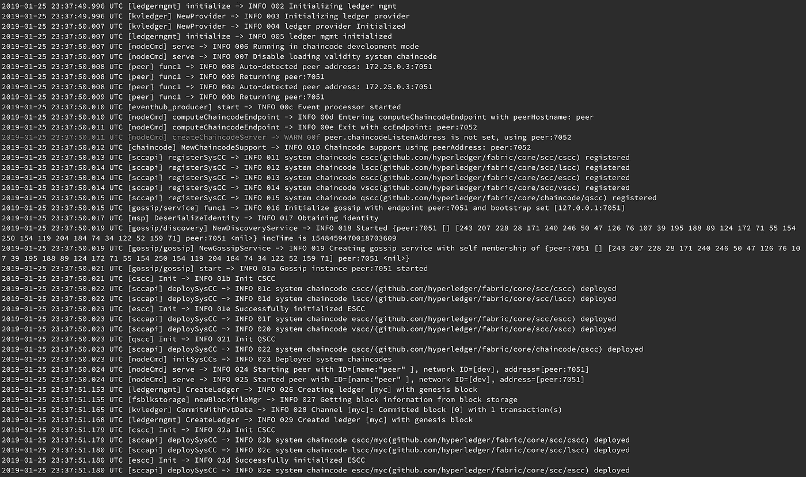

# 在开发环境中测试 hyperledger 结构链代码

> 原文：<https://medium.com/coinmonks/test-hyperledger-fabric-chaincode-in-dev-environment-8794096b5df2?source=collection_archive---------1----------------------->

## 链码开发模式

# 快乐分类器

这是我的 hyperledger fabric 博客系列的第四部分- `Happyledger`博客系列:)。在这篇文章中，我将展示如何在我们的本地开发机器上构建、运行和测试(调试)链代码。

普通链码安装并运行在对等体上。但是使用`chaincode dev mode`,我们可以在本地开发机器上运行和测试它们。在将链码部署到真实网络之前，有必要对其进行编译、运行和测试。

与本文相关的所有部署文件和配置都在[hlf-chain code-dev](https://gitlab.com/rahasak-labs/hlf-chaincode-dev)git lab repo。请签出存储库并遵循以下步骤。

# 1.设置结构开发网络

首先，我们需要使用预先生成的订购者和渠道构件部署开发模式 docker 容器。下面是在这个目录中发现的预生成工件。

1.  `myc.block` -通道阻塞
2.  `myc.tx` -渠道加入交易
3.  `orderer.block`——订货商街区

您可以按如下方式部署服务。它将启动并运行`orderer`、`peer`、`cli`和`chaincode`容器。订购者以`SingleSampleMSPSolo`开始，同行以`dev-mode`开始。

# 2.构建并运行链代码

接下来，我们需要在`chaincode container`中构建并运行 chaincode。我已经把我的`rahasak.go`链码放在了`chaincode/rahasak`目录下。该链码具有`User`对象和`Create`、`Get`、`Search`功能。

下面是在`chaincode`容器中构建和运行这个链代码的命令。

运行链码时，我们为链码指定唯一的名称和版本(`rahasak.1`)。现在 chaincode 已经在 chaincode 容器中启动了。

# 3.安装和实例化链代码

接下来的事情是在对等体中安装和实例化 chaincode(与我们在真实结构集群中安装和实例化 chaincode 一样)。下面是做那件事的方法。

在安装和实例化时，我们需要指定链码的名称。在这里我给了`rahasak`作为名字和`1`作为版本。现在我们的链码设置已经可以测试了。

# 4.测试链代码

为了测试链码，我们可以执行`invoke`、`query`事务。下面是做那件事的方法。

# 参考

1.  [https://hyperledger-fabric . readthedocs . io/en/v 1 . 0 . 6/peer-chain code-devmode . html](https://hyperledger-fabric.readthedocs.io/en/v1.0.6/peer-chaincode-devmode.html)
2.  [https://github . com/hyperledger/fabric-samples/tree/release/chain code-docker-devmode](https://github.com/hyperledger/fabric-samples/tree/release/chaincode-docker-devmode)

> [直接在您的收件箱中获得最佳软件交易](https://coincodecap.com/?utm_source=coinmonks)

