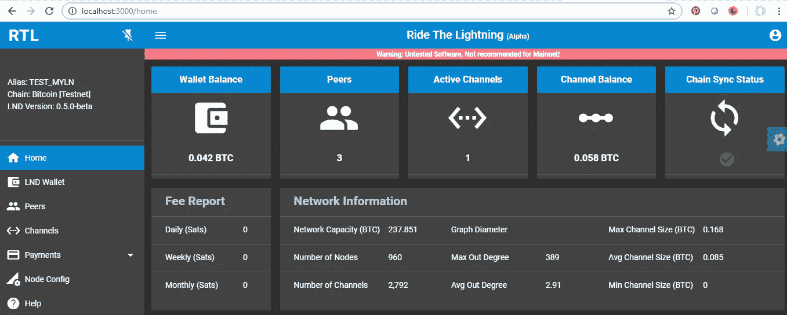

# 在 Windows 上用 LND 和比特币测试 RTL 网络用户界面

> 原文：<https://medium.com/coinmonks/testing-rtl-web-ui-with-lnd-and-bitcoin-on-windows-2728d62eb2f3?source=collection_archive---------1----------------------->

请帮助审阅和改进本指南。欢迎建设性的反馈。

当我们开始为 LND 开发 Ride The Lightning (RTL)应用程序时，我们经历了多次迭代，在 Windows 上设置比特币和 LND 测试节点基础设施，就像在 Windows 环境下进行开发一样。在这个过程中，我们学到了很多东西，这是一次分享从经验中获得的知识的尝试。

我们也有既得利益为我们的应用程序获得一些 alpha 测试人员，这样我们可以根据反馈改进应用程序。:-)


Application stack for running RTL

目的是提供一个基本指南，说明如何在 Windows 平台上设置带有比特币测试后端的闪电网络守护程序(LND)。本指南假设您对比特币和闪电网络有一些基本的了解。如果你需要更好地了解比特币和闪电网，下面是关于这些话题的很好的介绍。

[](https://bitcoinmagazine.com/guides/what-bitcoin/) [## 比特币是什么？

### 比特币对不同的人有不同的意义。对一些人来说，这是一个自由流动的货币不与任何货币挂钩的未来

bitcoinmagazine.com](https://bitcoinmagazine.com/guides/what-bitcoin/) [](https://bitcoinmagazine.com/articles/understanding-the-lightning-network-part-building-a-bidirectional-payment-channel-1464710791/) [## 了解闪电网络，第 1 部分:构建双向比特币支付渠道

### 闪电网络可能是最受期待的技术创新，将部署在…

bitcoinmagazine.com](https://bitcoinmagazine.com/articles/understanding-the-lightning-network-part-building-a-bidirectional-payment-channel-1464710791/) 

如果你喜欢更深入地挖掘和研究，你可以参考下面由[詹姆森·洛普](https://medium.com/u/efbe66f7cec8?source=post_page-----2728d62eb2f3--------------------------------)撰写的页面，这是关于这些主题的最佳概要。

 [## 詹姆森·洛普::比特币资源

### 比特币是一个革命性的系统，相当复杂，学习曲线也很陡。确保你有一个体面的…

lopp.net](https://lopp.net/bitcoin.html) 

闪电网络是比特币支付的第二层协议，建立在底层的比特币区块链网络之上。本指南重点介绍 Lightning 网络守护程序(LND)，它是 Lightning 网络协议规范的实现之一。闪电网络的协议规范被称为闪电技术或闪电的基础，可以在[这里](https://github.com/lightningnetwork/lightning-rfc/blob/master/00-introduction.md)找到。

闪电网络生态系统要求 LN 节点运营商向网络提供流动性和连接性，以便比特币用户可以使用网络进行支付。LN 节点运营商需要连接到网络对等方，打开与对等方的通道，并将比特币资金锁定在通道中，以便支付可以通过这些通道进行。有效的 LN 节点管理需要对对等体、信道、余额等进行主动监控。

[乘风破浪](/coinmonks/introducing-rtl-a-web-ui-for-lnd-d0bb0d937e91)网络用户界面正在开发中，旨在为 LN 节点运营商提供一个在 LND 易于使用的界面，使他们能够高效、直观地执行节点管理功能。

用 RTL 网络用户界面测试 LND，将需要设置三层软件，即比特币、LND 和 RTL。

*请注意:本指南侧重于在****test net**上运行所有软件，以方便测试和熟悉所有基础设施组件。***

****A)** **硬件要求****

**运行比特币和闪电不需要先进的硬件。任何运行 windows 7(或更高版本)且内存超过 2 GB 的家用电脑都足够了。您需要确保您有大约 35 GB 的硬盘空间用于比特币 testnet +闪电。**

**对于互联网连接，需要宽带非计量连接。**

**您可以在下面了解更多关于比特币的硬件要求:**

**[](https://bitcoin.org/en/full-node#minimum-requirements) [## 运行完整节点-比特币

### 矿工、企业和注重隐私的用户依赖于他们使用的完整节点的特定行为，所以他们将…

bitcoin.org](https://bitcoin.org/en/full-node#minimum-requirements) 

虽然核心网站上列出的要求是针对 mainnet 的。对于 testnet，互联网连接和硬盘空间要求要低得多，并且您的节点不需要在 testnet 上一直在线。** 

****B)比特币设置****

**第一步:根据您运行的 windows 版本，按照这里提供的说明下载并安装比特币核心。比特币核心的推荐版本为 0.17.0 或更高版本。**

**第 2 步:安装完成后，运行比特币核心 testnet 版本。**

****

**Running Bitcoin Core — Testnet**

**按照 Bitcoin.org 网站上提供的说明安装比特币核心。初始设置后，比特币核心图形用户界面将开始从网络上下载区块链，并开始同步你的 testnet 节点。**

**第三步:当图形用户界面上的菜单选项被启用时，点击菜单中的“设置”选项并选择“选项”。在“主”选项卡中，单击“打开配置文件”按钮。**

****

**Opening Bitcoin Core Config file**

**在配置文件中输入以下选项:**

```
*testnet=1
txindex=1
server=1
dbcache=6000
daemon=1
rpcuser=<user>
rpcpassword=<password>
zmqpubrawblock=tcp://127.0.0.1:28332
zmqpubrawtx=tcp://127.0.0.1:28333*
```

**替换配置文件中的用户和密码值。保存并关闭文件。**

**第 4 步:关闭比特币核心客户端，重新启动。让它与网络完全同步。Testnet 同步可能需要几个小时到一天，这取决于您的计算机配置和互联网带宽。区块链比特币测试网需要的总磁盘空间约为 28 GB。**

****C)雷电网络守护程序设置****

**第一步:在这里访问 LND [的最新版本。推荐下载的版本是“0.5-beta”或以上。根据计算机上 CPU 的类型，下载:](https://github.com/lightningnetwork/lnd/releases)**

***lnd-windows-386-v 0.5-beta . zip*’(英特尔 CPU)**

**或者**

***lnd-windows-amd64-v 0.5-beta . zip*’(AMD CPU)**

**第二步:将文件解压到一个文件夹中，这样会给你两个可执行文件，分别是'*lnd.exe*'和'*lncli.exe*'。**

**' lnd.exe '是一个完整的可执行包，你需要运行 lnd。“lncli.exe”提供了一个命令行界面来控制和查询 LND。**

**在运行 LND 之前，你应该确保比特币核心在 testnet 上完全同步。**

****

**Bitcoin Core Testnet — Synced**

**第三步:打开 windows 命令提示符和改变目录到文件夹的位置，LND 文件被解压缩。使用以下命令选项运行“lnd ”:**

```
lnd --bitcoin.active --bitcoin.testnet --debuglevel=debug --bitcoin.node=bitcoind --bitcoind.rpcuser=<user> --bitcoind.rpcpass=<password> --bitcoind.zmqpubrawblock=tcp://127.0.0.1:28332 --bitcoind.zmqpubrawtx=tcp://127.0.0.1:28333
```

**确保为 rpcuser 和 rpcpass 传递的值与 bitcoin.conf 文件中指定的值相同。**

****

**Running lnd from command prompt**

**一旦 LND 启动，该过程等待用户创建集成的 LN 比特币钱包。**

**第 4 步:打开另一个命令提示符窗口，并改变目录到文件夹中的 LND 文件解压。使用以下选项运行“lncli ”:**

**`lncli --n testnet create`**

**要创建新的钱包，请输入您的钱包密码，选择关于现有种子的`n`,并输入可选密码作为种子密码。创建由 24 个字组成的新密码种子。 ***记录下这个种子短语，最好写在纸上，妥善保管。*****

**第五步:一旦创建了钱包，lnd 进程将继续，并开始与比特币网络同步。它可能需要几个小时到一天的时间才能与比特币后端完全同步。**

****

**lnd syncing with Bitcoin Testnet**

**步骤 6:打开文件资源管理器并转到以下位置:**

```
C:\Users\<windows user>\AppData\Local\Lnd
```

**打开“lnd.conf”文件，并填入以下选项:**

```
[Application Options]
alias=<NameyourNode>
color=#68F450
debuglevel=debug
externalip=<your IP address>[Bitcoin]
# enable either testnet or mainnet
bitcoin.active=1
bitcoin.testnet=1
bitcoin.node=bitcoind[Bitcoind]
bitcoind.rpcuser=<user>
bitcoind.rpcpass=<password>
bitcoind.zmqpubrawblock=tcp://127.0.0.1:28332
bitcoind.zmqpubrawtx=tcp://127.0.0.1:28333
```

**为 alias、externalip、bitcoind.rpcuser 和 bitcoind.rpcpass 提供适当的值。保存并关闭文件。一旦配置好 lnd.conf，运行 lnd 就不需要传递命令行参数。**

**如果你重新运行 LND，在创建钱包后，你需要用你的密码解锁钱包，然后 lnd 才能开始与比特币后端重新同步并开始工作。使用以下命令解锁 lnd:**

```
lncli unlock
```

**您可以通过运行以下命令来检查 lnd 的状态:**

```
lncli -n testnet getinfo
```

**监控' synced_to_chain '参数，只要它不是' true '，lnd 仍在同步比特币。**

****

**getinfo output**

**您可以通过下面的“lncli”了解更多有关可用函数的信息:**

 **[## LND gRPC API 参考

### GenSeed 是应该用来实例化新 lnd 实例的第一个方法。这种方法允许呼叫者…

api.lightning .社区](https://api.lightning.community/)** 

****D) RTL 设置****

**第一步:驾驭闪电 web UI 需要 Node.js 和 Git。如果您还没有，可以从以下位置下载并安装这些依赖项:**

**node . js—[https://nodejs.org/en/download/](https://nodejs.org/en/download/)**

**https://git-scm.com/download/win**

**步骤 2:打开命令提示符，输入以下命令:**

```
> cd /
> git clone [https://github.com/ShahanaFarooqui/RTL.git](https://github.com/ShahanaFarooqui/RTL.git)
> cd RTL
> npm install
```

**给国家防范机制一些时间来完成 RTL 的安装。**

**步骤 3:npm 安装完成后，运行以下命令启动 RTL web 服务器(确保您位于运行 NPM 安装的 RTL 文件夹中)。**

```
> node rtl --lndir <Path of admin.macroon file> 
```

**在 testnet 上运行的 lnd v 0.5 的 admin.macroon 文件的位置是:**

```
C:\Users\<windows user>\AppData\Local\Lnd\data\chain\bitcoin\testnet
```

**如果 RTL web 服务器初始化成功，它应该如下所示:**

****

**RTL initializes successfully**

**第四步:打开 RTL 网页界面，打开浏览器，网址如下:**

**[http://localhost:3000](http://localhost:3000)**

**瞧啊。你准备好接受测试了。**

**如果您的 lnd 节点解锁，应用程序的主页将如下所示:**

****

**RTL home page with LND unlocked**

**如果您的 lnd 节点被锁定，UI 将提示您输入节点密码，可以输入该密码来解锁节点。根据节点被锁定的时间长短，可能需要一段时间才能在解锁后同步，并且应用程序可以使用。**

**第五步:现在你已经准备好用闪电网络和比特币测试 RTL 了。您可以在下面了解有关可用 RTL 功能的更多信息:**

**[https://github . com/ShahanaFarooqui/RTL/blob/master/Application _ features . MD](https://github.com/ShahanaFarooqui/RTL/blob/master/Application_features.md)**

****E)资金节点****

**要使用闪电网络，你需要为你的节点提供资金。你可以通过水龙头获得一些测试网硬币来资助你在测试网上的节点。我列出了一些活跃的水龙头网址，可以用来获取测试网硬币。**

 **[## 比特币测试网 3 水龙头

### 比特币测试网龙头

coin 龙头. eu](https://coinfaucet.eu/en/btc-testnet/)**  **[## TP 的测试网龙头

### 这是一个比特币测试网龙头和电子钱包。该网站仅用于测试目的。请记住…

tpfaucet.appspot.com](http://tpfaucet.appspot.com/)**  **[## 又一个比特币测试网龙头！YABTF！

### 没有广告！没有 BS！没有跟踪的东西！有史以来最好的开发体验！

testnet-faucet.mempool.co](https://testnet-faucet.mempool.co/)** 

**一旦你完成了测试，做一个好公民，并归还 testnet 硬币，这样其他开发人员和测试人员就可以使用它了。**

****F)测试 RTL****

**使用 RTL 用户界面测试 lightning 网络的步骤包括:**

**步骤 1:资助你的节点**

****

**LND Wallet Screen**

**第二步:与同龄人交往**

****

**Peer management screen**

**步骤 3:打开与连接的对等方的通道**

****

**Channel Management screen**

**第 4 步:核实并发送付款**

****

**Verify and Send Payments screen**

**您可以在以下测试网站上测试验证和发送付款:**

 **[## 闪电网络出版公司。

### 使用微支付发布和阅读内容

testnet.yalls.org](https://testnet.yalls.org/)**  **[## Starblocks |在 TESTNET 上用 LN 花比特币

### 编辑描述

starblocks.acinq.co](https://starblocks.acinq.co/)** 

****G)寻求帮助****

**要获得有关技术问题的帮助，最好与社区联系。**

****比特币****

**对于比特币来说，一个很好的起点是 bitcoin.org，它列出了具有良好牵引力和非常大的现有知识库的社区 URL。**

**[](https://bitcoin.org/en/community) [## 社区-比特币

### 找到与比特币相关的有趣的人、团体和社区。

bitcoin.org](https://bitcoin.org/en/community) 

**闪电**

对于闪电，LND 开发商 Slack 是一个很好的地方来寻找 LND 或闪电的答案，以及挂出来，提高你的知识。

 [## 闪电网络开发人员

### Lightning 网络守护程序的开发人员资源和文档。

开发闪电社区](https://dev.lightning.community/) 

**骑着闪电(RTL)**

在 RTL 问题上获得帮助的最佳途径是在 Github 上开一个问题并参与进来。

[](https://github.com/ShahanaFarooqui/RTL/issues) [## 沙哈纳法鲁基/RTL

### RTL 大厦。在 GitHub 上创建一个帐户，为沙哈纳法鲁基/RTL 的发展做出贡献。

github.com](https://github.com/ShahanaFarooqui/RTL/issues) 

**H)学分**

这一部分是留给帮助审查和改进本指南的人的。提前感谢！:-)

**I)参考文献**

[](https://bitcoin.org/en/) [## 比特币——开源 P2P 货币

### 比特币是一种创新的支付网络，也是一种新的货币。找到您需要知道的一切，并开始…

bitcoin.org](https://bitcoin.org/en/) [](https://lightning.engineering/) [## 闪电实验室

### 我们正在开发 Lightning:一个开放的协议层，它利用区块链和智能合约的力量来实现…

闪电工程](https://lightning.engineering/) [](https://github.com/ShahanaFarooqui/RTL) [## 沙哈纳法鲁基/RTL

### RTL 大厦。在 GitHub 上创建一个帐户，为沙哈纳法鲁基/RTL 的发展做出贡献。

github.com](https://github.com/ShahanaFarooqui/RTL) [](https://github.com/lightningnetwork/lightning-rfc/blob/master/00-introduction.md) [## 闪电网络/闪电-rfc

### 雷电网络规格。通过在…上创建帐户，为 lightningnetwork/lightning-rfc 的发展做出贡献

github.com](https://github.com/lightningnetwork/lightning-rfc/blob/master/00-introduction.md) 

RTL 网络用户界面是一项正在进行的工作，我们正在努力增加更多的功能，提高应用程序的可用性。任何反馈、评论、代码贡献等。很受欢迎。如果你想成为一名开发者，Angular 5/6/7 和 Node.js 技能会派上用场。欢迎对我们的开发 [git repo](https://github.com/ShahanaFarooqui/RTLFullApplication) 提出拉取请求。

就是这个！希望这篇指南能帮助你踏上探索比特币和闪电网络的旅程。如有任何问题或反馈，欢迎在 twitter ( [@Suheb__](https://twitter.com/Suheb__) )留言或找我。

> [直接在您的收件箱中获得最佳软件交易](https://coincodecap.com/?utm_source=coinmonks)

[](https://coincodecap.com/?utm_source=coinmonks)**