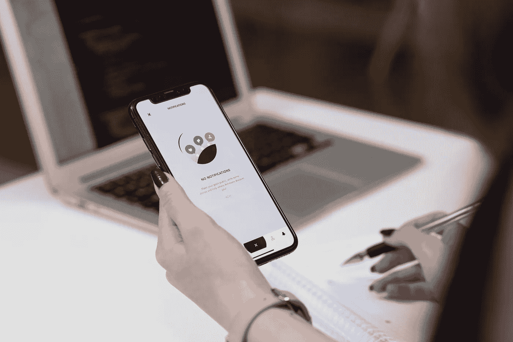
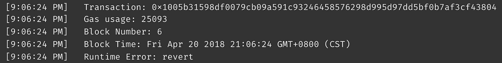

# 测试可靠性。SoTP —第 2 部分

> 原文：<https://medium.com/coinmonks/testing-solidity-dapp-sotp-part-2-9685b3375aaf?source=collection_archive---------1----------------------->



Photo by [freestocks.org](https://unsplash.com/photos/40k6ZqbsXuo?utm_source=unsplash&utm_medium=referral&utm_content=creditCopyText) on [Unsplash](https://unsplash.com/search/photos/testing?utm_source=unsplash&utm_medium=referral&utm_content=creditCopyText)

我们将在这里做一些真正的 Dapp 测试，并看到这样做的一些很酷的功能。在《鲨鱼池》系列的前一部分中，我们已经创建了一个全功能的 Solidity smart contracts Dapp。或者我们是这样认为的。在我们把它投入生产之前，必须对它进行测试。

**Dapp**的试玩版在[这个地址](http://34.210.217.34/)有。

所有的**源代码**都可以在[这个 GitHub 库](https://github.com/joze144/pool-shark)中免费获得。

加入我们: [Solidity 开发社区，了解更多信息](https://solidity_devs.select.id/bjxx)

# 测试环境

对于编码部分，我们将使用带有 async/await 库的 [Truffle 框架。松露提供](http://truffleframework.com/docs/getting_started/javascript-tests)[**web 3**](http://web3js.readthedocs.io/en/1.0/)[**摩卡**](https://mochajs.org/) 和 [**柴**](http://www.chaijs.com/) 库开箱。这正是我们所需要的。

我们还需要一个可以安全做事的区块链。为此，我们将使用 [Ganache ("testrpc")](http://truffleframework.com/ganache/) 。它所做的，是在你的机器上运行一个测试区块链，并设置 10 个帐户，每个帐户有 100ETH 余额。

# 测试

松露让你在这里的生活超级轻松。在 truffle init 上，它创建了一个测试目录，你应该把你的测试放在那里。当你将运行 **truffle test** 命令时，它将自动经历编译、迁移和部署阶段，然后运行你目录中的所有测试。

从你的根目录运行**块菌测试**命令来运行测试

```
$ truffle test
```

您不必担心您是否正在测试最新的构建。松露确保了这一点。如果你想运行一个特定的测试文件，你可以把它作为 test 命令的一个参数。

运行单个测试

```
$ truffle test ./test/fishToken.js
```

## 测试基础

首先，我们创建一个测试文件。这是一个极简测试的样子。

```
**const *FishToken*** = artifacts.require(**"./FishToken.sol"**)

**const *timePeriodInSeconds*** = 3600
**const *from*** = ***Math***.floor(**new** Date() / 1000)
**const *to*** = ***from*** + ***timePeriodInSeconds*** contract(**'FishToken'**, **async** (accounts) => {
  **const** owner = accounts[0]

  **let** instance
  beforeEach(**'setup contract for each test'**, **async** () => {
    instance = **await *FishToken***.new(***to***)
  })

  it(**'Owner is shark'**, **async** () => {
    **const** currentShark = **await** instance.currentShark()
    assert.equal(currentShark, owner)
  })
})
```

松露在这里变了变戏法，默认为你提供了[**【web 3】**](http://web3js.readthedocs.io/en/1.0/)[**摩卡**](https://mochajs.org/) 和 [**柴**](http://www.chaijs.com/) 库。让我们看看我们还用过什么:

*   **artifacts.require()** 获取您的契约抽象。这样就不需要契约 ABI 或字节码。
*   **contract()** 类似于摩卡里的 **describe()** 。唯一的区别是它给了你**账户**参数，从 **web3** 获取你的账户，让你的生活更轻松。
*   **beforeEach()** 和摩卡里一样。它在每个 **it()** 之前被调用。这样，您可以为每个测试获得一个新的契约实例。
*   **Contract.now()** 部署契约的新实例。只需要提供构造函数参数。

协定上的每个函数和变量都可以从实例中调用。让我们看看如何在我们的 FishToken 契约上调用 **transfer()** 函数。

```
**await** instance.transfer(to, amount, {**from**: from, gas: 5000000, gasPrice: '20000000000000'})
```

**transfer()** 是一个函数实例。我们需要用我们在合同中定义的参数和一些特定于交易的参数来填充它:

*   **到**是我们要发送令牌的地址。
*   **金额**是我们要发送的代币金额。
*   来自的**是可选的。默认情况下，它是您的**帐户**变量中的第一个帐户。这是在合同代码中显示为 msg.sender 的帐户。**
*   **气**和**气价**都是可选的。不需要真的为 testnet 设置它们，但是它们设置了你想要为事务花费的以太量。

更多代码请查看存储库中的测试。在这里，我将描述更多的一般情况下，什么样的测试，我们必须为我们的 Dapp。我们的 Dapp 可能看起来很简单，但是它实际上包含了相当多要测试的不那么琐碎和普通的东西。

## 能见度

我们必须确保内部函数不能被执行。通过使用 async/await，您可以将 **try/catch** 放在应该失败的语句周围，并断言 **catch()** 得到执行。

```
it(**"Add to participants should be restricted"**, **async** () => {
  **try** {
    **await** instance.addToParticipants(user1)
    assert.equal(**true**, **false**)
  } **catch** (err) {
    assert.equal(**true**, **true**)
  }
})
```

我们还必须确保我们的 **issueToken()** 函数，只能由创建者执行，这是一个**池**契约。

## 溢出和下溢

**uint256** 最大值为 2ˇ256–1。这是一个巨大的数字，但是上溢和下溢仍然是可能的。如果您注意了本系列前一部分中的代码，您会发现我们已经在处理事务和发布新令牌时检查了溢出和下溢。

```
**function** transfer(**address** _to, **uint256** _value) **public** onlyWhileOpen **returns** (**bool** success) {
    **if** (balances[msg.sender] < _value || balances[_to] + _value <= balances[_to]) {
        **return false**;
    }
```

在 if 语句中，我们检查发送方的余额是否足够进行该交易。这本身就防止了下溢。但是我们还必须检查接收方和添加金额的余额是否高于当前余额。可能发生的情况是，在添加数量后，我们得到一个溢出。这意味着我们越过了最大可能的数字，余额又开始从 0 开始计数。这肯定会破坏我们的数据，这种检查可以防止这种情况。

我们需要小心修改平衡状态的每一个函数。在我们的例子中，这意味着 FishToken 契约上的函数 **transfer()** 和 **issueToken()** 。而且在池合同上处理存款的功能，如果由于任何原因我们不能发行代币，必须拒绝存款。

果然，在测试中我发现了一个问题。在溢出的情况下，我在 **FishToken** 合约上拒绝了令牌的发行，但在 **Pool** 合约上没有正确处理拒绝。

让我们看看代码。这是有 bug 的旧版本。

```
**function** () **public payable** onlyWhileOpen {
    require(msg.value > 0);
    **uint256** rewardTokens = rate.mul(msg.value);
    iFishToken(token).issueTokens(msg.sender, rewardTokens);
}
```

我们只是称 **issueTokens()** 不在乎结果。我们应该做的是要求 **issueTokens()** 调用成功，否则恢复事务。固定代码看起来像这样

```
**function** () **public payable** onlyWhileOpen {
    require(msg.value > 0);
    **uint256** rewardTokens = rate.mul(msg.value);
    require(iFishToken(token).issueTokens(msg.sender, rewardTokens));
}
```

我现在也修复了我以前帖子中的代码。

## 时间约束函数

测试时间受限的函数有点棘手。有两种方法可以做到。一个你可以在区块链上操纵时间的街区。Zeppelin library 已经有了一个[助手来做这件事](https://github.com/OpenZeppelin/zeppelin-solidity/blob/master/test/helpers/increaseTime.js)，并且可以免费使用。当然，这只适用于测试网。

但是我更喜欢做的是创建一个模拟契约，它让我可以操纵变量**的值。这是我们将在这里使用的。您要做的是创建一个子契约，并添加测试所需的函数。**

```
**pragma** solidity ^0.4.21;

**import "./SafeMath.sol"**;
**import "./FishToken.sol"**;

**contract** TimeMockedFishToken **is** FishToken {
    **using** SafeMath **for uint256**;

    **function** leapForwardInTime(**uint256** _seconds) **public returns** (**bool** success) {
        **if**(deadline.sub(_seconds) > deadline){
            **return false**;
        }
        deadline = deadline.sub(_seconds);
        **return true**;
    }

    **function** leapBackInTime(**uint256** _seconds) **public returns** (**bool** success) {
        **if**(deadline.add(_seconds) < deadline) {
            **return false**;
        }
        deadline = deadline.add(_seconds);
        **return true**;
    }

    **function** TimeMockedFishToken(**uint256** _deadline)  FishToken(_deadline) **public** { }
}
```

您可能会发现构造函数的定义有点奇怪(我就是这样)。它所做的只是将参数传递给 FishToken 构造函数。

**TimeMockedFishToken** 拥有父 **FishToken** 的所有方法和变量，但是让我们用这两个额外的方法来更改 **deadline** 的值。看看我是如何在这个模拟契约中检查下溢和溢出的。只是为了让它进入肌肉记忆！

# 排除故障

每个人都会犯错，迟早你会不知道为什么有些交易没有通过。这就是松露再次帮助你的地方。它[提供了一个调试器](http://truffleframework.com/docs/getting_started/debugging)，帮助你调试事务执行。你只需要一个事务 id，用它调用 truffle debug 命令。

失败交易的示例。



```
$ truffle debug 0x1005b31598df0079cb09a591c93246458576298d995d97dd5bf0b7af3cf43804
```

它将再次运行事务，并让您一步一步地通过它。您还可以看到变量的值，并轻松地找出导致事务被拒绝的确切原因。

# 结论

我们已经完成了智能合约的测试。我发现了一些可能的问题，并解决了它们。我想提一下，我只涉及了适用于我们 Dapp 的测试。要了解更多信息，我强烈推荐浏览 Consensys 的[已知攻击列表。现在，我们可以相当自信地认为，我们的智能合约会按计划运行。](https://consensys.github.io/smart-contract-best-practices/known_attacks/)

你在我的代码中发现错误了吗？你能找到优化它的方法吗？请让我知道，我很想听到你的反馈！

**Dapp**的演示可在[这个地址](http://34.210.217.34/)获得。

所有的**源代码**都可以在[这个 GitHub 库](https://github.com/joze144/pool-shark)中免费获得。

## 该系列的部分内容:

*   [第 1 部分——可靠性智能合同](/@jozhe/learn-solidity-shark-of-the-pool-part-1-ac0f733eecdd)
*   **第 2 部分—测试坚固性 Dapp**
*   [第 3 部分—节点。Solidity Dapp 的 JS 后端服务](/@jozhe/node-js-backend-service-for-ethereum-dapp-sotp-part-3-2d3aa5ec50e9)
*   [第 4 部分—使用 MetaMask Web3 反应 Web 应用程序](/@jozhe/react-web-dapp-with-metamask-web3-sotp-part-4-f252ebe8d07f)