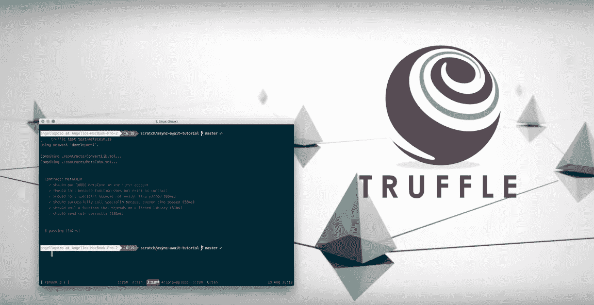

# 用 Truffle 和 Async/Await 测试可靠性

> 原文：<https://medium.com/coinmonks/testing-solidity-with-truffle-and-async-await-396e81c54f93?source=collection_archive---------2----------------------->

如果你问一个程序员/开发者工作中最糟糕的部分是什么，我想大多数人会说写测试。您必须创建模拟数据并进行编码反转，以使特定的东西正常工作。除此之外，你必须为一个特性/功能编写许多不同的案例。编写好的测试需要很多时间。但是随着 node 8 中 async/await 的引入，编写测试变得更好了！这就是我们用来为 [HelloSugoi](https://www.hellosugoi.com/) 创建超过 100 个测试的[。](/hello-sugoi/building-100-tests-for-hellosugoi-ebde9a6c62d)

> [发现并回顾最佳区块链软件](https://coincodecap.com)

## 观众:

主要面向用 Solidity 编写以太坊应用程序和用 Javascript 编写代码测试的开发人员。对于任何对 async/await 及其如何帮助编写更好的测试感兴趣的人来说。

## 要求/安装:

对于节点 8，async/await 默认启用。在 7.6 版本之前，只要添加了`--harmony-async-await`标志，就可以使用 async/await。对于之前的版本，你也可以使用 [Babel](https://babeljs.io/) 向下转换到 ES5 兼容的 javascript。我建议安装 Node 8 或以上，这个项目才能正常工作。您可以使用[自制软件](https://brew.sh/)或 [nvm](https://github.com/creationix/nvm) 来管理您正在使用的版本。

除了安装 node 之外，您还需要在全球范围内安装 [Truffle](https://github.com/trufflesuite/truffle) 和 [Ganache-cli](https://github.com/trufflesuite/ganache-cli) 。

1.  `npm install -g truffle`
2.  `npm install -g` 加纳切-cli

[Truffle](https://github.com/trufflesuite/truffle) 用于编译和迁移实体契约到以太网上。 [Ganache-cli](https://github.com/trufflesuite/ganache-cli) 作为伪以太坊节点，立即返回，而不是 15 秒。要确认您已经安装了所有组件，请尝试以下操作:

1.  Node ≥ 7.6 在命令行输入`node -v`确认
2.  通过在命令行中输入`npm -v`来确认 npm ≥ 4
3.  [松露](https://github.com/trufflesuite/truffle) ≥ 3.3 在命令行输入`truffle -v`确认
4.  [Ganache-cli](https://github.com/trufflesuite/ganache-cli) ≥ 5.0.0 在命令行输入`ganache-cli -v`确认

## 项目设置示例:

我有一个例子项目回购与我们所有的代码。如果您想使用它，请克隆并安装它的依赖项。

1.  git 克隆[https://github.com/sogoiii/truffle-async-await-tests](https://github.com/sogoiii/truffle-async-await-tests)
2.  `cd truffle-async-await-tests`
3.  `npm install`或`yarn install`
4.  `truffle compile`
5.  `truffle test`

第四个命令运行所有测试，它们应该成功完成。

## 异步/等待的工作原理:

从概念上讲，async/await 使异步 JavaScript 代码看起来像同步代码。让我们比较一下这两者:

Comparing simple truffle test as promise chain or async/await

从上面的例子中，我认为`status2`方法看起来比`status`方法更干净。它实际上有 4 行样板文件，比`status2`中的 3 行逻辑还要多。我觉得选择很容易！

要使用 async/await，您需要将`async`名字添加到函数声明中。这告诉 v8 解释器寻找`await`键，否则 node 抛出一个错误，询问`await`是什么。你把`await`放在任何 promise 函数/方法前面，不是回调！如果你的函数是回调函数，我建议使用像[蓝鸟](http://bluebirdjs.com/docs/api-reference.html)或者 Node 8 中引入的原生 [promisify 方法](http://2ality.com/2017/05/util-promisify.html)这样的包。幸运的是，[松露](https://github.com/trufflesuite/truffle)回报的是承诺而不是回调。

一个异步函数(`async function(){}`)也返回一个承诺！这很好，因为如果需要的话，您可以链接承诺或异步函数。如下例所示:

Async returns a promise

不久前，async/await 遇到了相当大的性能冲击。它足够大，不使用 async/await 是合理的。自从 [v8 5.5 发布以来，性能](https://v8project.blogspot.com/2016/10/v8-release-55.html)变得越来越好。除非您正在做计算量很大的事情，否则使用 async/await 可能是一个不错的选择。

## 示例(简单情况):

[松露](https://github.com/trufflesuite/truffle)好吃是因为`.deployed`还一个承诺。记住，承诺面前只有等待的地方！

打开`test/metacoin.js`文件，查看第一个测试。

Truffle easy test example

第一次测试只做了 3 个操作。第一个是获取已部署的契约 JavaScript 对象，并将其设置为变量`meta`。然后调用`await`关键字后面的函数`getBalance.call()`函数。同样，这是因为`.call`返回一个承诺。最后，我们简单地检查函数是否在断言中返回了预期的值。很简单！它的所有检查是根据测试标题检查`meta`的余额是否为`1000`。

当您在命令行中运行`truffle test test/metacoin.js`时，您将看到所有测试是如何成功运行的。

## 示例(错误情况):

要用 async/await 捕获错误，您需要将调用包装在 try/catch 中。

Truffle fail test example

在上面的测试中，我调用了一个我知道在 Solidity 契约中不存在的函数。`Await`将抛出一个在 try/catch 中被捕获的错误。因为我想验证调用`someNonExistentFn`是否抛出错误，所以我在 catch 中返回 true 以退出测试。如果`await meta.someNonExistentFn()`成功，catch 块将不会被调用，下一行`throw new Error(...)`将被命中。从而告诉我函数没有抛出。

## 示例(时间旅行):

有时，一个可靠契约可能有一个只有在将来被调用时才起作用的功能。在`MetaCoin.sol`中，我给`specialFn`添加了`onlyAfterDate`函数修饰符，在这里我定义了将来什么时候可以调用一个函数。

MetaCoin.sol with time info only

在元币构造函数内部，我手动将`endTime`设置为`1 days`。固体中的时间变量是纪元秒的`uint`。`onlyAfterDate`函数修饰符使用`endTime`，这意味着任何带有`onlyAfterDate`的函数都只能在`1 days`中被调用。

为了测试这项功能，我们不会等一整天！当时间更加动态而不是硬编码时会发生什么？Ganache-cli 增加了一个名为`evm_increaseTime`的 RPC 方法，它将穿越区块链。

Ganache-cli evm_increaseTime as a promise

我们所要做的就是用`evn_increaseTime`和 params 对 web3 进行 RPC 调用。我将基于回调的 web3 封装到一个 promise 中，这样我们可以将它与 async/await 一起使用。

有了这个新功能，我们只需简单地用一个时间和嘣！都过了几天了！如果您使用的是 [Testrpc](https://github.com/ethereumjs/testrpc) 4.0.0(以及旧版本的 ganache-cli)，那么会有一个 bug，必须挖掘一个块才能使`evm_timeTravel`生效。你可以在这里查看 bug。

Successful time travel with Truffle and Ganache-cli

## 大对比:

下面的两个片段测试了完全相同的东西。唯一的区别是一个写为承诺链，另一个写为 async/await。只是把重点讲清楚！

Large Promise Chain Truffle Test

Large Async/Await Truffle Test

## 结论:

我希望您能看到 async/await 的测试有多好。许多样板文件消失了，这增加了可读性。捕捉错误可能更繁琐，但它们是可以管理的。另外，如果您需要为您的测试进行时间旅行， [Ganache-cli](https://github.com/trufflesuite/ganache-cli) 提供了一种更新时间的方法。如果您已经在使用 promises，那么与 async/await 集成是非常容易的。如果你有很多回调，那么使用`require('utils').promisify`让你的生活变得简单。看到趋势了吗？

> 加入 Coinmonks [电报频道](https://t.me/coincodecap)和 [Youtube 频道](https://www.youtube.com/c/coinmonks/videos)获取每日[加密新闻](http://coincodecap.com/)

## 另外，阅读

*   [复制交易](/coinmonks/top-10-crypto-copy-trading-platforms-for-beginners-d0c37c7d698c) | [加密税务软件](/coinmonks/crypto-tax-software-ed4b4810e338)
*   [网格交易](https://coincodecap.com/grid-trading) | [加密硬件钱包](/coinmonks/the-best-cryptocurrency-hardware-wallets-of-2020-e28b1c124069)
*   [密码电报信号](http://Top 4 Telegram Channels for Crypto Traders) | [密码交易机器人](/coinmonks/crypto-trading-bot-c2ffce8acb2a)
*   [最佳加密交易所](/coinmonks/crypto-exchange-dd2f9d6f3769) | [印度最佳加密交易所](/coinmonks/bitcoin-exchange-in-india-7f1fe79715c9)
*   [Bitget 回顾](https://coincodecap.com/bitget-review) | [双子星 vs BlockFi](https://coincodecap.com/gemini-vs-blockfi) | [OKEx 期货交易](https://coincodecap.com/okex-futures-trading)
*   [美国最佳加密交易机器人](https://coincodecap.com/crypto-trading-bots-in-the-us) | [经常性回顾](https://coincodecap.com/changelly-review)
*   [在印度利用加密套利赚取被动收入](https://coincodecap.com/crypto-arbitrage-in-india)
*   [霍比评论](https://coincodecap.com/huobi-review) | [OKEx 保证金交易](https://coincodecap.com/okex-margin-trading) | [期货交易](https://coincodecap.com/futures-trading)
*   [面向开发人员的最佳加密 API](/coinmonks/best-crypto-apis-for-developers-5efe3a597a9f)
*   最佳[密码借贷平台](/coinmonks/top-5-crypto-lending-platforms-in-2020-that-you-need-to-know-a1b675cec3fa)
*   [杠杆代币的终极指南](/coinmonks/leveraged-token-3f5257808b22)