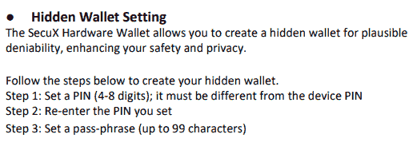

# 测试 SecuX V20 硬件钱包|回顾

> 原文：<https://medium.com/coinmonks/testing-the-secux-v20-hardware-wallet-review-4cc19dc7e8de?source=collection_archive---------0----------------------->

## 隐藏的账户，暴露的 XPubs，泄露的密钥，和其他诡计

作者@ vicariousdrama

653892–654043

# 摘要

SecuX V20 是来自 [SecuX](https://secuxtech.com/) 的旗舰硬件钱包产品，SecuX 是 2018 年成立的相对较新的产品。该设备有一个大触摸屏彩色显示器，一个离线/断开操作的电池，并通过 USB 或蓝牙与主机接口。它兜售一种已经通过 CC EAL5+认证的[英飞凌](https://www.infineon.com/)安全元件芯片。虽然就钱包而言体积庞大，但它看起来令人愉快，但却过时了，像一个超大的杯垫或扁平的冰球。

本文不是拆箱或用户特性的演练。为此，我建议你关注用户手册或你最喜欢的视频网站上的各种视频。不过，我将介绍一些我在测试这款钱包时遇到的安全和隐私问题。对于任何使用硬件钱包的人来说，安全性是一个非常重要的问题，并且通常会根据个人的需要而与可用性相调和。我希望你在这里不仅能学到 SecuX 钱包的一些东西，还能学到为你挑选[最佳五金钱包](/coinmonks/the-best-cryptocurrency-hardware-wallets-of-2020-e28b1c124069)时需要寻找的东西。

# 试验台

让我首先声明我通常在产品中做所有的测试。由于资源有限，这更像是一种个人选择，它迫使我对自己正在做的事情格外关注。在这种情况下，没有办法运行 testnet，如果我想，因为设备不支持它。

虽然这款设备支持蓝牙，但我没有在测试中使用它。它可能非常方便与移动设备配对，但考虑到 SecuX 的笨重，我发现我可能会随时坐在办公桌前操作它。

USB 是我选择的唯一接口方式，并且只具有基于浏览器的功能，因为它提供了完整的功能集并且是跨平台的。

# 隐藏账户和似是而非的否认

为了初始化设备，我使用 pins 1234 和 0000(这里表示的 pin 和密码是为了解释简单起见。用更强的！).我允许设备生成种子词，并验证它可以恢复种子恢复词。出于安全考虑，您应该按照协议生成自己的种子词，并可以使用 Estudio 比特币指南[https://estudiobitcoin . com/do-you-trust-your-seed-don-generate-it-yourself/](https://estudiobitcoin.com/do-you-trust-your-seed-dont-generate-it-yourself/)。

无论您是允许设备随机选取一组种子词，还是自己生成一组种子词，它都只支持没有密码的情况。“25 号”这个词实际上是隐藏钱包功能的一部分。因此，如果您有一个密码，您可以用基本的 24 个字进行初始化，然后创建一个隐藏的钱包，在配置时指定您的密码。

还需要注意的是，wallet 只适用于嵌套的 segwit。

[手册](https://secuxtech.com/secuxtech-download/User-Manual/SecuX-User-Manual-2019.pdf)的第 4 页对隐藏钱包功能进行了说明。

所以在我的情况下，我用别针 *1234* 保护了底座 24 个字。我将把这个称为“主关键字”。当使用主密钥的 pin 码登录设备时，设置菜单有一个隐藏选项。点击它，我选择并确认 pin 码 *0000* 。对于密码短语，在引脚 *0000* 上，我使用 *AAAA* 。我称之为“隐藏密钥”。此时，设备重新启动，当使用隐藏键登录时，设置菜单不再显示隐藏选项。

现在让我们回顾一下，如果是在胁迫下，这是如何应用的。在扳手攻击的情况下，如果您使用主密钥登录，那么熟悉该设备的攻击者可以验证您是否在主密钥上，因为在设置中可以使用 Hidden。同样，如果你用隐藏的密钥登录，他们也知道。

因此，要使用带有胁迫类型设置的钱包，您需要执行以下操作

1.  使用主密钥的 pin 码登录( *1234* )
2.  从“设置”菜单中，确认“隐藏”是显示的选项
3.  单击隐藏选项
4.  输入并确认 pin 码( *0000* )
5.  输入密码

现在我不用 AAAA 的*。而是我要用 *ZZZZ* 。设备重新启动，我使用隐藏密钥的 ping 命令登录。*

由于密码短语充当第 25 个字，隐藏密钥现在用一个完全不同的私钥设置，那是我第一次使用 *AAAA* 的时候。我可以登录到 web 控制台，并管理帐户。虽然隐藏帐户上的标签仍然是不同的密码短语，但在引擎盖下，它是一个不同的私钥和公钥。

所以为了保护资金，你不仅要记住两个不同的 pin，还要记住你的密码。有了上述信息..

*   主关键字—用少量资金作为假货处理
*   隐藏的密钥密码 *AAAA* —用少量资金当作假的
*   隐藏的密钥密码*ZZZZ*——大部分资金的真实“隐藏”

概括一下:每当我需要花费/查看我的存储时，我登录 Main，用密码短语 *ZZZZ* 为我的存储配置 Hidden。然后，我登录到隐藏的密钥，执行交易，然后重新启动。重新登录到主界面，用密码短语 *AAAA* 配置隐藏的假货。这允许显示主账户和隐藏账户，而不会暴露你的秘密。

做点工作，并不是保护基金的好方法，但对于貌似可信的否认来说，这还可以。

# 暴露的 XPubs

SecuX wallet 的一个主要注意事项是，所有的接口都必须与 SecuX 自己控制的服务器或与之接口的第三方进行。没有 HWI 接口，也没有插件可以使用像 [Electrum](http://electrum.org/) 、 [Sparrow](https://sparrowwallet.com/) 或 [Specter](https://github.com/cryptoadvance/specter-desktop) 这样的通用软件接口来使用钱包。

也许它是为了保护用户免受技术问题的困扰，但无论是设备还是网络界面，(可能还有 iOS 和 Android 移动应用)都没有提供任何关于 XPubs 或派生路径的信息。例如，这对于在 Electrum 中设置手表钱包是很方便的。然而，有两种方法可以减轻这种情况

## 备选方案 1。脱机使用 Electrum

在完全离线的计算机未连接到网络的情况下，使用[尾](https://tails.boum.org/)启动，打开 Electrum，并使用初始化设备时建立的种子字恢复钱包。选择选项以表明它是 [BIP 39](https://github.com/bitcoin/bips/blob/master/bip-0039.mediawiki) ，并可选地输入您想要的密钥的密码短语( *AAAA* 和 *ZZZZ* )。对于钱包类型，应该选择 **P2WPKH-P2SH** ，派生路径 **m/49'/0'/0'** 。然后，您可以查看将显示 ypub 的钱包信息。在控制台中，您可以通过输入以下内容获得更多详细信息，包括 xpub 和 ypub

> wallet.get _ keystores()中 k 的 k.dump()

## 选项 2。使用网站

无论如何，在某些时候你必须使用这个网站。甚至只是创建一个帐户，让硬币出现在您设备上的列表中。

当你进入[钱包网站](https://wallet.secuxtech.com/SecuXcess/#/wallet/account)并连接你的设备时，会有大量的各种域和 API 调用活动。

在查看比特币账户信息时，XPub 和 YPub 对正在查看的当前账户进行了两次调用。您可以在开发人员工具中看到这些请求，并保留下来以供将来参考。简而言之，web 界面与硬件钱包通信，提取公钥，并将它们发送到 api.blockchair.com 以获得地址列表。

从隐私的角度来看，您的 xpub 信息，或者至少是关于加密货币的流量，正在与以下甚至更多人共享

*   maxst.icons8.com
*   fonts.gstatic.com
*   wallet.secuxtech.com
*   [www.google-analytics.com](http://www.google-analytics.com)
*   cdnjs.cloudflare.com
*   o414050 .摄取.哨兵. io
*   api.blockchair.com
*   bitcoinfees.earn.com
*   report-uri.cloudflare.com

应该非常清楚的一点是，使用这种设备没有任何隐私可言。虽然这是一种延伸，但可以想象，上述实体中的一些可以对请求执行模式识别，以确定一段时间内的公钥集，并确定您的隐藏钱包是否处于“隐藏模式”的状态。

# 地址验证和硬币控制

无论您使用哪个选项从前面的部分中获得 XPubs，您都可以将它们加载到 Electrum 中，以获得另一种方法来验证设备上显示的地址是否在您的控制之下。

在网络界面中，我发现当点击账户的接收按钮时，显示的地址似乎是从接下来的 5 个可用地址中随机选择的。当它与第一个地址不匹配时，这最初引起了人们的关注，因此有更多的理由在 Electrum 或其他钱包设置中验证地址以观看 XPub。

没有硬币控制可用于选择地址消费。

所有交易的签名都是通过将设备与 web 应用程序集成，并通过触摸板在设备上执行确认操作来完成的。不支持离线交易、PSBTs 或对您自己或首选服务器的广播控制。

# 泄露的钥匙

这让我想到了我的下一个主要关注点。网站上泄露的密钥。不是您的私钥(希望保存在设备的安全元件中)，而是 web 站点用来调用不同 web 服务的密钥。

根据收集到的信息，这很容易被利用来关闭服务并阻止人们查看他们的帐户。由于该设备依赖于与网站的这种交互来准备交易，因此用户不仅不能看到他们的账户，而且也不能从他们那里消费。SecuX 网站上的常见问题解答解决了这个问题

这和我的推荐不谋而合。生成您用来初始化设备的种子词，并备份它们，以便您可以恢复您的帐户和资金。

# 【SecuX 的推荐

对于 SecuX，我建议如下

## 网站(全球资讯网的主机站)

*   消除可能导致拒绝服务的安全漏洞。如果你需要更多细节，请联系我。
*   减少过多的数据共享
*   让用户清楚地了解正在收集的数据以及如何使用这些数据
*   添加硬币控制和彻底的标签
*   添加对本机 segwit 检索的支持
*   考虑添加多签名支持
*   使用更准确的费用估算服务

## 设备固件

*   添加对本机 segwit 的支持
*   增加对用户选择账号的支持
*   添加对 github.com/bitcoin-core/HWI 硬件接口的支持
*   添加对显示公钥、派生路径和类型的支持

## 证明文件

*   考虑到以上部分，改进/扩展隐藏钱包功能
*   明确表示钱包的类型(P2WPKH-P2SH)
*   考虑向用户解释派生路径

# 结论

有这么多的安全和隐私问题，我现在不能推荐这个钱包。

值得注意的是，这些问题中的许多都可以通过适当的关注来解决。

对于用户来说，如果你拥有这个钱包，请注意上面的警告，并确保你可以收回你的资金。

## 另外，阅读

*   最好的比特币[硬件钱包](/coinmonks/the-best-cryptocurrency-hardware-wallets-of-2020-e28b1c124069?source=friends_link&sk=324dd9ff8556ab578d71e7ad7658ad7c)
*   [莱杰 vs 特雷佐](/coinmonks/ledger-vs-trezor-best-hardware-wallet-to-secure-cryptocurrency-22c7a3fd391e)

