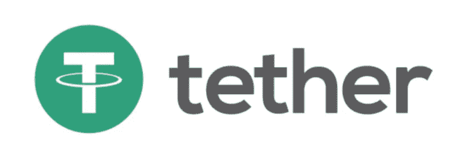
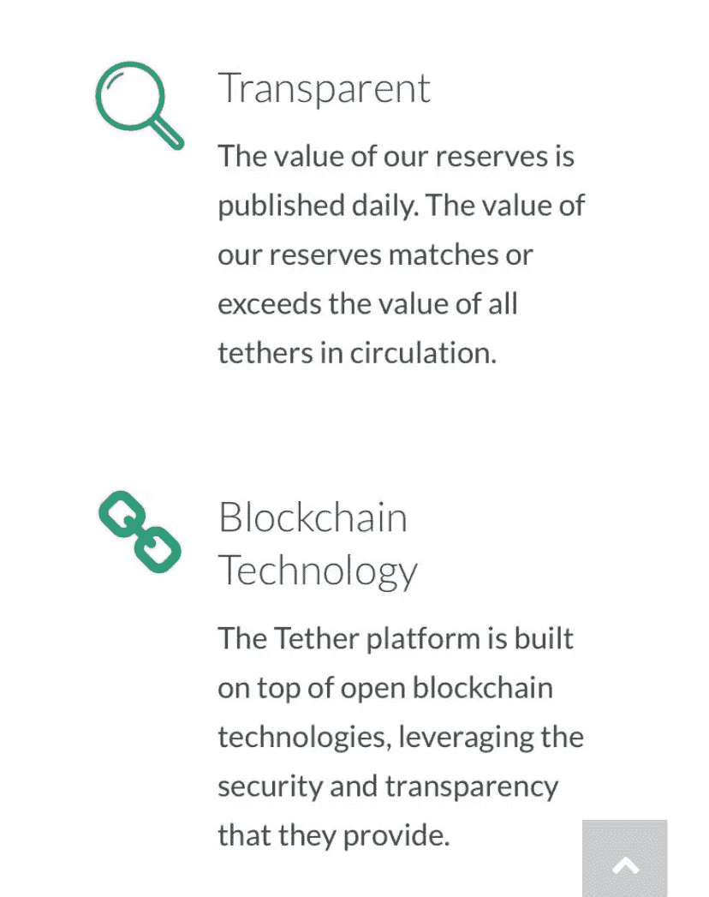
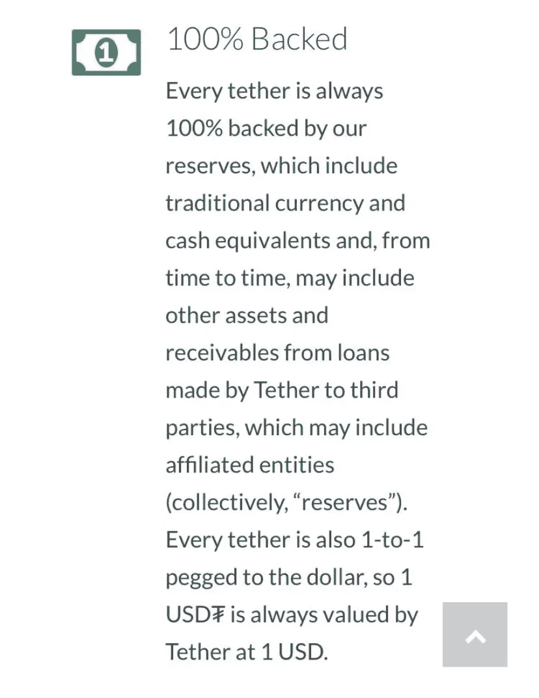

# 系绳——等待发生的潜在灾难

> 原文：<https://medium.com/coinmonks/tether-a-potential-disaster-waiting-to-happen-89e1b50570ac?source=collection_archive---------0----------------------->

## **只有勇敢者承认的密码世界里的白象**

**稍微介绍一下你的作者:诈骗戳**是一个小型的个人理财专家团队。你可以在 Twitter 或 Instagram [@FraudStamp](https://twitter.com/fraudstamp) 上关注我们，或者访问我们在 www.fraudstamp.com[的网站](http://www.fraudstamp.com/)

视而不见不会让问题消失。有一种备受瞩目的加密货币，往好里说是有问题的，往坏里说是写满了欺诈。如果加密货币失败，将对整个加密货币市场产生重大影响。然而，稳定的硬币市场将最严重地感受到货币的失败。我们在这里谈论的硬币是泰瑟(USDT)。

Tether 的市值在所有加密货币中排名第四，市值略高于 100 亿美元。比特币(BTC)价值 2180 亿美元，以太坊(ETH)价值 480 亿美元，XRP 价值 130 亿美元。系绳是一种与美元挂钩的稳定硬币。这是迄今为止最有价值的稳定硬币。下一个最大的稳定硬币是戴(戴)与市值。紧随其后的是 TrueUSD (TUSD)，市值 2.83 亿美元；然后是 Paxos(派克斯)，市值 2.45 亿美元。

**为什么稳定币很重要？**

稳定硬币的重要性不会昙花一现。6 月份创下了有史以来的最高交易量，比 5 月份增长了 14%，稳定的硬币交易价值为 540 亿美元。

那么，我们为什么需要稳定的硬币呢？加密货币的问题在于它们不稳定。这种波动性使得加密货币不适合作为交易媒介。这就是稳定硬币的来源。在大多数情况下，它们以 1:1 的比例与美元挂钩，通常由银行账户中的法定等值货币支持。一些稳定的硬币使用一种算法，将硬币与美元挂钩。但是，Tether 以美元储备作为抵押。Paxos 和 TrueUSD 也由法定储备支持，同样与美元挂钩。还有第三种稳定硬币，这是基于其他加密货币的价值，被称为加密抵押稳定硬币，这里最大的硬币是戴，市值 4.17 亿美元，增长迅速。

稳定的硬币是加密货币市场流动性的主要来源。那是什么意思？交易员和投资者使用它们在不接受法定货币的交易所购买其他加密货币，并在其他加密资产经历重大波动时作为存储资金的地方。

问题是大多数交易所与银行没有关系。因此，投资者在一个确实存在这种关系的交易所用美元购买稳定的硬币。然后，他们将稳定的硬币转移到他们希望交易的交易所。许多交易所使用稳定的硬币作为交易对，而不是美元。

**抵押品支持的稳定硬币**

我们将专注于抵押品支持的稳定硬币。就占所有稳定硬币总市值的百分比而言，这是迄今为止最大的类别，也代表了对用户的最高风险。为了使一枚稳定的硬币保持其价值，其储备应该等于发行或流通中硬币价值的 100%。事实上，这并不完全正确。假设 Tether 认为他们可以利用其储备在货币市场中赚取 2%,那么他们实际上只能拥有大约 98%的覆盖率，即法定储备与发行中的 Tether 的总价值之比。然而，用户需要对基础抵押品有信心，以容易地交易硬币，并使硬币保持 1∶1 的挂钩。这种信心只能通过两种方式来实现，资金存放在声誉良好的 A 级银行，并对这些资金进行定期独立审计。还有第三个要求，虽然不是必需的，但可以为市场提供额外的安全性，即监管稳定硬币的运营公司受到监管。这将意味着该机构必须每月(甚至可能实时)报告其储备，并向监管机构提供其他相关统计数据。

Gemini (GUSD)(市值 1000 万美元)和 Paxos 是唯一以这种方式监管的稳定硬币。系绳没有勾选任何一个框。让我们更仔细地看看这一点。

Gemini (GUSD)(市值 1000 万美元)和 Paxos 是唯一以这种方式监管的稳定硬币。系绳没有勾选任何一个框。让我们更仔细地看看这一点。

Tether 不提供经审计的账目

系绳不受控制

Tether 没有公布其储量的最新信息。

这本身就令人担忧。让我们再深入一点，看看系绳的历史。

**关于系绳**

USDT 成立于 2015 年。据《华尔街日报》报道，BTC 80%的交易都是在 USDT 的帮助下完成的。

泰瑟一开始是出于好意。以下是直接从 2015 年发布的 Tether 原始白皮书中摘录的一些断言和承诺:

任何加密货币的目标都是完全消除对信任的要求。

“Tether 采用简单而有效的方法进行储备证明，这大大降低了我们作为储备资产托管人的交易对手风险。”

储备是以一比一的比例持有的。

“非技术用户更容易理解一对一的支持实现……”

在任何时候，我们储备中持有的法定货币余额都将等于(或大于)流通中的货币数量。

除上述限制外，还承诺:

公开报告储量证明和其他审计结果。

我们在网站的透明页面上公布银行账户余额。

专业审计员将定期核实、签署和公布我们的基本银行余额和财务转账报表。

总之:

Tether 拥有简单可靠的储量实施证明，并接受定期专业审计。我们潜在的银行关系、合规和法律结构为我们成为储备资产的托管人和债券发行人提供了一个安全的基础。

**让我们看看现实中会发生什么:**

首先要看的是公司的形象，网站 www.tether.to

乍看之下，泰晤士报遵守了他们的诺言，在他们的主页上有一个区域写着:

透明的

我们的储备价值每天公布。我们储备的价值相当于或超过了流通中所有绳索的价值。

另外:

百分百支持

每笔资金始终由我们的储备提供 100%支持，储备包括传统货币和现金等价物，并且**有时可能包括其他资产和由资金向第三方(可能包括关联实体)提供的贷款产生的应收款项。**

因此，从表面上看，Tether 遵守了其白皮书中的承诺。但是有一些新的东西是白皮书中没有的…

**“…可能包括由信托公司向第三方(可能包括附属实体)提供的贷款产生的其他资产和应收款项。”**

所以现在 Tether 为这个游戏引入了新的规则。这是一个大问题。我们将很快回到这一点。

当我们继续搜索网络主页时，我们看到一个标签，上面写着:

透明度更新

资金证明

我们认为这很好，就像好奇的投资者对确保我们持有的股票安全感兴趣一样，我们按下标签，看看有多少发行中的货币实际上是由银行存款支持的，因为实际上这才是最重要的，其余的都是烟幕和镜子。

有一份来自一家律师事务所的报告，这家事务所看起来不错，这是一个积极的消息。但是积极的一面很快变成了巨大的消极面。这份报告的日期是 2018 年 6 月 1 日，大约两年前！资金证明的日常报告到此为止。这份报告唯一的好处是，它确实证实了两年前有争议的捆绑在当时得到了完全支持。但那是很久以前了。在密码市场，两年相当于二十年。从那时到现在，任何事情都可能发生，正如你将在下面看到的，发生了很多事情，但没有一件是好的！

**更换银行**

Tether 的白皮书披露，两家台湾银行是其主要银行，穆迪对这两家银行的展望均为“负面”。但现在这已经无关紧要了，尽管 Tether 在白皮书中保证说，我们的基本银行关系、合规和法律结构为我们成为储备资产的托管人和 Tether 的发行人提供了一个安全的基础。他们与这两家银行的银行关系于 2017 年初终止，因为富国银行(Wells Fargo)因其与 Tether 的关系而切断了台湾银行的代理银行服务。泰瑟需要一个新家。他们在巴哈马找到了家。宣布与一家名为 Deltec Bank & Trust Limited 的金融机构(非银行)建立新的关系，这家银行肯定不是 A 级银行。泰瑟发表了一封来自德尔泰克的信，就在同一天，泰瑟宣布了它的新关系。这封信证实了他们持有的储备。日期为 2018 年 11 月 1 日，它确实提出了一个问题:在失去与台湾银行的银行关系和与巴哈马达成新协议之间的中间时间(大约 18 个月)发生了什么？不管发生了什么，这显然没有透露给系绳的持有人，而且无疑涉及一些系绳不想告知市场的诡计。

这家律师事务所的报告确实证实了这段不确定时期的大部分储备。然而，当 Tether 似乎没有正式的银行安排时，看看这些资金在 18 个月中存放在哪里将是有趣的。同样非常可疑的是，为什么泰瑟决定任命一家律师事务所来审查储备，而不是一家更习惯于进行这种审查的声誉良好的会计师事务所。这是一个很大的问号。

**进入纽约总检察长**

2019 年 4 月 25 日，纽约总检察长宣布对 Tether、Bitfinex 和他们的母公司 iFinex 进行调查。

我们的调查已经确定,“Bitfinex”交易平台的运营商也控制着“系绳”虚拟货币，他们参与了掩盖行为，以掩盖混合客户公司资金的 8.5 亿美元的明显损失，纽约州率先要求虚拟货币企业依法运营……

五天后，泰瑟发表了自己的声明；截至 2019 年 4 月 30 日，USDT 只有 74%的菲亚特汽车支持这是一枚炸弹，但市场很快摆脱了这一消息，并继续这样做。

那么，对于系绳的持有者来说，这一切意味着什么呢？这意味着 AG 认为有 8.5 亿美元的 Bitfinex 资金丢失(Bitfinex 声称这些钱没有丢失，只是被冻结了。然而，正如我们将看到的，这与咨询小组的论点无关。).为了防止 Bitfinex 破产，它向 Tether 借了 8 . 5 亿美元来弥补差额，并签订了一份贷款协议，但没有一份协议被披露。所以这基本上打开了多个罐子的虫子。

首先，这意味着 Tether 不再由菲亚特 1:1 覆盖，如果曾经是，至少存在 8 亿美元的缺口，尽管 Tether 在 2019 年 7 月宣布从 Bitfinex 收到 1 亿美元，但没有进一步的宣布。也许这就是为什么 100%支持的定义在 Tethers 主页上发生了如此大的变化。

其次，我们必须看看 100%支持的定义被改变的另一个可能的原因…

当大量的钱无所事事，赚取极低的利息时，利用其中的一部分为自己的目的服务总是很诱人的，尤其是当没有人需要回答的时候。系绳基本上是两个人的乐队。货币市场没有提供任何太有吸引力的东西，所以为什么不把钱借给一些“分支机构”,用这些钱发展其他业务，当然，我们希望是出于偿还这些贷款的良好意图。不幸的是，历史书上充斥着金融方面的良好意图，而这些总是以投资者遭受重大损失而告终。现在我们并不是说这肯定是在这里发生的事，但这是为什么这个定义最近被改变的一个令人信服的原因。否则为什么不保持定义不变呢？

这就引出了我们的第三点，为什么泰瑟选择了律师而不是会计师？答案很简单，会计师想要报告现金、现金等价物和贷款，更重要的是，借给子公司的钱是否可以收回。对泰瑟来说，这不太可能是一个有吸引力的提议。

我们的指控到底是什么？

我们认为有几点与投资者/系绳持有人相关。

Tether 未能履行其储备报告义务，以至于上一份独立报告已超过两年。

2019 年，Tether 承认，发行中的 Tether 只有 74%的现金支持

客户资金被存放在评级较差的机构中，这些机构比主流 A 级银行更容易倒闭。

客户资金可能被转移到关联公司，可能无法收回。

Tether 正在误导投资者/硬币持有者，让他们相信这种货币是 100%由现金支持的，而事实并非如此。

挪用客户资金。对客户资金使用情况的披露不够充分。Tether 对其用户负有及时披露客户资金使用情况的责任。

**平心而论**

这太大太快了！

让我们现实一点。泰瑟有一个伟大的想法，但有一个基本问题仍然没有得到满意的解决。银行业。所有主流银行都拒绝与基于加密货币的企业开展业务。他们和大麻生意被归为一类。所以泰瑟很聪明，他们努力工作，在台湾找到了几家银行。不完全是一个主流的司法管辖区，但他们无疑认为目前已经足够了。但是他们最担心的事情发生了。银行账户被关闭了。他们很快找到了另一个解决方案。然而，那场灾难紧接着又发生了，他们被响尾蛇击中了…

他们的姐妹公司遭受了巨大的损失，耗尽了他们所有的流动资金。当然，他们必须支持他们的姐妹交易所。如果 Bitfinex 在 8.5 亿美元被冻结、被盗或丢失后崩溃，那么这将影响两家公司，因此所有者很自然地做了我们所有人可能会做的事情，从一个口袋借钱给另一个口袋，忘记了他们在玩的是客户的钱。

显而易见，Tether 害怕全盘招供，只要浏览一下他们的网站，就会发现他们显然在继续误导投资者、交易所和监管者。

**Tether 能做些什么来纠正这种情况呢？**

泰瑟必须认识到，他们继续隐瞒现实情况的时间越长，这个问题就越有可能从目前的一个中等大小的雪球发展成足以摧毁一个村庄的雪球。有几个简单的步骤可以快速完成。从一个痛苦的开始——咬紧牙关。但现在是时候趁它飞得高的时候做这件事了。

指定一家声誉好的会计师事务所(前 10 名)至少每月审查一次其资源，并将这些发布到他们的网站上。

制定一个计划来弥补任何不足，并努力遵循这个计划。

承诺遵守其发布的一套透明度准则。

任命一名高级合规官负责上述事宜。

这件事不能再隐瞒了。

**接下来会发生什么——这是如何解决的？**

如果泰瑟继续其疏忽和误导行为，那么有一些事情应该发生。进行系绳交易的交易所对其客户负有义务，以确保达到适当的合规性和标准。交易所应该要求做出改变。如果交易所不采取行动，监管机构在某个时候肯定也会采取行动，然后对所有人来说都太晚了。已经有人提议制定一部名为《加密货币法案》的法律。这提议监管加密货币。在联邦政府之前把他们的房子收拾好，这是泰瑟的最大利益所在。

结果可能是，系绳确实有足够的储备，我们真的希望如此，但这不再是问题了。**这是一项 100 亿美元的业务，就像一个街角的糖果店，完全信任几个人，这些人没人从亚当那里知道，充其量也就是形迹可疑的人。**

**其他的稳定币呢？**

这就是系绳面临的主要威胁。投资者决定使用一种稳定的硬币，这种硬币有可独立核实的储备并且受到监管。这肯定是最安全的赌注吗？这就是双子座和帕克斯出现的地方。

为了获取新闻和提醒，请在推特上关注我们@ [欺诈戳](https://twitter.com/fraudstamp?lang=en-gb)

## 此外，请阅读

*   最佳[密码交易机器人](/coinmonks/crypto-trading-bot-c2ffce8acb2a)
*   [加密副本交易平台](/coinmonks/top-10-crypto-copy-trading-platforms-for-beginners-d0c37c7d698c)
*   最佳[密码税务软件](/coinmonks/best-crypto-tax-tool-for-my-money-72d4b430816b)
*   [最佳密码交易平台](/coinmonks/the-best-crypto-trading-platforms-in-2020-the-definitive-guide-updated-c72f8b874555)
*   最佳[密码借出平台](/coinmonks/top-5-crypto-lending-platforms-in-2020-that-you-need-to-know-a1b675cec3fa)
*   [最佳区块链分析工具](https://bitquery.io/blog/best-blockchain-analysis-tools-and-software)
*   [密码套利](/coinmonks/crypto-arbitrage-guide-how-to-make-money-as-a-beginner-62bfe5c868f6)入门指南:如何赚钱
*   最佳[加密制图工具](/coinmonks/what-are-the-best-charting-platforms-for-cryptocurrency-trading-85aade584d80)
*   [总账对 Trezor](/coinmonks/ledger-vs-trezor-best-hardware-wallet-to-secure-cryptocurrency-22c7a3fd391e)
*   了解比特币最合适的书是什么？
*   [3 常见问题解答点评](/coinmonks/3commas-review-an-excellent-crypto-trading-bot-2020-1313a58bec92)
*   [AAX 交易所点评](/coinmonks/aax-exchange-review-2021-67c5ea09330c) |转诊代码、交易费用、利弊
*   [衍生工具审查](/coinmonks/deribit-review-options-fees-apis-and-testnet-2ca16c4bbdb2) |选项、费用、API 和 Testnet
*   [FTX 密码交易所点评](/coinmonks/ftx-crypto-exchange-review-53664ac1198f)
*   [n 保存零审核](/coinmonks/ngrave-zero-review-c465cf8307fc)
*   [逐位交换审查](/coinmonks/bybit-exchange-review-dbd570019b71)
*   [3Commas vs Cryptohopper](/coinmonks/cryptohopper-vs-3commas-vs-shrimpy-a2c16095b8fe)
*   最好的比特币[硬件钱包](/coinmonks/the-best-cryptocurrency-hardware-wallets-of-2020-e28b1c124069?source=friends_link&sk=324dd9ff8556ab578d71e7ad7658ad7c)
*   最佳 [monero 钱包](https://blog.coincodecap.com/best-monero-wallets)
*   [莱杰 nano s vs x](https://blog.coincodecap.com/ledger-nano-s-vs-x)
*   [bits gap vs 3 commas vs quad ency](https://blog.coincodecap.com/bitsgap-3commas-quadency)
*   [莱杰纳米 S vs 特雷佐 one vs 特雷佐 T vs 莱杰纳米 X](https://blog.coincodecap.com/ledger-nano-s-vs-trezor-one-ledger-nano-x-trezor-t)
*   [block fi vs Celsius](/coinmonks/blockfi-vs-celsius-vs-hodlnaut-8a1cc8c26630)vs Hodlnaut
*   [bits gap review](/coinmonks/bitsgap-review-a-crypto-trading-bot-that-makes-easy-money-a5d88a336df2)——一个轻松赚钱的加密交易机器人
*   为专业人士设计的加密交易机器人
*   [PrimeXBT 审查](/coinmonks/primexbt-review-88e0815be858) |杠杆交易、费用和交易
*   [埃利帕尔泰坦评论](/coinmonks/ellipal-titan-review-85e9071dd029)
*   [赛克斯石评论](https://blog.coincodecap.com/secux-stone-hardware-wallet-review)
*   [BlockFi 评论](/coinmonks/blockfi-review-53096053c097) |赚取高达 8.6%的加密利息