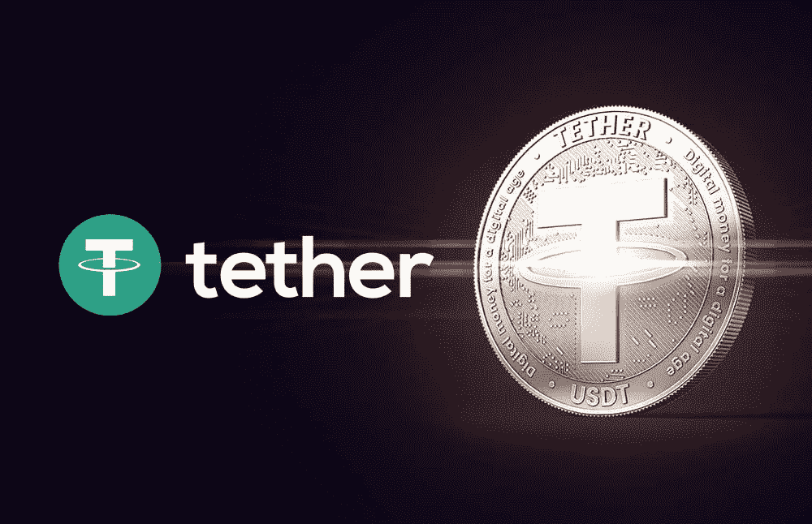
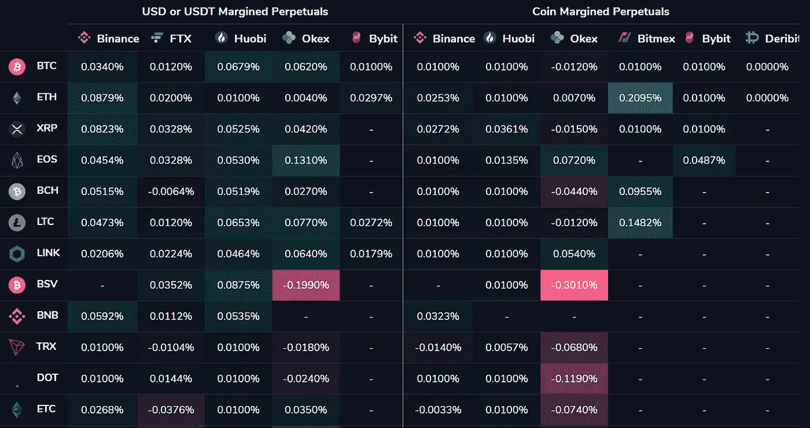
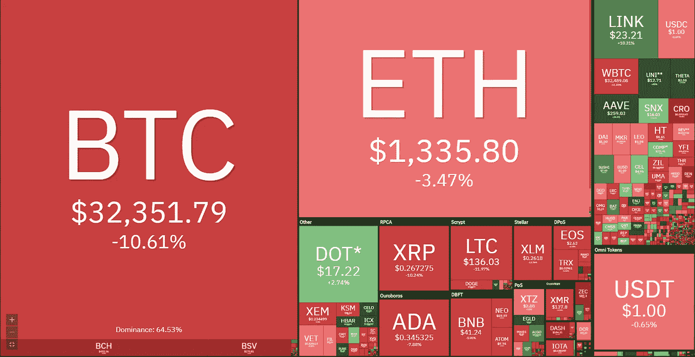

# 系绳——一个稳定硬币的故事

> 原文：<https://medium.com/coinmonks/tether-dc3254cf8cb3?source=collection_archive---------5----------------------->

正如上周所指出的，那些已经在加密市场呆了一段时间的人已经习惯了某些团体、个人和平台在市场上推动制造恐惧、不确定性和怀疑(FUD)的叙事。这些周期性新闻故事通常会对散户投资者产生不成比例的影响，他们买入 FUD，失去信念，卖给更有经验的人(因为从事加密工作的时间更长)，或者对市场结构和风险进行了适当的尽职调查，这导致他们认为大多数故事都没有经过充分研究，或者试图推动对发布内容的对手有利的议程。

历史悠久的加密交易所 Bitfinex 和 stablecoin 平台 Tether 由英属维尔京群岛注册公司 iFinex 共同拥有。尽管 iFinex 显然没有在美国注册，但它目前正受到无处不在的美国法律机构的调查。纽约司法部长(NYAG)正在调查 iFinex 在 2019 年明显混合企业和客户资金，以填补 Bitfinex 的 8.5 亿美元漏洞。NYAG 声称，由于总部位于巴拿马的 Crypto Capital(Bitfinex 以前使用的一个有问题和有漏洞的支付处理器)持有/冻结资金，交易所从 Tether 的储备中借入现金来填补缺口，以保持偿付能力。

重要的是要理解，NYAG 对 iFinex 的调查并不关注 USDT 等被用来支撑比特币价格和操纵加密市场的系绳产品，因为各种流传的说法会让许多人相信这一点。它主要关注 iFinex 公司的企业财务事务，以及该公司如何处理和管理 8.5 亿美元的损失，以及是否违反了任何法律。这个故事还远远没有结束，上周有报道说，iFinex 即将完成向总检察长办公室提交所有要求的文件。一旦 OAG 审查了大约 250 万份文件，市场最终将了解 NYAG 是否会在法庭上起诉 iFinex，以及是否应该对 iFinex 提起诉讼。随着 iFinex 在与 NYAG 的战斗中进入下一个关键阶段，我们并没有忘记“系绳是一个骗局”故事的复兴时间。

同样重要的是要理解，Tether 最初是由 Bitfinex 团队创建的，用于处理 fiat banking rails 应用于加密交易时的延迟。在没有大宗经纪商的情况下，高频/低延迟套利交易者需要能够在全球范围内足够快速地转移现金和资产，以便在多个交易所之间部署他们的策略。使用银行电汇向公司希望交易的交易所的关联银行提供信贷，将花费太长时间来有效地进行大规模市场套利。Bitfinex 是一家以技术为主导的交易所，其定位是为专业交易者设计的交易所，它开发了 Tether 来解决这一特定问题。

Kenetic Trading 处于加密行业这个经常被误解的领域——系统交易的最前线。有许多像 Kenetic 这样的交易公司，有些是可见的，但许多选择不可见，并负责随着市场动态的发展，在交易所和稳定的硬币发行者之间悄悄地转移数千亿美元的价值。对我们来说，毫不奇怪，散户投资者、主流媒体记者和不太知情的机构投资者根本不了解加密市场的“管道和线路”是如何工作的，因此很难反驳造假者的主要说法，即 Tether 被用来人为推高比特币的价格。

除非您是一家贸易公司，否则您几乎没有理由在 Deltec Bank(iFinex 的主要银行关系)和 Tether 拥有银行账户，因此对与 Tether 发行和赎回相关的资本流动的方式和时间有深入的了解。加密交易领域之外的任何人也无法真正与 iFinex/Deltec 员工和服务提供商建立和保持牢固的工作关系，这有助于从定性角度了解与 Tether 实际相关的任何风险。作为一家交易公司，我们非常清楚，限量发行、赎回和销毁每周都在持续发生。我们还知道，这一过程与生态系统中的大多数(包括散户或新一波机构买家)完全无关。Tether 由类似于 Kenetic 的机构量化/高频/低延迟交易商设计并主要发行、赎回和交易。因此，对所谓的“系绳骗局”的大量分析充满了假设和理解上的错误也就不足为奇了。

关于最近的泰瑟 FUD 有各种各样的指控，解决每一个都超出了本周的范围。但最重要的一点应该是，相关性并不意味着因果关系。认为在比特币价格上涨的同时 Tether 发行量增加，这证明 iFinex/Tether/Bitfinex 凭空发行 Tether 以购买 BTC 并推高其价格(以及 Deltec 作为 Tether 储备持有的任何 BTC 的价格)，充其量是智力薄弱。

加密市场仍处于相对早期的发展阶段，交易所仍然支离破碎，有时彼此脱节，许多交易所仍然没有得到银行和大宗经纪商的适当服务。加密中的价格发现发生在许多不同的交易所，在不同的时区，在不同的监管管辖区，并有不同的技术栈和 API 供交易者插入。因此，由于不同交易所的买卖强度不一致，就会出现价差。Tether 为交易者提供了一种以低延迟套利的方式，从而带来更具流动性的市场和更准确的价格发现，一天 24 小时，一周 7 天。套利者对于所有市场的有效交易至关重要，而稳定的硬币(如 at Tether)允许加密交易公司做市，消除错位造成的价差，并为整个生态系统提供流动性强、价格准确的市场。

关于发行 Tether 是为了抬高比特币价格的主要指控是被误导的。现货市场对比特币的需求增加，导致市场之间的错位加剧，因为新资金在不同时间、以不同的买入(和卖出)模式和策略涌入不同交易所的生态系统。例如，除了许多普通套利交易外，现货需求的增加在贷款和衍生品市场创造了利率套利机会，在这些市场上，美元或稳定的货币等价物可以轻松获得两位数的回报，而无需承担价格风险。牛市和更大的波动性增加了系统交易者可获得的这些更复杂的交易机会的数量，这为系绳发行的增加创造了自然需求。随着 BTC 价格上涨，交易者将要求(并发行)更多的 USDT 来交易这些机会，并利用现有的收益率，而不是像许多人让你相信的那样反过来。系绳发行滞后于领先的 BTC 价格，换句话说，牛市导致更大的 USDT 发行，熊市导致更大的 USDT 赎回/毁灭。最后，为了推翻最近几周 FUD 的另一项主张，发行通常以可疑的整数执行，因为交易员只是想让他们的会计和贸易对账更容易，因此发行 100，000，000 或 200，000，000 整批就不足为奇了。

## **套利交易示例:**

现货市场购买会增加市场波动。随着投机者建立长期衍生品头寸并为此支付溢价，永久掉期合约融资利率转为正值。利率套利交易者请求发行 USDT 和美元法定货币，并将其发送到 Tether 的 Deltec 银行账户。USDT 被铸造并存入交易者的钱包，然后转移到衍生品交易所，交易者用它来做空 BTC 永久掉期，因此进行市场自然想要的相反交易，并收取多头支付空头的溢价。交易员用现货 BTC 或类似策略对冲空头衍生品头寸。

随着特定交易所的利率压缩，机会不再具有吸引力，交易者平仓，或者赎回在 Deltec 银行持有的 Tether 银行账户中的 USDT，或者他们快速有效地将 USDT 部署到其他地方，因为在不同时间和不同数字资产交易对的其他场所隐含的美元利率增加，如下面的 Viewbase.com 表所示。

作为最后一点，在这个特定的 FUD 叙事中的悖论是，Tether 在公共的、不可变的和可验证的区块链上的发行——Omni、EOS、Tron 和以太坊——是它被攻击的原因。具体来说，由于分散技术和加密的性质，用户要求他们支持的项目透明，而 Tether 的发布时间表是免费的，所有人都可以看到，这使得市场可以得出他们希望的任何结论，即使他们真的没有网络和理解来得出正确的结论。Tether 是一家私人公司，在没有法律要求的情况下，用户要求极度透明的加密市场中，它经常被忽视。像许多快速增长的公司一样，iFinex 当然有它需要解决的问题，但在我们看来，欺诈性地抽取 BTC 并不是其中之一。也许这些用户应该要求他们当地的银行、互联网服务提供商、政治领导人也有同样的透明度？也许我们都应该。

Crypto weekly performance: 26th January 2021\. Source [https://coin360.com/](https://coin360.com/?utm_source=hs_email&utm_medium=email&_hsenc=p2ANqtz-9yZmo_JHmPHhtjPDgWnIys17q9L291czmq8yMaXZVVqTVGVxcGgPHUEVGpw3yQ1c8w98pb)

## 也阅读

*   [Bybit 融资融券交易](/coinmonks/bybit-margin-trading-e5071676244e) | [币安融资融券交易](/coinmonks/binance-margin-trading-c9eb5e9d2116) | [Overbit 审核](/coinmonks/overbit-review-9446ed4f2188)
*   [加密货币储蓄账户](/coinmonks/cryptocurrency-savings-accounts-be3bc0feffbf) | [YoBit 审查](/coinmonks/yobit-review-175464162c62) | [Bitbns 审查](/coinmonks/bitbns-review-38256a07e161)
*   [Botsfolio vs nap bots vs Mudrex](/coinmonks/botsfolio-vs-napbots-vs-mudrex-c81344970c02)|[gate . io 交流回顾](/coinmonks/gate-io-exchange-review-61bf87b7078f)
*   [最佳比特币保证金交易](/coinmonks/bitcoin-margin-trading-exchange-bcbfcbf7b8e3) | [萝莉点评](/coinmonks/lolli-review-e6ddc7895ad8) | [比特币保证金交易](https://blog.coincodecap.com/bityard-margin-trading)
*   [创造并出售你的第一个 NFT](https://blog.coincodecap.com/create-nft) | [本地比特币评论](/coinmonks/localbitcoins-review-6cc001c6ed56)
*   [加密保证金交易交易所](/coinmonks/crypto-margin-trading-exchanges-428b1f7ad108) | [赚取比特币](/coinmonks/earn-bitcoin-6e8bd3c592d9) | [Mudrex 投资](https://blog.coincodecap.com/mudrex-invest-review-the-best-way-to-invest-in-crypto)