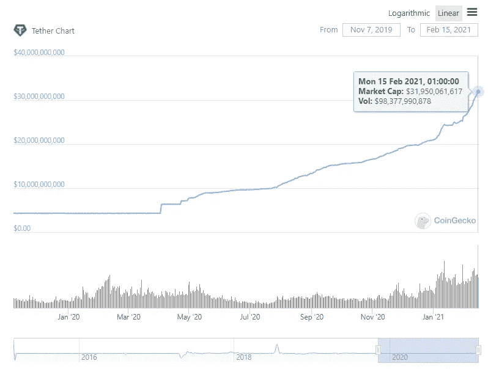
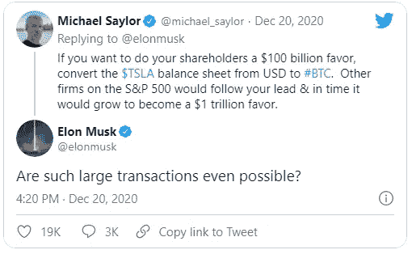
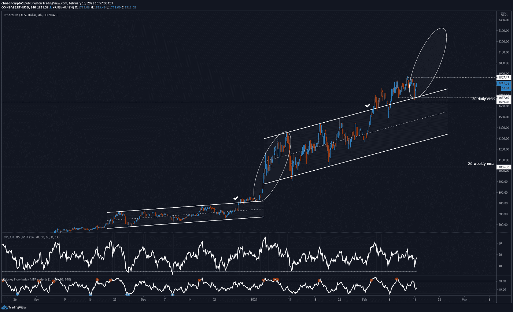
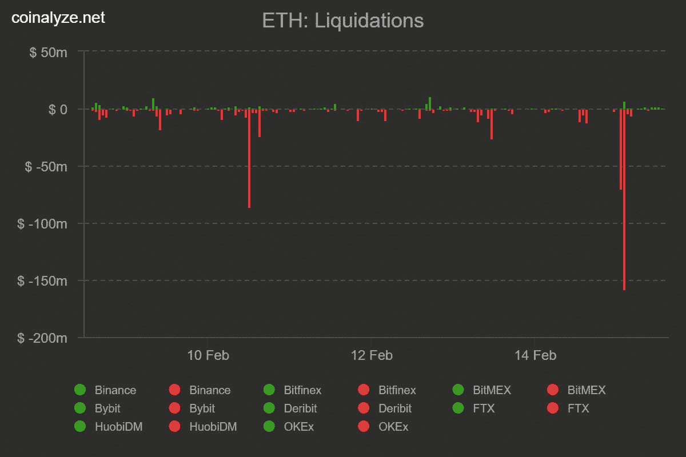
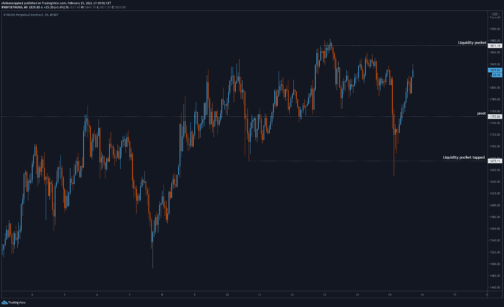
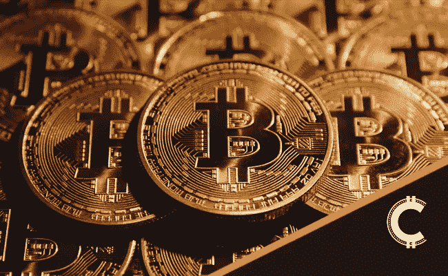

# 特斯拉宣布后，系绳市值突破 300 亿美元

> 原文：<https://medium.com/coinmonks/tether-market-cap-crosses-30-bn-after-tesla-announcement-8d297fb190a9?source=collection_archive---------4----------------------->

在一年多一点的时间里，随着企业和散户投资者涌入比特币和加密，寻求对无限可用现金的通胀对冲，Tether 市值翻了一番，从 150 亿美元增加到 310 亿美元。

如今，比特币和以太坊都处于又一次大动作的悬崖边。

让我们开始吃吧。

# 特斯拉宣布后，系绳市值突破 300 亿美元

机构和企业投资推动 USDT(Tether)流入大幅增加，推动稳定币的市值远远超过 300 亿美元的里程碑。

事实上，根据 Coingecko 的数据，USDT 的市值目前为 319 亿美元，而 Tether 在整个加密领域的市值排名第三。

值得注意的是，在特斯拉首席执行官埃隆·马斯克宣布对比特币投资 15 亿美元后一天，USDT 流入量激增。

鉴于马斯克与企业界的深远联系，他公开倡导比特币作为对冲法定货币通胀的工具具有不小的分量。

虽然马斯克个人已经对比特币感兴趣，但在 Twitter 上的简短交谈后，他可能从 Microstrategy 的首席执行官迈克尔·塞勒那里获得了特斯拉公司投资战略的灵感。

在此之前，Saylor 发现自己被迫钻研比特币，以便[对冲通货膨胀](https://chrisoncrypto.com/blog/f/microstrategy-bitcoin-is-less-risky-than-gold)，因为封锁刺激救济计划导致美元供应创纪录增长。

自 9 月 5 日[以来，由于对稳定货币的需求有增无减，流通中的美元已经翻了一番，从 150 亿美元增加到近 320 亿美元，而且还在增加。](https://chrisoncrypto.com/blog/f/bitcoin-stablecoin-metrics-reveals-intense-buy-pressure)

从历史上看，稳定的比特币流入一直是牛市健康的指标，并经常被用于比特币价格建模的一篮子市场工具中。

尽管如此，[对 Tether 1:1 美元储备支持的担忧仍然存在，并没有停止对所谓“Tether-比特币”关系的猜测，这种关系经常与正在进行的 iFnex 诉讼混淆。](https://chrisoncrypto.com/blog/f/explainer-do-fresh-usd-tether-concerns-have-any-merit)

[***订阅邮件列表，获取发布内容！***](http://chrisoncrypto.com)

# 技术上来说

## 这个以太坊分形有腿吗？

上周末，我们发布了一篇博文,详细解释了比特币牛市即将再次走高的原因，同时也提醒人们注意连锁指标，这些指标表明，在下一次可能的上涨之后，市场可能会暂时出现泡沫。

然而，由于加密市场通常相对一致，因此值得关注 ETH/USD，记住 [ETH/BTC](https://www.tradingview.com/x/CRMB7XVM/) 对从 2020 年 12 月开始进入牛市阶段。

正如[电报频道](https://t.me/chrisoncryptochannel)所详述的，以太坊见证了一次抛售，价格跌至 1660 美元，随后价格大幅回调至 1830 美元以上——目前的交易价格(撰写本文时)。

在大规模平仓事件中，超过 1.5 亿美元的杠杆多头头寸被平仓，融资利率随后很快恢复到正常水平。

**ETH 即时关卡观看**

*   2000 美元心理阻力位
*   1870 美元阻力(可能是做多机会)
*   1，750 美元 LTF 支点/支撑位

以太坊随时都可能突破 2000 美元的价格点，正如周末详细介绍的那样，比特币也可能突破 54000 美元。

不用说，仅仅因为链上和技术数据提供融合并不意味着某些加密货币“必须”表现，过去的表现也不一定决定未来的行为。

然而，随着这波加密牛市转变为散户参与程度更高的市场，大规模平仓事件和连锁数据可以将买卖行为联系起来。

一如既往，多头一马当先。

下次再见。

**加入** [**电报**](https://t.me/chrisoncryptochannel) **频道进行实时更新！
关注我的** [**多嘴多舌**](https://gab.com/chrisoncrypto) **和我下面的社交门户。**

[https://www.paypal.com/donate?hosted_button_id=C9VRLGTBHQX2N](https://www.paypal.com/donate?hosted_button_id=C9VRLGTBHQX2N)

[https://chrisoncrypto.com/blog/f/bitcoin-is-primed-for-another-move-higher](https://chrisoncrypto.com/blog/f/bitcoin-is-primed-for-another-move-higher)

[http://www.chrisoncrypto.com/](http://www.chrisoncrypto.com/)

你也可以用比特币支持我！
**BTC** 地址:**3 eydseypjhn 68 axkncuqbb 7 ebqcxrejamr**

最诚挚的问候，

**克里斯托·阿塔尔德**
克里斯通密码的创始人
www.cityam.com
的撰稿人直接接通:[电报](https://t.me/chrisoncrypto)

*最初发布于*[*https://mailchi . MP*](https://mailchi.mp/66b44e6dfc3e/tether-market-cap-crosses-30-billion-after-tesla-announcement?e=[UNIQID])*。*