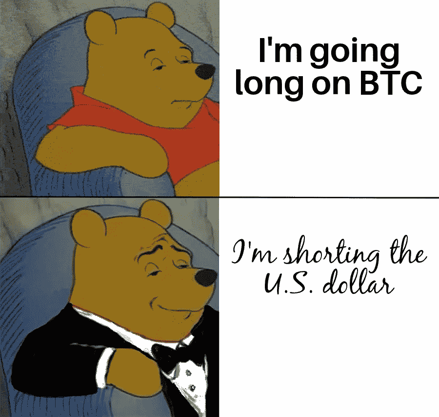
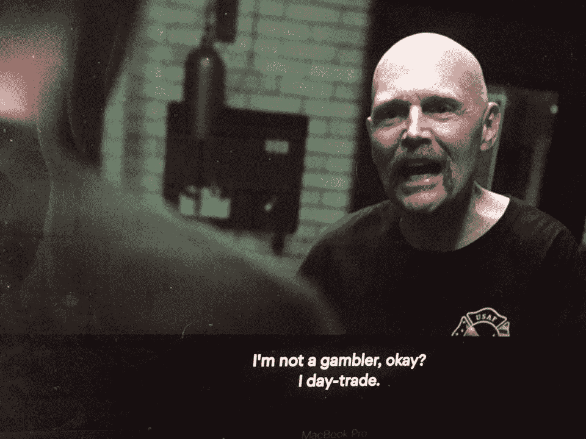
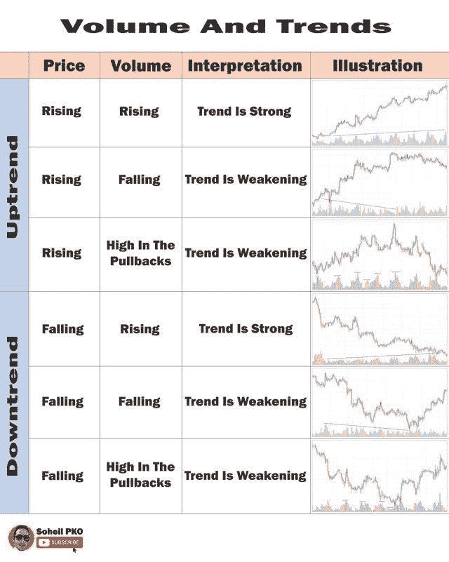
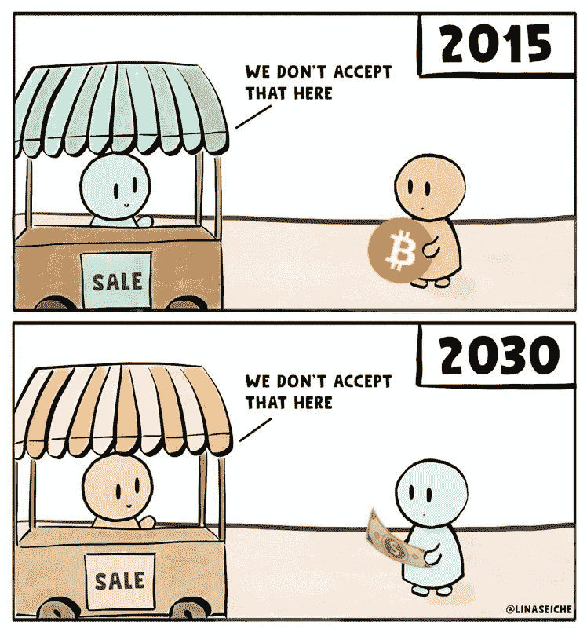

# 与 SEC | John McAfee 就加密泵问题达成和解

> 原文：<https://medium.com/coinmonks/tether-settles-with-sec-john-mcafee-indicted-for-crypto-pump-17066483266b?source=collection_archive---------3----------------------->

[source](https://www.reddit.com/r/Bitcoin/comments/lykzdv/for_the_intellectuals_out_there/)

## 贝宝收购 Curv |莱昂国王将发布 NFT 专辑|雅达利建立加密赌场

*   Bitfinex 和 Tether 不承认有任何不当行为，并同意支付 1850 万美元作为与 SEC 和解的一部分。
*   PayPal 继续对加密货币表现出兴趣，在 2020 年试图收购 BitGo 后收购了 Curv。
*   莱昂国王乐队将以不可替代的令牌(NFT)的形式发行他们的新专辑，名为《当你看到自己》——成为第一个这样做的乐队。
*   约翰·迈克菲起诉加密泵和转储计划，非法 ICO 推广

## 今日报价

> “要在十年内获得回报，就去种树。要收获一百年的回报，培养人民。”—胡志明

## [Pionex](http://blog.coincodecap.com/go/pionex)

试试专业的加密交易所 Pionex，它有免费的加密交易机器人来自动完成你的交易。阅读我们的 [Pionex 评论](/coinmonks/pionex-review-exchange-with-crypto-trading-bot-1e459d0191ea)并查看我们的 [**加密交易机器人**](/coinmonks/crypto-trading-bot-c2ffce8acb2a) 列表。

> 同时检查[bits gap vs Bituniverse vs 3 commas](https://www.youtube.com/watch?v=7kQvPpE08ts&t=367s)

## 最新消息📰

*   Bitfinex 以 1850 万美元与纽约总检察长达成和解
*   上市美容应用程序制造商 M [eitu 以 4000 万美元收购 ETH BTC](https://www.theblockcrypto.com/post/97477/meitu-40-million-btc-eth)
*   SEC 调查伊隆·马斯克的微博
*   研究显示，比特币钱包“后门”导致数百万资金失踪
*   PayPal 收购 Curv 加密托管公司
*   Aavegotchi NFT [Drop 不到一分钟就卖光了](https://thedefiant.io/aavegotchi-nft-drop-sells-out-in-under-one-minute/)
*   一群密码支持者[烧掉了一张班克斯的原版“白痴”照片](https://news.bitcoin.com/burned-original-banksy-morons-print-nft/)，并把它变成了 NFT
*   [游戏巨头育碧与 NFT 平台 Sorare 合作](https://thedefiant.io/gaming-giant-ubisoft-partners-with-nft-platform-sorare/)
*   莱昂国王将是第一个以 NFT 的名义发行专辑的乐队
*   花旗声称，比特币正处于一个临界点，可能成为全球贸易的“首选货币”
*   [雅达利建立秘密赌场](https://www.bloomberg.com/news/articles/2021-03-08/atari-partners-with-crypto-gaming-operation-to-launch-casino?ref=coingecko&utm_medium=email&utm_source=coingecko&utm_content=%F0%9F%9A%80+How+much+would+you+pay+for+a+piece+of+Twitter+history%3F+%F0%9F%92%AC&utm_campaign=CoinGecko+Newsletters)利用怀旧和非传统赌场
*   《出埃及记》在美国证券交易委员会备案，出售 7500 万美元的股票
*   复合的新区块链为央行数字货币做好了准备
*   [EIP1559 预定](https://hackmd.io/@timbeiko/1559-updates/https%3A%2F%2Fhackmd.io%2F%40timbeiko%2F1559-update-008)伦敦硬地叉
*   Hermez 的测试网现已公开
*   Dev [称 3100 万美元的 Meerkat Finance](https://cointelegraph.com/news/dev-says-31-million-meerkat-finance-exploit-was-a-test-will-return-funds) 漏洞是一个“测试”；会返还资金
*   [勇敢](https://brave.com/) [收购](https://brave.com/brave-search/)关注隐私的搜索引擎 Tailcat

> *报税季即将来临，使用最好的* [***加密报税软件***](/coinmonks/best-crypto-tax-tool-for-my-money-72d4b430816b) *来申报你的加密报税吧。*

[Source](https://www.reddit.com/r/CryptoMarkets/comments/lxd6fw/ey/)

> BlockFi 首次推出加密奖励信用卡。在日常购物中获得 1.5%的比特币奖励。[现在加入等候名单](http://blog.coincodecap.com/go/blockfi)。

## 好的读物📑

*   比特币的[(不)普通](https://dci.mit.edu/research/2021/2/25/dci-bitcoin-security-effort)好处
*   Len Sassaman 和 Satoshi:赛博朋克的历史
*   政府[能阻止比特币](https://quillette.com/2021/02/21/can-governments-stop-bitcoin/)吗？
*   认为 BTC 是一个肮脏的行业？考虑一下一美元的碳成本
*   [原子](https://www.sec.gov/news/speech/peirce-atomic-trading-2021-02-22)交易
*   系绳，一个更大的贝宝
*   🖌️以太坊的艺术[文艺复兴](https://felipether.medium.com/%EF%B8%8F-ethereums-artistic-renaissance-77de62df1a69)
*   [EIP-1559](/coinmonks/economic-analysis-of-eip-1559-a-summary-afac46533928) 经济分析:综述
*   更好的[投标](https://barnabe.substack.com/p/better-bidding-with-eip1559)与 eip1559
*   [以太坊经济的崛起](https://www.coinbase.com/learn/market-updates/deep-dive-ethereum-economy)
*   为币安智能链设置[元掩码](https://blog.coincodecap.com/metamask-for-binance-smart-chain)
*   [击败科博保险库](/swlh/defeating-the-cobo-vault-pros-self-destruct-mechanism-abf321e2f5b5) Pro 的自毁机制
*   比特币:被解放的迈克尔·塞勒
*   算法稳定的未来
*   回溯到这个减半周期，找到比特币的最终目标价格
*   矿工[可提取价值](https://doseofdefi.substack.com/p/miner-extractable-value-and-makers)和制造商锁定

> *买个* [***硬件钱包***](/coinmonks/the-best-cryptocurrency-hardware-wallets-of-2020-e28b1c124069) *和* [*保护你的加密货币*](/coinmonks/how-to-prevent-cryptocurrency-hacking-and-theft-from-your-wallet-65c8ff767766) *。*

[Source](https://www.reddit.com/r/Bitcoin/comments/kmof53/the_8_laws_of_bitcoin_updated/)

> Eth2 核心团队在线[研讨会](https://hackmd.io/@hww/workshop_feb_2021)，2021 年 2 月

## 开发商

*   [罩下的以太坊](/coinmonks/ethereum-under-the-hood-part-1-ver-0-4-7ac9ccbfd0f6)
*   比特币[侧链](/iovlabs-innovation-stories/bitcoin-sidechains-74a72ceba35d)
*   [通过简单的内联节省能源](https://blog.soliditylang.org/2021/03/02/saving-gas-with-simple-inliner/)
*   BTC 的数据科学:初级读本
*   建造一个[区块链模拟器](/coinmonks/building-a-blockchain-simulator-2331087bebc4)
*   我的集中体验— [衣冠楚楚](https://defited.medium.com/my-centralized-experience-dapper-3d3e3a99cbd7)
*   [数据恢复](https://hackmd.io/@benjaminion/data_recovery):玩具示例
*   [慕斯](https://ethereum-mousse.medium.com/mousse-an-ethereum-2-0-emulator-for-local-testing-of-eth2-applications-19af727519ce):以太坊 2.0 仿真器，用于 Eth2 应用的本地测试
*   [负载均衡](https://chasewright.com/load-balancing-freemium-ethereum-endpoints/)免费以太坊端点
*   [更新支付通道的余额](/coinmonks/updating-the-balance-of-a-payment-channel-944a713a8408)
*   [EIP-3156](https://soliditydeveloper.com/eip-3156) :创建闪贷标准
*   [克服](https://orenlab.sise.bgu.ac.il/p/PP0)基于浏览器的旁路防御
*   Flashbots 上 [MEV 故障排除初学者指南](https://fifikobayashi.medium.com/beginners-guide-to-troubleshooting-mev-on-flashbots-aee175048858)
*   使用 MetaMask 自定义网络 API 将[用户连接到第 2 层网络](https://consensys.net/blog/metamask/connect-users-to-layer-2-networks-with-the-metamask-custom-networks-api/)

> 想成为以太网和 **Web3 开发者**？[从这里开始](http://blog.coincodecap.com/go/learn)。

## 多方面的

*   [链表](https://chainlist.org/):连接 EVM 供电网络
*   [密码经济学书籍](https://dci.mit.edu/research/2021/2/25/dci-bitcoin-security-effort)

## 播客和视频💽

*   为什么 [DeFi 是未来](http://podcast.banklesshq.com/54-why-defi-is-the-future-mark-cuban) |马克·库班
*   我们是白痴，我们是可怜的阿明·soleiman‪i‬

[Source](https://www.reddit.com/r/CryptoMarkets/comments/lyyswg/volume_and_trends/)

## 加密交易和折扣🔖

*   注册参加[**by bit**](/coinmonks/bybit-exchange-review-dbd570019b71)exchange，赢取高达 625 美元的奖金。
*   在 [**Bityard**](https://blog.coincodecap.com/go/bityard) 获得 258 美元的交易费折扣

## 产品评论和其他加密软件📙

*   [CoinDCX 评论](https://blog.coincodecap.com/coindcx-review)
*   [YoBit 评论](https://blog.coincodecap.com/yobit-review)
*   最佳加密交易所
*   [最佳密码借贷平台](/coinmonks/top-5-crypto-lending-platforms-in-2020-that-you-need-to-know-a1b675cec3fa)
*   [如何在印度购买比特币](https://blog.coincodecap.com/buy-bitcoin-india)

想让我们展示你的产品吗？请通过 [Twitter @coinmonks](https://twitter.com/coinmonks) 联系我们

## 乔布斯👷

*   现金正在寻找一个技术内容作家，邮件:你好
*   附近正在找一个 [EVM 互通工程师](https://boards.greenhouse.io/near/jobs/4844647002)
*   MetaMask 正在招聘工程师。在这里应用。
*   [Switchain](https://www.switchain.com/) 正在寻找一名[的业务发展副总裁](https://cryptocurrencyjobs.co/sales/switchain-vp-of-business-development/)。远程，全职
*   在区块链研发边缘的[铁锈](https://chainsafe.io/careers/openpositions/rust-developer)、[戈朗](https://chainsafe.io/careers/openpositions/lead-golang-developer)、[坚固度](https://chainsafe.io/careers/openpositions/solidity-engineer)。[加入链锁](https://chainsafe.io/careers/openpositions)！
*   小道消息正在寻找一位[区块链的安全工程师](https://jobs.lever.co/trailofbits/4f459855-3299-462f-9e73-299a840d5baf)
*   0x: [所有类型的开发人员](https://0x.org/about/jobs)和一名[数据分析师](https://boards.greenhouse.io/0x/jobs/4220949002)
*   ethereum.org 正在[招聘一名前端开发人员](https://ethereum.bamboohr.com/jobs/view.php?id=32)

## 在 Coinmonks 上发布

如果你喜欢在 crypto/区块链空间上写教育文章，并且想在 Coinmonks 出版物上发表。只需在**发邮件给我或者 DM 我**[***推特***](https://twitter.com/coinmonks)**