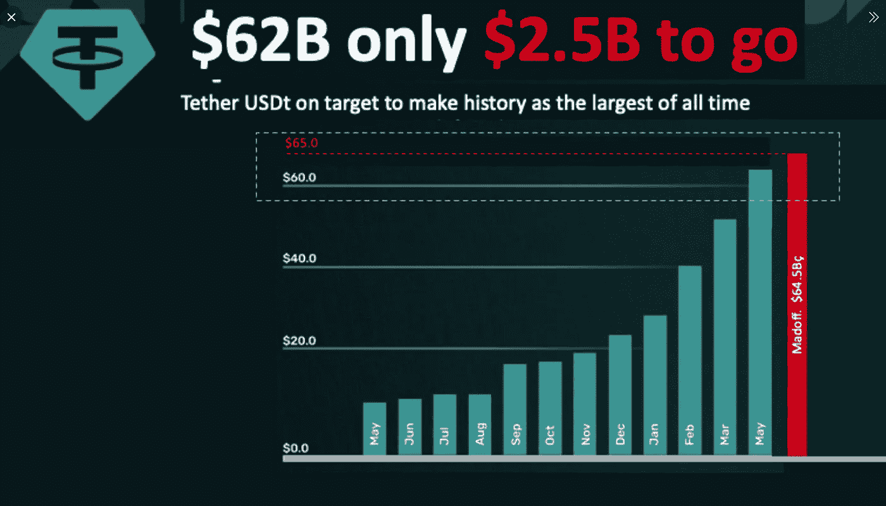

# 泰瑟(USDT):一场即将发生的事故

> 原文：<https://medium.com/coinmonks/tether-usdt-an-accident-waiting-to-happen-c4f4f8030f32?source=collection_archive---------1----------------------->

*Image from:* [*Twitter*](https://twitter.com/intel_jakal/status/1401095388405268481)

**系绳。**stable coins 之父。市值达到惊人的 620 亿美元，目前在加密货币市值指数中排名第三，仅次于 BTC 和以太坊。

泰瑟也被指控在之前的牛市中操纵市场。自创立之日起，它就被认为是见不得人的、不透明的，是用来操纵市场的工具。