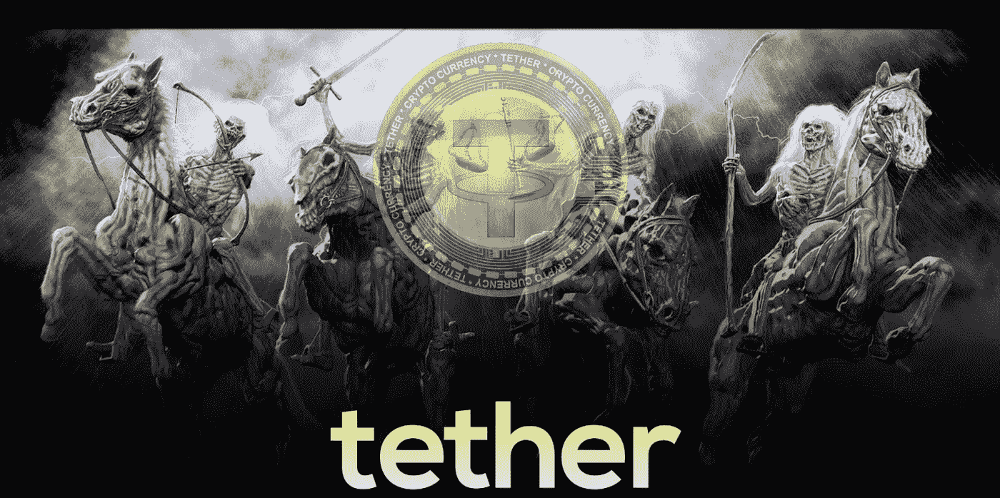

# 系绳(USDT):世界末日的场景！

> 原文：<https://medium.com/coinmonks/tether-usdt-the-doomsday-scenario-96bf16b679dc?source=collection_archive---------2----------------------->

> **我希望我们有一些清晰度，告诉我们的客户一些真实的东西总是非常困难的，这加剧了不确定性**
> 
> **如果我们不迅速行动，BTC 可能会降到 1k 以下**
> 
> *——Bitfinex&系绳首席财务官“梅林”，吉安卡洛·德瓦西尼(2018 年 10 月)*

Tether 的 stablecoin " **USDT** "经常被加密货币社区以各种错误的理由讨论。一个…