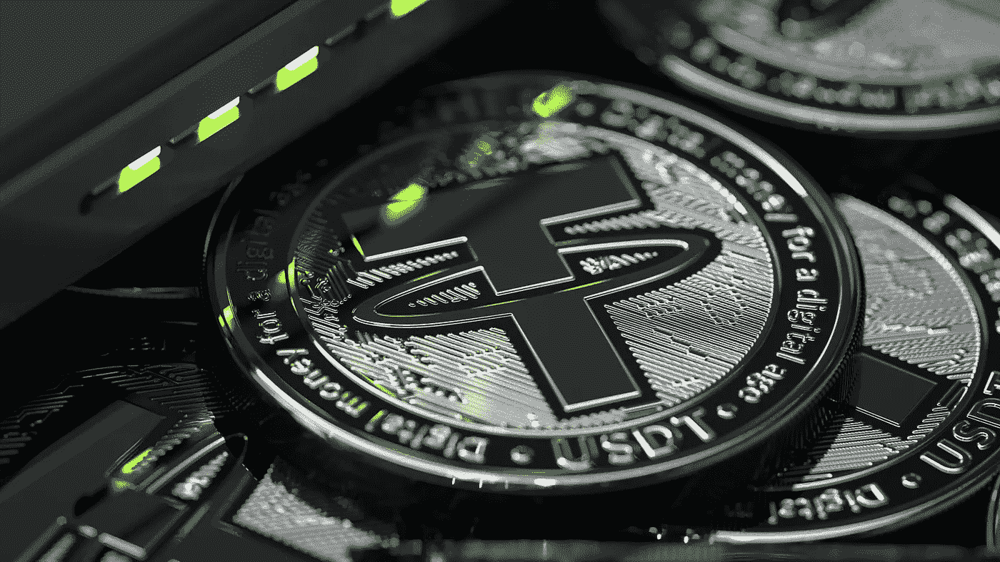
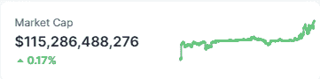
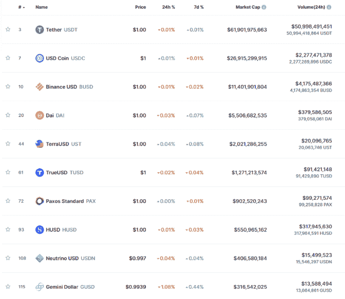
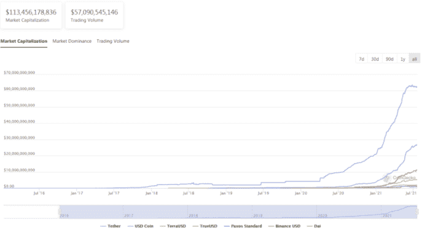
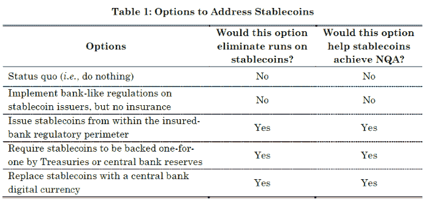
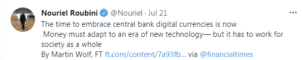
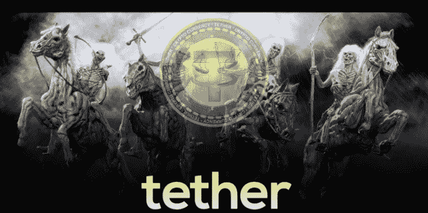

# tether(USDT)受到越来越严格的监管审查

> 原文：<https://medium.com/coinmonks/tether-usdt-under-increased-regulatory-scrutiny-bf574a1c76ff?source=collection_archive---------0----------------------->

各种来源的传言称 stablecoins 将很快受到监管，并开始在非常严格的监管框架下运营。

大多数 stablecoins 在母公司的集中控制下运行，从一开始就缺乏清晰度。重要的是要记住，除了戴之外的所有 stablecoins 都是中央集权的，受各自母公司的控制。

USDT 由 Tether(Bitfinex 的高管)管理，USDC 由 Circle 管理。我们最近还看到 BUSD(币安)的股价上涨，市值已超过 100 亿美元。

USDC 声称是唯一一种由独立的、公认的、全球领先的会计网络审计的加密货币(Grant Thorton)。然而，我们正在等待这次审计的正式确认。

稳定的硬币在过去 12-18 个月中实现了严重的增长，应该被视为一支重要的力量，或者更好地说，是对目前市值 1.3 万亿美元的整个加密货币行业的严重威胁。

# 市值很重要

一些分析师支持市值无关紧要的观点，在我看来这是一个严重的错误。市值不仅仅来源于最后的价格或最后的交易。我们不是在谈论一个低流动性的硬币，它在卖出和买入订单之间有 800%的利润。对于大多数顶级交易所的大多数顶级硬币来说，这些都是流动性市场。

即使是小型交易所，如今也拥有大部分顶级加密货币的流动性。否则他们无法生存。

他们在稳定的债券中有这种流动性，尤其是在泰瑟的 USDT。

说市值不重要是错误的，这只能适用于在交易量非常低的交易所交易的一些流动性非常差的资产。

## Stablecoins 市值

Stablecoins MarketCap — Coinmarketcap

稳定密码的总市值已经达到 1150 亿美元，而加密密码的市值目前为 1.3 万亿美元。这个数量接近整个市场的 10%。

Tether 几乎占据了 stablecoin 市场的半壁江山，紧随其后的是、、戴。

Stablecoins Index, Coinmarketcap

从 2020 年 3 月到今天，stablecoins 已经走了很长一段路，通过在其运营的选定区块链(主要是以太坊、创和 BSC)上持续发行(铸造)新代币，其市值上涨了约 1000%。

尤其是 BUSD，在不到 12 个月的时间里，发行了 100 多亿枚面值 1 美元的代币。去年 8 月刚刚达到 2 亿美元，不到一年后就已经接近 120 亿美元了！

Stablecoins Marketcap, CoinGecko

这张图表显示了去年稳定硬币的上涨幅度。批评者仍然不相信这些稳定的硬币会像发行它们的公司所说的那样有 1:1 的支持。

所有稳定债券的发行量都呈指数级增长，如今的估值比一年前高出 1000 亿美元。

我们现在可以理解为什么市值极其重要了。

# 目前对泰瑟·USDT 和斯塔布尔·科恩斯的威胁

规定。

这是这个领域的每个人都害怕的。稳定的公司害怕独立审计师。审计员将发现所有的违规行为，并将不得不在发行这些证券的公司的资产负债表上签字。

事实上，对于系绳的情况，这里没有赌注。五年多来的违规行为和缺乏透明度，令人对 USDT 的整体长期可持续性产生担忧。

## 本周关于稳定资本的监管新闻

*   7 月 14 日:杰罗姆·鲍威尔(Jerome Powell):“如果你有美国数字货币，你就不需要稳定的硬币了”( [路透社](https://www.reuters.com/business/feds-powell-says-stablecoins-need-appropriate-regulatory-framework-2021-07-14/))

> 美联储理事莱尔·布雷纳德表示，美联储正在加紧研究和公开参与数字版美元

*   7 月 19 日:驯服野猫 Stablecoins ( [SSRN](https://papers.ssrn.com/sol3/papers.cfm?abstract_id=3888752) )

NQA:没有问题(*每个单元的价值都是无可置疑的*)。

引自论文( [*来源*](https://papers.ssrn.com/sol3/papers.cfm?abstract_id=3888752) ):

> **Tether 声称其虚拟货币一直完全由美元支持是一个谎言。这些公司掩盖了投资者面临的真实风险，由未经许可和不受监管的个人和实体在金融系统最黑暗的角落进行交易。**

*   7 月 20 日:耶伦呼吁对稳定的信贷迅速采取行动( [彭博](https://www.bloomberg.com/news/articles/2021-07-19/yellen-tells-regulators-to-act-quickly-on-stablecoin-rules))

> **鉴于数字资产的快速增长，各机构在监管该行业以及为新机构制定任何建议方面进行合作非常重要。**
> 
> *——珍妮特·耶伦*

此外，最近，我们注意到一些流行的金融数据支持 CBDCs(中央银行数字货币)。例如，努里埃尔·鲁比尼是加密货币的生动批评者，也是美联储控制下的中央集权货币的倡导者。

*Source:* [*Twitter*](https://twitter.com/Nouriel/status/1417716137396248576)

# 结论

*Source of Image:* [*WallpaperUP*](https://www.wallpaperup.com/31970/4_Horsemen_of_the_Apocalypse_religion_revelations_bible_dark_horror_skulls_skeleton_weapons_sword_horses_monsters.html) *(modified)*

缺乏支持其代币的资产的任何透明表示的稳定币是 USDT 币。没有明确的证据表明 Tether 的每个 USDT 都有同等价值的资产支持，并且 Tether 提供的任何报告都是模糊的和不充分的。

币安发行的 100 亿美元 BUSD 资产同样模棱两可。

币安最近陷入了监管困境，受到了许多金融机构的指责，因为它是以金融实体的身份运营的。

所有政府都有一个明确的战略，它肯定会很快成为新的政策。一方面，规范和限制稳定的信贷，如果有任何违规行为，然后有效地取缔它们。

另一方面，在美联储对美国的控制下，在欧洲央行对欧盟的控制下，以 1:1 的价格促进中央银行稳定的货币。

与 CBD 有很多利害关系，当与中国的任何交易出现时，政府不会对系绳感到满意。

中国的 CBDC 对美元和欧元都是一个威胁，因为它将挑战这两种货币的霸权。DCEP 网络被美国和欧盟视为威胁，对策只能包括创建数字美元和数字欧元等价物。

与中国政府的情况一样，这些法定数字等价物也将要求限制私人创造稳定货币的努力，并可能限制一般的加密货币市场。

*导语图片来源:* [*Unsplash*](https://unsplash.com/photos/5xlHjrzQO54) *(由* [*DrawKit 插图*](https://unsplash.com/@drawkit) *)*

*参考文献:*

*   *ASPI —* [*中国的数字人民币倡议是网络，不是货币*](https://www.aspistrategist.org.au/chinas-digital-renminbi-initiative-is-a-network-not-a-currency/)
*   *彭博—* [*耶伦呼吁对稳定的信贷采取快速行动*](https://www.bloomberg.com/news/articles/2021-07-19/yellen-tells-regulators-to-act-quickly-on-stablecoin-rules)
*   *SSRN —* [*驯服野猫马厩*](https://papers.ssrn.com/sol3/papers.cfm?abstract_id=3888752)
*   *路透社—* [*美联储的数字货币可能会削弱对加密货币的需求*](https://www.reuters.com/business/feds-powell-says-stablecoins-need-appropriate-regulatory-framework-2021-07-14/)

*更多关于系绳和稳定器的文章*

*   [***【系绳】(USDT):一场事故等待着发生***](/coinmonks/tether-usdt-an-accident-waiting-to-happen-c4f4f8030f32)
*   [***【系绳】(USDT):末日场景！***](/coinmonks/tether-usdt-the-doomsday-scenario-96bf16b679dc)
*   [***为什么 Stablecoins 将无法保持钉住***](/coinmonks/why-stablecoins-will-not-be-able-to-maintain-the-peg-fb07327999dc)

*激活于:*

*●*[***read cash***](https://read.cash/@Pantera)*●*[***noise cash***](https://noise.cash/u/Pantera99)*●*[***Medium***](/@panterabch)*●*[***蜂巢***](https://hive.blog/@pantera1) *●*

*●* [***推特***](https://twitter.com/Panterabch)*●*[***LinkedIn***](https://www.linkedin.com/in/panterabch/)**●**[***Reddit***](https://www.reddit.com/user/PanteraBCH)**

***原发布于*[*https://read . cash*](https://read.cash/@Pantera/tether-usdt-under-increased-regulatory-scrutiny-3d2cb23d)*。***

> **加入 [Coinmonks 电报频道](https://t.me/coincodecap)，了解加密交易和投资**

## **另外，阅读**

** [## 加密交易机器人——最佳免费加密交易机器人

### 2021 年币安、比特币基地、库币和其他密码交易所的最佳密码交易机器人。四进制，位间隙…

medium.com](/coinmonks/crypto-trading-bot-c2ffce8acb2a)  [## 最佳 6 个加密交易信号电报通道

### 这是乏味的找到正确的加密交易信号提供商。因此，在本文中，我们将讨论最好的…

medium.com](/coinmonks/best-crypto-signals-telegram-5785cdbc4b2b)  [## BlockFi 评论 2021:利弊和利率

### 今天，我们提出了一个全面的 BlockFi 评论，这是一个成立于 2017 年的加密贷款平台，拥有其…

blog.coincodecap.com](https://blog.coincodecap.com/blockfi-review)  [## 加密税务软件——五大最佳比特币税务计算器[2021]

### 不管你是刚接触加密还是已经在这个领域呆了一段时间，你都需要交税。

medium.com](/coinmonks/best-crypto-tax-tool-for-my-money-72d4b430816b)  [## Pionex 评论 2021 |免费加密交易机器人和交换

### Pionex 是为交易自动化提供工具的后起之秀。Pionex 上提供了 9 个加密交易机器人…

medium.com](/coinmonks/pionex-review-exchange-with-crypto-trading-bot-1e459d0191ea)  [## 存储比特币的最佳加密硬件钱包[2021]

### 保管您的数字资产很容易，但找到正确的存储方式却是一项繁琐的任务。在线钱包有一个风险…

blog.coincodecap.com](https://blog.coincodecap.com/best-hardware-wallet-bitcoin)**