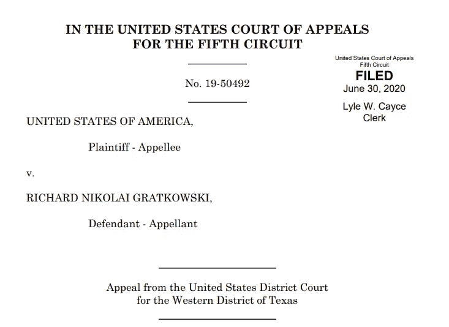

# 德克萨斯州联邦法官裁定第四修正案不适用于比特币交易记录

> 原文：<https://medium.com/coinmonks/texas-federal-judge-rules-fourth-amendment-does-not-apply-to-bitcoin-transaction-records-97d4e6126f?source=collection_archive---------4----------------------->

## 美国诉 Gratkowski 案的律师解释(2020) 964 F3d 307。

美国公民在他们的比特币交易记录中有第四修正案隐私权吗？第五巡回上诉法院最近的一个联邦案件涉及第四修正案是否适用于区块链的加密货币交易，这为政府在没有授权令的情况下获取这些记录的能力树立了巨大的先例。

提醒一句，这是我在理解这个新兴行业的监管框架的过程中遇到的最黑暗的案例之一。它涉及一名刑事被告，他使用自己的比特币在一个儿童色情网站上购买非法内容。然而，在我们继续讨论这个案件及其对第四修正案宪法权利的法律影响之前，值得注意的是，被告在这个案件中的所作所为与目前出于完全合法和利他主义的原因持有比特币的数百万用户无关。尽管媒体报道了加密货币的非法使用案例，但大多数加密货币持有者并没有向恐怖组织转移资金，也不是像本案中的被告那样使用加密货币的个人。拥有比特币的绝大多数人之所以拥有比特币，是因为他们明白一种无国界、去中心化货币的真正力量，这种货币是自主的，与由善意但天生有缺陷的人实施的管理不善的宏观经济政策的操纵无关。这也是对一个货币体系的抗议，这个货币体系经常让低收入人群辛辛苦苦挣来的钱不断贬值。不用说，就像任何新技术一样，一些人会利用它来作恶，而另一些人会利用它来创造一个更好、更公平的世界。因此，尽管被告做出了令人发指的行为，引发了这起案件，但该裁决仍然保留了法律先例，并触及了加密货币交易方面的公民自由。

让我们开始解释一些关于本案证明事实的事实背景。在联邦执法部门开始调查一个儿童色情网站(“网站”)以及像 Gratkowski 这样的罪犯用来购买非法儿童色情作品的通过比特币基地购买的比特币之后，刑事被告 Gratkowksi 成为了联邦调查的对象。由于大量比特币流入该网站，联邦特工得到了消息，并开始调查公共比特币账本上的高流量。

我打算学习一点关于区块链分类账和交易组如何运作的知识，以充分理解这个案例的事实。每当一个组织创建多个比特币地址时，它通常会将这些地址组合成一个中心比特币地址，称为“集群”鉴于比特币分类账对公众完全开放，联邦调查局等执法机构能够梳理分类账，识别他们认为违反美国法律的集群。

这就是本案中发生的情况。联邦特工能够在公共账本上找到一组加密货币交易，这些交易被用来在网站上购买儿童色情制品。然后，联邦调查局向比特币基地送达了大陪审团传票，而不是获得搜查令，以便他们可以获得任何向网站集群内任何地址发送比特币的个人的信息。Gratkowski 被发现，并最终被逮捕后，代理人从他的家中查获一个硬盘驱动器载有儿童色情。Gratkowski 承认了罪行，并最终被指控犯有一项接收儿童色情制品罪和一项以观看为目的访问网站罪。Gratkowki 认为，传票侵犯了第四修正案对他的比特币交易记录的隐私权，并要求压制由此获得的证据。

这是联邦法院不得不解决美国公民在其区块链交易记录中是否享有第四修正案隐私权的第一个案例。

在美国，第四修正案明文规定

> 人民的人身、房屋、文件和财产安全不受无理搜查和扣押的权利不得侵犯，除非有正当理由，并经宣誓或证实，特别说明要搜查的地方和要扣押的人或物，否则不得签发搜查令

第四修正案保护人民免受政府不合理的搜查和扣押。无论是警察可以检查你的垃圾来找到对你不利的证据，还是他们可以不经你同意窃听你的电话，第四修正案已经被美国最高法院以多种方式进行了分析和诉讼。然而，重要的是要记住，它的功能是确保对政府官员的行为进行适当的约束，这些官员的行为超出了法律实施的正常需要。这并不一定意味着所有的搜查和扣押都被禁止，只是不合理的。

正如大法官韩德在 20 世纪 30 年代的一个禁酒令案例中所写的，第四修正案是:

> “自由的支柱之一，对于一个自由的政府来说是如此的必要，以至于执法中的权宜之计必须永远让位于维护其赖以存在的原则不可侵犯的必要性。”

然而，有时最高法院确定搜查确实是合理的，因此不受第四修正案的保护。政府侵犯了个人的第四修正案权利，这个人必须*对争议的项目有合理的隐私期望*。此外，当一个人自愿将这些项目或信息交给第三方时，最高法院已经认定不再有对隐私的合法期望。这就是所谓的第三方原则，并在 *Smith 诉 Maryland* (1979)一案中得到确立。442，美国 735，743-44。

基于这一分析，可以肯定的是，Gratkowski 将为他所犯下的罪行接受审判。理应如此。或者至少，政府在对他的刑事诉讼中可以采纳这些证据。然而，Gratkowski 依赖于一个案例，该案例阐述了第三方原则在应用于手机时的一个有趣的例外。这就是*卡彭特诉美国* (2018) 138 S. Ct 案。2206.

长话短说， *Carpenter* 案是关于四名男子在 2011 年抢劫一系列无线电窝棚和 T-Mobiles 商店后被捕的。具有讽刺意味的是，当联邦调查局最终抓住他们时，他们根据《商店通信法》申请法院命令，从他们的移动运营商那里获取被告的手机位置数据。在该案件中，政府试图克服被告的第四修正案的反对意见，即在他们的手机记录位置数据中存在隐私利益。政府辩称，因为手机位置数据存储在手机运营商那里，这实际上是第三方泄露，因此史密斯会允许它进入。然而, *Carpenter* 法院裁定，鉴于手机定位记录的独特性质，个人在通过手机记录捕捉到的身体运动记录中保持着合法的隐私期望。这一案件开创了一个先例，即政府不能仅仅因为你的手机被威瑞森和美国电话电报公司监控和存储，就根据第三方原则获得你的行踪

Gratkowski 认为他的情况等同于《卡彭特》中出现的独特背景。他向法庭辩称，存储在公共区块链网络和比特币基地交易所的比特币交易记录不受第四修正案第三方原则的约束，因此，因为他对比特币记录中的隐私有合理的预期，所以不能用来对付他。

本案中法院不同意。Gratkowski 法庭没有依赖于 Carpenter 的案例，而是决定这个案例中的情况更像是银行记录和通话记录，而不是手机定位数据。银行记录的问题此前已经由最高法院在*美国诉米勒* (1976) 425 U.S. 435 一案中提起诉讼。在该案中，最高法院的结论是，银行记录不是对第三方的机密通信，而是流通票据，其中仅包含自愿传递给银行并在正常业务过程中暴露给其雇员的信息。法院认为，当国会颁布《银行保密法》时，它假定个人没有“对保存在银行记录中的信息的任何合法的隐私期望”他们指出，银行保密法的明确目的是要求保留记录，因为它们在“刑事税收、监管调查和诉讼”中有用。这段话直接引自法律本身:12 USCS 1829b。

在 Gratkowki 的案件中，法院得出结论，银行记录和通过手机自动跟踪你的位置数据之间有着明显的区别。他们认为，位置数据和银行记录/通话记录之间的区别在于，位置数据“提供了一个了解一个人生活的亲密窗口，不仅揭示了特定的活动，还通过它们揭示了家庭、政治、职业、宗教和性关系。”此外， *Gratkowki* 法院得出结论，手机已经成为“几乎人体解剖的一个特征”,第三方位置数据暗示隐私问题超出了 *Miller* 和 *Smith 所寻求的记录。*原因？手机已经成为 21 世纪生活中不可或缺的一部分，并且不需要用户采取积极的行动，手机就可以开始跟踪你的运动。这种没有手机就无法生活的情况，以及用户没有采取积极的行动来开启追踪功能，是法院选择在 *Carpenter* 一案中破例的原因。

法院否认个人在公共区块链账本上的加密货币交易记录中有合理的隐私预期，因为:(1)区块链上的信息非常有限，因为它只记录了发送、接收和转移硬币的金额的地址；(2)比特币不是“日常生活中无处不在或不可或缺的一部分；以及(3)需要用户的肯定行为来转移硬币。此外， *Gratkowski* 法院否认个人在比特币基地(和其他交易所)的交易记录中有合理的隐私预期，因为关于个人的信息是有限的，比特币基地没有“了解一个人生活的私人窗口”，并且仍然需要用户采取积极行动来发起转移。最终，法院判定用户同意牺牲一些隐私，通过像比特币基地这样的中介进行交易。因此，通过这样做，他们在这些交易所的交易中也没有合理的隐私期望。[这又回到了我发表的第一篇文章，在那里，加州法院开创了“不是你的钥匙也不是你的硬币”的先例。”](/coinmonks/not-your-keys-not-your-coins-becomes-the-law-of-the-land-in-california-689626b06bfc)

最后，Gratkowski 不得不为他的罪行接受审判，他的交易证据没有被阻止用于对他不利。不管你对 Gratkowski 的看法如何，也不管他对比特币做了什么，这个案件是联邦法院如何看待加密货币以及公共账本和交易所中存储的信息的关键时刻。一个事实似乎变化得比法院能跟上的还要快，随着新技术继续考验第四修正案第三方原则，看看他们的裁决是否会改变将是有趣的。我们都在眼前看到的最显著的差异是加密货币在我们日常生活中日益普遍和持续的使用情况。对于这种情况，法院确定它是小的。这种情况将如何改变，目前还没有定论。然而，最终，这个案件是政府解决第四修正案隐私问题和保护公民自由的需要之间的一个有趣的交集，同时也认识到执法部门需要阻止使用加密货币实施的犯罪。这个案例将会是一个有趣的案例，值得我们继续关注。