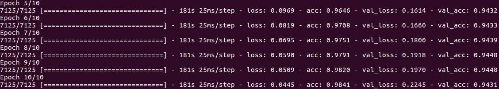
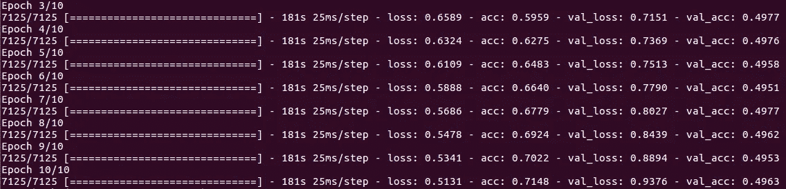

# 基于递归神经网络的 Keras+TensorFlow 文本分类器

> 原文：<https://medium.com/coinmonks/text-classifier-with-keras-tensorflow-using-recurrent-neural-networks-ad63dd5fc316?source=collection_archive---------2----------------------->


R 通用神经网络(RNN)可以用来分析文本序列，并根据参数分配标签。例如，在 [Keras 示例](https://github.com/keras-team/keras/blob/master/examples/imdb_lstm.py)中，它们被用于将 IMDB 电影评论分为正面或负面。

在这个例子中，我们将使用 RNN 来训练分类器，以解决与“系列”中的其他故事密切相关的问题，这些故事涉及使用 LSTM(长短期记忆)来自动生成音乐歌词，从特定流派的语料库中学习“风格”:

 [## 单词级 LSTM 文本生成器。用神经网络生成自动歌词。

### 我开始用非技术性的聊天谈论这个项目，谈论我对 5000 个语料库所做的分析…

medium.com](/@monocasero/word-level-lstm-text-generator-creating-automatic-song-lyrics-with-neural-networks-b8a1617104fb)  [## 更新:自动歌词创作与词嵌入

### 这是故事的延续…

medium.com](/@monocasero/update-automatic-song-lyrics-creator-with-word-embeddings-e30de94db8d1) 

然而，我也希望这可以被视为一个独立的信息。

所有代码、一些文本语料库和更多文档都可以在 Github 正在进行的项目的页面中找到:

[](https://github.com/enriqueav/lstm_lyrics) [## enriqueav/lstm _ 歌词

### lstm _ 歌词- LSTM 文字生成。用于从音乐流派的语料库中生成歌词。

github.com](https://github.com/enriqueav/lstm_lyrics) 

# 分类器的背景和目标

lstm_lyrics 项目的主要目标是训练一个神经网络来“学习”音乐流派的歌词风格，然后能够从中生成文本行。然而，算法总是试图添加某些“可变性”，以避免陷入某些无限的文本循环，或者在给定某个种子的情况下生成完全相同的东西。

不幸的是，经过大量的实验，测试了许多不同的网络架构、数据表示等，每次这种特定的“可变性”都会导致一些生成的文本几乎是随机的。

判断这种情况，并考虑到我已经在为我当前的工作做文本分类器，我决定创建另一个网络来对来自该流派语料库的真实文本和随机生成的行进行分类。想法是，**在这个新网络被训练之后，它将能够预过滤由歌词生成器创建的*最差的*行。**这意味着它将检测更接近随机噪声的生成线。

# **训练集的创建**

我已经创建了一个实用程序脚本来生成新的神经网络将使用的训练集。它可以按如下方式执行:

`python3 utils/generate_classifier_set.py corpora/corpus_banda.txt banda_subset.txt random_banda.txt`

我不会详细解释这个脚本，但基本思想是它将创建两个文件，第一个文件是原始语料库的子集，忽略所有包含至少一个被忽略单词的行(根据参数 MIN_WORD_FREQUENCY 过滤的不太常用的单词)。

第二个文件将包含随机生成的文本，遵循以下规则:

*   使用与第一个文件相同的单词，这意味着语料库的总词汇量减去被忽略的单词(不常用的)。
*   包含相同数量的行(每行是一个训练或测试示例)。
*   以与原始语料库中相同的概率选择单词。
*   以与语料库中相同的概率选择行的长度，这意味着，如果语料库中 30%的行具有 5 个单词，则大致相同百分比的随机生成的行将具有 5 个单词，等等。

考虑到所有这些规则，这两个文件的大小将非常相似。举一个具体的例子:

```
Both files have exactly the same number of lines (126,665 in this case), and roughly the same number of total words (703,435 vs. 705,279) and characters (*3,515,098 vs. 3,523,796)*:*$ python3 generate_random_lines.py corpora/corpus_banda.txt* banda_subset.txtrandom_banda.txt *$ wc* banda_subset.txtrandom_banda.txt *126665  703435 3515098* banda_subset.txt *126665  705279 3523796* random_banda.txt
```

训练分类器的脚本将读取这两个文件来创建训练/测试示例。

# 分类器训练

如果你已经看了这一系列的故事(现在你已经看了😊)，你已经知道歌词生成器的单个训练示例由一个句子组成，一个单词接一个单词，目标标签是单个值，由语料库中的下一个单词表示。例如:

```
>>> sentences[0]['put', 'a', 'gun', 'against', 'his']>>> next_words[0]'head'>>> sentences[1]['a', 'gun', 'against', 'his', 'head']>>> next_words[1]'pulled'
```

给定输入，单个例子的网络输出将是每个可能单词的概率。因此，如果您的词汇表包含 5000 个不同的单词，那么输出将是一个包含 5000 个值的向量，每个单词的概率都为 1。例如，如果网络已经训练好，如果您输入:

```
['put', 'a', 'gun', 'against', 'his']
```

5000 个概率中最高的将是指向单词`'head'`的那个。

二进制分类器的情况与此类似，但甚至更简单，因为输出将是 0 和 1 之间的单个浮点值，表示网络对给定句子的置信度是**肯定的，**无论这在您的上下文中意味着什么。在这种情况下，**正**表示真实文本(与随机生成相反)。

现在说说代码。

完整的脚本[可在此处获得](https://github.com/enriqueav/lstm_lyrics/blob/master/classifier_train.py)，我们将回顾最重要的部分。

首先，我们从包含正面和负面例子的文件中创建训练集。我们已经介绍了如何创建这些文件。因为不是所有的句子都有相同的长度(以单词为单位)，所以我们用`pad_and_split_sentences`填充它们，我们还创建了标签`y`，用正确的长度连接 0 和 1。

```
good_ones = process_file(sys.argv[1])
bad_ones = process_file(sys.argv[2])

x = pad_and_split_sentences(good_ones + bad_ones)
y = [1]*len(good_ones) + [0]*len(bad_ones)
```

然后我们创建字典，在这个过程之后，变量`words`将是一个包含两个文件中所有不同单词的有序集合

```
print("Reading files and getting unique words")
words = set([PAD_WORD])
for line in x:
    words = words.union(set(line))
words = sorted(words)
print('Unique words:', len(words))

word_indices = dict((c, i) for i, c in enumerate(words))
indices_word = dict((i, c) for i, c in enumerate(words))
```

下一步是相当标准的，我们洗牌并分成 90%的训练和 10%的测试

```
sentences, labels, sentences_test, labels_test = shuffle_and_split_training_set(x, y)
```

然后我们得到模型，你可以在这个故事中读到单词嵌入[，它基本上是一种将不同单词翻译成向量的方法(在这个例子中，有 32 个维度)。然后我们将这些向量传递给一个 64 个单位的双向长短期记忆(一种 RNN 单位)。](/@monocasero/update-automatic-song-lyrics-creator-with-word-embeddings-e30de94db8d1)

增加辍学是避免过度适应的一种[方式。最后，输出是 1 的密集层，有 **sigmoid** 激活。正如我们所讨论的，分类器的输出将是一个介于 0 和 1 之间的浮点值，这由 **sigmoid** 给出。](https://machinelearningmastery.com/dropout-regularization-deep-learning-models-keras/)

```
model = Sequential()
model.add(Embedding(len(words), 32))
model.add(Bidirectional(LSTM(64)))
model.add(Dropout(dropout))
model.add(Dense(1, activation='sigmoid'))
```

然后我们用**binary _ cross entropy**loss 和 **adam** optimizer(可以改成 experiment)编译模型。为了适应这个模型，我们使用了一个数据生成器，我在系列文章的第一篇中已经解释过了，基本思想是将示例+标签小批量地输入到模型中，而不是一次性地发送出去。这主要用于当您的训练集不适合内存时，或者当您想要在执行时进行[数据扩充](https://www.quora.com/What-does-the-term-data-Augmentation-mean-in-the-context-of-Machine-Learning)时。

```
model.compile(loss='binary_crossentropy', 
              optimizer="adam", 
              metrics=['accuracy'])
print(model.summary())

model.fit_generator(generator(sentences, labels, BATCH_SIZE),
                    steps_per_epoch=int(len(sentences)/BATCH_SIZE) + 1,
                    epochs=10,
                    callbacks=callbacks_list,
                    validation_data=generator(sentences_test, labels_test, BATCH_SIZE),
                    validation_steps=int(len(sentences_test)/BATCH_SIZE) + 1)
```

最后，我们调用一个函数来使用测试集上网络的最终权重，并获得一种混淆矩阵，从而获得**真阳性、真阴性、假阳性、假阴性的数量**。如果最后一个参数为真，它还将打印所有返回了**假阴性**和**假阳性**的例子，因此您可以直观地看到网络犯了什么样的错误。

```
confusion_matrix(sentences_test, labels_test, True)
```

要开始训练，我们需要执行以下命令

```
$ python3 classifier_train.py <positive_examples_file> <negative_examples_file>
```

# 结论

对于所提出的情况(随机文本对来自语料库的歌词)，10 个时期后的训练准确度在训练集中约为 98% (acc: 0.9841)，在测试集中约为 94.3% (val_acc: 0.9431)(验证)。



考虑到双方都有歧义，这是非常好的。运气(不好的话)的话，随便几行就会看起来很像真正的歌词。2.有些情况下，从语料库中提取的真实歌词看起来很像随机噪音，特别是在墨西哥班达或\_(ツ)_/雷鬼音乐中。

# 额外的

只是作为一个实验，我试图运行相同的分类器训练，但标签被打乱，使用相同的例子，但随机改变它们的“正面”或“负面”标签。训练集会有什么变化？每个时期的测试/验证集呢？



该网络能够在超过 70%的范围内适应训练集(acc: 0.7148)，但是由于标签是随机的，因此在被标记为“正”与被标记为“负”之间没有真实的关系。我们可以验证这种拟合确实是无意义的，因为验证的准确性(val_acc)从未超过 50%。不出所料，即使是“训练过的”网络也无法归纳出训练阶段从未见过的例子。


> 加入 Coinmonks [电报频道](https://t.me/coincodecap)和 [Youtube 频道](https://www.youtube.com/c/coinmonks/videos)获取每日[加密新闻](http://coincodecap.com/)

## 另外，阅读

*   [复制交易](/coinmonks/top-10-crypto-copy-trading-platforms-for-beginners-d0c37c7d698c) | [加密税务软件](/coinmonks/crypto-tax-software-ed4b4810e338)
*   [网格交易](https://coincodecap.com/grid-trading) | [加密硬件钱包](/coinmonks/the-best-cryptocurrency-hardware-wallets-of-2020-e28b1c124069)
*   [密码电报信号](http://Top 4 Telegram Channels for Crypto Traders) | [密码交易机器人](/coinmonks/crypto-trading-bot-c2ffce8acb2a)
*   [最佳加密交易所](/coinmonks/crypto-exchange-dd2f9d6f3769) | [最佳加密交易所](/coinmonks/bitcoin-exchange-in-india-7f1fe79715c9)
*   开发人员的最佳加密 API
*   最佳[密码借贷平台](/coinmonks/top-5-crypto-lending-platforms-in-2020-that-you-need-to-know-a1b675cec3fa)
*   杠杆代币的终极指南