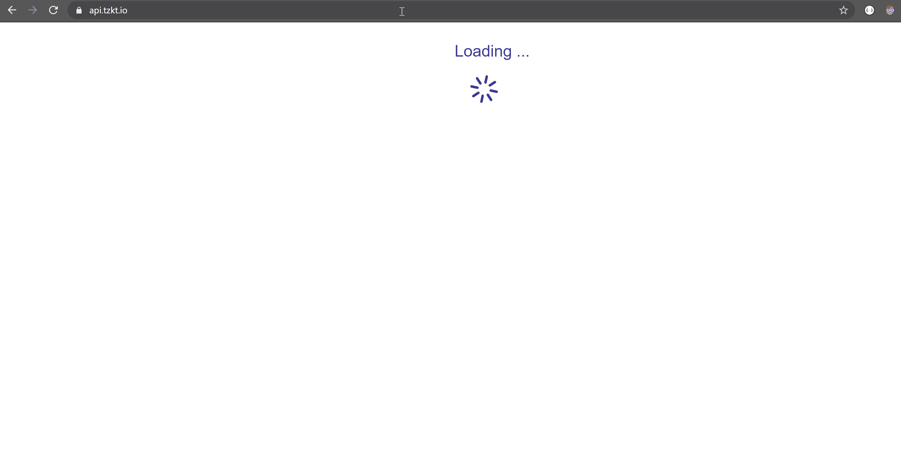

# TzKT Explorer 上以美元、欧元和 BTC 显示的 Tezos 账户报告

> 原文：<https://medium.com/coinmonks/tezos-account-reports-in-usd-eur-and-btc-on-tzkt-explorer-5315a128c1e4?source=collection_archive---------4----------------------->

直到今天，你还只能用 XTZ 币从 TzKT explorer[下载 Tezos 会计报告。但现在你也可以得到美元、欧元和 BTC 的报告，并在操作时进行价格结算。](https://tzkt.io)

TzKT Tezos 索引器 [v1.1 已经发布](https://github.com/baking-bad/tzkt)。现在，它支持按块时间戳排列的市场数据索引。您可以在各种报价提供商之间切换(目前支持`TzktQuotes`和`Coingecko`)或者轻松创建自定义报价提供商。

# Tezos API 内置市场数据

最酷的特性是将历史价格直接注入到 TzKT API 的响应中，例如，您可以在操作时请求以美元、欧元或 BTC 结算的 Tezos 交易。您所需要做的就是将`?quote=`查询参数附加到您的请求 url，指定所需货币的逗号分隔列表(目前支持`BTC`、`EUR`和`USD`)。

# Tezos 帐户税务报告

此外，我们很高兴地宣布备受期待的帐户报表(。csv 报告)基于历史价格(运营时)的各种货币(BTC、欧元、美元)。目前，默认报价提供商使用 [CoinGecko](https://www.coingecko.com) 市场数据。

我们相信这将有助于建立准确的 Tezos 税务报告。

干杯！

*原载于 2020 年 8 月 5 日 https://baking-bad.org***。**

> *[直接在您的收件箱中获得最佳软件交易](https://coincodecap.com?utm_source=coinmonks)*

**