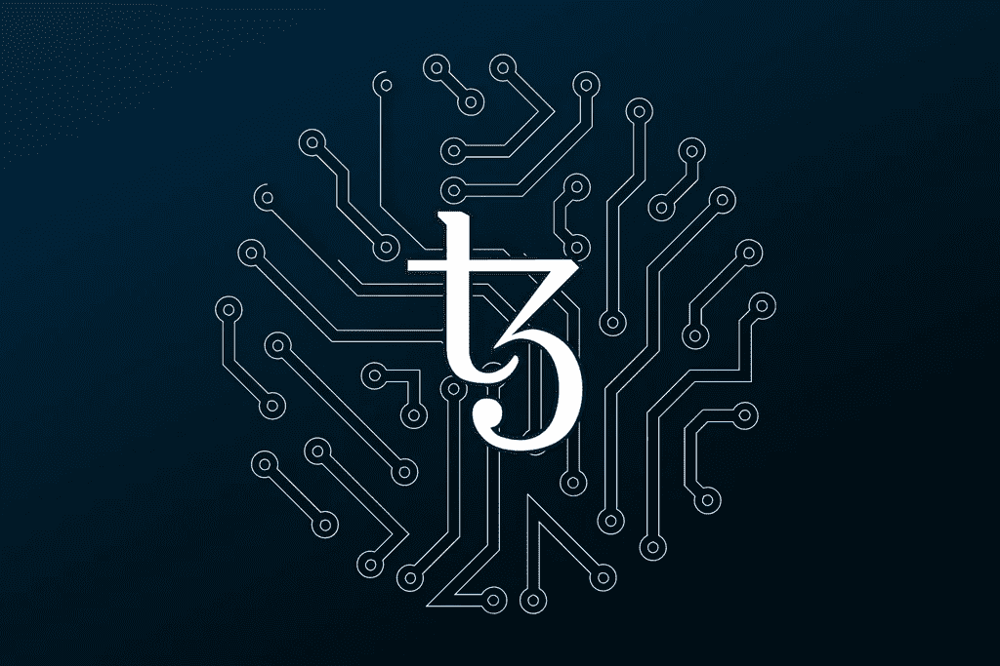
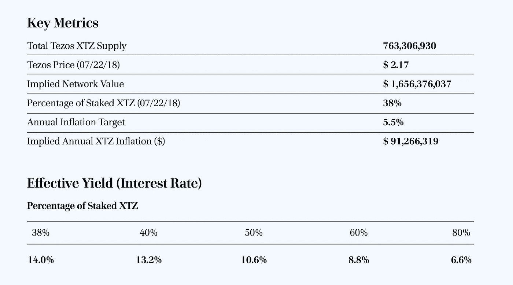

# Tezos 烘焙和授权指南

> 原文：<https://medium.com/coinmonks/tezos-baking-delegation-guide-a410d9821fc8?source=collection_archive---------0----------------------->

## 关于烘焙和委派 XTZ 的 a 到 Z

Tezos (XTZs)需要被委托给面包师来获得块奖励。Staked 为 Tezos baking 提供匿名的全自动委托服务。我们张贴烘焙所需的保证金，并收取 10%的烘焙费。

委托是非托管的，委托人不能花你的钱(XTZs)，你的股份永远不会有风险。要委托您的 XTZ 进行 Staked，请使用以下地址:

> tz 1 rcfb 9 gpalpsztu 6j 58 sb 74dm 8 QE 6 XB zv

## 象征经济学

Effective yield estimates based on a 62.5 second block interval.

## **关于**

泰佐斯区块链协议是一个委托的利益证明系统，支持图灵完全智能合同。Tezos 是用 OCaml 实现的，这是一种函数式编程语言，它提供了速度、明确的语法和语义以及正确性的正式证明。

## **发射**

Tezos betanet 于 2018 年 6 月 30 日推出，并开始处理将在“mainnet”上持续存在的真实交易。在大约三周的前七个周期中，Tezos 基金会负责所有区块的生产和验证。2018 年 7 月 21 日，第一个非 Tezos 基金会，或“社区”区块出炉。

## **烘焙&代言**

Tezos 将烘焙称为在链中签署和发布新块的操作。面包师至少需要 10，000 XTZ(约 22，000 美元)才有资格成为代理人，拥有额外的代理股权增加了他们被选为面包师或代言人的机会。

在每个周期开始时(4096 个区块或约 3 天)，随机选择并公布每个区块的烘焙师。面包师每烤一块面包可获得 16 XTZ 的奖励。

除了烘焙师之外，还随机选择了 32 名认可者来验证最后烘焙的块。代言人每代言一个区块就能获得 2 XTZ。

## **街区奖励&通货膨胀**

整体奖励由协议规定的通货膨胀提供资金。奖励经过校准，因此 XTZ 代币的数量以每年大约 5.5%的速度增长。如果 100%委托 Tezos 代币，年化收益率为 5.5%。**目前已经委托了 38%的 Tezos tokens，其中包括 Tezos 基金会拥有的 10%，因此年化收益率目前为 14%。**

为了确保面包师和代言人诚实行事，他们需要为他们烘焙或代言的每一块面包交付保证金。如果出现恶意行为，如双重烘烤或双重背书，他们将没收保证金。

## 管理

协议修正案在 131，072 个街区或大约 3 个月的选举周期内通过。随着协议的成熟，预计这一周期会越来越长。治理提案需要 80%的法定人数。

## **XTZ 激活和授权指令**

要选择代表并参与 Tezos 的股权证明机制，您需要首先激活您的 XTZ 分配，创建一个帐户来委托股权，并指定负责代表您参与烘焙和治理的公共代表密钥。您可以在任何时候更改代理，尽管更改只会在 N 个周期后生效。

1.  使用 [Activatez](https://stephenandrews.github.io/activatez/) 在 genesis block 上激活您的 XTZ 分配，这是一个简单的工具，可以快速安全地激活您的 XTZ，而不必从冷存储中删除您的私人数据
2.  用你的募捐者信息创建一个 TezBox 钱包:访问 [TezBox](https://tezbox.com/) ，选择“恢复 TezBox”，然后选择“募捐者钱包”
3.  输入您的信息:PDF 种子词，PDF 电子邮件地址，ICO 密码，和 KYC 激活码
4.  点击“添加账户”按钮，创建一个新的 KT1 账户(一个用于授权的特殊账户)(费用:0.25 XTZ)
5.  将您的 XTZ 从 tz1 帐户转移到 KT1 帐户。从主钱包中选择“发送”，在“收件人”地址中输入您的 KT1 地址，输入 XTZ 金额，然后单击“发送”(将费用字段留空)
6.  在 KT1 帐户中，选择“代理”菜单，然后选择“自定义代理”
7.  输入地址:**tz 1 rcfb 9 gpalpsztu 6j 58 sb 74dm 8 QE 6 xbzv**点击确认

## **关于押桩**

[Staked](http://staked.us/) 代表机构投资者运营最安全、性能最佳、最具成本效益的分散式 PoS 协议批量生产节点。我们的多层监听和签名节点架构为利益相关者提供了安全性、可伸缩性和分散性的理想组合。

Staked 为领先的 PoS 协议(包括 Tezos、EOS、Factom、Cosmos、Decred、R-Chain、OmiseGO、Thunder、Ethereum、Dfinity 等)提供工业规模的桩接基础设施，使我们能够为客户提供满足其所有桩接需求的理想解决方案。

**服务器基础设施**

堆叠节点部署在多层配置中的高性能计算资源上，该配置结合了安全性和可扩展性，同时最大限度地减少了对硬件提供商的集中。该基础架构使用 Kubernetes 编排来确保高可用性和极低的网络延迟，并且可以随着网络增长按需扩展。

**DDoS 防护**

AWS Shield、弹性负载平衡和高级 IP 地址混淆技术用于防御恶意的网络、传输和应用层拒绝服务攻击。

**听云**

监听云由可公开访问的节点组成，这些节点动态分配来自多个云服务提供商的资源，包括 AWS、Google Cloud 和 Azure。在 Kubernetes 的精心策划下，监听云实现了近乎无限的规模、自我修复和去中心化的硬件基础设施。

**签名服务器**

签名服务器是负责生成和签名块的裸机服务器。它们在美国的 Equinix 数据中心受到保护，具有用于密钥安全的硬件签名模块，并且有防火墙，因此它们只能与监听服务器通信。

> 加入 Coinmonks [电报频道](https://t.me/coincodecap)和 [Youtube 频道](https://www.youtube.com/c/coinmonks/videos)获取每日[加密新闻](http://coincodecap.com/)

## 另外，阅读

*   [复制交易](/coinmonks/top-10-crypto-copy-trading-platforms-for-beginners-d0c37c7d698c) | [加密税务软件](/coinmonks/crypto-tax-software-ed4b4810e338)
*   [网格交易](https://coincodecap.com/grid-trading) | [加密硬件钱包](/coinmonks/the-best-cryptocurrency-hardware-wallets-of-2020-e28b1c124069)
*   [密码电报信号](http://Top 4 Telegram Channels for Crypto Traders) | [密码交易机器人](/coinmonks/crypto-trading-bot-c2ffce8acb2a)
*   [最佳加密交易所](/coinmonks/crypto-exchange-dd2f9d6f3769) | [最佳加密交易所](/coinmonks/bitcoin-exchange-in-india-7f1fe79715c9)
*   开发人员的最佳加密 API
*   最佳[密码借贷平台](/coinmonks/top-5-crypto-lending-platforms-in-2020-that-you-need-to-know-a1b675cec3fa)
*   杠杆代币的终极指南
*   [7 个最佳零费用加密交易平台](https://coincodecap.com/zero-fee-crypto-exchanges)
*   [最佳网上赌场](https://coincodecap.com/best-online-casinos) | [期货交易机器人](/coinmonks/futures-trading-bots-5a282ccee3f5)
*   [分散交易所](https://coincodecap.com/what-are-decentralized-exchanges) | [比特 FIP](https://coincodecap.com/bitbns-fip)
*   [用信用卡购买密码的 10 个最佳地点](https://coincodecap.com/buy-crypto-with-credit-card)
*   [加拿大最佳加密交易机器人](https://coincodecap.com/5-best-crypto-trading-bots-in-canada) | [Bybit vs 币安](https://coincodecap.com/bybit-binance-moonxbt)