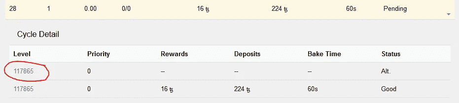

# Tezos 债券损失:工作实例

> 原文：<https://medium.com/coinmonks/tezos-bond-loss-worked-examples-67e0282735f2?source=collection_archive---------4----------------------->

通过 Tez Baker [电报频道](https://t.me/TezBaker)我们几天前收到了以下问题:

> 伙计们，有个问题。假设的。假设你的债券由于恶意行为而被削减。这些技术开发区会怎么样？它们被永久销毁了吗？还是会被分发给其他面包师？

# **简答**

一半被烧掉了，另一半给了烘烤下一块面包的面包师。相同的条件适用于双重烘焙(创建两个具有相同键但不同节点 id 的不同块)。

# **第一个成功的例子**

由于每个人都在学习技术，已经有了一些双重烘焙的例子；下面是我们发现的第一个例子[opqkvbn 1 qglgvrtdtkwgjwvaysawpjreeccfa 5 rad SEZ 3 ejfg 2 f](https://tzscan.io/opQKVbn1QGLGvRTdtKwgJwvaYsaWPJreeCCFA5raDsEz3ejFG2f)

注意地址 as 是一个私人的，匿名的面包师，他现在做得很好，所以我们希望他们不介意我们用这个操作作为例子[tz 1 neujrqiceom 7 LAF 5 w 63 mlbxwims 4 clauj](https://tzscan.io/tz1NEujRQicEoM7LAF5W63mLbxwiMS4CLauJ?default=baking)

这个周期损失的债券是 504 XTZ。

252 辆 XTZ 被烧毁。

从积极的一面来看，幸运的面包师获得了剩余的 252 XTZ。碰巧的是，这是我们在 [tezos 代表团服务](https://www.tezbaker.io/health/network)网络图中跟踪的两条私人鲸鱼之一。我们亲切地将这个地址命名为“老汉皮”(另一个我们命名为“大蓝”，不是很有创意，但它们很合适)。

有趣的是，面包师损失了 504 XTZ，因为在第 28 周期，整笔存款是 224 XTZ！

> 如果邦德是 224，他们怎么会失去 504 XTZ 呢？

他们第 28 周期的总债券是 532 XTZ。

他们最初被分配到第 28 周期的 1 个区块(债券:1 * 224 XTZ = 224 兹)和 11 个背书(债券:11 * 28 XTZ = 308 XTZ)(债券总额:224 XTZ + 308 XTZ = 532 XTZ)。

该周期的[奖励分成](https://api1.tzscan.io/v1/rewards_split/tz1NEujRQicEoM7LAF5W63mLbxwiMS4CLauJ?cycle=28&p=0) (TZScan 的 api)如下:

他们获得了他们烤出的街区(1 * 16 XTZ = 16 XTZ)和他们完成的代言(11 * 2 XTZ = 22 XTZ)的所有奖励。

然而，你可以看到他们被罚款 504 XTZ 和 36 XTZ 奖励被取消。

**债券损失—初始假设**

不幸的是，对这个面包师来说，罚款和被取消的奖励是从你在这个周期中完成的所有事情中扣除的，包括违法行为。

双重烘焙发生在 117865 层。

*Extract taken from* [*tz1NEujRQicEoM7LAF5W63mLbxwiMS4CLauJ;*](https://tzscan.io/tz1NEujRQicEoM7LAF5W63mLbxwiMS4CLauJ?default=baking) *double click Cycle 28 under the Baking History to expand and view the block details.*

在此之前，他们已经获得了 10 次认可

*Extract taken from* [*tz1NEujRQicEoM7LAF5W63mLbxwiMS4CLauJ;*](https://tzscan.io/tz1NEujRQicEoM7LAF5W63mLbxwiMS4CLauJ?default=baking) *double click Cycle 28 under the Endorsement History to expand and view the endorsement details. Noting that there is one more endorsement on the second page.*

**罚款计算—初始假设**

所有债券的损失，包括违规操作。

在这个例子中，504 XTZ 罚款包括 1 * 224 XTZ 集体保证金和 10 * 28 XTZ 背书保证金。

**撤销奖励计算—初始假设**

失去包括违规操作在内的所有奖励。

在这个例子中，36 个 XTZ 撤销奖励包括 1 * 16 个 XTZ 区块奖励和 10 * 2 个 XTZ 背书奖励。

**红鲱鱼——初始假设**

从这个例子中，你可以得出这样的结论:你只损失了这个周期中所有先前的区块和背书的存款，因为面包师在双重烘焙后有一次成功的背书，并且没有罚款。不过，有没有可能没有面包师捡起来呢？背书是在 118446，Tez Baker 在 118488 烤了一块，我们没有选择它，即使我们运行了原告流程。因此，我们很高兴地得出结论，你只是失去了所有先前操作的存款，你很好地继续前进。因此，我们认为我们应该检查另一个双烘焙，以确保我们的理解是正确的！

## 第二个例子

面包师[tz 1n 674 RM 7 umvvvxzpsqngx 6 vtn 2 xwolcdcf 6](https://tzscan.io/tz1N674Rm7uMVVXzPsqnGX6VTn2xWoLCdcF6)双倍烤到 88872 级如下图。

一个街区后这辆车被发现，并被处以 567 XTZ 的罚款。这与我们以前的论点相匹配，因为面包师以前有 19 次背书，每次背书 21 XTZ(19 * 21(背书存款)+ 168(整笔存款)= 567)。事实上，这位面包师是幸运的，因为他们错过了 5 次代言，而这又要花费 95 XTZ。

第一条罚款可以看这里[https://tz scan . io/oodbxzubwmxt 1 xjhzirw 7 q3na 4 uetjfshiiynnsje 8 UAW V5 dczj](https://tzscan.io/oodBXzubwMxT1xjhZiRw7q3nA4UetJfShiiYnNsJe8UawV5DCZj)

一切都好，但这是什么？第二次罚款？[https://tzscan.io/double-baking](https://tzscan.io/double-baking)

看来你确实会因为未来的代言和封杀而被罚款，而且这一罚款在 90002 年被提高了。不确定为什么在这个级别但是其他烘焙师没拿起来(软件配置差异？).

第二条罚款可以看这里[https://tz scan . io/onucjsh 7 CQ 3 emzq 1 rj 5 xkwdggdj 1 adtp 48 buzdjhztmzfo 1 xvez](https://tzscan.io/onuCJSH7cq3eMzq1rj5XKwDGGDj1ADtp48bUZdjhzTMzfo1XvEz)

请注意，这是在 90002 时提出的，因此面包师在 90086 时逃脱了最后一次背书，因为没有其他面包师提出它。第二张罚单是 126 XTZ，是 6 次代言费(6 * 21 XTZ)。所以一些有趣的问题；为什么在 block 90002 之前没有其他面包师接罚款，为什么没有人接最后的背书？此外，提高罚款是否有时间限制，罚款是否必须在同一周期内提高？

## 所以对于双重烘焙，我们失去了所有的存款和周期奖励

嗯，不完全是，我们还有一个面包师，他烤了三次，达到 50777 XTZ，被罚款 732。他们继续支持和烘烤，你会看到另外 6 个点球，直到我们到达 50787，然后停止。面包师继续背书和烘烤，但没有更多的罚款。在这一点上，我们无法解释为什么会这样。7 次罚款是最大限度吗，似乎值得怀疑？我们的下一步是开始查看源代码来解决这个问题，但这将在以后的文章中讨论。

另一个混淆点是，在上面的双烤证据中，损失的保证金和损失的奖励一栏并不一定与某一特定的罚金相一致。例如，如果你看看倒数第三个，“面包卷”为一次代言增加了 12 XTZ 的罚款，但损失的奖励为零，我们知道你为一次优先零代言获得 2 XTZ。由于某种原因，这 2 个 XTZ 出现在上面一行的 6 个 XTZ 中，但这是否意味着其存款更高(每次背书 12 个 XTZ)，但这似乎出现在“基础面包师 5”下面两行。为什么会这样，我们无法编造一个叙述！这可能是 TZScan 端的一个错误，因为我们是通过他们的 API 查看数据的。

## 我们仍然需要回答的问题

**原告程序做什么？**烘焙时，你有许多流程在运行:节点、烘焙者、支持者和原告。节点和原告不需要访问您的密钥，那么原告具体做什么呢？我们不能完全确定，但我们猜测它通知网络一个双重烘焙，可以由下一个烘焙师选择，烘焙下一个块。

**所有的罚款都必须在这个周期中提高吗？因此，如果你在循环的最后一个街区加倍烘烤，你会被罚款吗？双重烘烤的罚款数量有限制吗？我们知道有些事情阻止了进一步的罚款；会不会是面包师基金会的软件开关？当我们还在 betanet 的时候，基金会有可能在他们的节点上测试各种配置吗？我们知道的是，它停止了罚款，否则面包师会损失很多钱。**

**是什么触发把处罚信息放到一个块里？**第一次出现双重烘焙违规时，下一个街区的面包师会立即处理。在同一个周期中，随后的代言不会马上被接受，事实上大多数面包师都忽略了这一点。会不会是一些面包师在运行不同的配置，从而发现了这些违规行为，而我们其他人却忽略了它们。

# **故事的寓意**

如果你两次烘焙，那么立即关掉你的烘焙和背书程序。在下一次循环之前不要打开它。这至少会降低你失去存款和即将到来的签约和封号奖励的风险。在我们完全了解未来罚款的程度之前，最好是安全的，并将流程切换到下一个周期。

这种机制似乎被设计成大的影响力会招致大的惩罚。

如果你是大面包师，它会很快变得非常昂贵。

阴阳在 Tezos 中的作用。

如果你对这个主题了解更多，请随时添加评论来帮助我们填补缺失的空白。

# 注意事项

*   每个周期的存款都在增加，直到我们到达第 64 个周期。背书保证金与循环次数相同。例如，周期 21 具有 21 XTZ 的存款。烘烤一块砖的押金是循环数* 8 XTZ。
*   你认可一个优先零块可以获得 2 个 XTZ 奖励。对于优先级别为 1 的块，你可以得到其中的一半，优先级别为 2 的块，你可以得到 0.666，以此类推(2(奖励)/(优先级别+ 1))。当我们有一个优先级为 1 的块时，就会创建一个优先级为 1 的强制实施。优先级为 1 的块是指为该块分配的烘焙师没有烘焙，并且该烘焙师属于队列中的第二个烘焙师。

# **介绍 Vivport**

Tez Baker 推出了一个简单的时间管理待办事项列表网络应用程序，下面是我们的故事…

【Vivport 简介

> [直接在您的收件箱中获得最佳软件交易](https://coincodecap.com/?utm_source=coinmonks)

