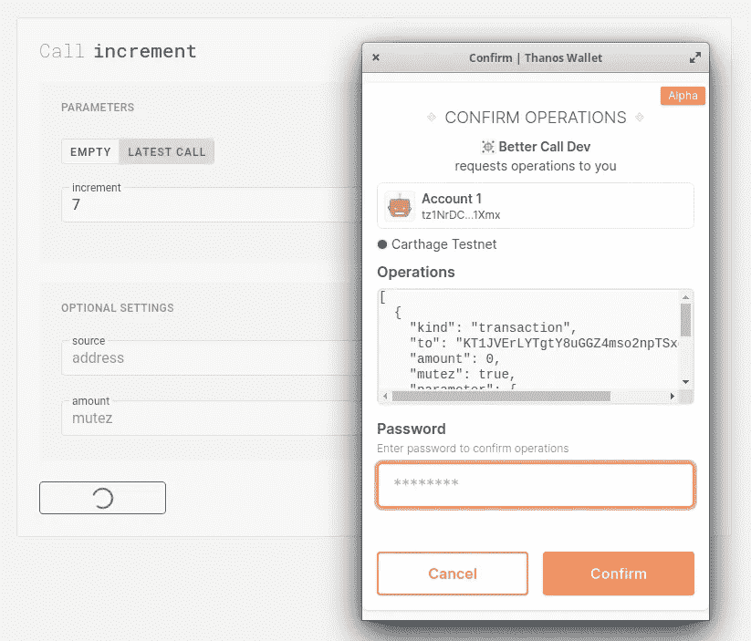
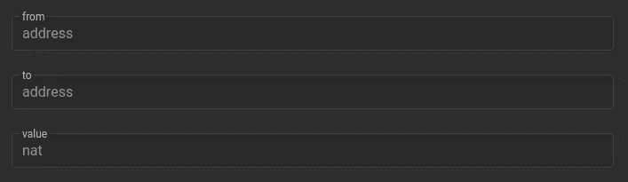
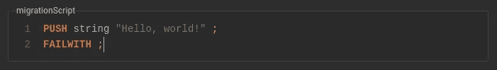
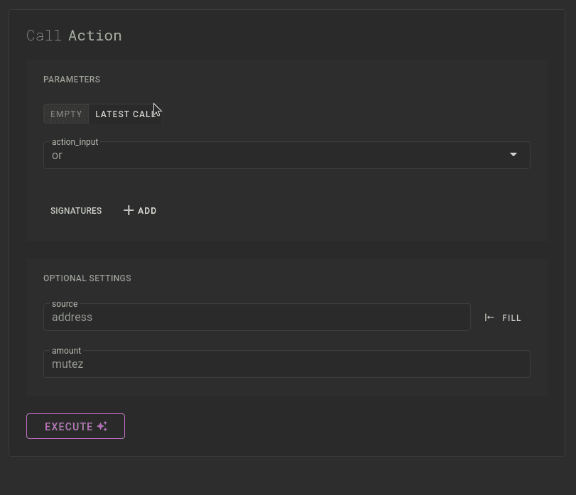
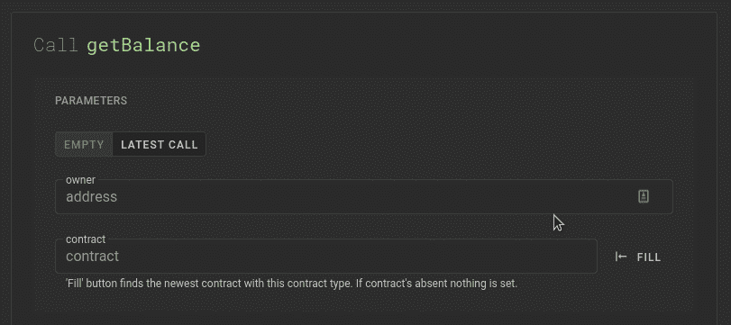
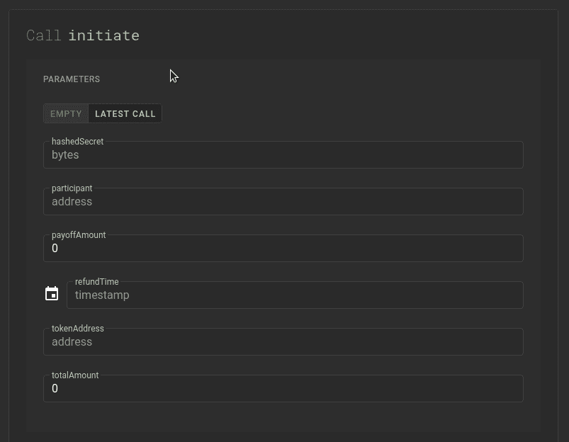
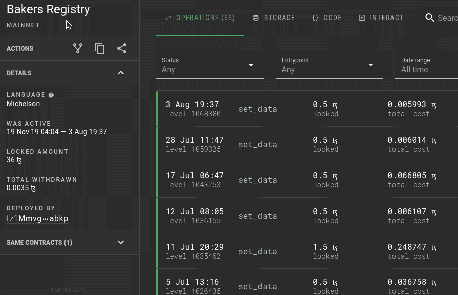
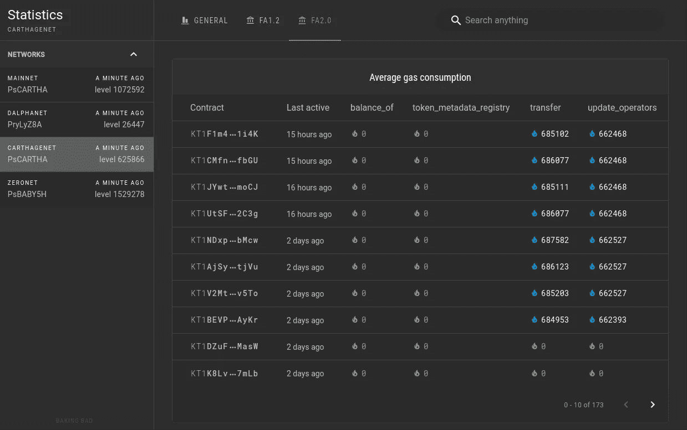
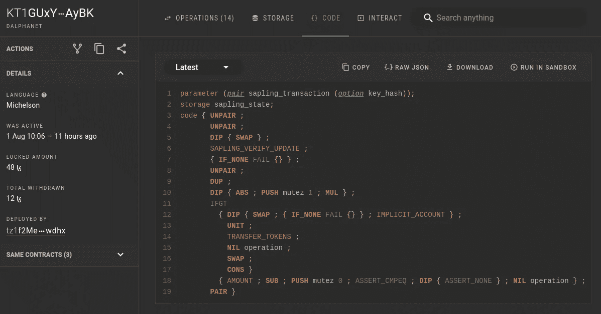

# tezos contract explorer Better Call Dev 现在支持 Dalphanet 和通过 Beacon 的高级合同交互

> 原文：<https://medium.com/coinmonks/tezos-contract-explorer-better-call-dev-now-supports-dalphanet-and-advanced-contract-interaction-a269c69998a7?source=collection_archive---------1----------------------->

昨天，我们发布了一个新版本的 BCD 浏览器，主要关注 Tezos 合同交互。

> ***简而言之***
> 
> 现在，你可以执行任意复杂程度的契约调用(嵌套类型、lambdas 等),并通过灭霸钱包或其他支持 Beacon 的扩展来执行它们，或者进行模拟，或者只是复制原始参数。
> 
> *除此之外，BCD 现在允许使用方便的存储编辑器克隆任何合同，并通过 Beacon 进行部署。*

# 灯塔和灭霸集成

多亏了 [Beacon SDK](https://www.walletbeacon.io/) 、[灭霸钱包](https://thanoswallet.com/)和 [Taquito 库](https://tezostaquito.io/)，Better Call Dev 已经成为任何合同的通用客户端。实际上，您可以使用在 BCD 的交互选项卡上构建的参数来注入操作。

这个功能在沙盒版本中并不完全可用，但我们会尽快修复。

# 交互形式改进

应用了多个样式修复和视觉改进，我们还修复了参数生成器中的几个错误。以下是最显著的变化。

**字段标签和占位符**
除了右侧边栏中的完整类型规范之外，当前还显示字段类型和名称。

**Lambda 表达式编辑器**
用纯迈克尔逊写 lambdas，或者粘贴一个编译 LIGO、SmartPy，或者其他高级语言代码的结果。

**嵌套类型结构**
目前在公共网络中发现的大多数情况都被正确处理，BCD 支持嵌套映射(big_maps)、列表、集合、选项。

**FA 回调地址**我们已经标记了所有适合 FA1.2/FA2 查看方法的合同，您可以通过按“填充”按钮粘贴随机合同。

**用最新的调用参数填充**
最后，用最新应用的事务的数据填充参数，然后编辑需要更改的字段，这要容易得多。

# 叉形按钮

该特征允许将任何合同复制到具有现有或定制存储的任何公共网络(很快是沙箱)。您可以复制生成的脚本或通过 Beacon/灭霸钱包部署合同。

# Tezos FA 令牌统计

一个社区要求的功能，允许通过气体消耗比较不同的 FA 标准实施。此外，这实际上是一个令牌合同的完整列表。

# 最小 Dalphanet 支持

我们确保新的测试网络索引正确，并且 BCD 已经可以用于调试。目前不支持与 Sapling 相关的任何内容，可能会在注入 *007* 协议后添加。

# API 端点的变化

对 API 设计进行了一些强制修改，如果您使用下面列出的端点，请注意。

> ***注***
> 
> `*/v1/tokens/{network}/{address}/transfers*` *端点为* ***已弃用*** *(虽然还能用)，请用* `*/v1/tokens/{network}/transfers/{address}*` *代替。*
> 
> `*/v1/tokens/{network}*` *响应体已更改，详情请参见* [*文档*](https://api.better-call.dev/v1/docs/index.html) *。*

# 我们在做什么

在下一个版本中，我们将展示我们自己的 Tezos DApp 列表/追踪器的第一个原型，具有扩展的使用统计和其他有趣的功能。
敬请期待！

*原载于 2020 年 8 月 6 日 https://baking-bad.org**[*。*](https://baking-bad.org/blog/2020/08/06/better-call-dev-tezos-explorer-supports-dalphanet-and-enables-contract-interaction-and-cloning/)*