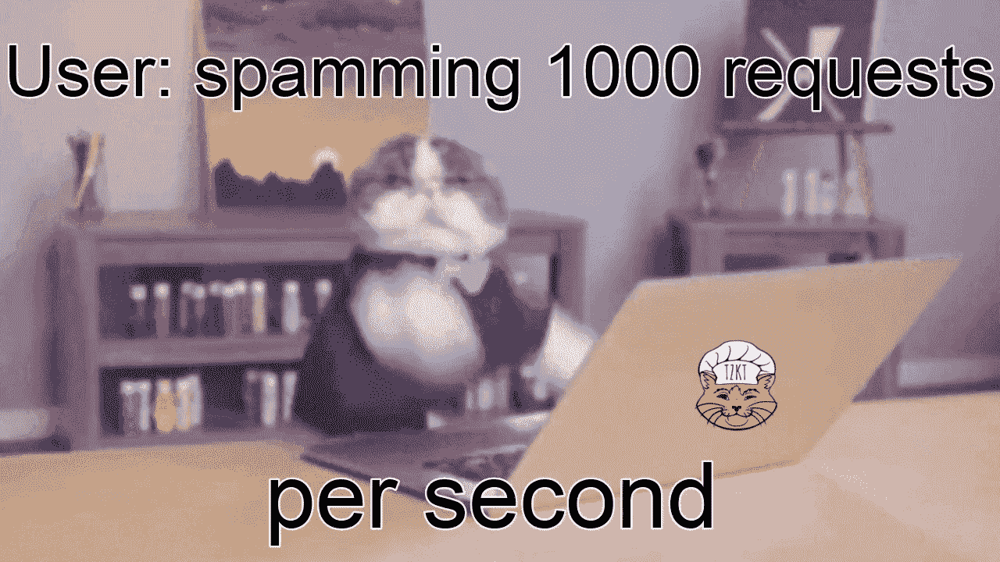

# Tezos Explorer API 最佳实践:#1 不要请求相同的区块链数据，直到它实际发生变化

> 原文：<https://medium.com/coinmonks/tezos-explorer-api-best-practices-1-dont-request-the-same-blockchain-data-until-it-actually-bf57b787ce59?source=collection_archive---------5----------------------->

Tezos 生态系统发展非常迅速。Tezos 基金会继续向开发者提供资助，最近宣布了第四批 Tezos 生态系统资助。祝贺所有获得资助的人！随着开发人员数量的增长，需求也在增长。其中之一与通过 API 从区块链获取数据有关。无论您是 Tezos wallet、explorer、exchange、baker、public delegation service 或任何 DApp 的开发人员，您都需要访问区块链的数据。

自从 [Tezos API TzKT](https://api.tzkt.io/) 的第一个版本发布以来，我们一直在不断地分析 API 的用法和各种行为模式。我们已经看到了好的和坏的模式，有时甚至是滥用的模式，这不仅给 API 带来了不必要的负载，而且使客户端应用程序非常低效。

因此，我们决定开始这一系列文章，分享使用 Tezos explorer API 的最佳实践，我们已经在所有项目中成功地使用了很长时间。

# 目录

*   ✅ [不请求相同的数据，直到它实际改变](https://baking-bad.org/blog/2020/07/29/tezos-explorer-api-tzkt-how-often-to-make-requests/#how-often-to-make-requests)
*   🔜只请求你真正需要的东西
*   🔜过滤 API 上的数据，而不是客户端上的数据
*   🔜小心使用分页

# 我需要多久发出一次 API 请求？

这是最重要的问题，不幸的是大多数用户也不知道正确的答案。

例如，让我们考虑一个简单的应用程序，它在帐户余额变化时发送通知。这个假设的例子实际上演示了一些人如何使用 TzKT Tezos API。

显然，这个例子效率极低，因为假设的作者不能正确回答数据应该多久被请求一次的问题。让我们试着修好它！

首先，我们需要了解 Tezos 区块链的数据多久更新一次。很明显，Tezos 区块链中的数据更新的频率并不比块创建的频率高。我们需要的所有信息(如账户交易或余额更新)只能在添加冻结后出现。

完全没有必要每秒请求一次数据，因为更新的数据不会早于新块出现。至少我们可以用更简单、更快速的 [/head](https://api.tzkt.io/v1/head) 请求替换 [/accounts/{address}](https://api.tzkt.io/v1/accounts/tz1NortRftucvAkD1J58L32EhSVrQEWJCEnB) 请求，并跟踪`level`字段以识别新块，当它被创建时，我们可以请求 [/accounts/{address}](https://api.tzkt.io/v1/accounts/tz1NortRftucvAkD1J58L32EhSVrQEWJCEnB) 端点。

然而，这也不是最有效的方法。如果我们记住块每分钟出现不超过一次(在 mainnet 上)，我们可以使我们的应用程序更加有效。在请求了 [/head](https://api.tzkt.io/v1/head) 端点之后，我们可以很容易地计算出下一个时间段的估计时间，只需给上一个时间段加上一分钟。新块之前肯定不会出现，在这个时间之前再要求 [/head](https://api.tzkt.io/v1/head) 是没有意义的。

因此，让我们像这样创建检查方法:

现在，我们可以使用这种方法作为一种限制器，以避免过多的请求和数据处理的过多迭代。

这样，我们的通知程序看起来就像这样:

如您所见，这个小小的改进帮助我们显著减少了 API 请求的数量，并节省了带宽和其他资源。

# Tezos 基于周期的数据

有时，我们只需要在新的周期到来时做一些事情，例如计算并发送上一个周期的 Tezos 赌注奖励。在这种情况下，我们可以使用类似的方法:

# 结论

因此，每次需要在循环中请求数据时，首先要了解数据更新的频率。没有理由在一分钟内请求一次以上的余额或账户交易，就像没有理由在每个周期内请求一次以上的未来奖励一样。

尝试在本地缓存关键数据，如最后一个块的时间或最后一个周期的编号，以了解何时希望在区块链中更新正确的数据，以及何时提出下一个请求。

# 下一步是什么？

这是“Tezos Explorer API 最佳实践”系列的第一篇文章。在下一篇文章中，我们将讨论 API 请求中的数据选择。

敬请期待！

*原载于 2020 年 7 月 29 日 https://baking-bad.org***。**

> *[*在您的收件箱中直接获得最佳软件交易*](https://coincodecap.com/?utm_source=coinmonks)*

**