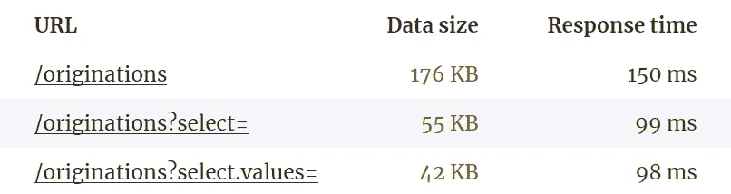
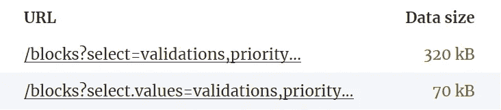
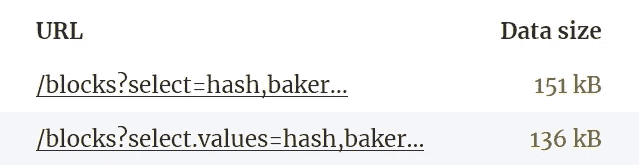

# Tezos Explorer API 最佳实践:#2 只请求您实际需要的东西

> 原文：<https://medium.com/coinmonks/tezos-explorer-api-best-practices-2-request-only-what-you-actually-need-5e265dbaba2b?source=collection_archive---------2----------------------->


在[的上一篇文章](https://baking-bad.org/blog/2020/07/29/tezos-explorer-api-tzkt-how-often-to-make-requests/)中，我们分析了如何根据块和周期之间的时间优化对 Tezos Explorer API 的请求频率，并展示了使用这一知识的最有效方法。

在本文中，我们将继续向您展示如何最大限度地利用 [TzKT，Tezos Explorer API](https://api.tzkt.io/) 。几乎每天都有新的面包师、钱包、DApps、交换者甚至各种探险家出现在 Tezos 生态系统中。在这一系列文章中，我们将尝试帮助开发者以更有效的方式使用 Tezos Explorer API，我们相信这将带来更好的用户体验。

# 目录

*   ✅ [不请求相同的数据，直到它实际发生变化](https://baking-bad.org/blog/2020/07/29/tezos-explorer-api-tzkt-how-often-to-make-requests/#how-often-do-i-need-to-make-api-requests)
*   ✅ [只要求你实际需要的东西](https://baking-bad.org/blog/2020/08/10/tezos-explorer-api-tzkt-request-only-what-you-need/#request-only-what-you-actually-need)
*   🔜过滤 API 上的数据，而不是客户端上的数据
*   🔜小心使用分页

# 只请求你真正需要的东西

默认情况下，API 返回包含最大数据集的对象，以覆盖尽可能多的案例并满足尽可能多的用户的需求。然而，对于每个特定的用户和每个特定的任务，大部分结果数据都是冗余的，因为它们根本没有被使用。这导致网络流量的低效使用，有时还会导致低效的响应时间。

为此，TzKT API 提供了使用查询参数`?select=`和`?select.values=`只请求所需数据的能力。

例如，我们希望获得快照级别。我们可以使用 [/cycles](https://api.tzkt.io/v1/cycles) 端点轻松地做到这一点。虽然，这个端点返回一个充满有用数据的对象数组:

```
[{
    "index": 7,
    "snapshotIndex": 9,
    "snapshotLevel": 2560,
    "randomSeed": "1bcd1d832aff2d72a8d16a9f9e5f994e177e29eac789138b019f0c4a30c4e5ec",
    "totalBakers": 52,
    "totalRolls": 19077,
    "totalStaking": 190989137117557,
    "totalDelegators": 312,
    "totalDelegated": 187846516221396
},{
    "index": 8,
    "snapshotIndex": 14,
    "snapshotLevel": 7936,
    "randomSeed": "4a38061cdab9818e0aa6e05e57fc65b5e80abc53618e82b9ab9a12bbf739c764",
    "totalBakers": 168,
    "totalRolls": 22422,
    "totalStaking": 224673132682556,
    "totalDelegators": 1169,
    "totalDelegated": 215276722522456
}]
```

然而，我们只需要`snapshotLevel`。因此，通过将查询参数`?select=snapshotLevel`附加到我们的请求 [/cycles？select=snapshotLevel](https://api.tzkt.io/v1/cycles?select=snapshotLevel) 我们将得到我们实际需要的东西:

```
[2560, 7936, 9728, 15872, 20480, 24576, ...]
```

这样好多了，不是吗？我们只收到了我们需要的东西。

在某些情况下，使用`?select=`查询参数有助于减少传输的数据量和响应时间，因为在请求数据库时`JOIN`操作的数量较少。

下面是数据选择如何影响性能的另一个很好的例子:



正如您所看到的，通过使用`?select=`查询参数，您可以获得显著的性能提升。

# 选择与选择值

正如我们上面已经提到的，TzKT API 允许以两种方式进行数据选择:`select`和`select.values`。现在让我们更详细地关注它们。

在这两种模式下，我们都需要指定一个逗号分隔的字段列表来包含在响应中。在`select`模式下，响应将被表示为常规 JSON 对象的列表。

> ***例题***
> 
> `*?select=address,balance*`*=>*

在`select.values`模式的情况下，响应将是值数组的数组。

> ***例题***
> 
> `*?select.values=address,balance*` *= >* `*[ [ "tz1abcd", 1000 ] ]*`

为了更好地理解这两种模式之间的区别，让我们再看几个例子



如你所见，数据中有巨大的差异。显然，有时这种差异并不显著:



这主要取决于字段名的长度和字段中包含的数据量，因此在每种特定情况下，最好估计数据量，并在此基础上在易用性和响应时间之间做出选择。

> **注*注*注**
> 
> *如果选择单字段，在* `*.fields*` *和* `*.values*` *两种模式下，响应都将是一个值数组。*

# 结论

在本文中，我们演示了如何使用`?select`和`?select.values`参数来显著减少网络流量并提高应用程序的性能。如果您在 Tezos API 中遗漏了什么，请[联系我们](https://baking-bad.org/docs/#contacts)，我们将尽最大努力帮助您！

# 下一步是什么？

这是“Tezos Explorer API 最佳实践”系列的第二篇文章。在下一篇文章中，我们将讨论 API 请求中的数据过滤。

干杯！

*原载于 2020 年 8 月 10 日*[*【https://baking-bad.org】*](https://baking-bad.org/blog/2020/08/10/tezos-explorer-api-tzkt-request-only-what-you-need/)*。*

> [直接在您的收件箱中获得最佳软件交易](https://coincodecap.com?utm_source=coinmonks)

[](https://coincodecap.com?utm_source=coinmonks)