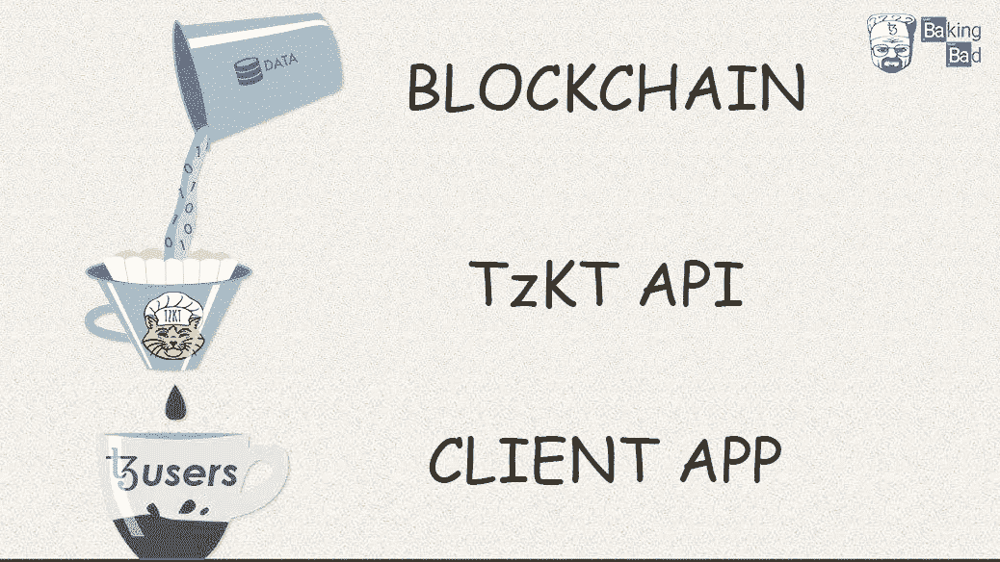

# Tezos Explorer API 最佳实践:#3 在 API 上过滤数据，而不是在客户端

> 原文：<https://medium.com/coinmonks/tezos-explorer-api-best-practices-3-filter-data-on-the-api-not-on-the-client-991e5c9e2d4a?source=collection_archive---------7----------------------->

在[之前的文章](https://baking-bad.org/blog/2020/08/10/tezos-explorer-api-tzkt-request-only-what-you-need/)中，我们发现了`select`参数如何显著减少传输的数据量和响应时间。

在本文中，我们将解释如何通过在对 [Tezos Explorer TzKT API](https://api.tzkt.io) 的请求查询中使用数据过滤来显著提高性能，并简化应用程序的逻辑。开发什么样的应用程序并不重要。它可以是一个简单的面包师仪表板，一个钱包，甚至是一个交换。如果使用请求级过滤，则依赖于 TzKT API 逻辑，这大大降低了出错的风险。

# 目录

*   ✅ [不要请求相同的数据，直到它实际发生变化](https://baking-bad.org/blog/2020/07/29/tezos-explorer-api-tzkt-how-often-to-make-requests/#how-often-do-i-need-to-make-api-requests)
*   ✅ [只要求你实际需要的东西](https://baking-bad.org/blog/2020/08/10/tezos-explorer-api-tzkt-request-only-what-you-need/)
*   ✅ [在 API 上过滤数据，而不是在客户端](https://baking-bad.org/blog/2020/09/28/tezos-explorer-api-tzkt-filter-data-on-the-api/#filter-data-on-the-api-not-on-the-client)
*   🔜小心使用分页

# 在 Tezos API 上过滤数据，而不是在客户端

每次我们从 Tezos API 请求一组数据时，我们实际上需要数据中非常具体的一小部分。让我们看一个简单的例子，当我们只需要一个委托人的奖励支付交易的特定周期。我们可以简单地获取所有传入的事务，不幸的是，很多人都这样做:`[/operations/transactions?target={address}&limit=10000](https://api.tzkt.io/v1/operations/transactions?target=tz1LWGsr1PvafwecGd3Ha2wXRsxRB5n5qkH8&limit=10000)`

> ***注***
> 
> *如果您在应用程序中使用*`*limit=10000*`*(TzKT API 的当前最大值)，很可能您的应用程序需要优化。*

我们有 117 笔交易。那绝对不是我们要找的。让我们优化它！

先排除`failed`、`backtracked`、`skipped`交易，只留下`applied` : `[...&status=applied](https://api.tzkt.io/v1/operations/transactions?status=applied&target=tz1LWGsr1PvafwecGd3Ha2wXRsxRB5n5qkH8&limit=10000)`

我们有 113 笔交易，稍微好一点，但仍然不够。

显然，在绝大多数情况下，我们只需要调查特定的一段时间。通常只对前一个 Tezos 块或周期进行选择就足够了。在我们的例子中，我们只需要一个周期交易`[...&level.ge={cycleStart}&level.lt={nextCycleStart}](https://api.tzkt.io/v1/operations/transactions?status=applied&target=tz1LWGsr1PvafwecGd3Ha2wXRsxRB5n5qkH8&level.ge=819201&level.lt=823297)`

> ***注***
> 
> *如您所见，TzKT Tezos API 允许您指定各种参数模式，如* `*.gt*` *(大于)、* `*.ge*` *(大于或等于)、* `*.lt*` *(小于)和* `*.le*` *(小于或等于)，以进行更精确的过滤。*

哈！就 3 笔交易！似乎这就是我们一直在寻找的东西！

我们现在需要认识到的是，奖励支出有特定的金额，大约是其平均值(在我们的示例中，在 0.1 tez 和 1 tez 之间)，因此我们可以通过`amount`字段`[...&amount.gt=100000&amount.le=1000000](https://api.tzkt.io/v1/operations/transactions?status=applied&target=tz1LWGsr1PvafwecGd3Ha2wXRsxRB5n5qkH8&level.ge=819201&level.lt=823297&amount.gt=100000&amount.le=1000000)`过滤掉不需要的交易

> **注*注*注**
> 
> *请注意，TzKT API 中的所有数量均以 microtez* 为单位

现在我们只看到一个交易。

最后，让我们使用我们从[上一篇文章](https://baking-bad.org/blog/2020/08/10/tezos-explorer-api-tzkt-request-only-what-you-need/)中学到的知识，并添加`?select`来获得我们真正需要的字段:`[...&select=timestamp,sender,amount,bakerFee](https://api.tzkt.io/v1/operations/transactions?status=applied&target=tz1LWGsr1PvafwecGd3Ha2wXRsxRB5n5qkH8&level.ge=819201&level.lt=823297&amount.gt=100000&amount.le=1000000&select=timestamp,sender,amount,bakerFee)`

最后，我们不仅显著节省了数据量(在我们的例子中为 16 KB，而在我们的例子中为 294 B)和响应速度(在我们的例子中为 180 ms，而在我们的例子中为 51 ms)，而且我们还显著简化了应用程序逻辑，并成功地将数据过滤委托给了 API。

> ***注***
> 
> *如果您的应用需要通过某些特定的参数进行过滤，而这些参数尚未实现，* [*只需联系我们*](https://baking-bad.org/docs/#contacts) *，我们将尽力满足您的需求！*

# 高级请求过滤

这就是我们想要展示的开始！TzKT API 为数据过滤提供了更多的选项。让我们再深入一点。

# 基本模式

除了上面描述的`.gt`、`.ge`、`.lt`和`.le`基本模式外，还有`.eq`和`.ne`模式，假设我们需要所有不成功的操作。为此，我们可以使用**不等于**的过滤模式`param.ne=123`。它帮助我们排除所有具有特定值的实体。我们的请求看起来像`[..status.ne=applied](https://api.tzkt.io/v1/operations/transactions?target=KT1NE2NeoCD2raoc88TpamNFYL5cmmZG5w7D&status.ne=applied)`

> **注*注*注**
> 
> ****不等于*** *过滤模式对数值和字符串值都适用。**

# *按列表过滤*

*有时我们需要通过允许值的列表来过滤数据(例如钱包的地址列表)，我们可以使用列表 `param.in=12,34,56`中的**和列表** `param.ni=12,34,56`中没有的**选项，通过一个请求:`[/transactions?sender.in={firstAddress},{secondAddress}](https://api.tzkt.io/v1/operations/transactions?sender.in=tz1Zrqm4TkJwqTxm5TiyVFh6taXG4Wrq7tko,KT1RCAETpkm9z44MW7Cph3mrWshqVURPubT4)`获得所有需要的数据***

# *按其他字段筛选*

*此外，我们可能需要根据数据的“性质”而不是特定的值来过滤数据。比如，如果我们想获得面包师注册/重新激活的所有操作呢？换句话说，我们需要得到 Tezos 委托操作，其中`sender`字段等于`newDelegate`字段。在这种情况下，我们可以使用**等于另一个字段** `param1.eqx=param2`和**不等于另一个字段** `param1.nex=param2`过滤模式:`[/delegations?newDelegate.eqx=sender](https://api.tzkt.io/v1/operations/delegations?newDelegate.eqx=sender)`。另一个例子是请求所有循环传输:`[/transactions?sender.eqx=receiver](https://api.tzkt.io/v1/operations/transactions?sender.eqx=receiver)`。*

# *检查空值*

*如果合适，请在您的请求中使用`null`检查参数。让我们考虑我们只需要委托取消操作:`[/delegations?prevDelegate.null=false&newDelegate.null=true](https://api.tzkt.io/v1/operations/delegations?prevDelegate.null=false&newDelegate.null)`*

> ***注*注*注***
> 
> *`*&newDelegate.null=true*` *可简化/简称为* `*&newDelegate.null*` *，不带* `*=true*` *。**

# *通配符模式匹配*

*TzKT API 允许您对事务参数使用通配符模式匹配。当您需要过滤智能合约呼叫时，这很有帮助。例如，如果我们需要获得一个特定令牌的传输，那么`.as`通配符模式匹配就能派上用场:`[/transactions?...parameters.as=*"entrypoint":"transfer"*](https://api.tzkt.io/v1/operations/transactions?target=KT1PWx2mnDueood7fEmfbBDKx1D9BAnnXitn&parameters.as=*%22entrypoint%22:%22transfer%22*)`。*

> ****注****
> 
> **当然我们可以反求由对面的* ***不同于*** *过滤模式* `*.un*` *:* `[*...parameters.un=*"entrypoint":"transfer"**](https://api.tzkt.io/v1/operations/transactions?target=KT1PWx2mnDueood7fEmfbBDKx1D9BAnnXitn&parameters.un=*%22entrypoint%22:%22transfer%22*)`*

# *处理批处理和内部 Tezos 操作*

*往往根本不需要过滤，只需要通过它的 hash 就可以得到我们需要的操作:`[/operations/{hash}](https://api.tzkt.io/v1/operations/opK5rnDgd4ipyeS3JnFrENMpeu7xY44AMcke9u9GDku7Udt8sYd)`*

*如果是批量操作，当您只需要一个`[/operations/{hash}/{counter}](https://api.tzkt.io/v1/operations/opGh86jKg2za9JyfsppmmLMgY1yj2Cu5DyBWZVLfkFwBwVUXGnD/188201)`时，您可以使用批量中特定操作的`counter`来避免请求所有操作*

*如果操作包含内部操作，可以通过其`counter`和`nonce` : `[/operations/{hash}/{counter}/{nonce}](https://api.tzkt.io/v1/operations/opK5rnDgd4ipyeS3JnFrENMpeu7xY44AMcke9u9GDku7Udt8sYd/3/0)`得到内部操作*

# *结论*

*综上所述，我们想说的是，API 端的数据过滤有很多不可否认的优势，比如减少了客户端应用的负载，由于数据量更小，下载速度明显更快。如果您能使用 TzKT API 的最大功能，我们将非常高兴，因为这是它的初衷。*

# *下一步是什么？*

*这是“Tezos Explorer API 最佳实践”系列的第三篇文章。在下一篇文章中，我们将讨论 API 请求中的分页。*

*干杯！*

**原载于 2020 年 9 月 28 日*[*【https://baking-bad.org】*](https://baking-bad.org/blog/2020/09/28/tezos-explorer-api-tzkt-filter-data-on-the-api/)*。**

## *另外，阅读*

*   *最好的[密码交易机器人](/coinmonks/crypto-trading-bot-c2ffce8acb2a)*
*   *[密码本交易平台](/coinmonks/top-10-crypto-copy-trading-platforms-for-beginners-d0c37c7d698c)*
*   *最好的[加密税务软件](/coinmonks/best-crypto-tax-tool-for-my-money-72d4b430816b)*
*   *[最佳加密交易平台](/coinmonks/the-best-crypto-trading-platforms-in-2020-the-definitive-guide-updated-c72f8b874555)*
*   *最佳[加密借贷平台](/coinmonks/top-5-crypto-lending-platforms-in-2020-that-you-need-to-know-a1b675cec3fa)*
*   *[最佳区块链分析工具](https://bitquery.io/blog/best-blockchain-analysis-tools-and-software)*
*   *加密套利指南:新手如何赚钱*
*   *最佳[加密制图工具](/coinmonks/what-are-the-best-charting-platforms-for-cryptocurrency-trading-85aade584d80)*
*   *[莱杰 vs 特雷佐](/coinmonks/ledger-vs-trezor-best-hardware-wallet-to-secure-cryptocurrency-22c7a3fd391e)*
*   *了解比特币的[最佳书籍有哪些？](/coinmonks/what-are-the-best-books-to-learn-bitcoin-409aeb9aff4b)*
*   *[3 商业评论](/coinmonks/3commas-review-an-excellent-crypto-trading-bot-2020-1313a58bec92)*
*   *[AAX 交易所评论](/coinmonks/aax-exchange-review-2021-67c5ea09330c) |推荐代码、交易费用、利弊*
*   *[Deribit 审查](/coinmonks/deribit-review-options-fees-apis-and-testnet-2ca16c4bbdb2) |选项、费用、API 和 Testnet*
*   *[FTX 密码交易所评论](/coinmonks/ftx-crypto-exchange-review-53664ac1198f)*
*   *[n 零审核](/coinmonks/ngrave-zero-review-c465cf8307fc)*
*   *[Bybit 交换审查](/coinmonks/bybit-exchange-review-dbd570019b71)*
*   *[3Commas vs Cryptohopper](/coinmonks/cryptohopper-vs-3commas-vs-shrimpy-a2c16095b8fe)*
*   *最好的比特币[硬件钱包](/coinmonks/the-best-cryptocurrency-hardware-wallets-of-2020-e28b1c124069?source=friends_link&sk=324dd9ff8556ab578d71e7ad7658ad7c)*
*   *最佳 [monero 钱包](https://blog.coincodecap.com/best-monero-wallets)*
*   *[莱杰 nano s vs x](https://blog.coincodecap.com/ledger-nano-s-vs-x)*
*   *[Bitsgap vs 3 commas vs quad ency](https://blog.coincodecap.com/bitsgap-3commas-quadency)*
*   *[莱杰 Nano S vs 特雷佐 one vs 特雷佐 T vs 莱杰 Nano X](https://blog.coincodecap.com/ledger-nano-s-vs-trezor-one-ledger-nano-x-trezor-t)*
*   *[block fi vs Celsius](/coinmonks/blockfi-vs-celsius-vs-hodlnaut-8a1cc8c26630)vs Hodlnaut*
*   *[bits gap review](/coinmonks/bitsgap-review-a-crypto-trading-bot-that-makes-easy-money-a5d88a336df2)——一个轻松赚钱的加密交易机器人*
*   *为专业人士设计的加密交易机器人*
*   *[PrimeXBT 审查](/coinmonks/primexbt-review-88e0815be858) |杠杆交易、费用和交易*
*   *[埃利帕尔泰坦评论](/coinmonks/ellipal-titan-review-85e9071dd029)*
*   *[SecuX Stone 评论](https://blog.coincodecap.com/secux-stone-hardware-wallet-review)*
*   *区块链评论 |从你的密码中赚取高达 8.6%的利息*