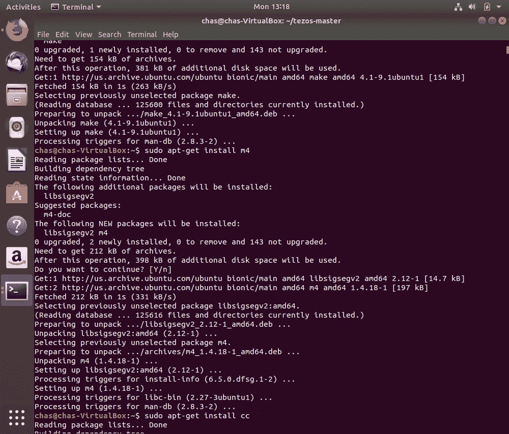
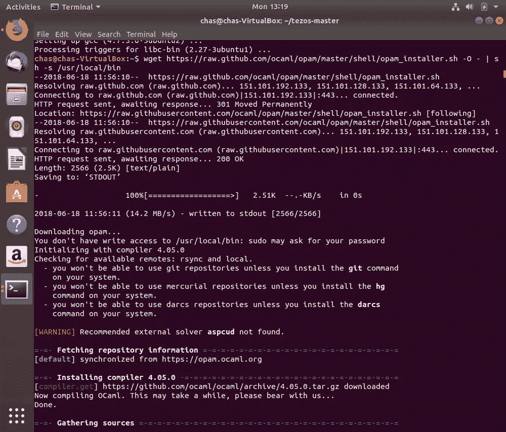
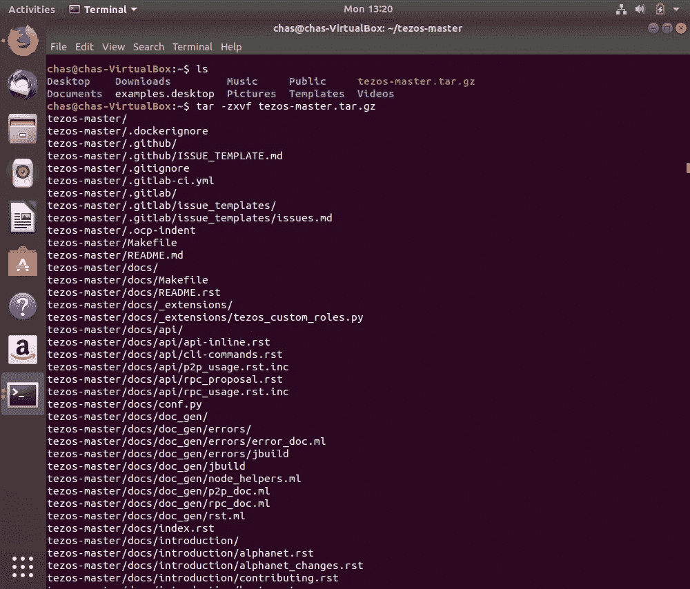
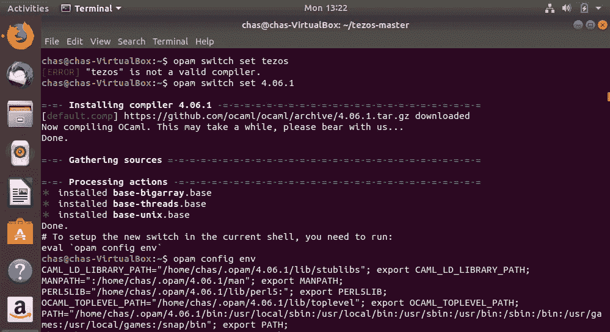
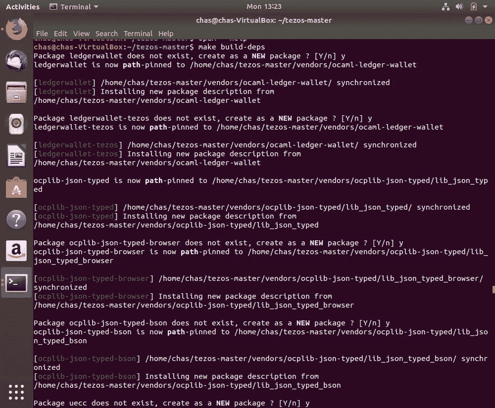
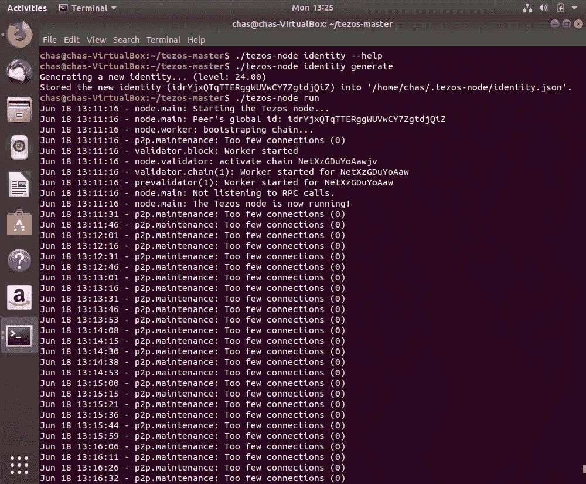

# Tezos 安装指南

> 原文：<https://medium.com/coinmonks/tezos-installation-guide-8175b3f0b748?source=collection_archive---------2----------------------->

这是一个在全新安装的 [Ubuntu](https://www.ubuntu.com/download/desktop) 18.04 上编译和安装 [Tezos](https://gitlab.com/tezos/tezos/) 的分步指南。我使用[虚拟盒子](https://www.virtualbox.org/)在我的 Windows PC 上安装 Ubuntu，如本指南[所述](https://linus.nci.nih.gov/bdge/installUbuntu.html)。

本指南可能适用于许多版本的 Linux，但我只能保证它能在我使用的相同环境中工作。我了解到的一件事是，区块链相当大，所以你需要为机器分配大量的硬盘空间。

> [发现并回顾最佳区块链软件](https://coincodecap.com)

我不是专家。我只想分享对我有效的方法。如果你有问题，请评论，我会尽我所能帮助你。如果没有，也许其他人会对解决方案进行评论。

在本文中，Tezos 首席开发人员[建议，一旦网络处于活动状态，您的系统至少要为一个节点准备 8GB 的 RAM。目前还不知道其他推荐的规格。](/tezos/its-a-baker-s-life-for-me-c214971201e1)

# 指南

启动 Ubuntu 后打开一个终端，输入斜体的命令。

我改进了一些指令，所以截图并不总是与命令完全匹配。使用斜体的命令。

**步骤 1 —更新并安装依赖关系**

```
*sudo apt-get update**sudo apt-get upgrade**sudo apt-get install make m4 gcc aspcud curl bubblewrap**sudo apt-get install ocaml opam**sudo apt-get install -qq -yy libgmp-dev libhidapi-dev pkg-config*
```



**步骤 2 —安装最新的 OPAM 编译器**

```
*wget https://raw.github.com/ocaml/opam/master/shell/opam_installer.sh -O — | sh -s /usr/local/bin*sh <(curl -sL [](https://raw.githubusercontent.com/ocaml/opam/master/shell/install.sh)) [https://raw.githubusercontent.com/ocaml/opam/master/shell/install.sh](https://raw.githubusercontent.com/ocaml/opam/master/shell/install.sh)[)](https://raw.githubusercontent.com/ocaml/opam/master/shell/install.sh))
```



**第 3 步——下载并解压缩最新的 Tezos 软件，然后导航至该文件夹。**

```
*wget https://gitlab.com/tezos/tezos/-/archive/betanet/tezos-betanet.tar.gz**tar -zxvf tezos-betanet.tar.gz**cd tezos-betanet*
```



**步骤 4 —更新 OPAM 并切换到最新的 OPAM 编译器**

```
*opam init**opam update**opam switch create 4.06.1**opam switch set 4.06.1**eval $(opam config env)*
```



**步骤 5——安装 Tezos**

```
*make build-deps**make*
```



**步骤 6 —设置并运行您的 Tezos 节点**

```
*./tezos-node identity generate**./tezos-node config init**./tezos-node config update --rpc-addr=127.0.0.1:8732**./tezos-node run*
```



…就是这样！你有一个正在运行的 Tezos 节点。您现在可以打开一个新的终端来与您的节点进行交互。

你可以用

```
*./tezos-node config update --peer=IPADDR:PORT* 
```

向引导数据库添加对等项。http://tzscan.io/network 有一份活跃的同事名单可供选择。

更多信息请见 http://doc.tzalpha.net/index.html。