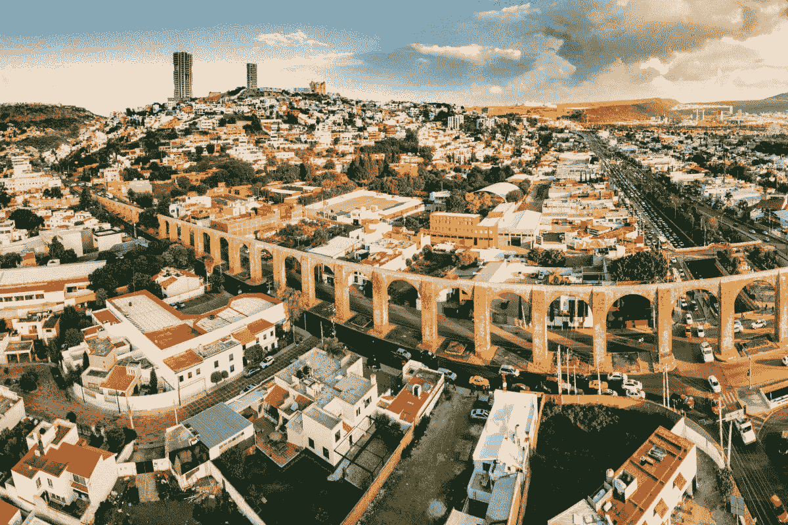
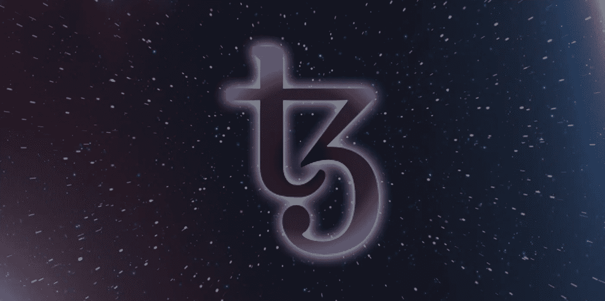
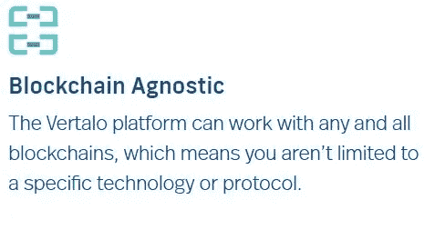

# Tezos 成功地将中美洲和沙特阿拉伯的房地产纳入区块链

> 原文：<https://medium.com/coinmonks/tezos-successfully-incorporates-south-american-and-saudi-arabian-real-estate-to-the-blockchain-4e1c92fdf6a5?source=collection_archive---------0----------------------->

Queretaro, Mexico — the location of 2 new digital real estate assets built on the Tezos Blockchain

***作者注——****我在本文中多次引用了“*[*【Tezos】*](https://tezos.com/)*”包括标题。这些参考是指 Tezos 生态系统以及在 Tezos 基础上构建有用东西的公司、组织和个人。泰佐斯，像所有其他区块链一样，不是一个中央实体——而是一个分散的联邦，对于那些选择利用它的人来说。像往常一样，这些内容应该只作为教育新闻使用，而不是金融建议。我与 Tezos、Aqarchain、MountX、Vertalo 或我在下面的内容中提到的许多其他链接没有赞助或直接联系。一如既往，我将尽我所能，从一个热爱创新技术的人的中立角度来探讨这个话题。*

# 介绍

本月早些时候，Tezos 生态系统实现了一些巨大的里程碑——在某种程度上被比特币的统治地位和价格行为所掩盖。让我们了解一下在过去的几周里有哪些重大而令人兴奋的更新。

当以太坊的气体正在通过屋顶时，Tezos 正在先人一步思考，并做出巨大的改变以消除未来的问题。正如 [Decrypt](https://decrypt.co/48019/tezos-delphi-upgrade-slashes-gas-costs-by-75?utm_source=twitter&utm_medium=social&utm_campaign=auto) 在最近的一篇文章中总结的那样，Tezos 最近通过链上治理进行的升级将智能合同的天然气消耗减少了大约 75%！如果你有机会与智能合同互动，你会知道气体效率是当前进入适当可扩展性的障碍之一。从长远来看，极高的天然气费用是不可持续的。区块链上的每一次互动都需要流畅，每个人都可以接触到。这意味着*低气费*。

在这篇文章中，我不打算关注 Delphi 的所有技术细节，但是我知道 Tezos 完全按照它应该的那样运行。链上治理，根据需要进行逻辑改进。如果你想了解更多关于 Delphi 的事情，我推荐你在这里阅读。游牧实验室做了出色的工作，从技术角度为感兴趣的人总结了更新。

从很高的层面来说，这些升级将使 Tezos 更适合 Defi 应用。以下是游牧实验室的一些重要经验:

*   一个块现在可以包括 3.5 倍更简单的 tz *到 tz* 操作
*   一个块现在可以包括 4 倍多的 FA2 转移
*   一个合同可能执行 10 倍以上的内部调用

除了通过最近对 [Delphi](https://forum.tezosagora.org/t/delphi-upgrade/2395) 的升级做出巨大的技术改进之外，Tezos 区块链本月还通过令牌化的房地产看到了成功的真实世界用例。让我们回顾一下最近的两个例子。

# MountX & Vertalo 利用 Tezos 区块链首次对墨西哥的房地产进行了令牌化

[在这个例子](https://www.mountx.io/post/mountx-vertalo-choose-tezos-for-first-ever-tokenization-of-real-estate-in-mexico)中，我们看到两家独特的公司并肩合作，将房地产带到区块链。MountX 是一个新的房地产资本投资平台，希望以独特的方式进入市场。你可以在这里阅读更多关于他们[的信息。这个新的组织与 Vertalo 一起工作，完成了墨西哥克雷塔罗的两套公寓。这相当于大约 250，000 美元的房地产转化为区块链元数据。这些公司计划在今年剩余时间和 2021 年将墨西哥和加拿大的许多其他房地产资产令牌化。](https://www.mountx.io/quienes-somos-mountx-real-estate)

根据 MountX 发布的新闻稿，这一新系统的一些优势包括:

> 通过三重簿记访问链上股东登记册
> 
> API 与经纪自营商的连接
> 
> 数字保管人
> 
> KYC/反洗钱投资者验证流程的可移植资格
> 
> 通过合作伙伴 ATS 的二级流动性，以及通过 Vertalo 的无钥匙保管区块链钱包。

假设这些公寓被标记为 FA1.2 标记，我联系了 Vertalo 以获得更多关于这个主题的信息来确认技术规格。我通过 [Twitter](https://twitter.com/Vertalo_) 收到了以下回复。

*“不，我们将它们标记为 Vertalo VTokens，这是我们在 Tezos Mainnet 上线和 F1/2x 之前开发的跨链标准”*

**Source- Vertalo.com**

Vertalo VTokens 似乎是区块链不可知论者，但目前正专注于 Tezos 生态系统。这向我表明，维尔塔洛既致力于将不同的区块链生态系统联系在一起，同时也对是什么让特佐斯如此特别有眼光。

# Aqarchain 在沙特阿拉伯的 Tezos 上推出数字房地产平台

根据 Aqarchain 的[白皮书](http://aqarchain.io/wp-content/uploads/2019/04/Aqar-Chain-White-Paper-V2-min.pdf)，Aqarchain 是一家专注于实现数字化房地产解决方案的技术驱动型公司。该公司在沙特阿拉伯有 32 年的家族房地产业务背景。他们的白皮书涵盖了一切，从他们的目标，到他们的解决方案，再到他们对房地产未来的愿景。如果你想了解更多关于 Aqarchain 正在做的事情，他们的白皮书很可能是你开始研究的最好地方。

根据[来自未来科技杂志](https://futuretechmag.com/aqarchain-launches-real-estate-platform-on-tezos-blockchain/)的新闻稿，Aqarchain 的 Haitham AlHammadi 表示——“*Tezos 平台的就绪性和易用性，以及其强大的安全标准，为我们提供了基础设施和适应我们业务模式的能力。Tezos 最近还获得了 shariah 合规证书，使我们能够向投资者提供 100%符合 shariah 的投资选择。这将有助于我们扩大投资者范围”。*

Shariah compliant 本质上可归结为符合 Shariah/伊斯兰法律的业务。说白了——建在泰佐斯区块链上的 Aqarchain 房地产平台在沙特境内的居住管辖区内是完全合法的。这对该地区的正当合法发展至关重要。

# 结论

看到房地产在两个非常不同的地方成功地获得合法令牌，我对智能合同平台的未来采用持乐观态度。去年，美国商业房地产的总规模估计在 14-17 万亿美元之间。这是一个巨大的、尚未开发的技术进步市场。另一边见。

# 想了解更多？

想了解更多关于 Tezos 的信息？Tezos 是以治理为核心的区块链。Tezos 用户可以参与治理结构，并为协议的未来投票。明天将会有一个 Tezos 市政厅，届时将会有许多 Tezos 社区中最有影响力的人物出席。你可以在这里免费报名参加[。](https://hopin.com/events/session-18-tezos-town-hall-the-next-amendment-proposal?utm_source=twitter&utm_medium=social&utm_campaign=20201118&utm_content=register5)

*“根据您的问题，本次有节制的对话将提供关于 Tezos 治理流程的信息，包括即将到来的修订提案的途径、这些改进将如何帮助 Tezos 生态系统向前发展，以及社区团队推出更多定期更新提案的更新计划。”— TQuorum*

# **资源和链接**

 [## Delphi 升级

### 这是游牧实验室、Metastate 和 Marigold 的联合帖子。我们非常高兴地宣布对…的投票

forum.tezosagora.org](https://forum.tezosagora.org/t/delphi-upgrade/2395)  [## Tezos“德尔福”升级削减 75%的天然气成本-解密

### 简而言之，Tezos 区块链公司成功实施了“德尔福”升级。升级减少了汽油…

decrypt.co](https://decrypt.co/48019/tezos-delphi-upgrade-slashes-gas-costs-by-75?utm_source=twitter&utm_medium=social&utm_campaign=auto)  [## MountX & Vertalo 选择 Tezos 进行首次墨西哥房地产令牌化

### MountX 首席执行官通过在 YouTube 上实时标记两处墨西哥房地产展示了易用性

www.mountx.io](https://www.mountx.io/post/mountx-vertalo-choose-tezos-for-first-ever-tokenization-of-real-estate-in-mexico)  [## Aqarchain 在 Tezos 区块链上推出房地产平台

### Aqarchain 宣布，它正在 Tezos 区块链建立一个房地产投资平台，以发行和管理…

t.co](https://t.co/ZywoMUaoPZ?amp=1)  [## 德尔福:官方发布

### 我们很高兴地宣布，我们已经编制了一个 Tezos 协议提案，我们称之为“德尔福”，哈希…

blog.nomadic-labs.com](https://blog.nomadic-labs.com/delphi-official-release.html)  [## 美国商业房地产的总规模估计在 14 到 17 万亿美元之间

### Nareit 完成了对美国商业地产规模的第三轮年度评估，发现美国商业地产的总规模

www.reit.com](https://www.reit.com/news/blog/market-commentary/total-size-us-commercial-real-estate-estimated-between-14-and-17)  [## Vertalo |数字资产管理平台|数字证券、安全令牌、股票…

### 糟糕的用户体验和技术平台之间的碎片化阻碍了私人资产市场。韦尔塔洛…

www.vertalo.com](https://www.vertalo.com/) 

我希望这篇文章是信息性的、教育性的，并能启发你用不同的眼光看待这个世界。如果你觉得它有用——一定要在[推特](https://twitter.com/onelemononelime)上点赞或转发这篇文章。

如果您愿意支持我，您可以使用下面我的推荐链接之一在交易所购买加密货币，在利息账户中保存加密货币或购买硬件钱包，以在冷存储中离线保护您的加密。我的目标是写一些内容，让世界各地的人们了解激动人心的全新技术。你的支持让我以后可以写更多的文章。

> [***Blockfi***](https://blockfi.com/?ref=426c0778)
> 
> *这项服务允许你保存比特币，并获得以太坊的利息，这是一个非常神奇但未被充分认识的功能*
> 
> [***摄氏度网络***](https://celsiusnetwork.app.link/1277423ac3)
> 
> *保存您的加密货币，并从您存入的相同抵押品中获得利息*
> 
> 
> 
> **买卖加密货币——这是你首次接触比特币或以太网最简单、最安全的方式之一**
> 
> ****总账****
> 
> **使用支持蓝牙的硬件钱包保护您的加密货币**

## *另外，阅读*

*   *最好的[密码交易机器人](/coinmonks/crypto-trading-bot-c2ffce8acb2a)*
*   *[Deribit 审查](/coinmonks/deribit-review-options-fees-apis-and-testnet-2ca16c4bbdb2) |选项、费用、API 和 Testnet*
*   *[FTX 密码交易所评论](/coinmonks/ftx-crypto-exchange-review-53664ac1198f)*
*   *最好的比特币[硬件钱包](/coinmonks/the-best-cryptocurrency-hardware-wallets-of-2020-e28b1c124069?source=friends_link&sk=324dd9ff8556ab578d71e7ad7658ad7c)*
*   *[密码本交易平台](/coinmonks/top-10-crypto-copy-trading-platforms-for-beginners-d0c37c7d698c)*
*   *最好的[加密税务软件](/coinmonks/best-crypto-tax-tool-for-my-money-72d4b430816b)*
*   *[最佳加密交易平台](/coinmonks/the-best-crypto-trading-platforms-in-2020-the-definitive-guide-updated-c72f8b874555)*
*   *最佳[加密贷款平台](/coinmonks/top-5-crypto-lending-platforms-in-2020-that-you-need-to-know-a1b675cec3fa)*
*   *[block fi vs Celsius](/coinmonks/blockfi-vs-celsius-vs-hodlnaut-8a1cc8c26630)vs Hodlnaut*
*   *[莱杰 vs 特雷佐](/coinmonks/ledger-vs-trezor-best-hardware-wallet-to-secure-cryptocurrency-22c7a3fd391e)*
*   *Bitsgap 评论——一个轻松赚钱的加密交易机器人*
*   *为专业人士设计的加密交易机器人*
*   *[3commas Review](https://blog.coincodecap.com/3commas-review-an-excellent-crypto-trading-bot) |一款优秀的密码交易机器人*
*   *[PrimeXBT 审查](/coinmonks/primexbt-review-88e0815be858) |杠杆交易、费用和交易*
*   *Bitmex 上的[保证金交易的白痴指南](/coinmonks/the-idiots-guide-to-margin-trading-on-bitmex-dbbd7742c6fc?source=friends_link&sk=7bfa99d2a181142510c8442c8ddb0786)*
*   *加密摇摆交易的权威指南*
*   *[Bitmex 高级保证金交易指南](/coinmonks/bitmex-advanced-margin-trading-guide-2270c195ce25?source=friends_link&sk=1d986cca731f5084b9a2db4a4bc4a7ad)*
*   *[开发者最佳加密 API](/coinmonks/best-crypto-apis-for-developers-5efe3a597a9f)*
*   *[加密套利](/coinmonks/crypto-arbitrage-guide-how-to-make-money-as-a-beginner-62bfe5c868f6)指南:新手如何赚钱*
*   *顶级[比特币节点](https://blog.coincodecap.com/bitcoin-node-solutions)提供商*
*   *最佳[加密制图工具](/coinmonks/what-are-the-best-charting-platforms-for-cryptocurrency-trading-85aade584d80)*
*   *了解比特币的[最佳书籍有哪些？](/coinmonks/what-are-the-best-books-to-learn-bitcoin-409aeb9aff4b)*

> *[直接在您的收件箱中获得最佳软件交易](https://coincodecap.com?utm_source=coinmonks)*

**