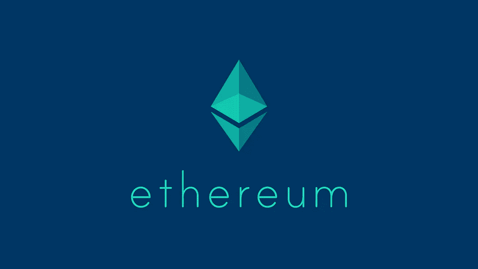
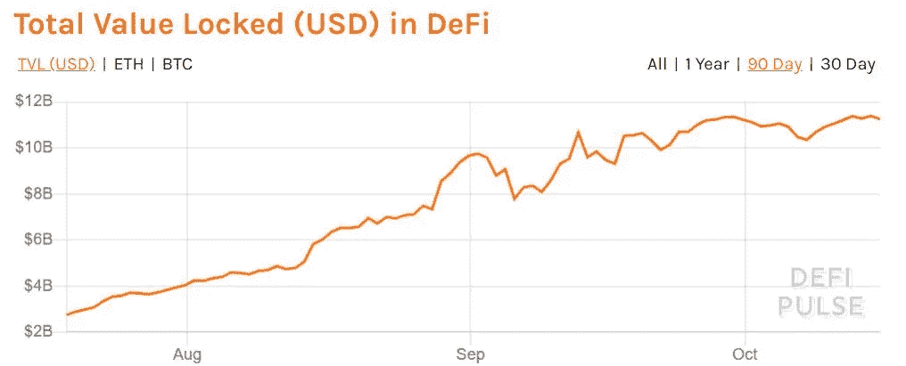
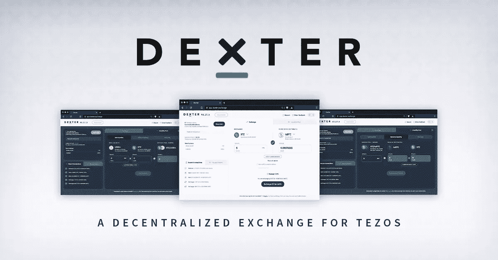
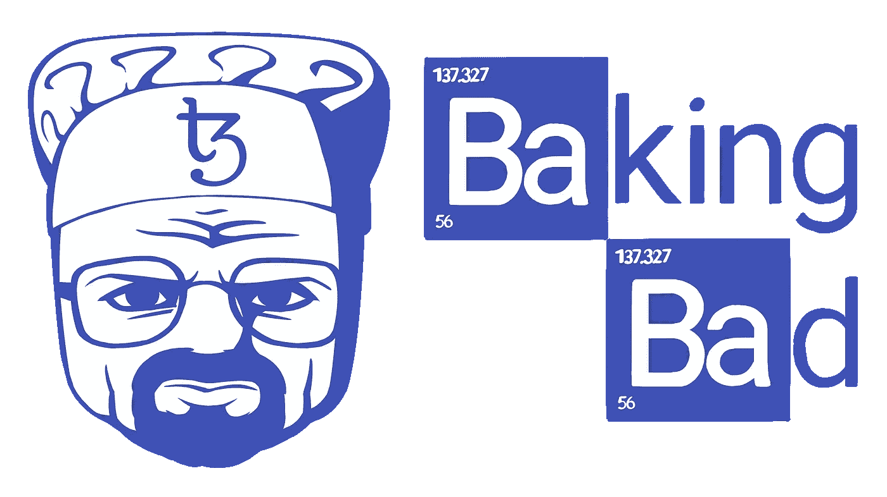

# 泰佐斯 Vs 以太坊

> 原文：<https://medium.com/coinmonks/tezos-vs-ethereum-1b036bbe7ae2?source=collection_archive---------0----------------------->

Source — DefiPulse Oct 2020

智能合约和 Defi 在 2020 年已经完全疯了。截至 2020 年 10 月 15 日，Defi 总额超过 110 亿美元，高于 7 月份的 30 亿美元。我看到一个新兴产业以令人难以置信的方式崛起。我想在这篇文章的开头说，我是我所写的两个区块链平台的倡导者。虽然这两者没有直接联系，但我个人认为它们都是伟大的数字资产。我写的不是财务建议，而是我个人的观点和研究。在选择投资时，请根据自己的研究做出自己的决定。我既不是这些区块链的赞助人，也不是我在本文中提到的任何应用程序的赞助人。

我将对每个智能合约平台进行分类，并在几个受欢迎的类别中对它们进行排名，从 1 到 5，试图教育人们并引发讨论。我真的没有见过其他人写这样的东西——所以我希望两个社区都能欢迎它，并从双方都喜欢的角度得到一些东西。

如果你还没有使用区块链技术——这篇文章可能会超出你的理解范围。最好的起点是熟悉比特币、以太坊和加密货币的一般概念，然后再深入研究。我将对这些智能合约平台进行分解，并就一些更复杂的概念进行比较，这些概念对于普通人来说并不熟悉或自然。但是，如果你沉迷于替代硬币空间，甚至只是其中一个生态系统，这篇文章就是为你准备的。

如果你喜欢这篇文章，并想在未来阅读我的观点或文章，我邀请你到[在 Twitter 上关注我](https://twitter.com/onelemononelime)。

*让我们从每个人最喜欢的流行语开始。*

 [## 最佳免费加密交易机器人——前 16 名比特币交易机器人[2021]

### 2021 年币安、比特币基地、库币和其他密码交易所的最佳密码交易机器人。四进制，位间隙…

medium.com](/coinmonks/crypto-trading-bot-c2ffce8acb2a) 

# **Defi**

**排名:**

**Tezos — 3 |以太坊— 5**

Uniswap 今年彻底改造了游戏。*2020 年《秘密》中最大的故事之一*——这个 DEX 完全改变了互联网和人类共同运作的方式。这种当前的、最初的 Defi 浪潮可以说是完全建立在以太坊的基础上的，尽管它确实没有理由必须如此。简而言之，这可以归结为一个事实，即该领域一些最好的开发人员正在从事利用以太坊而不是其他加密货币的项目。对于今年创建的 Defi 景观，我只能说非常积极的事情，我很自豪有机会参与这一令人兴奋的技术的早期采用。Uniswap 已经证明，dex 和空投都可以成为区块链未来景观的一部分。

[Dexter](https://dexter.exchange/) 是一款全新的 DEX，功能与 Uniswap 非常相似。用户界面简洁，网站上提供的文档内容全面，易于阅读。除了 Tezos 上的 BTC 和美元包装产品之外，该平台上还没有任何资产，但我对未来将出现的所有不同类型的代币持乐观态度。我的希望是有人想出一个办法，让一些房地产 FA1.2 代币明年在 Dexter 上交易。对于那些只熟悉以太坊的人来说——[fa 1.2 代币](https://assets.tqtezos.com/docs/token-contracts/fa12/1-fa12-intro/#:~:text=2%3F-,FA1.,to%20transfer%20a%20user's%20tokens.)是 ERC-20 代币的 Tezos 等价物。可以将这些令牌视为构建在平台之上的额外一层。目前还没有很多不同类型的代币被创造出来——但是能够被创造出来的潜力是极其广泛的。当你想到已经存在的所有不同类型的 ERC-20 代币时，我真的为 FA1.2s 感到兴奋

鉴于目前已建成的生态系统，我认为建筑物/土地等大市值资产有更多机会以 FA1.2s 而非 ERC-20 的形式进入 Defi。ERC-20 的环境充斥着废话，对于不熟悉的人来说很难穿越。虽然你有许多有价值的 ERC-20，如 UNI governance 令牌和包括 Chainlink 在内的价格神谕，但你必须了解如何筛选大量垃圾。我将非常有兴趣看到这两个惊人的平台并肩发展，并对两者都感到乐观。当这些系统的基础设施建成时，我不会对 Defi 领域的叙述转变感到惊讶。我希望有一个具有过滤机制的 DEX，随着更多种类的令牌可用，它允许您快速找到非常具体的资产。虽然我对 ERC-20 和 FA1.2s 的未来持乐观态度，但在 2020 年，以太坊仍然是 Defi 之王。

# **股权证明**

**排名:**

**泰佐斯— 5 |以太坊— 2**

与以太坊不同——它正处于从工作证明向利益证明的过渡过程中，Tezos 是一个智能合同平台，从一开始就考虑到了利益。Tezos 是一个从未在工作证明生态系统中运作过的区块链。因此，Tezos 构建的利益证明环境比当前通过工作证明创建新以太坊的状态要健壮得多。

Tezos 生态系统的赌注信息非常透明，很容易通过数据库了解，如 Baking Bad 上提供的数据库或谷歌云托管的公共数据集。

 [## 烘焙坏- Tezos 委托审计员

### 一个独立的审计和比较服务 Tezos 委托服务，最完整的 Tezos 面包师名单，以及…

www.baking-bad.org](https://www.baking-bad.org/) 

对于安全极客来说——Tezos 应用程序、团队和项目传统上都以安全和审计为中心。Tezos 的证据要素也不例外。我个人使用 Baking Bad 已经有一年了，我发现它对很多事情都很有用，从选择面包师到审核面包师到监控我的授权奖励。

下注 Tezos 非常简单，既可以从个人钱包中下注，也可以从比特币基地或北海巨妖等交易所下注。整个过程只需几分钟，而且永远不会重复，除非你想更换委托你制作 Tezos 的面包师。对于不想选择自己的面包师的用户来说，通过交换自动授权很简单，并且仍然可以获得一定比例的赌注收益。

关于以太坊仍然有很多猜测，因为它还不是一个功能产品。我希望它能把我们都吹走，但结果仍然未知。出于这些原因，我认为以太坊赌注与 Tezos Defi 非常相似。这是即将到来的事情，在隧道的尽头，你几乎可以在你的面前看到光明。然而，这并不意味着它是目前存在的东西。由于这些原因，我认为 Tezos 是这个类别中的明显赢家。

# **治理**

**排名:**

**泰佐斯— 5 |以太坊— 3**

治理一直是区块链社区的热门话题。以下信息直接摘自 [Tezos 网站](https://tezos.com/get-started)。

# [自我修正](https://tezos.com/get-started#self-amendment)

*自我修正使 Tezos 无需将网络拆分(“分叉”)成两个不同的区块链就能自我升级。这一点很重要，因为分叉的建议或期望可能会分裂社区，改变利益相关者的激励，并破坏随着时间的推移形成的网络效应。由于自我修正，协议升级的协调和执行成本得以降低，未来的创新可以无缝实施。*

# [*连锁治理*](https://tezos.com/get-started#governance)

*在 Tezos 中，所有利益主体都可以参与管理协议。选举周期为利益攸关方就拟议的议定书修正案达成一致意见提供了一个正式和系统的程序。通过将这种链上机制与自我修正相结合，Tezos 可以改变这种最初的选举过程，以便在发现它们时采用更好的治理机制。*

正如你所看到的 Tezos 生态系统中的治理非常清晰，并且为每个用户都做了安排。目前，您不需要持有额外的治理令牌或资产来投票。这使得治理过程对用户来说不仅透明，而且简单。

以太坊在一个非常不同的治理模式下发展。随着许多以太坊用户焦急地等待以太坊 2.0，我们看到在协议之上构建了过多不同的治理平台。总的来说，仍然有很多方法可以参与到治理活动中，但是为了参与其中，您需要挖掘更深的层次。这在生态系统中创造了许多不同的子社区和“分叉”。由于这些原因，我认为 Tezos 在链上治理方面是明显的赢家。

# **用例**

**排名:**

**泰佐斯— 4|以太坊— 5**

以太坊有机会比 Tezos 多存在几年——允许它被用于许多不同的事情。今天，我们看到以太坊被用于从天然气到 dex 到借贷平台到 NFT 的一切。以太坊已经展示了它的用例，证明了它可以用在很多我们从来没有想过可以想象的地方。在这一点上，我不相信这是猜测，当有近 900 万以太锁在 Defi。虽然其中一些用例非常新，但我仍然相信链上的跟踪记录展示了清晰而明显的成功。我也很兴奋地看到像 Reddit 和 T2 这样的公司如何在未来整合以太坊。这些都是金融界和科技界的大腕。

另一方面，Tezos 目前主要用作价值储存手段和赌注机制。然而，目前有不同的机构非常努力地将平台上的资产令牌化。例如，提升回报公司正在[用泰佐斯区块链](https://www.prnewswire.com/news-releases/elevated-returns-and-securitize-to-tokenize-usd-1b-of-real-estate-on-tezos-will-build-new-compliant-security-token-issuance-standards-300793038.html)将 10 亿美元的房地产进行证券化。我认为 Tezos 的一些用例实际上有更强的基础——但目前由于[梅特卡夫定律](https://en.wikipedia.org/wiki/Metcalfe%27s_law)的原因，该平台缺乏与以太坊同等水平的影响力和范围。无论如何，我们已经看到了一些令人兴奋的新进展，如蒂姆·德雷珀为 Tezos 风险基金筹集了 2500 万美元。

我相信这两个智能合约平台在房地产、游戏/电子竞技、数字艺术和音乐行业等领域都有巨大的增长空间。我希望看到企业家、开发商和投资者深入这些不同的层面，向世界展示什么是真正可能的。

# 总体排名(满分 20 分)

**Tezos — 17|以太坊— 15**

正如你所看到的，我非常积极地看待这两个区块链。我相信两者都已经在改变世界方面取得了长足的进步，而我们才刚刚开始。如果你是任何一种最大化主义者——我鼓励你客观地看待区块链，并思考这些平台如何有不同的优势和劣势。

我希望这篇文章是信息性的、教育性的，并能启发你用不同的眼光看待这个世界。如果你觉得它有用——一定要在 [Twitter](https://twitter.com/onelemononelime) 上喜欢或转发这篇文章。

**您可以使用我下面的推荐链接在交易所购买加密货币，在利息账户中保存加密货币，或者购买硬件钱包，以在冷存储中离线保护您的加密。我的目标是写一些内容，让世界各地的人们了解激动人心的全新技术。你的支持让我以后可以写更多的文章。**

> [**区块链**](https://blockfi.com/?ref=426c0778)
> 
> 这项服务可以让你保存比特币，并获得以太坊的利息，这是一个真正令人惊讶和未被充分认识的功能
> 
> [**摄氏度网**](https://celsiusnetwork.app.link/1277423ac3)
> 
> 保存您的加密货币，并获得与您存款相同的抵押品的利息
> 
> [**北海巨妖**](http://r.kraken.com/DYqPb)
> 
> 买卖加密货币——这是获得比特币或以太网初始投资的最简单、最安全的方式之一
> 
> [**总账**](https://shop.ledger.com/?r=94304db10a14)
> 
> 使用支持蓝牙的硬件钱包保护您的加密货币

 [## 最佳 6 个加密交易信号电报通道

### 这是乏味的找到正确的加密交易信号提供商。因此，在本文中，我们将讨论最好的…

medium.com](/coinmonks/best-crypto-signals-telegram-5785cdbc4b2b) 

## 另外，阅读

*   [密码本交易平台](/coinmonks/top-10-crypto-copy-trading-platforms-for-beginners-d0c37c7d698c)
*   最好的[加密税务软件](/coinmonks/best-crypto-tax-tool-for-my-money-72d4b430816b)
*   [最佳加密交易平台](/coinmonks/the-best-crypto-trading-platforms-in-2020-the-definitive-guide-updated-c72f8b874555)
*   最佳[加密借贷平台](/coinmonks/top-5-crypto-lending-platforms-in-2020-that-you-need-to-know-a1b675cec3fa)
*   [最佳区块链分析工具](https://bitquery.io/blog/best-blockchain-analysis-tools-and-software)
*   [加密套利](/coinmonks/crypto-arbitrage-guide-how-to-make-money-as-a-beginner-62bfe5c868f6)指南:新手如何赚钱
*   最佳[加密制图工具](/coinmonks/what-are-the-best-charting-platforms-for-cryptocurrency-trading-85aade584d80)
*   [莱杰 vs 特雷佐](/coinmonks/ledger-vs-trezor-best-hardware-wallet-to-secure-cryptocurrency-22c7a3fd391e)
*   了解比特币的[最佳书籍有哪些？](/coinmonks/what-are-the-best-books-to-learn-bitcoin-409aeb9aff4b)
*   [3 商业评论](/coinmonks/3commas-review-an-excellent-crypto-trading-bot-2020-1313a58bec92)
*   [AAX 交易所评论](/coinmonks/aax-exchange-review-2021-67c5ea09330c) |推荐代码、交易费用、利弊
*   [Deribit 审查](/coinmonks/deribit-review-options-fees-apis-and-testnet-2ca16c4bbdb2) |选项、费用、API 和 Testnet
*   [FTX 密码交易所评论](/coinmonks/ftx-crypto-exchange-review-53664ac1198f)
*   [n 零审核](/coinmonks/ngrave-zero-review-c465cf8307fc)
*   [Bybit 交换审查](/coinmonks/bybit-exchange-review-dbd570019b71)
*   3Commas vs Cryptohopper
*   最好的比特币[硬件钱包](/coinmonks/the-best-cryptocurrency-hardware-wallets-of-2020-e28b1c124069?source=friends_link&sk=324dd9ff8556ab578d71e7ad7658ad7c)
*   最佳 [monero 钱包](https://blog.coincodecap.com/best-monero-wallets)
*   [莱杰纳米 s vs x](https://blog.coincodecap.com/ledger-nano-s-vs-x)
*   [bits gap vs 3 commas vs quad ency](https://blog.coincodecap.com/bitsgap-3commas-quadency)
*   [莱杰 Nano S vs 特雷佐 one vs 特雷佐 T vs 莱杰 Nano X](https://blog.coincodecap.com/ledger-nano-s-vs-trezor-one-ledger-nano-x-trezor-t)
*   [block fi vs Celsius](/coinmonks/blockfi-vs-celsius-vs-hodlnaut-8a1cc8c26630)vs Hodlnaut
*   Bitsgap 评论——一个轻松赚钱的加密交易机器人
*   为专业人士设计的加密交易机器人
*   [PrimeXBT 审查](/coinmonks/primexbt-review-88e0815be858) |杠杆交易、费用和交易
*   [埃利帕尔泰坦评论](/coinmonks/ellipal-titan-review-85e9071dd029)
*   [赛克斯石评论](https://blog.coincodecap.com/secux-stone-hardware-wallet-review)
*   [BlockFi 评论](/coinmonks/blockfi-review-53096053c097) |从您的密码中赚取高达 8.6%的利息