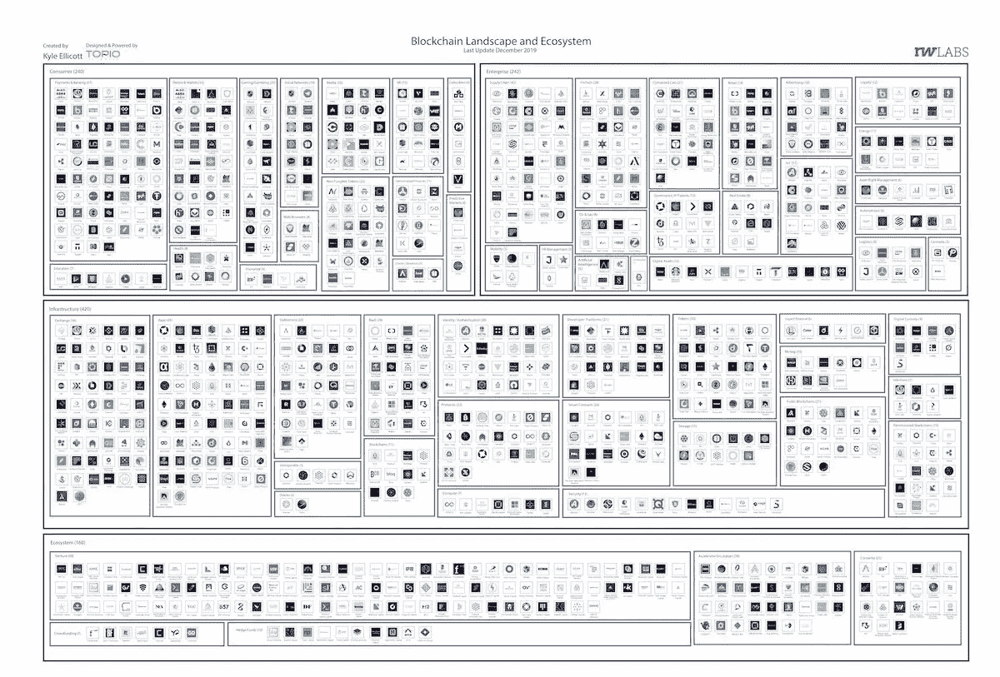

# 泰国将区块链加入电子签证/腾讯数字货币集团传闻/ Libra 更新，2019 Recaps，2020 预测

> 原文：<https://medium.com/coinmonks/thailand-adding-blockchain-to-electronic-visa-tencent-rumors-of-digital-currency-group-libra-b29d03cb80e2?source=collection_archive---------0----------------------->

Photo by [Chad Madden](https://unsplash.com/@chadmadden?utm_source=unsplash&utm_medium=referral&utm_content=creditCopyText) on [Unsplash](https://unsplash.com/s/photos/festive?utm_source=unsplash&utm_medium=referral&utm_content=creditCopyText)

*2019 年 12 月 24 日*

*在本周的平安夜*🎄*版，我们有* ***2019 年*** *和* ***2020 年行业预测*** *围绕区块链所有地区，DApps & DLT 景观。有传言称* ***腾讯*** *正在建立一个数字货币研究小组，而* ***中国*** *则在加密货币交易、加密交易所和与加密相关的活动方面进一步发展。* ***泰国*** *正计划将区块链应用于其电子落地签证，适用于来自 15 个以上国家的 500 万游客。天秤座协会***公布了其第二张* ***天秤座核心*** *路线图，概述了其向 mainnet 推出的努力。又到了一年中更多关于 2020 年的预测以及年底报告的时候了，我们从****DappRadar*******Fidelity Digital Assets*******Global Coin Research、******Messari******

****我们甚至在大量的研究中找到了临时抱佛脚的余地(* [*Q4 2019 区块链景观*](https://www.topionetworks.com/markets/blockchain-landscape-5bf43854b9abe4633c1f87da)*&*[*DApps 景观*](https://www.topionetworks.com/markets/dapps-stack-landscape-5de8d07eb9abe453e04203f8) *) &书籍(关于* [*数字资产*](https://www.scribd.com/document/430637579/Current-Market-Overview-of-Digital-Assets)*&*[*企业区块链*](https://www.amazon.com/dp/B07Z3LJCHW/ref=cm_sw_r_tw_dp_U_x_C6iSDbACJJN2Z) *)连同对风险投资的见解(新基金！！)、基础设施、DApps、比特币、经济学、交易所和 Stablecoins。为了了解更多信息，让你跟上时代的步伐，这里有一张本周业内热门新闻的快照。****

## **🇨🇳 [腾讯传言成立数字货币研究部以响应国家政策](https://www.coinsnetwork.com/2019/12/25/tencent-rumored-to-establish-digital-currency-research-department-in-response-to-national-policy/)**

**中国腾讯成立数字货币研究小组，研究如何创新商业模式和测试应用场景的传言层出不穷。一些分析师认为，由于美国脸书计划推出自己的加密货币 Libra，中国也需要私营公司做出相应的部署。… [阅读更多内容](https://www.coinsnetwork.com/2019/12/25/tencent-rumored-to-establish-digital-currency-research-department-in-response-to-national-policy/)**

## **📖[微软正在使用区块链帮助公司信任人工智能](https://www.coindesk.com/microsoft-is-using-blockchain-to-help-firms-trust-ai)**

**微软的区块链数据管理器获取链上数据，并将其连接到其他应用程序。因此，来自节点或智能合约内部的交易数据可以发送到其他数据库或数据存储。这些是可以部署人工智能的地方，或者在供应链的情况下，物联网(IoT)信息可以发挥作用的地方……[阅读更多](https://www.coindesk.com/microsoft-is-using-blockchain-to-help-firms-trust-ai)**

## **📈[泰国将区块链纳入电子签证系统](https://www.fxstreet.com/cryptocurrencies/news/thailand-integrates-blockchain-into-e-visa-system-201912240118)**

**泰国正计划将区块链应用于其电子落地签证(eVOA)。该国新的区块链驱动的 eVOA 系统计划加快和保护数字签证申请过程。该系统将向来自 15 个以上国家的 500 万游客开放… [阅读更多信息](https://www.fxstreet.com/cryptocurrencies/news/thailand-integrates-blockchain-into-e-visa-system-201912240118)**

## **📖[存储之外:托管如何发展以满足机构需求](https://www.coindesk.com/beyond-storage-how-custody-is-evolving-to-meet-institutional-needs)**

**由于数字资产是不记名资产，大多数投资活动都涉及处理基础私钥。这意味着，与传统金融相比，托管在加密投资者的日常操作中发挥着更大的作用。无论投资者想用他们的资产做什么——购买和持有，退出主要头寸，积极交易，参与赌注和治理——托管人都会参与。… [阅读更多信息](https://www.coindesk.com/beyond-storage-how-custody-is-evolving-to-meet-institutional-needs)，并确保查看更多来自[迪奥戈莫尼卡](https://medium.com/u/e368872e1e96?source=post_page-----b29d03cb80e2--------------------------------) & [安克雷奇](https://medium.com/u/6d1871dd1b61?source=post_page-----b29d03cb80e2--------------------------------)的信息**

## **🇨🇳 [中国科技中心深圳开始清理加密相关公司](https://news.8btc.com/chinas-tech-hub-shenzhen-kicks-off-cleanup-of-crypto-related-companies)**

**中国最近更新了对加密货币交易和加密交易所的强硬态度，中国人民银行(PBoC)宣布，任何发现的加密相关活动都将“立即处理”。根据中国人民银行的区块链蓝皮书，在中国的 28，000 家区块链企业中，只有 4，000 家从事纯区块链技术，而多达 25，000 家试图通过非法集资或金融欺诈发行自己的加密货币或令牌……[阅读更多](https://news.8btc.com/chinas-tech-hub-shenzhen-kicks-off-cleanup-of-crypto-related-companies)**

# **本周阅读的研究:**

**上周晚些时候， [DappRadar](https://medium.com/u/b355b203c3dd?source=post_page-----b29d03cb80e2--------------------------------) 发布了 2019 年 dapp 行业评论，这是对全年所有 dapp 事件的详细回顾。以下是一些关键要点:**

*   **以太坊仍然是区块链最重要的智能合约。2019 年，其 dapp 生态系统的日用户量增长了 118%，日价值增长了 166%。**
*   **以太坊也是迄今为止唯一一家在四个主要领域成功发展 dapps 的区块链:DeFi、交易所、游戏、赌博和高风险。**
*   **尽管 EOS 和 TRON 被许多人贴上了“以太坊杀手”的标签，但两家公司都在努力扩大用户基础，以及他们的 dapps 所获取的价值。**
*   **截至 12 月中旬，每天在所有以太坊 dapps 上交互的唯一活跃钱包数量增长了 118%，超过 19，000 个。**

**你可以在这里找到完整的报告以及可下载的 PDF 版本。**

# **本周的更多内容:**

**📖【2020 年 18 个预测由[离群风险投资](https://medium.com/u/5751ee054871?source=post_page-----b29d03cb80e2--------------------------------)的[劳伦斯·蓝迪-布莱恩](https://medium.com/u/761d1bb9f3a1?source=post_page-----b29d03cb80e2--------------------------------)**

**📖[2020 年 DeFi 趋势](https://messari.io/article/defi-trends-for-2020)作者[Messari](https://medium.com/u/6ea4a7e0c022?source=post_page-----b29d03cb80e2--------------------------------)[的](https://medium.com/u/7cf93d3c3400?source=post_page-----b29d03cb80e2--------------------------------)Ryan selk is**

**📖 [GCR 社区对 2020 年的预测](https://globalcoinresearch.com/2019/12/20/gcr-community-predictions-for-2020/)来自[全球硬币研究](https://medium.com/u/ad00598aecd4?source=post_page-----b29d03cb80e2--------------------------------)**

**📖[解密数字资产数据:从](/@FidelityDigitalAssets/demystifying-digital-asset-data-a-look-at-bitcoin-transaction-value-e6f6e89c5b50)[富达数字资产](https://medium.com/u/3a8b739a08d1?source=post_page-----b29d03cb80e2--------------------------------)看比特币交易价值**

**📖展示区块链如何超越金融的 5 个行业作者[艾莉森·麦考利](https://medium.com/u/e8b36138b7fd?source=post_page-----b29d03cb80e2--------------------------------)**

**📖 [EY 向公众发布第三代零知识证明区块链技术](https://www.ey.com/en_gl/news/2019/12/ey-releases-third-generation-zero-knowledge-proof-blockchain-technology-to-the-public-domain)**

**📖[兰花推出隐私网络](/fabric-ventures/orchid-launches-privacy-network-47ea09d086ef)由[纺织企业](https://medium.com/u/d3d50f504e6b?source=post_page-----b29d03cb80e2--------------------------------) / [兰花](https://medium.com/u/5df805f020f6?source=post_page-----b29d03cb80e2--------------------------------)的[理查德·缪尔海德](https://medium.com/u/8875491ec1fe?source=post_page-----b29d03cb80e2--------------------------------)**

**📖[从](https://thegraph.com/blog/the-path-to-web3)[图](https://medium.com/u/c2f061b81210?source=post_page-----b29d03cb80e2--------------------------------)到 Web3 的路径**

**📖[政府数字货币的熔化与为何‘halve ning’变得怪异](https://www.coindesk.com/meltem-demirors-on-government-digital-currencies-and-why-the-halvening-gets-weird)纳撒尼尔·惠特莫尔**

**📖[区块链字节序列化](/whiteblock/byte-serialization-in-blockchain-e147347ab578)作者 [Antoine Toulme](https://medium.com/u/9e3f4ade4009?source=post_page-----b29d03cb80e2--------------------------------)**

**💰[大卫·a·约翰斯顿](/pegnet/adding-pegnets-passets-to-ethereum-6b20d63ae635)[为以太坊](https://medium.com/u/a7467cf7c73?source=post_page-----b29d03cb80e2--------------------------------)添加佩格内特的通行证**

# **分散式应用程序手表**

## **📖 [Libra 的第二份路线图概述了它对 mainnet 发布的最后推动](https://www.theblockcrypto.com/linked/51183/libras-second-roadmap-outlines-its-final-push-toward-mainnet-launch)**

**Libra 协会发布了 Libra Core 的[第二个路线图](https://developers.libra.org/blog/2019/12/17/libra-core-roadmap-2)，Libra Core 是支撑计划中的 Libra 网络的关键软件。Libra 的许可区块链建立在开源软件的基础上，旨在允许开发者、公司和消费者通过该系统构建自己的项目。在 10 月份发布的[首个路线图](https://www.theblockcrypto.com/linked/41830/libra-publishes-roadmap-laying-out-4-key-milestones-to-be-met-before-mainnet-launch)中，天秤座宣布… [阅读更多](https://www.theblockcrypto.com/linked/51183/libras-second-roadmap-outlines-its-final-push-toward-mainnet-launch)**

**📖[2019 年的 dapp 生态系统:刚刚发生了什么？](/dappradar-com/the-dapp-ecosystem-in-2019-what-just-happened-fca801c8bdc7)由 [DappRadar](https://medium.com/u/b355b203c3dd?source=post_page-----b29d03cb80e2--------------------------------)**

**📖[区块链上的游戏进入了一个新时代](/swlh/games-on-the-blockchain-move-into-a-new-era-297cb95d5cdd)作者 [Robert Hoogendoorn](https://medium.com/u/29856977c13c?source=post_page-----b29d03cb80e2--------------------------------)**

**📖 [2019 集锦](/instadapp/2019-highlights-813047369200) by [Sowmay Jain](https://medium.com/u/21786e9fd68f?source=post_page-----b29d03cb80e2--------------------------------)**

**📖[区块链自动化变得简单](/the-liquidapps-blog/blockchain-automation-made-easy-29a1fdd2af8b)由[liquid PPS](https://medium.com/u/111b26bf40a9?source=post_page-----b29d03cb80e2--------------------------------)**

# **📺收听:**

**确保在假期中抽出几分钟，收听由[彼得·麦科马克](https://medium.com/u/79b96a130697?source=post_page-----b29d03cb80e2--------------------------------)主演的[纳撒尼尔·惠特莫尔](https://medium.com/u/1b4838316374?source=post_page-----b29d03cb80e2--------------------------------)的最新一集《崩溃》。在 [The Breakdown](https://art19.com/shows/late-confirmation) 的这一年末特别节目中，彼得讨论了为什么过去的一年代表了世界各地公民行动和主权抗议的转折点，以及为什么 2020 年可能会看到非比特币加密资产的持续流血。尽情享受吧！**

** [## 崩溃:彼得·麦科马克在挑战比特币的新时代 CoinDesk 的最新确认

### 彼得·麦科马克是这个领域最杰出的播客之一。2019 年，他增加了一个名为“挑战”的新播客…

open.spotify.com](https://open.spotify.com/episode/5aRceQrDkca9kRI0YFNgeu)** 

> ***👉下载新的* [*区块链用于基础设施景观*](https://www.topionetworks.com/events/5d79268b78e00230faba6f77) *Q4 2019 版&* [*DApps“栈”景观*](https://www.topionetworks.com/markets/dapps-stack-landscape-5de8d07eb9abe453e04203f8)**

****

****Q4 2019 Edition** of the Blockchain for Infrastructure & Ecosystem Landscape**

**不想等到下周，[现在就订阅](http://click1.m.readwritelabs.com/xsdqkbbrgsdtqkmntpjlstcnkytvpvphsnhsqlvbrhhd_yfqbfcmslnskglmckvqv.html?source=post_page---------------------------)📥有关区块链、DApps 等的实时行业见解！**

> **[直接在您的收件箱中获得最佳软件交易](https://coincodecap.com/?utm_source=coinmonks)**

********