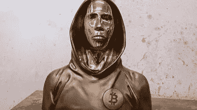

# 那次我遇到了聪

> 原文：<https://medium.com/coinmonks/that-time-i-met-satoshi-5b7f50de2541?source=collection_archive---------7----------------------->

Satoshi Nakamoto statue

我于 2019 年 10 月 29 日上午 8:30 到达注册会计师继续教育班。华尔街，确切地说是华尔街 40 号。该课程名为“数字货币、会计和税务处理”演讲者在 9:00 开始，接着是非常典型的不太新鲜的丹麦欧式早餐。当然，没有冒犯任何丹麦人的意思。