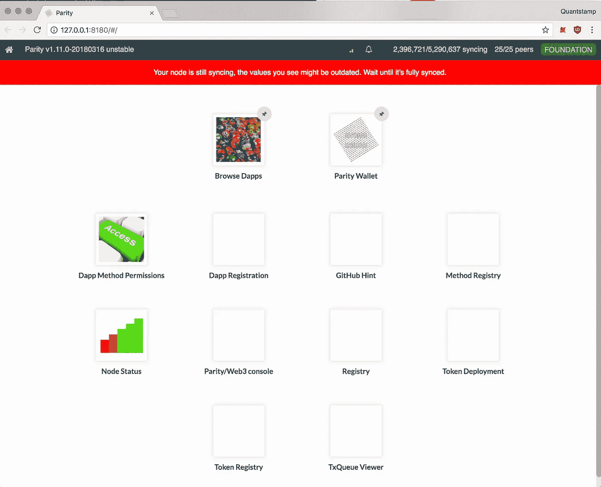
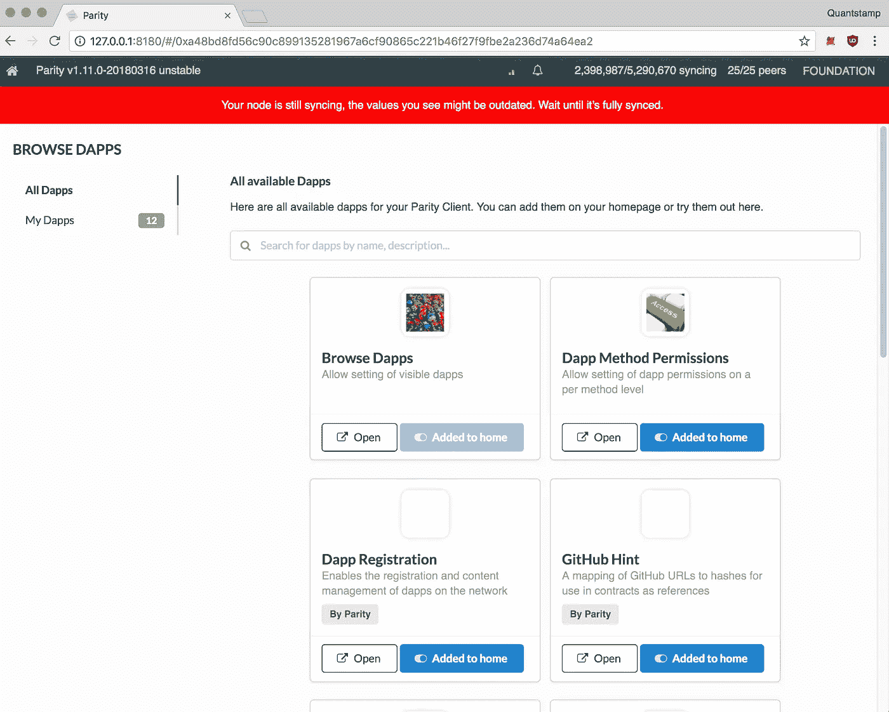
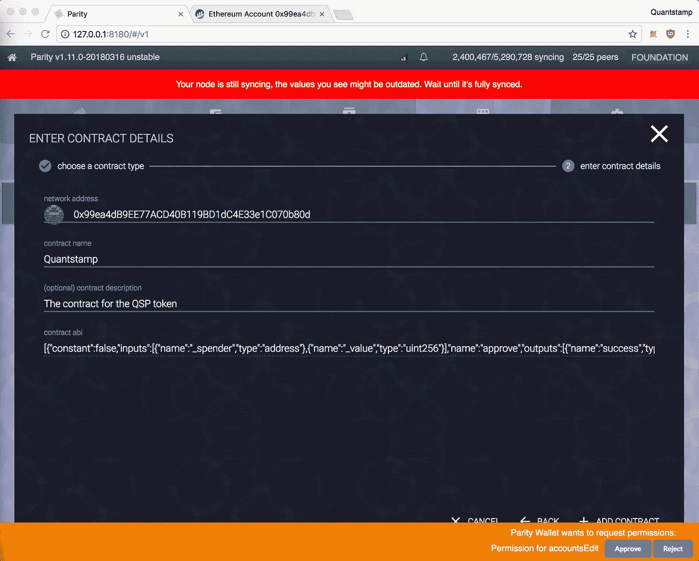
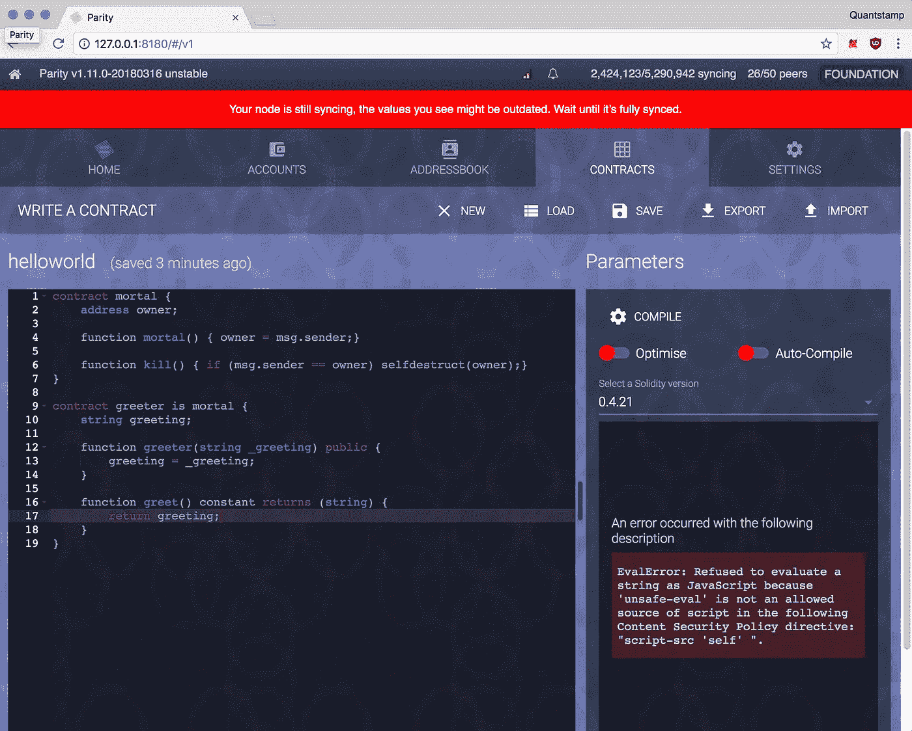

# 那次我在我的电脑上运行了一个完整的以太坊节点

> 原文：<https://medium.com/coinmonks/that-time-i-ran-a-full-ethereum-node-on-my-computer-566c783dc37b?source=collection_archive---------0----------------------->

*第一部*

我有一台存储容量为 500 千兆字节的计算机。我希望这台计算机成为全球分散以太坊主网络的一部分。我们走吧！

我在 Github 上参观 [go-ethereum 项目。它](https://github.com/ethereum/go-ethereum)[很活跃](https://github.com/ethereum/go-ethereum/pulse)！

> [发现并回顾最佳区块链 api 和节点产品](https://coincodecap.com/category/blockchain-node-and-api)

看起来我需要的软件名叫`geth`。[文档](https://github.com/ethereum/go-ethereum/wiki)说挺有能力的。我把它安装在我的电脑上！

```
Lees-MacBook-Pro:geth leeazzarello$ geth version
Geth
Version: 1.8.2-stable
Architecture: amd64
Protocol Versions: [63 62]
Network Id: 1
Go Version: go1.10
Operating System: darwin
GOPATH=/Users/leeazzarello/go
GOROOT=/usr/local/Cellar/go/1.10/libexec
```

让我们运行它！

```
Lees-MacBook-Pro:~ leeazzarello$ geth
INFO [03–19|15:40:28] Maximum peer count ETH=25 LES=0 total=25
INFO [03–19|15:40:28] Starting peer-to-peer node instance=Geth/v1.8.2-stable/darwin-amd64/go1.10
INFO [03–19|15:40:28] Allocated cache and file handles database=/Users/leeazzarello/Library/Ethereum/geth/chaindata cache=768 handles=128
INFO [03–19|15:40:36] Initialised chain configuration config=”{ChainID: 1 Homestead: 1150000 DAO: 1920000 DAOSupport: true EIP150: 2463000 EIP155: 2675000 EIP158: 2675000 Byzantium: 4370000 Constantinople: <nil> Engine: ethash}”
INFO [03–19|15:40:36] Disk storage enabled for ethash caches dir=/Users/leeazzarello/Library/Ethereum/geth/ethash count=3
INFO [03–19|15:40:36] Disk storage enabled for ethash DAGs dir=/Users/leeazzarello/.ethash count=2
INFO [03–19|15:40:36] Initialising Ethereum protocol versions=”[63 62]” network=1
INFO [03–19|15:40:36] Loaded most recent local header number=5285440 hash=8aed25…6106fa td=3142921855785140055448
INFO [03–19|15:40:36] Loaded most recent local full block number=0 hash=d4e567…cb8fa3 td=17179869184
INFO [03–19|15:40:36] Loaded most recent local fast block number=5285335 hash=e3e4b9…87f92a td=3142576463361106413435
INFO [03–19|15:40:36] Loaded local transaction journal transactions=0 dropped=0
INFO [03–19|15:40:36] Regenerated local transaction journal transactions=0 accounts=0
INFO [03–19|15:40:36] Starting P2P networking 
INFO [03–19|15:40:38] UDP listener up self=enode://e4647b30867c35991fff0f25481448ca10e29c707ffee4548813d5f2458f92397a3b6aaa6e7b24ee58b89531d54d0d2b62d694ba7e0508dcfb83a1f1ad16c376@[::]:30303
INFO [03–19|15:40:38] RLPx listener up self=enode://e4647b30867c35991fff0f25481448ca10e29c707ffee4548813d5f2458f92397a3b6aaa6e7b24ee58b89531d54d0d2b62d694ba7e0508dcfb83a1f1ad16c376@[::]:30303
INFO [03–19|15:40:38] IPC endpoint opened url=/Users/leeazzarello/Library/Ethereum/geth.ipc
INFO [03–19|15:42:38] Block synchronisation started 
WARN [03–19|15:42:40] Synchronisation failed, retrying err=”block download canceled (requested)”
WARN [03–19|15:42:49] Lied about chain head peer=e63681e1eec3c72f reported=2503882 found=2504058
WARN [03–19|15:42:49] Synchronisation failed, dropping peer peer=e63681e1eec3c72f err=”peer is stalling”
```

呃…这是怎么回事？我想我会在这里坐一会儿。


在我等待的时候，我读了一些文件。我发现这个东西叫做*快速同步模式*。这两种模式似乎是不兼容的，一种模式不能转换成另一种模式。小崽子，我们重新开始，这次动作要快！

```
Ctrl+C
Lees-MacBook-Pro:~ leeazzarello$ geth --fast
```


哇，我的硬盘上现在有一堆千兆字节。

```
Lees-MacBook-Pro:geth leeazzarello$ pwd
/Users/leeazzarello/Library/Ethereum/geth
Lees-MacBook-Pro:geth leeazzarello$ du -sh chaindata/
 63G chaindata/
```

我想知道我是否能与我电脑上的区块链数据互动？同步了吗？看起来有一个互动控制台可以让我找到答案。

```
Lees-MacBook-Pro:geth leeazzarello$ geth console
> INFO [03-19|15:47:19] Block synchronisation started 
INFO [03-19|15:47:21] Imported new block headers               count=278 elapsed=62.697ms number=5285719 hash=9e4e03…65b0fe ignored=106
INFO [03-19|15:47:21] Imported new block headers               count=110 elapsed=92.542ms number=5285829 hash=905f1e…0ca7ee ignored=0
INFO [03-19|15:47:22] Imported new state entries               count=259 elapsed=4.845µs  processed=36200855 pending=4145 retry=2 duplicate=0 unexpected=0
INFO [03-19|15:47:23] Imported new state entries               count=384 elapsed=4.167µs  processed=36201239 pending=9959 retry=0 duplicate=0 unexpected=0
INFO [03-19|15:47:23] Imported new block receipts              count=41  elapsed=43.361ms number=5285376 hash=218633…f56eb9 size=2.98mB ignored=0
INFO [03-19|15:47:24] Imported new state entries               count=384 elapsed=2.181µs  processed=36201623 pending=14455 retry=2 duplicate=0 unexpected=0
INFO [03-19|15:47:25] Imported new block receipts              count=1   elapsed=478.739µs number=5285377 hash=bedd4c…8fb709 size=10.67kB ignored=0
INFO [03-19|15:47:25] Imported new block receipts              count=129 elapsed=206.809ms number=5285506 hash=580e9b…c4bb7f size=8.83mB  ignored=0
INFO [03-19|15:47:26] Imported new state entries               count=384 elapsed=2.201µs   processed=36202007 pending=19068 retry=0 duplicate=0 unexpected=0
INFO [03-19|15:47:26] Imported new block headers               count=1   elapsed=4.297ms   number=5285830 hash=294154…19d282 ignored=0
INFO [03-19|15:47:26] Imported new block receipts              count=39  elapsed=58.088ms  number=5285545 hash=a041c3…dabfd4 size=3.03mB  ignored=0
INFO [03-19|15:47:26] Imported new block receipts              count=64  elapsed=87.223ms  number=5285609 hash=7fbf4a…5626f3 size=3.98mB  ignored=0
INFO [03-19|15:47:28] Imported new block receipts              count=62  elapsed=72.201ms  number=5285671 hash=9aa74a…6fe835 size=4.01mB  ignored=0
INFO [03-19|15:47:28] Imported new state entries               count=1152 elapsed=2.002ms   processed=36203159 pending=18929 retry=0 duplicate=0 unexpected=0
INFO [03-19|15:47:28] Imported new block receipts              count=71   elapsed=78.378ms  number=5285742 hash=6c98ce…850746 size=3.83mB  ignored=0
INFO [03-19|15:47:29] Imported new block receipts              count=22   elapsed=28.929ms  number=5285764 hash=eb9c1d…7fa025 size=1.30mB  ignored=0
INFO [03-19|15:47:29] Imported new state entries               count=0    elapsed=567.702µs processed=36203159 pending=1     retry=1 duplicate=0 unexpected=384
INFO [03-19|15:47:30] Imported new state entries               count=273  elapsed=3.147µs   processed=36203432 pending=4369  retry=0 duplicate=0 unexpected=384
INFO [03-19|15:47:31] Imported new state entries               count=384  elapsed=2.712µs   processed=36203816 pending=10253 retry=0 duplicate=0 unexpected=384
INFO [03-19|15:47:32] Imported new state entries               count=384  elapsed=27.117µs  processed=36204200 pending=14955 retry=0 duplicate=0 unexpected=384
```

WTF！？！？！这东西在滥发我的控制台！让我们再试一次。

```
Lees-MacBook-Pro:~ leeazzarello$ geth --verbosity 2 console
Welcome to the Geth JavaScript console!instance: Geth/v1.8.2-stable/darwin-amd64/go1.10
coinbase: 0xc255ac58231fba799e6822bf7af53fc50418aa8a
at block: 0 (Wed, 31 Dec 1969 16:00:00 PST)
 datadir: /Users/leeazzarello/Library/Ethereum
 modules: admin:1.0 debug:1.0 eth:1.0 miner:1.0 net:1.0 personal:1.0 rpc:1.0 txpool:1.0 web3:1.0> WARN [03-19|15:49:16] Synchronisation failed, retrying         err="block download canceled (requested)"
WARN [03-19|15:50:16] Synchronisation failed, retrying         err="block download canceled (requested)"
> eth.syncing
false
> eth.blockNumber
0
```

`eth.syncing`的输出是`false`(这似乎是对“我完全同步了吗？”这个问题的肯定回答)但是当前块是零。这说不通。

我想知道同步是什么意思？我怀疑我不知道，因为我以为我在同步，但它不像是我在同步。看起来有一篇关于这个主题的流行文章。我读过了。


一些关于正确使用`geth`的知识表明，来自 geth 的快速同步链数据实际上并不是对查找当前块和地址平衡有用的数据。其他知识建议我使用一个不同的叫做奇偶校验的客户端应用程序。

酷，我可以用铁锈了！我需要再次同步整个区块链吗？我可以从 geth 导入链数据吗？存储很便宜，我找不到共享数据问题的答案。让我们运行这两个没有共享任何东西。

```
Lees-MacBook-Pro:parity leeazzarello$ ./target/release/parity --no-warp
2018-03-19 16:11:02  Keys path /Users/leeazzarello/Library/Application Support/io.parity.ethereum/keys/Foundation
2018-03-19 16:11:02  DB path /Users/leeazzarello/Library/Application Support/io.parity.ethereum/chains/ethereum/db/906a34e69aec8c0d
2018-03-19 16:11:02  Path to dapps /Users/leeazzarello/Library/Application Support/io.parity.ethereum/dapps
2018-03-19 16:11:02  State DB configuration: fast
2018-03-19 16:11:02  Operating mode: active
2018-03-19 16:11:03  Configured for Foundation using Ethash engine
2018-03-19 16:11:03  Updated conversion rate to Ξ1 = US$541.49 (8794077 wei/gas)
2018-03-19 16:11:08  Public node URL: enode://4121163a69d484ba67179c470087bec584f76acf85d6c937b70209e81851a39644f293cfd34fcfb911d5c468371a30e39f2e4f2cd1000e889304e3ca428f558a@10.7.34.83:30303
2018-03-19 16:11:13  Syncing    #2039 4d35…2d91   205 blk/s    0 tx/s   0 Mgas/s   5388+ 1189 Qed     #8636    8/25 peers   2 MiB chain 12 MiB db 11 MiB queue 4 MiB sync  RPC:  0 conn,  0 req/s,   0 µs
```


看起来我的磁盘快满了！

```
Lees-MacBook-Pro:chains leeazzarello$ pwd
/Users/leeazzarello/Library/Application Support/io.parity.ethereum/chains
Lees-MacBook-Pro:chains leeazzarello$ du -sh ethereum/
1.3G ethereum/
```

还没有同步…我读到奇偶校验有一个应用程序商店的用户界面。有意思。让我们在块同步的时候浏览一下。



The Parity UI

我正在浏览 app store。-应用程序 UI 希望请求名为“aaps 权限”的权限。我不知道这是什么意思。我的 aaps 需要权限才能请求权限吗？无论如何，点击拒绝按钮…

哼。这可能是个错误的选择。让我们把许可权拿回来。单击批准会产生不同的结果！酷毙了。



The Parity Ðaap browser

我试试 GitHub hint-app。单击“打开”会提示“外壳权限”。第一次尝试时，已经有一个应用程序从 web 浏览器向我的本地计算机请求 shell。很酷，我不怕。我会允许的。我看到一个名为 URL 的字段。我将“[http://example.com](http://example.com)”放入表单，系统提示我输入“节点权限”。允许它。沉默…

我不知道刚刚发生了什么。我看不出有什么变化。我没有得到 Github 的提示，不管那是什么意思。哦好吧。

整洁！有平价钱包 app(app？).它需要“账户许可”。似乎是合法的。我会允许的。

看起来我可以添加我的雇主的智能合同。酷毙了。这一次一个新的权限叫做“accountsEdit 权限”。点击批准。



The Parity token watcher Ðaap

我的磁盘空间怎么样？

```
Lees-MacBook-Pro:parity leeazzarello$ du -sh /Users/leeazzarello/Library/Application\ Support/io.parity.ethereum/chains/ethereum
4.5G
```

到达那里…

我注意到奇偶校验有一个 IDE 来编写智能合约！让我们在我等磁盘装满的时候打一份 hello world 合同。我将跟随[以太坊欢迎教程](https://www.ethereum.org/greeter)。

看起来 IDE 中的`solc`编译器正在请求一些非默认的权限。我不知道如何授予这些权限，但我知道如何在奇偶校验 ide 之外使用`solc`。我会的。



The Parity Smart Contract Editor

放弃奇偶智能合同编辑器，我继续欢迎教程的说明。它说我应该[将一个 WebSocket (RPC)连接](https://github.com/ethereum/go-ethereum/wiki/JavaScript-Console)到我的本地区块链服务。我们开始吧！

```
$ geth attach ws://127.0.0.1:8546
Fatal: Unable to attach to remote geth: bad status
```

哼。嗯，我正在运行`geth`，并连接到一个运行`parity`的节点。看起来不仅链数据格式不兼容，RPC 的网络协议也不兼容。Muah wah。我启动`geth`，继续学习教程。*进程点…现在* `*geth*` *和* `*parity*` *在同一台电脑上运行。*

```
Lees-MacBook-Pro:contract leeazzarello$ geth --ws --verbosity 1
Fatal: Error starting protocol stack: listen tcp 127.0.0.1:8546: bind: address already in use
```

lol，是啊。需要不同的网络端口。

```
Lees-MacBook-Pro:contract leeazzarello$ geth --ws --wsport 8547 --verbosity 1
Lees-MacBook-Pro:contract leeazzarello$ geth attach ws://127.0.0.1:8547
Welcome to the Geth JavaScript console!instance: Geth/v1.8.2-stable/darwin-amd64/go1.10
coinbase: 0xc255ac58231fba799e6822bf7af53fc50418aa8a
at block: 0 (Wed, 31 Dec 1969 16:00:00 PST)
 modules: eth:1.0 net:1.0 rpc:1.0 web3:1.0
```

耶！我已连接，但还记得几天前 geth 告诉我它没有同步吗？让我们看看这个教程如何进步。我的电脑上没有完全同步的区块链。似乎还有很多其他的选择。我将在另一部分讨论它们。现在，我不能部署欢迎教程。让我们至少在我当地的连锁店里建立账户。

看起来 geth API 自从欢迎教程编写以来已经改变了。

```
> personal.unlockAccount(eth.accounts[0])
Unlock account 0xc255ac58231fba799e6822bf7af53fc50418aa8a
Passphrase: 
Error: The method personal_unlockAccount does not exist/is not available
```

让我们试试测试网。

```
Lees-MacBook-Pro:contract leeazzarello$ geth --testnet --ws --wsport 8547 --verbosity 1 console
> personal
{
 listAccounts: undefined,
 ecRecover: function(),
 getListAccounts: function(callback),
 importRawKey: function(),
 lockAccount: function(),
 newAccount: function github.com/ethereum/go-ethereum/console.(*bridge).NewAccount-fm(),
 openWallet: function github.com/ethereum/go-ethereum/console.(*bridge).OpenWallet-fm(),
 sendTransaction: function(),
 sign: function github.com/ethereum/go-ethereum/console.(*bridge).Sign-fm(),
 unlockAccount: function github.com/ethereum/go-ethereum/console.(*bridge).UnlockAccount-fm()
}
> personal.newAccount()
Passphrase: 
Repeat passphrase: 
Error: The method personal_newAccount does not exist/is not available
```

狂野。我想我被卡住了。在我等待奇偶校验同步的时候，是时候去上游项目做一些 bug 搜索了，看起来需要几天时间。

还是不要！看起来 API 被破坏了，但是命令行工具调用不同的函数来创建一个新的帐户。

```
Lees-MacBook-Pro:contract leeazzarello$ geth --testnet account new
INFO [03–20|14:24:50] Maximum peer count ETH=25 LES=0 total=25
Your new account is locked with a password. Please give a password. Do not forget this password.
Passphrase: 
Repeat passphrase: 
Address: {861bd3185bf3344a21cd26828fc64b230c91f89a}
```

但是通过控制台调用的`personal.unlockAccount()`函数继续失败。在这一点上，我想我要休息一下。我觉得很迷茫。看来我需要更深入地了解这些软件应用程序的细节。也许有一些实用程序可以帮助完成欢迎教程？

**总之**

*   我安装了两个不同的以太坊客户端应用程序
*   大约 75GB 在两天内被复制到我的电脑上，但在我完成这篇文章之前没有同步
*   一个客户有一个 API，它在记录的函数使用上抛出了一个异常
*   在我的电脑上无法复制使用`geth`作为示例客户端的教程

请继续关注第二部分，我将在同步后尝试制作一个奇偶校验的 hello world。