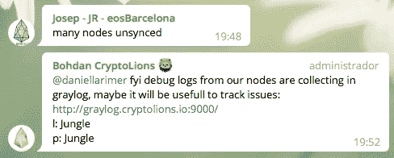

# 这就是我们如何在 1.0 #EOSIO 发布前 11 天连续两次攻破 Jungle Testnet 的

> 原文：<https://medium.com/coinmonks/thats-how-we-broke-jungle-testnet-twice-in-a-row-eleven-days-before-1-0-eosio-release-ef996495df?source=collection_archive---------4----------------------->

**首先**:本文与 2018 年 6 月 16 日 EOS Mainnet 暂停没有任何关系。本文涵盖了 2018 年 5 月 20 日 Jungle Testnet 中的受控压力测试。

2018 年 5 月 20 日—黎明 4.0 EOS 版(1.0 版发布前 11 天)

[EOSMetal](https://medium.com/u/af7c15cbbf20?source=post_page-----ef996495df--------------------------------) 团队，EOS BP 候选人，积极参与 Jungle Testnet(EOS Mainnet 启动前最重要的测试网)和我们的节点“mosquito meta”(64GB 内存和 8 个内核)。我们的目的是及时了解与该软件相关的所有新闻，当然我们想将网络推向极限，以了解它能承受多远。

我们知道，凭借我们在关键系统领域 20 多年的经验，我们可以为社区做些好事。

Jungle Testnet 是一个试验和学习 EOSIO 软件的好地方。这个测试网是由 Cryptolions 管理的，主要是 Bohdan 作为系统管理员，在他们的 Github 中有一个非常活跃的电报通道和许多非常好的 EOSIO 软件。

我们的第一个目标是了解 Testnet 节点每秒可以处理多少事务，并使用 Testnet Monitor(Cryptolions 的另一个伟大工具)实时监控所有节点的状态。为此，我们使用了一个简单的 Linux 脚本，它使用每个节点的 HTTP 端点向网络发送随机事务。为了开始压力测试，我们首先需要使用丛林测试网资源的标记，所以我们向 Bohdan 请求:

Bohdan transferred 10Millions to our account

With the staked tokens, we have plenty of CPU and Net Bandwidth to execute transactions in Jungle Testnet

Some explanations from [Daniel Larimer](https://medium.com/u/1d906c7421de?source=post_page-----ef996495df--------------------------------) about how limits works

当然啦！丛林测试网的其他 BP 加入了 TRX 党

派对开始了！

We used [https://github.com/CryptoLions/TX-test-sender](https://github.com/CryptoLions/TX-test-sender)

开始几分钟后，我们得到了第一个结果(大量的红色)

most nodes were flooded, and other Bps wanted join to the party too

而噩梦，开始了…

The effect was nodeos service consuming 100% CPU

We informed [Daniel Larimer](https://medium.com/u/1d906c7421de?source=post_page-----ef996495df--------------------------------) about our test results

关于资源限制的一些解释

在这种情况下，有可能恢复丛林测试网，我们再次开始，但与一个更重的压力测试发布交易与 20k 的长备忘录

噩梦又开始了…

几分钟后，所有节点被淹没，最后丛林测试网崩溃

Alfter request of Bohdan, We stopped the flood

丛林测试网死了，没有恢复的可能

还有[丹尼尔·拉里默](https://medium.com/u/1d906c7421de?source=post_page-----ef996495df--------------------------------)帮助了我们

New tools for recovery were created

第二天，丛林测试网死亡 24 小时后，经过多次恢复尝试，Blockone 分析了块日志，并建议重新启动链

超级 Bohdan 开了一家新连锁店

All BPs had to rejoin

当然，在 Jungle Testnet 再次启动后的下一步，我们的节点 mosquitometa 重新投入业务并生产区块，我们希望验证前一天发生的事情不是偶然的，因此我们开始了新的压力测试:)

First, only my node was overloaded

大约两个小时后，噩梦再次出现…

Send TRX with Long Memo is confirmed as the root case of the problems

All nodes were unsynced

丹尼尔提出了新的改进

Blockone, adds a new P2P protocol called bnet for better performance

并修复了交易中备忘录大小的错误

limit memo from 40k to 256 bytes

几个小时后，丛林测试网从零开始重新启动

我们发现了链条中的另一个问题

New tag was made and all nodes were updated fixing different issues (same day!)

我们又开始对新标签进行压力测试，结果非常好:

662 Transactions per second, without problems

一切都很好，我们学到了一些教训

还有一些工作要做

感谢所有参与 Jungle Testnet 的人以及他们在那两天里的耐心和辛勤工作(没有所有这些专业人士，我们永远无法测试它)，感谢 B1 在我 20 年的经历中所见过的最快的支持。

在这种没有休息的紧张工作之后，我们很高兴能为这一非常重要的事业做出贡献。

**非常重要的是** **重要的是**那些在 mainnet 推出之前一直在 testnets 中努力工作的**小团队****能够获得足够的票数来生存**。这些团队背后没有庞大的营销机器，但他们在技术领域拥有非常优秀的专业人员。

**我们希望继续为社区做出贡献**，帮助为 EOS 创建一个更好、更安全的 mainnet，但为此我们需要您的投票。有了您的投票，我们可以获得奖励，继续合作，在 Mainnet 中测试真正的 dapps，制定灾难恢复程序，并使 EOS mainnet 变得更大更好。

我们没有营销团队，我们是技术系统管理员，我们每天都在真实的生产环境中不间断地工作。我们可以贡献很多，就像我们在丛林中证明的那样。如果你有问题，你可以顺便访问我们的电报频道:[https://t.me/EOSMetal](https://t.me/EOSMetal)和 EOS 西班牙语频道:[https://t.me/eosEs](https://t.me/eosEs)。

当然，你可以为我们投票！敬我们英国石油公司的候选人“eosmetaliobp”

*真诚地，你的*[*EOS metal*](https://medium.com/u/af7c15cbbf20?source=post_page-----ef996495df--------------------------------)*团队*