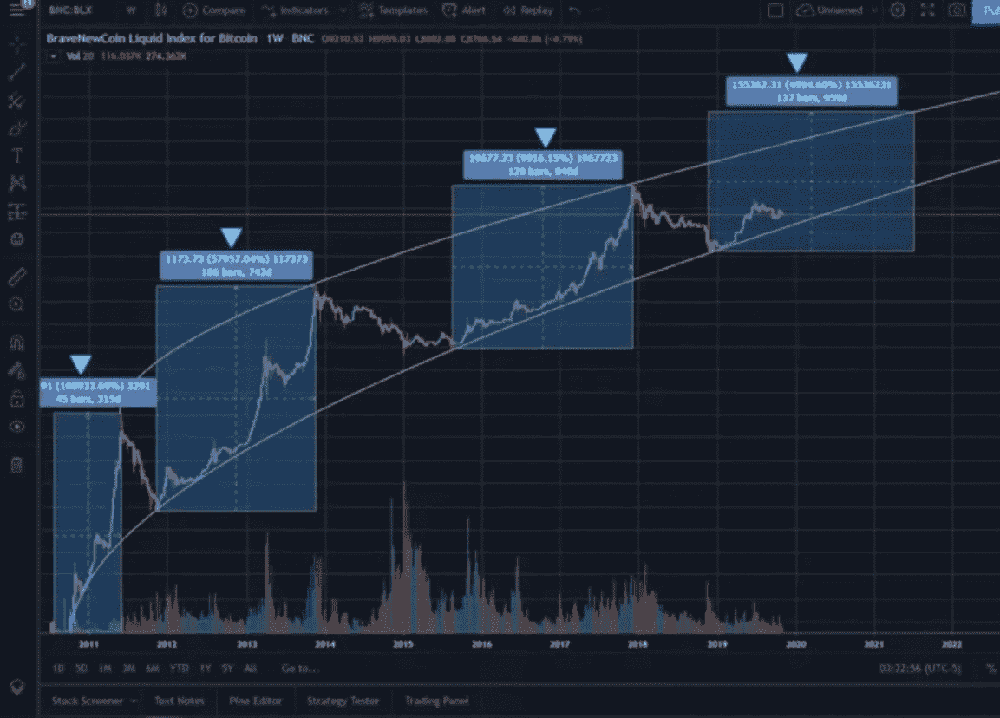
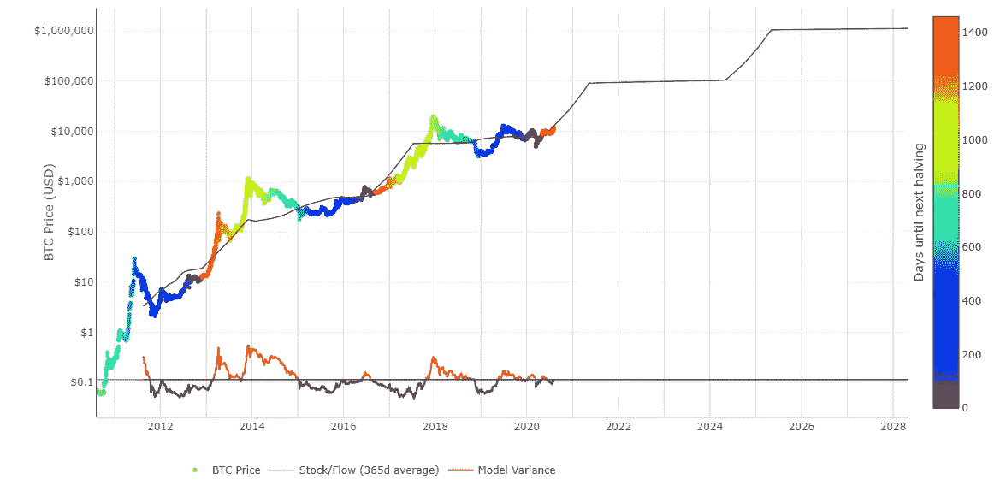

# 2020 年比特币牛市减半:为什么这个周期不同

> 原文：<https://medium.com/coinmonks/the-2020-bitcoin-halving-bull-run-why-this-cycle-is-different-80d8af4ce8b6?source=collection_archive---------0----------------------->

无论你是新手还是老手，比特币世界中最受期待、最受庆祝、最受关注的事件之一就是减半。大约每隔四年，矿工赚取的比特币数量就会减半。每开采 210，000 个区块就会自动触发通缩，这可能是比特币协议中内置的最重要的一个功能，可以自动减少进入流通的硬币数量。

早在 2009 年比特币出现的时候，矿工每开采一个区块就能获得 50 BTC 的奖励。在 2012 年 11 月第一次减半之前，最初几年大约铸造了 1050 万枚比特币。当这第一次减半发生时，比特币矿工每块获得的金额被减半——降至 25 BTC。同样，下一次减半——2016 年 7 月将矿工奖励削减至每开采一个区块 12.5 BTC，2020 年 5 月，奖励自动降低(减半)至每区块 6.25 BTC。

# 比特币减半和随后的牛市

每次减半后的几个月都是牛市，我们看到比特币的价格大幅上涨。因为减半显著减少了新 BTC 进入流通的数量，这就造成了稀缺性。这是简单的供求经济学。

举例来说，在 2012 年 11 月第一次减半的当天，一个比特币的价格约为 11.50 美元。在接下来的 12 个月里，比特币的价格在 2013 年 4 月下旬升至 270 美元。

Bitcoin halving cycles. Each halving cycle has been longer and not as strong as the previous cycle.

快进到 2016 年 7 月的下一次减半。比特币在 2016 年 7 月 9 日(第二次减半的日期)的价格约为 650 美元。在接下来的 18 个月里，包括许多波动起伏，到 2017 年 12 月，比特币的交易价格仅为 2 万美元左右。

大多数人认为，比特币减半事件是随后市场牛市的催化剂。毕竟，比特币的价格在 2012 年和 2016 年各减半后的一段时间里升值了 12，000%以上。关于前两次减半，一个有趣的事实是——比特币经历大致相同的增长和价格升值需要两倍的时间(2016 年第二次减半的 1067 天，而 2012 年第一次减半的 513 天)。

许多 T-A(技术分析)专家的一个关键收获是比特币减半导致牛市的时期，牛市没有上次那么强劲，但时间也比上次稍长。取决于你订阅(或相信)谁，2020 年 5 月刚刚发生的第三次比特币减半将比上一次时间长一点，但没有那么强劲。同样，取决于你在比特币世界中听谁的权威人士，比特币价格已经被固定在即将到来的 2020-2021 年牛市的顶部，在 120，000 美元到 288，000 美元(或更多)之间。在这种最好的情况下(基于撰写本文时比特币价格约为 15000 美元，这将产生 8 倍至 20 倍的投资回报率。还不错。一点也不差。但是我大胆地说，他们是错的。

# 为什么这次牛市与众不同

PlanB 的 Stock 2 Flow 模型引发了关于比特币未来几年增长趋势的辩论。它预测，到 2021 年底，比特币的价格将在 10 万美元至 28.8 万美元之间。就像钟表一样，比特币的价格似乎完美地跟随这一模型。我在这里告诉你，虽然很棒，但 PlanB 的预测将低于实际表现，因为他没有包括使这个周期*与前两个周期*有很大不同的重要因素。

PlanB’s Stock 2 Flow model predicts Bitcoin’s price between $100,000 and $288,000 by the end of 2021.and over $1 million by 2025.

看，我不是一个蓝天，一切都很美好的人。但我喜欢认为我的杯子是半满的，而不是空的。我绝不是助教专家。但是比特币的牛市周期将会不同——*非常不同*。回报将令人瞠目结舌。这是即使是最好的助教专家也没有考虑到的。

这个周期将受到没人能预料到的事件——新冠肺炎——的影响。新冠肺炎的蔓延和余波以及其他因素以我们无法想象的方式影响了世界(和比特币)。

*   社会封锁导致企业以惊人的速度倒闭，
*   失业率达到我们有生以来从未见过的惊人水平，
*   世界各国政府无休止地印刷法定货币来支撑经济(推动通货膨胀或恶性通货膨胀)，
*   **利率进入负值区域**促使创纪录数量的公司转向价值避风港，
*   害怕接触或传播新冠肺炎**的人不想处理实体货币**(以及随后加速和快速采用加密货币)、
*   **公司以前所未有的数量倾倒现金**支持比特币(这里有一篇[的文章](https://mitchkoul.medium.com/what-if-the-top-10-public-companies-with-the-most-cash-bought-bitcoin-e27ed5a89fa9)说明了这一点)疯狂抢购对冲通货膨胀，
*   **微软战略、贝宝、Square 等企业和金融机构以及灰度和保真等基金的主流采用**，
*   **普通大众(零售)采用率**达到一年前都无法想象的水平，因为人们疯狂地期待比特币在对抗通胀中保值，
*   **整个国家转向比特币**来稳定经济，
*   **与之前的周期相比，比特币市场的整体成熟度**,以及
*   **供应如此稀缺**，比特币的价格被推高到以前认为不可能的高位。

这些基本(但重要)因素造就了比特币的完美风暴。之前的两次降价都没有类似的市场环境，既有严峻的经济形势，又有前所未有的主流采用率。比特币只会越来越好。

这些因素变成了在电子表格中难以量化的通配符(或变量)。

因此，尽管许多 T-A 专家表示，我们今天即将进入的牛市周期会稍微长一些，但不会那么强劲，但我认为你错了。它会变得更长更强。

事实上，这些“完美风暴”的市场条件将为比特币带来一些没有人预期的东西。我们不仅会经历一个比前两次更长的牛市，而且会持续到 2024 年的下一个减半周期。这意味着比特币价格不会像我们在过去的周期中那样在某个时间点经历整体市场回撤，而是将继续牛市，直到 2024 年减半甚至更久。

请记住，矿工赚取的比特币数量在每个周期减少一半，使得下一次减半(2024 年)后，采矿的奖励只有 3.125 BTC。这并不是说比特币将会无限制地呈抛物线上升——它确实仍会经历两位数的修正。但我们不太可能看到持续的熊市，就像我们在上两次牛市后看到的那样。

这将导致 2024 年减半后的“稀缺挤压”，这将具有新的意义，并以全新的视角看待。购买整个比特币几乎是不可能的，更不用说以相对合理的价格购买了。

这种稀缺性将超出最狂热的比特币狂热主义者的想象，并为我们提供了比特币牛市的秘方。比特币的市值将轻松超过黄金(目前为 9 万亿美元)，甚至可能是黄金的 2 到 3 倍。直到 2024 年减半后的很长一段时间，比特币才会开始持平，迈开大步，成为世界上最重要的价值储存手段。

正如 MicroStrategy 首席执行官迈克尔·塞勒(Michael Saylor)最近所说，“比特币是我们这个时代最伟大的货币运动员。超级明星运动员在他们学习和掌握技术的第一个十年里是特殊的、神秘的、不稳定的。在他们的第二个十年里，他们粉碎了他们前进道路上的所有人和事。”这很好地概括了这一点。

我知道我会被书中的人骂得体无完肤，或者说我在市场的天空中吃了一个馅饼。但是，如果你退一步来看，情况和市场状况是相当清楚的。我上面提到的变量(市场条件)使得这个特殊的市场周期前无古人，后无来者。谁也说不准比特币在本周期的年终价格会如何下跌，直到 2024 年价格减半。但我不认为比特币的价格不会在 2021 年底升至 32.5 万美元以上，到 2025 年升至近 200 万美元是不合理或不可能的——因为这个周期的独特市场条件。

是的，一个 200 万美元的比特币现在很难想象。但这并不比 2012 年 15000 美元的比特币价格更难想象，当时比特币价格为 11.50 美元。今天的市场更加成熟，“完美风暴”的市场条件甚至在一年前都无法想象。这使得*这个*比特币牛市成为一代人一次的机会，你会很高兴自己成为其中的一员。这才刚刚开始。

**关于作者**

*Mitchell Koulouris 是比特币分析师和权威人士。你可以在*[*mitchkoul@gmail.com*](mailto:mitchkoul@gmail.com)*联系米切尔。订阅米奇的 YouTube 频道，比特币线人在*[https://www.youtube.com/c/BitcoinInformantShow](https://www.youtube.com/c/BitcoinInformantShow)。

## 另外，阅读

*   最好的[密码交易机器人](/coinmonks/crypto-trading-bot-c2ffce8acb2a)
*   [3 商业评论](/coinmonks/3commas-review-an-excellent-crypto-trading-bot-2020-1313a58bec92)
*   [AAX 交易所评论](/coinmonks/aax-exchange-review-2021-67c5ea09330c) |推荐代码、交易费用、利弊
*   [德里比特评论](/coinmonks/deribit-review-options-fees-apis-and-testnet-2ca16c4bbdb2) |选项、费用、API 和测试网
*   [FTX 密码交易所评论](/coinmonks/ftx-crypto-exchange-review-53664ac1198f)
*   [n 零审核](/coinmonks/ngrave-zero-review-c465cf8307fc)
*   [Bybit 交换评论](/coinmonks/bybit-exchange-review-dbd570019b71)
*   [3Commas vs Cryptohopper](/coinmonks/cryptohopper-vs-3commas-vs-shrimpy-a2c16095b8fe)
*   最好的比特币[硬件钱包](/coinmonks/the-best-cryptocurrency-hardware-wallets-of-2020-e28b1c124069?source=friends_link&sk=324dd9ff8556ab578d71e7ad7658ad7c)
*   [密码本交易平台](/coinmonks/top-10-crypto-copy-trading-platforms-for-beginners-d0c37c7d698c)
*   最佳 [monero 钱包](https://blog.coincodecap.com/best-monero-wallets)
*   [莱杰 nano s vs x](https://blog.coincodecap.com/ledger-nano-s-vs-x)
*   [bits gap vs 3 commas vs quad ency](https://blog.coincodecap.com/bitsgap-3commas-quadency)
*   最好的[加密税务软件](/coinmonks/best-crypto-tax-tool-for-my-money-72d4b430816b)
*   [最佳加密交易平台](/coinmonks/the-best-crypto-trading-platforms-in-2020-the-definitive-guide-updated-c72f8b874555)
*   最佳[加密贷款平台](/coinmonks/top-5-crypto-lending-platforms-in-2020-that-you-need-to-know-a1b675cec3fa)
*   [莱杰纳米 S vs 特雷佐 one vs 特雷佐 T vs 莱杰纳米 X](https://blog.coincodecap.com/ledger-nano-s-vs-trezor-one-ledger-nano-x-trezor-t)
*   [block fi vs Celsius](/coinmonks/blockfi-vs-celsius-vs-hodlnaut-8a1cc8c26630)vs Hodlnaut
*   Bitsgap 评论——一个轻松赚钱的加密交易机器人
*   为专业人士设计的加密交易机器人
*   [PrimeXBT 审查](/coinmonks/primexbt-review-88e0815be858) |杠杆交易、费用和交易
*   [Altrady 审查](https://blog.coincodecap.com/altrady-reivew)
*   [埃利帕尔泰坦评论](/coinmonks/ellipal-titan-review-85e9071dd029)
*   [赛克斯·斯通评论](https://blog.coincodecap.com/secux-stone-hardware-wallet-review)
*   [BlockFi 审查](/coinmonks/blockfi-review-53096053c097) |赚取高达 8.6%的加密利息
*   [Coinrule 评论](https://blog.coincodecap.com/coinrule-review-a-perfect-trading-bot)
*   [最佳区块链分析工具](https://bitquery.io/blog/best-blockchain-analysis-tools-and-software)
*   [加密套利](/coinmonks/crypto-arbitrage-guide-how-to-make-money-as-a-beginner-62bfe5c868f6)指南:新手如何赚钱
*   最佳[加密制图工具](/coinmonks/what-are-the-best-charting-platforms-for-cryptocurrency-trading-85aade584d80)
*   了解比特币最好的[书籍有哪些？](/coinmonks/what-are-the-best-books-to-learn-bitcoin-409aeb9aff4b)

> [直接在您的收件箱中获得最佳软件交易](/coinmonks/newsletters/coinmonks)

