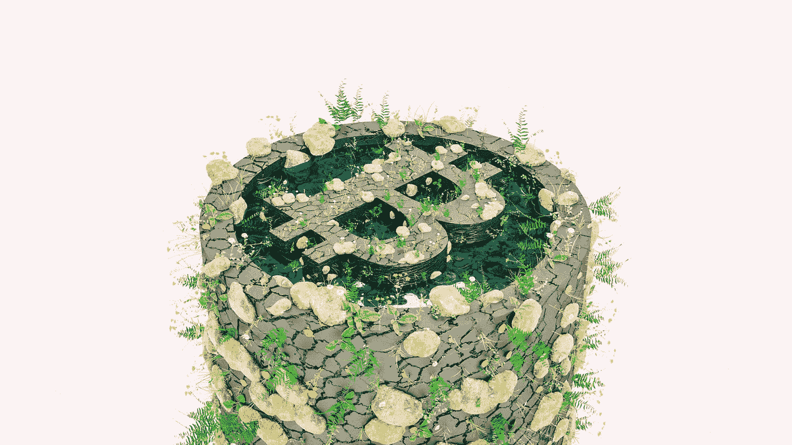

# 比特币炒作的 5 个原型

> 原文：<https://medium.com/coinmonks/the-5-archetypes-of-bitcoin-hype-3f6e56e05bc?source=collection_archive---------3----------------------->

## 我相信我们都听腻了第四条…

original art from [https://www.instagram.com/cryptoroho/](https://www.instagram.com/cryptoroho/)

每当比特币成为现在*臭名昭著的*之一时，世界各地的牛市、在线社区、博客和媒体疯狂地向[缓存发布故事，大肆宣传或为这种数字货币贡献他们的 2 美分](https://finance.yahoo.com/news/bitcoin-chatter-twitter-nears-highest-143512417.html)。这些讨论的特点是相同的一些评论、预测和故事——如此之多，以至于它们中的每一个都已经成为社区中的一种模因。下次比特币进入牛市时，我们将讨论**你会听到的 5 种人。**

## 1.“泡泡男孩”(或女孩)

这可能是我们在媒体上看到的最常见的比喻——每当比特币遭遇新的 [ATH](https://www.investopedia.com/terms/r/record_high.asp) ，你会看到每个人都在喊这个“泡沫”或“它将破裂”——好像比特币是唯一一种经历看似不合逻辑的狂热牛市波动的投机资产。投机性资产价格往往不合逻辑，缺乏基本面基础。这当然是因为人类的行为是不合逻辑的。这有点像第二十二条军规，因为如果不合逻辑的人类行为决定了一个高价点，那么这个高价点真的不合逻辑吗？如果价格在几天或几周内下降，答案将是响亮的肯定。但是，如果这种飙升是由*不合逻辑的*人类购买模式推动的，创造了一个正反馈循环，在这个更高的价格点巩固了上述资产——*这真的是一个“泡沫”吗*？但是我跑题了。

another bubble claim

传统金融公司和主流媒体喜欢喊“泡沫！每当比特币价格飙升，因为他们找不到“为什么”背后的原因。".然后，他们开始(半)毫无根据地指责数字货币投资者的无知和绵羊般的行为(*多么讽刺*)。

## 2.《迈克菲》

这个滑稽的比喻虽然不那么普遍，但在比特币的讨论中不时出现。“迈克菲”是指一个人发誓说比特币会在离现在太近的某个日期达到某个天文数字。当然，这个比喻的名字来自于约翰·迈克菲，他曾以承诺如果比特币在 2020 年 12 月 31 日没有达到 100 万美元的话，他会“吃掉自己的老二”而闻名。好了，现在是 2021 年，[《变弱的 T3》终于过去了，约翰·迈克菲的迪克等待清算。尽管这个比喻中有名无实的反英雄发现自己处于进退两难的境地，但“迈克菲”仍然依靠比特币生存。下次比特币遭遇牛市时，请小心他们。](http://dickening.com/)

The Dickening begins…

## 3.《 [FOMO](https://en.wikipedia.org/wiki/Fear_of_missing_out) ngers》

“每个人”。失败者。那个傻瓜。或许是最多样化的个人群体，任何比特币投资者都曾在某个时候感受过再熟悉不过的 FOMO。这群天真的投资者和博客试图[登上炒作列车](https://www.bloomberg.com/news/newsletters/2021-01-21/bitcoin-investing-why-people-are-buying-the-cryptocurrency-now?utm_medium=social&utm_campaign=socialflow-organic&utm_content=business&utm_source=twitter&cmpid=socialflow-twitter-business)为时已晚，最终在列车到达目的地时跳上了列车。你真的不能责怪“煽动者”，他们以前听说过比特币，但在错误的时间被炒作迷住了。我们都曾在某个时刻来到这里，这很自然。这就是为什么这个统计数据是我最喜欢的，也是其中最不迟钝的。他们保持开放的心态和健康的好奇心。危险之处在于，当这种 FOMO 表现为对你的房子进行再融资或出售你的汽车，在华尔街押注比特币时。

## **4。《神谕》(或《被选者》)**

开始了。又是这些家伙。每个人都认识一个人，他认识一个对比特币有预感的人；也许他们真的读过白皮书——也许他们理解密码学或者相信 DLT 的力量。不管怎样，他们现在可能很富有。“神谕”是计算机书呆子，他们可能在 [ASIC](https://en.wikipedia.org/wiki/Application-specific_integrated_circuit) s 和增加[方块难度](https://www.blockchain.com/charts/difficulty)之前，利用他们学校的计算机秘密开采比特币。“被选中的人”代表了这种比喻的另一种形式，其特点是他们从未购买任何比特币，而是以比特币的形式获得*报酬*。当他们在 Craiglist 上卖掉一些旧耳机或者几个比萨饼时，他们很快接受了这种数字货币。现在互联网不会停止提醒你。

## 5.[失落的男孩](https://www.nytimes.com/2021/01/13/business/tens-of-billions-worth-of-bitcoin-have-been-locked-by-people-who-forgot-their-key.html)

毫无疑问， ***阵容中最悲惨的*** 人物。这群人，通过一系列不幸的事件，最终丢失了他们的私人比特币密钥。如果你不知道，你的私人密钥，一系列的字母和数字，存储你的比特币持有量。作为一个人，你必须写下这个键来记住它。如果你丢失了你写它的那张纸，或者你写它的记事本文件(请不要把你的密钥写在记事本文件上……)，那么你的比特币就永远丢失了。“失落的男孩”永远不会声称他们的未开发的财富，因此将漫无目的地走在地球上一个永久的非肮脏的丰富状态。

## 我错过什么了吗？

这绝不是一份详尽的清单。我很想知道其他人对这 5 个比喻的看法，以及是否有我可能错过的重要比喻。

如果你喜欢这篇文章，并想要更多的喜欢，你可以在媒体上关注我。或者如果你在最无聊的社交媒体上，[在 LinkedIn](https://linkedin.com/in/graham-sahagian/) 上和我联系。

> 加入 Coinmonks [电报集团](https://t.me/joinchat/EPmjKpNYwRMsBI4p)，了解加密交易和投资

## 另外，阅读

*   什么是[闪贷](https://blog.coincodecap.com/what-are-flash-loans-on-ethereum)？
*   最好的[密码交易机器人](/coinmonks/crypto-trading-bot-c2ffce8acb2a)
*   [3 商业评论](/coinmonks/3commas-review-an-excellent-crypto-trading-bot-2020-1313a58bec92) | [Pionex 评论](/coinmonks/pionex-review-exchange-with-crypto-trading-bot-1e459d0191ea) | [Coinrule 评论](https://blog.coincodecap.com/coinrule-review-a-perfect-trading-bot)
*   [AAX 交易所评论](/coinmonks/aax-exchange-review-2021-67c5ea09330c) | [德里比特评论](/coinmonks/deribit-review-options-fees-apis-and-testnet-2ca16c4bbdb2) | [FTX 密码交易所评论](/coinmonks/ftx-crypto-exchange-review-53664ac1198f)
*   [n 零审核](/coinmonks/ngrave-zero-review-c465cf8307fc)
*   [Bybit Exchange 审查](/coinmonks/bybit-exchange-review-dbd570019b71) | [Bityard 审查](https://blog.coincodecap.com/bityard-reivew)
*   [3Commas vs Cryptohopper](/coinmonks/3commas-vs-pionex-vs-cryptohopper-best-crypto-bot-6a98d2baa203)
*   最好的比特币[硬件钱包](/coinmonks/the-best-cryptocurrency-hardware-wallets-of-2020-e28b1c124069?source=friends_link&sk=324dd9ff8556ab578d71e7ad7658ad7c)
*   [总账与 n 平均](https://blog.coincodecap.com/ngrave-vs-ledger)
*   [密码本交易平台](/coinmonks/top-10-crypto-copy-trading-platforms-for-beginners-d0c37c7d698c)
*   [莱杰 nano s vs x](https://blog.coincodecap.com/ledger-nano-s-vs-x)
*   [沃德评论](https://blog.coincodecap.com/vauld-review) | [尤霍德勒评论](/coinmonks/youhodler-4-easy-ways-to-make-money-98969b9689f2) | [区块链评论](/coinmonks/blockfi-review-53096053c097)
*   最好的[加密税务软件](/coinmonks/best-crypto-tax-tool-for-my-money-72d4b430816b) | [硬币追踪评论](/coinmonks/cointracking-review-a-reliable-cryptocurrency-tax-software-5114e3eb5737)
*   最佳[加密借贷平台](/coinmonks/top-5-crypto-lending-platforms-in-2020-that-you-need-to-know-a1b675cec3fa)
*   [莱杰纳米 S vs 特雷佐 one vs 特雷佐 T vs 莱杰纳米 X](https://blog.coincodecap.com/ledger-nano-s-vs-trezor-one-ledger-nano-x-trezor-t)
*   [block fi vs Celsius](/coinmonks/blockfi-vs-celsius-vs-hodlnaut-8a1cc8c26630)|[Hodlnaut 审查](https://blog.coincodecap.com/hodlnaut-review)
*   [Bitsgap 审查](/coinmonks/bitsgap-review-a-crypto-trading-bot-that-makes-easy-money-a5d88a336df2) | [四项审查](/coinmonks/quadency-review-a-crypto-trading-automation-platform-3068eaa374e1)
*   [埃利帕尔泰坦评论](/coinmonks/ellipal-titan-review-85e9071dd029) | [赛克斯斯通评论](https://blog.coincodecap.com/secux-stone-hardware-wallet-review)
*   [BlockFi 评论](/coinmonks/blockfi-review-53096053c097) |在您的密码中赚取高达 8.6%的利息
*   [DEX Explorer](https://explorer.bitquery.io/ethereum/dex) 和[区块链 API](https://explorer.bitquery.io/graphql)
*   [加密套利](/coinmonks/crypto-arbitrage-guide-how-to-make-money-as-a-beginner-62bfe5c868f6)指南:新手如何赚钱
*   最佳[加密制图工具](/coinmonks/what-are-the-best-charting-platforms-for-cryptocurrency-trading-85aade584d80)
*   了解比特币最好的[书籍有哪些？](/coinmonks/what-are-the-best-books-to-learn-bitcoin-409aeb9aff4b)

> [直接在您的收件箱中获得最佳软件交易](/coinmonks/newsletters/coinmonks)

