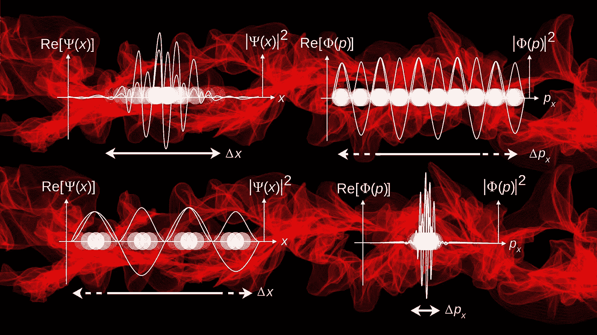

# 有可能摧毁比特币的 5 大威胁

> 原文：<https://medium.com/coinmonks/the-5-biggest-threats-for-bitcoin-that-have-the-potential-to-destroy-it-9b3845ebcd1d?source=collection_archive---------0----------------------->

比特币专门用于作为货币服务于人类的用例。从技术的角度来看，它试图尽可能容易和安全地实现这个目标——尽可能多的代码，但尽可能少的代码——这样就不会使事情变得不必要的复杂。比特币留了下来。

所有比特币的数量限制在 2100 万，但你可以将这个数量除以小数点后第八位，直到一个 Satoshi。然而，超过 80%的可能比特币已经在流通。但是不要忘记，作为加密货币的比特币和作为底层技术的区块链仍然非常年轻。比特币是个孩子。目前的版本号是 0 . 17 . 0——换句话说:该软件甚至还没有达到 1.0 版本，最后一个可用的比特币将在 2140 年被开采(或者铸造，如果你喜欢这个术语的话)。如果你认为这个时间点(而不是任意分配一个版本号)是成年年龄，那么比特币的“年龄”是 19 个月——假设 21 年是成年年龄。18 岁等于 16.5 个月。因此，比特币不仅是一个孩子，还是一个婴儿！

比特币显然在其生命的第一阶段表现良好。如果你坚持与一个蹒跚学步的孩子相比，比特币只是在学习如何爬行，或者正在迈出第一步。还是第一语言技能的获得和交流的意愿在诸如闪电网络的发展中表现出来了？现在推测还为时过早。

# 会出什么问题呢？

从比特币的年轻以及墨菲定律的应用来看，比特币在未来的生活中会面临很多危险。一段时间以来，我一直在思考比特币可能面临的危险，这可能会让他的存在戛然而止。这是由于生命的不可估量性和相对较短的人类寿命，这个列表是相当笼统的，并不声称是详尽无遗的！

自己判断:

# 5.太阳耀斑或日冕物质抛射

几乎在任何地方撞击地球的[日冕物质抛射](https://en.wikipedia.org/wiki/Coronal_mass_ejection)的直接撞击，会直接导致所有没有封装在法拉第笼中的电气设备和电子设备的毁灭。

铺设在地面上的电缆就像横跨整个大陆的全球天线。它们将日冕物质抛射的巨大能量直接传导到变电站，这些变电站遭到了不可挽回的破坏。全球卫星网络也毁于一旦，分分钟成为太空垃圾。所有连接到电网的私人电脑，如果没有完全封闭的接地金属外壳提供足够的屏蔽，都将被销毁。硬盘上的内容是否仍然可读值得怀疑。甚至地下计算机中心也只有部分受到保护。只有当它们能够足够早地与电网断开连接，并且系统能够足够快地关闭，存储的数据才有机会存活下来。

人们可能会想，如果这样的灾难发生，人类除了拯救比特币还有其他问题。但这种思维方式是错误的。尤其是在全球通讯、政府、银行、基础设施、生产、食品供应、安全等发生故障的情况下。作为一种全球通用的、可靠的货币，它将变得极其重要，它能确保价值和价值的快速跨境转移。

假设所有的挖掘设施都被一举摧毁，那么剩下的完好的比特币节点必须首先再次相互联系。这需要恢复电网和互联网。节点将相对快速地同意它们认为有效的事务。但是新区块的开发首先停止。难度太高，目前的硬件无法在十分钟内生成一个有效块。即使硬件制造商和大型采矿设施仍然有硬件库存，他们很可能在获得足够的电力以恢复全面运营方面存在重大问题。然而，可以假设仍然存在一些孤立的硬件，它们正以非常分散的方式投入运行。理想情况下，难度应该每 14 天降低一次，直到批量生产再次开始。我不确定难度调整算法能不能重新开始方块制作。但即使情况并非如此，实现和发布新的软件版本，允许在 CPU 上再次挖掘或手动降低难度，也将很快纠正这种情况。和往常一样，大多数节点接受并激活一个新的分支，就如何继续下去达成共识。

根据预测科学公司(Predictive Science Inc .)的物理学家皮特·赖利(Pete Riley)在 2012 年发表的一份报告，地球在 2012 年至 2022 年期间遭受卡灵顿级风暴袭击的几率为 12%。

比特币应该能够在太阳耀斑中存活。能否以足够的速度和决心采取措施保护比特币的完整性并确保其继续存在，令人质疑。

这同样适用于类似的全球灾难(超级火山爆发、冰河世纪或全球核战争)，这些灾难对基础设施的破坏足以让比特币区块链的区块形成停止。不幸的是，此时我想引用阿尔伯特·爱因斯坦的话:

> 我不知道第三次世界大战会用什么武器，但第四次世界大战会用棍子和石头。

阿尔伯特·爱因斯坦，1949 年

# 4.量子计算

尽管不同概念的不同团队在高压下致力于量子计算机的开发，但距离具有足够计算能力的功能性[量子计算机](https://en.wikipedia.org/wiki/Quantum_computing)还有很长的路要走。但是时间会到来的…

比特币的哈希算法被称为 SHA-256。在块形成和事务处理中，节点从未处理的事务中竞争构建块，并试图在其上形成哈希值，该哈希值具有一定数量的前导零，这取决于难度级别。谁赢得了这场比赛，并发布了一个满足这一条件的区块，并被网络接受，就可以获得奖励。这些计算非常广泛，并且对应于解决方案的“试错法”——这是一种暴力攻击。目标区块形成时间为十分钟。在目前的难度水平下，这一时间跨度只能通过大量使用高度专业化的芯片(ASIC)来坚持。假设无论如何不改变哈希算法，这就是使用量子计算机可能存在危险的症结所在。

普通计算机能够用 0 或 1 的信息单位进行数字计算，即所谓的比特。量子计算机则不同。它们接受所有可能的值，因此能够同时用这些超级信息状态执行计算。这样的信息单位被称为量子位。如果我们可以将足够数量的量子位元互相连结，平行可执行算术运算的数量会以指数方式增加。问题在于决定结果。

一台正常运行的量子计算机可以在实际标准运算单元所能完成的时间的几分之一内，完成交易确认和区块形成的大部分可能解决方案的“测试”。因此，它可能形成更长的区块链，并且类似于 51%攻击，使所有已经处理并且看起来有效的交易无效。如果这是秘密发生的，那么必须假设比特币的完整性受到了严重威胁。一台量子计算机可以很快地将大量的数据块压缩回几个月或几年前的状态。必要的回滚将是毁灭性的。没人会再相信比特币了。比特币能否从这样的打击中恢复过来是个问题。

但是有保护。如果哈希算法能早一点转变为“量子计算机安全”版本，比特币就能轻而易举地抵御这种攻击。量子安全算法已经开发出来，但显然还没有经过测试。由于量子计算机的开发只有极少数政府、公司和研究机构在进行，因此应该有可能在适当的时候采取行动。同样值得怀疑的是，对比特币的攻击是否会成为量子计算机的第一目标。但危险仍然存在:在正确的情况下，一台具有足够处理能力的正常运行的量子计算机对比特币网络当前形式的存在构成了潜在威胁。

# 3.代码中的软件错误

但也许你不需要一台量子计算机来危及比特币的完整性，使回滚成为必要，并让比特币因缺乏信任而死亡。在对普遍接受和使用的客户端进行编程时，一个简单的错误就可能毁掉比特币。

上面描述的场景比人们想象的要接近。在核心客户端的 0 . 13 . 0–0 . 16 . 2 版本中，有一个重复支出的 bug。在验证交易并将其分组时，大量的技术工作被投入到消除所谓的“双重花费”中。这是中本聪 2009 年发布的比特币白皮书主要关心的问题。作为一种数字货币，比特币必须确保价值不会先转移到一个地址，然后再转移到另一个地址。这就像花一美元两次。上午去买电影票，下午去喝咖啡。显然，对于纸币来说，双重消费不可能发生，对于数字金融交易来说，银行确保双重消费是不可能的，但在比特币网络中，作为监管机构的第三方被排除在外。这是通过将有效事务写入区块链并为块提供时间戳来实现的。只有第一次交易被认为是合法的，所有进一步的交易都被网络丢弃。

由于版本 0 . 13 . 0–0 . 16 . 2 中的软件缺陷，有可能造成双重支出。然而，要利用这个漏洞，需要相当大的哈希能力，也需要摧毁比特币的巨大意愿。这两个因素显然没有结合在一起。由于区块链是一个“公开分类账”，重复支出的发生受到长期监测。

危险依然存在。该漏洞已为公众所知，可以观察到可能的利用。比特币核心开发团队以广泛测试新版本而闻名。然而，类似的错误可能会在未来再次发生，在不同的情况下，银行、政府或公司可能会通过破坏比特币的完整性来摧毁比特币。除此之外，具有足够哈希能力的随机恶意节点也可能导致无效块。对软件错误 100%免疫是不可能的，但是广泛的测试和公开的代码讨论应该提供足够的安全性。

# 2.破坏(例如出于政治原因)

这个想法似乎与利用软件漏洞的可能性有关，只是这里可能不是个人致富的意图处于最前沿，而是摧毁比特币的明确意愿。就不利用现有漏洞而言，具有破坏性意图的“坏人或政党”将有更多选择来攻击比特币网络。突然剥夺哈希能力、区块构建中断或禁止比特币专用的网络数据包、端口或基础设施都摆在桌面上。通过政府、硬件制造商和大公司的大规模联合，通过撤回或操纵硬件或基础设施，这将是可能的。

比特币似乎离“大到不能死”还很远，无法在这样的攻击中存活。目前，比特币就像一只蚂蚁在大象腿上撒尿。但这种看法可能会改变，不同全球行动集团和部门的合并可能会以摧毁比特币为目标。但即使攻击选项不可预见，比特币已经有了两张无人能敌的王牌。一个是通过独立开发者的灵活性和响应性。如果创建了攻击媒介，可以通过更改代码轻松应对。

类似于量子计算机的开发，社区将通过改变软件来抵御对比特币的攻击。通过改变哈希算法，恶意接管哈希功能会在几分之一秒内使整个硬件过时。这就是第二张王牌发挥作用的地方:用户接受度。只有被用户接受并大量使用的软件才是有效的。无论试图摧毁哪个版本的比特币，答案总是会融合成一个被足够多的用户接受的新版本。

这种攻击的可能性似乎非常小，因为几乎整个世界都必须联合起来摧毁比特币。在过去的几个世纪里，全世界团结的频率可以从全球和平与和谐的时期中看出，或者从联合国成立以来的团结中看出。

# 1.无知和不感兴趣

作为一个狂热的比特币爱好者，这种可能性实际上是我最后想到的，但出于无知和不感兴趣，我实际上看到了比特币或其他第二层技术(如闪电网络)的最大危险，这取决于比特币区块链的存在。

比特币有潜力成为不仅仅在互联网上使用的全球货币。没有必要发明出来消灭其他法定货币，相反，在全球大规模采用比特币的过程中，法定货币必须被用来评估比特币。最后，比特币必须被赋予一些既定价值中相对稳定的价值。比特币不应该成为单一货币，而应该成为独立于政府的主要货币，为每一个用户提供同样的好处。

在我看来，唯一阻碍这个长期目标的是无知和不感兴趣。如果人们不想认识或承认比特币的好处、价值和可能性，比特币肯定会消亡。因此，我认为霍德林是未来的一个问题，但目前仍然是一个必要的邪恶。每一个持有但没有花掉的 Satoshi，都对比特币转变为全球接受的主导货币产生反作用。其效果类似于储蓄法定货币。储蓄的钱(或黄金)从经济循环中撤出，通过减少流动性阻碍市场和经济发展。由于随着比特币的出现，还会产生投机操纵和集中效应，因此从长远来看，它会产生负面影响。无论如何，不幸的是，霍德林是目前(公众广泛感知的第一个大型估值泡沫破裂后不久)小投资者充分分享比特币好处的唯一途径！

我认为比特币因无知而死亡的几率极小，但这是有可能的。

# 结论

你可以从这些例子中清楚地看到，比特币并不充分，并对所有类型的攻击免疫，但仍然有理由相信比特币是你最喜欢的货币。针对可能危险的防御措施基于用户的接受，不受第三方善意的影响。

比特币的力量来自独立、完整和主权。比特币的未来只取决于一个因素:用户对比特币及其收益和价值的信任。

最后一句话
人们不应该完全忽视“比特币自杀”或某种自我毁灭的可能性。组织和执行不当的硬分叉或支持团体或开发者内部不同倾向之间的分歧，可能会结束“比特币”实验。这种争议在过去就已经开始了，但比特币已经主权地绕过了悬崖。当然，这并不一定意味着以后不会再发生。

> [在您的收件箱中直接获得最佳软件交易](https://coincodecap.com/?utm_source=coinmonks)

[**Click to read today’s top story**](http://bit.ly/2G71Sp7)