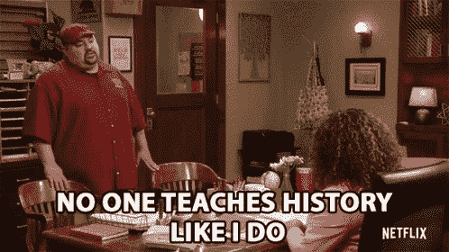
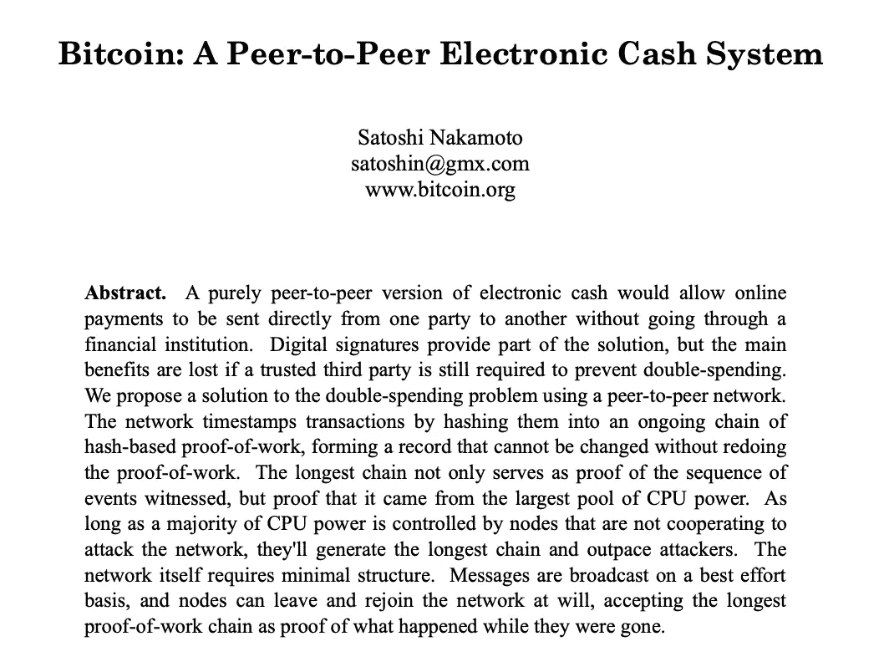
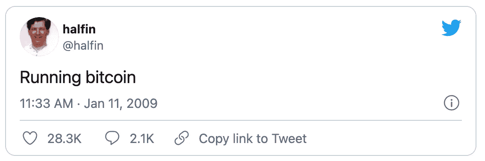
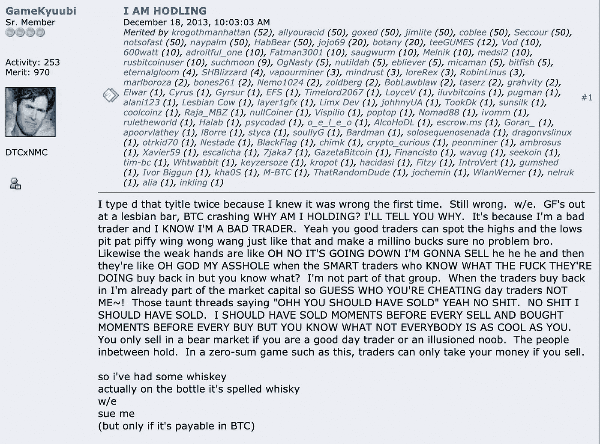

# 密码史上的 5 件大事

> 原文：<https://medium.com/coinmonks/the-5-important-events-in-crypto-history-437004ba53e2?source=collection_archive---------0----------------------->

## 塑造了我们所知的隐密体的著名时刻。

与我们所知的许多传统系统相比，比特币和整个加密行业仍然相对年轻。2008 年才被概念化的比特币，比目前涌入其中的大多数人都要年轻。

尽管如此，这是多事之秋的 13 年，相当一部分重大事件决定了 crypto 的发展方向。

这里有一些你可能已经知道的时刻，还有一些你将要了解的时刻！

Also, no one teaches you a bumpy ride like crypto does.

## 1.比特币起源板块

2008 年 10 月 31 日，中本聪撰写了一篇名为 *B* [*itcoin:一个点对点电子现金系统*](https://bitcoin.org/bitcoin.pdf) 的论文，其链接被发布到一个加密邮件列表中，从而为创造被称为比特币的神奇互联网货币埋下了种子。

这篇来自中本聪的论文后来被称为比特币白皮书。

Bitcoin.org was registered earlier in 2018\. [The Bitcoin whitepaper](https://bitcoin.org/bitcoin.pdf) was then published onto the website.

比特币网络于 2009 年 1 月 3 日诞生，当时中本聪创建了区块链的零号区块——创世纪区块。嵌在该块的 coinbase 中的是下面的文本。

> 泰晤士报 2009 年 1 月 3 日财政大臣濒临第二轮银行救助

这篇文章引用了《泰晤士报》的一个标题，并被解释为一个时间戳和对部分准备金银行引起的不稳定的评论。

## 2.哈尔·芬尼的传奇

2009 年 1 月 11 日**11 日**，中本聪进行了首笔 10 BTC 的个人对个人比特币交易。收到这笔交易的人不是别人，正是著名的计算机科学家和密码学家哈尔·芬尼。

同一天，哈尔·芬尼(Hal Finney)也在推特上表示，他正在自己现在已经名垂千古的推特上运行一个比特币节点。

[The legendary quote that started it all.](https://twitter.com/halfin/status/1110302988)

此外，哈尔是除中本聪之外管理比特币的第二人。

> 当 Satoshi 宣布第一次发布该软件时，我马上抓住了它。我觉得我是除了 Satoshi 之外第一个跑比特币的人。—哈尔·芬尼

哈尔·芬尼(Hal Finney)在比特币的发展中功不可没，这不仅仅是因为他是比特币的先驱。还因为他是可重复使用工作证明理论的支持者，该理论允许工作证明令牌被重复使用(比特币)，充当像货币一样的交易媒介。

不幸的是，2009 年晚些时候，他被诊断出患有 ALS，Hal 于 2014 年 8 月 28 日去世。

## 3.披萨日！

这一天，2010 年 5 月 22 日，已经成为民间传说的一部分，不是因为交易，而是因为价格:这名男子为这两个披萨支付了 10，000 比特币，今天价值超过 3.75 亿美元。

5 月 22 日现在被称为比特币披萨日。这名男子是拉斯洛·汉耶茨(Laszlo Hanyecz)，他同意支付 10，000 比特币购买两份外卖的棒约翰披萨。它最初是在 bitcointalk 论坛上组织的，当时 Laszlo 就以下问题寻求帮助:

> 我会花 10，000 比特币买几个披萨..比如两个大的，所以我有一些留到第二天吃——拉兹洛·汉耶茨

The picture that was posted by Laszlo Hanyecz after his order of 2 Papa John’s pizza came through. It also features his one-year-old daughter’s hand.

事后看来，这是已知人类历史上支付的最昂贵的披萨，然而，拉兹洛并不后悔花了比特币，因为他认为这是刺激比特币被采用的唯一方式。

> 这是一个非常有趣的系统，但没有人使用它，他说。如果没人用它，我拥有它也没关系。拉兹洛·汉耶茨

观看拉兹洛·汉耶茨《60 分钟》对安德森·库珀的采访片段，他在采访中谈到自己决定花掉大量比特币，同时与朋友庆祝披萨日。

## 4.为了亲爱的生命而坚持

密码字典中的一个词已经成功渗透到传统金融中，成为一个普通的投资术语，现在已经不仅仅是密码了。

你可能已经猜到了，这是 HODL。

事情发生在 2013 年 12 月 18 日(T1)，一个名叫 GameKyuubi 的用户在 [bitcointalk 论坛(T3)上发布了一个名为“我是霍德林”的条目。](https://bitcointalk.org/index.php?topic=375643.0)

> “我打了两次，因为我知道第一次是错的，”GameKyuubi 写道，他是第一个被判错别字的醉鬼

在帖子中，他咆哮着自己糟糕的交易技巧，以及在比特币价格暴跌之际，他打算简单地持有比特币。“只有当你是一个优秀的日内交易者或是一个被误导的新手时，你才会在熊市卖出，”他补充道。“在这种零和游戏中，只有你卖出，交易者才能拿走你的钱。”

多亏了 GameKyuubi，我们现在知道我们永远不应该在下跌时卖出，因为我们不是优秀的日内交易者，也不是虚幻的新手。

GameKyuubi has had one too much whisky and inadvertently became the HODL legend

## 5.比特币最大的抢劫案

Mt Gox 是一家总部位于日本的比特币交易所，在 2014 年初，它是世界上最大的交易所，处理全球 70%以上的比特币交易。然而，到了那年 2 月末**，它破产了。**

然而，这是一个保守的说法，因为任何使用 Mt Gox 的人都无法访问他们的钱包和资产。近 85 万个比特币(当时价值超过 8.5 亿美元)在黑客攻击中丢失，通过这次攻击，只有 20 万个比特币被找回。

这是唯一可能的，因为用户把他们的比特币放在交易所的热钱包里。从那以后，它就成了加密投资者的警示故事，被命名为一个被广泛重复的短语。

> 不是你的钥匙，不是你的硬币！

《财富》杂志有一部很好的纪录片，在 4 分钟内讲述了整个故事。

我希望你喜欢阅读这篇文章。请关注我，获取更多关于加密、区块链和 Web 3.0 的有趣文章！

*   [BlockFi vs Celsius](/coinmonks/blockfi-vs-celsius-vs-hodlnaut-8a1cc8c26630)|[Hodlnaut 点评](/coinmonks/hodlnaut-review-best-way-to-hodl-is-to-earn-interest-on-your-bitcoin-6658a8c19edf) | [KuCoin 点评](https://blog.coincodecap.com/kucoin-review)
*   [Bitsgap 审查](/coinmonks/bitsgap-review-a-crypto-trading-bot-that-makes-easy-money-a5d88a336df2) | [Quadency 审查](/coinmonks/quadency-review-a-crypto-trading-automation-platform-3068eaa374e1) | [Bitbns 审查](/coinmonks/bitbns-review-38256a07e161)