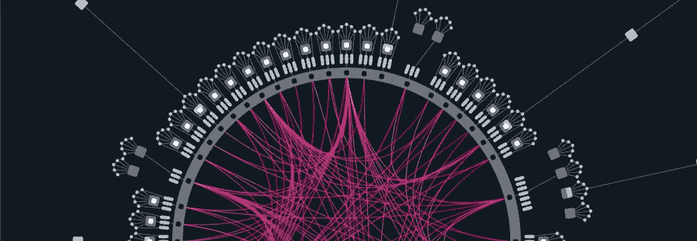
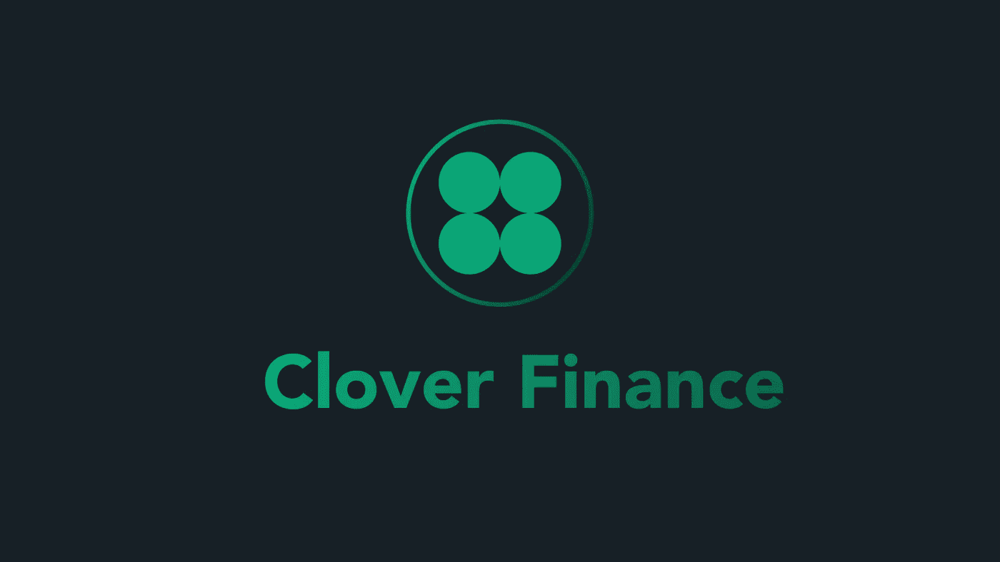
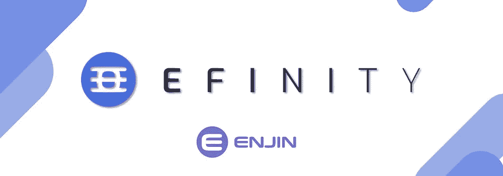

# 第五次也是第一批波尔卡多特人群拍卖的最后一次

> 原文：<https://medium.com/coinmonks/the-5th-and-the-final-for-batch-1-of-polkadot-crowd-auctions-26e9adac8fe1?source=collection_archive---------8----------------------->

~dwulf

**选手们**

**曼塔，隐私项目。**

我有点希望我把更多的这一点，但 Acala 和 Astar 的最大份额我的点。我尊重曼塔，希望他们赢。如果不是第一批，那么肯定是第二批。不幸的是，它可能是三叶草或 Efinity。老实说，我不太担心，Manta 肯定会参加第二批，我的目标是在这方面投入更多。

**三叶草**

好吧，我听说他们从阿卡拉的来源，这是我在围栏。我当然认为模仿是奉承的最好形式，然而，如果你要剪切粘贴并使之成为你自己的，就让它比你发现它时更好，并在它的基础上改进。Acala，已经得到了我的 DOT，如果 Clover 构建了比 Acala 更好的东西(用 Acala 的代码库)，只有这样我才会印象深刻。他们没有得到我的点，因为他们没有这样做。

**有效**

我真的对这个很有希望，但是他们超出了 Polkadot 的范围，首先处理 ERC20，然后处理 Polkadot。一些地理封锁，因为该死的监管者。我不怪他们，就像月光一样，都是伟大的工程。但如果他们向监管者屈膝，那就破坏了 5 个加密支柱，**(**Open；无国界；中立；抵制审查；我坚定地支持这些支柱。

**到目前为止的评估**

我对传播的感觉很好，Acala 是第一个赢家，这告诉我社区在正确的轨道上。Moonbeam 不会因为地理封锁而接受我，是的，我可以只使用 VPN，但我不确定回报是否会有 KYC 的附加条件，所以我决定通过。

当然，Astar 在第一批拍卖中胜出并不奇怪。智能合同集中在 EVM 和 WASM，他们有最好的机会更快地连接更多的区块链，我 100%支持他们的工程。

我把一点变成平行，使奖励范围多样化。但我只是浏览了一下他们的详细资料，没有听到任何不好的消息，我就继续下注。

对我来说，这使得 Manta 不确定他们是否会像我希望的那样在第一批中出现。如果它进入第二批，我会加倍下注，因为他们注重隐私。

**有** [**节**](https://learn.nodleprotocol.io/parachain/nodle-and-polkadot)

个人对物联网设备和所有东西都非常感兴趣 lora wan(**远程**的简称)是一种扩频调制技术，源自啁啾扩频(CSS)技术。Semtech 的 LoRa 是一个长距离、低功耗的无线平台，已经成为事实上的物联网(IoT)无线平台。

我为他们预留了一些点，当 Nodle 在拍卖台上得到时。我在给曼塔的分配和给诺德的储蓄之间权衡。曼塔越来越多，因为它是在拍卖线路上，但我也会为 Nodle 留出。

## **结论:**

毫无疑问，这可能是介入的最佳时机。我知道这是老生常谈，说它还为时过早，但它确实是。是的，这项技术已经存在了十多年，但是面对现实吧，人类，尤其是人类立法者、监管者和政府在采用这项技术方面进展缓慢。给你一个完美的机会，带着精确和确定的意图，一丝不苟地玩你的牌。

Polkadot 实际上是唯一的 0 级基础，1 级项目的春天正在从中绽放，Acala、Astar 和 Manta 是 1 级和 2 级互操作的完美风暴，通过直接的 API 交互，是完美的机制，以避免所有受监管的、KYC 授权的私钥漏洞与交换本身和不良第三方参与者共享。Polkadot 和 parachain 将提供退出旧世界经济的绝佳机会，并成为新世界经济的焦点。

> 加入 Coinmonks [电报频道](https://t.me/coincodecap)和 [Youtube 频道](https://www.youtube.com/c/coinmonks/videos)了解加密交易和投资

## 也阅读

 [## 获取信号、交易机器人和套利

### 在本文中，我们将回顾 Bitsgap，这是一个满足您所有交易需求的一站式加密交易平台。它…

blog.coincodecap.com](https://blog.coincodecap.com/bitsgap-review)  [## 40 个最佳电报频道，用于加密、电影、表演和演讲| CoinCodeCap

### 随着我们周围无限的信息，我们很难筛选和了解有价值的信息。电报有…

blog.coincodecap.com](https://blog.coincodecap.com/best-telegram-channels)  [## 5 个最佳社交交易平台[2021] | CoinCodeCap

### 困惑于社交交易和副本交易哪个平台最好？本文将带您了解各种…

blog.coincodecap.com](https://blog.coincodecap.com/best-social-trading-platforms)  [## BlockFi 评论 2021:利弊和利率| CoinCodeCap

### 今天，我们提出了一个全面的 BlockFi 评论，这是一个成立于 2017 年的加密贷款平台，拥有其…

blog.coincodecap.com](https://blog.coincodecap.com/blockfi-review)  [## 如何在印度购买比特币？2021 年购买比特币的 7 款最佳应用[手机版]

### 如何使用移动应用程序购买比特币印度

medium.com](/coinmonks/buy-bitcoin-in-india-feb50ddfef94)  [## 加密税务软件——五大最佳比特币税务计算器[2021]

### 不管你是刚接触加密还是已经在这个领域呆了一段时间，你都需要交税。

medium.com](/coinmonks/best-crypto-tax-tool-for-my-money-72d4b430816b)  [## 存储比特币的最佳加密硬件钱包[2021] | CoinCodeCap

### 保管您的数字资产很容易，但找到正确的存储方式却是一项繁琐的任务。在线钱包有一个风险…

blog.coincodecap.com](https://blog.coincodecap.com/best-hardware-wallet-bitcoin)  [## Pionex 评论 2021 |免费加密交易机器人和交换

### Pionex 是为交易自动化提供工具的后起之秀。Pionex 上提供了 9 个加密交易机器人…

medium.com](/coinmonks/pionex-review-exchange-with-crypto-trading-bot-1e459d0191ea)