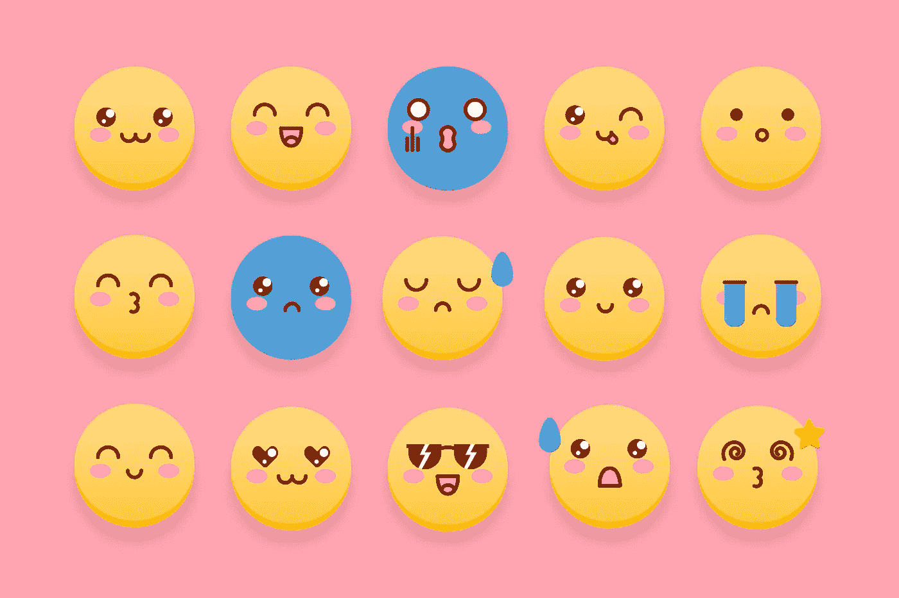

# NFT 买家的 7 个原型

> 原文：<https://medium.com/coinmonks/the-7-archetypes-of-nft-buyers-bdb7f700aacc?source=collection_archive---------2----------------------->

## 你是德根收藏家，分析型保守主义者，还是强迫症赌徒？

Cute vector created by mons.design — [www.freepik.com](https://www.freepik.com/vectors/cute)

自从我的第一次 NFT 之旅开始，它就带领我踏上了一段意外发现和好奇观察的旅程。最值得注意的是，我已经学会欣赏[一个社区对一个 NFT 项目的真正意义](https://www.ennetht.com/all-about-nft-blog/nft-deep-dive/community-a-key-metric-for-nft-investing)——你可以拥有一个看起来可疑的项目，它变得非常有价值…