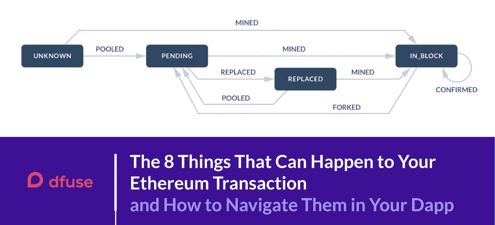

# 以太坊交易中可能发生的 8 件事以及如何在 Dapp 中浏览它们

> 原文：<https://medium.com/coinmonks/the-8-things-that-can-happen-to-your-ethereum-transaction-and-how-to-navigate-them-in-your-dapp-ed5b37470367?source=collection_archive---------1----------------------->

在[之前的一篇文章](/coinmonks/whats-wrong-with-dapps-on-ethereum-68d666645848)中，我们讨论了以太坊节点的固有限制以及这些限制对开发者的一些约束，并描述了 dfuse 平台可以如何提供帮助。在这篇文章中，我们将重点关注以太坊交易的复杂生命周期，以及当您试图在 dapps 中提供出色的用户体验时这些带来的挑战，以及 dfuse 如何提供帮助。

每当一个交易被提交到以太网，它就会以一种相当复杂的方式通过一系列的状态。并不是每一个状态转换都是向前的，一个事务可以返回到一个更早的状态，可以被另一个事务取代，或者可以完全脱离。(我们将在本文后面更详细地描述事务生命周期。)

使用 dfuse 毫不费力地跟踪事务状态在 dapp 中跟踪事务的过程，并为您的用户提供良好的体验，可能是一项挑战。今天，许多基于以太坊构建的 dapp 为他们的用户提供了有吸引力但静态的用户体验，这些用户体验显示了某个时间点的事务状态，并且必须被刷新(要么通过用户点击刷新，要么通过 dapp UI 定期刷新页面)以获得更新。其他的提供了更动态的接口，但是只能以相对粗糙的粒度来实现，和/或以高网络流量为代价，并且在它们的底层区块链节点上强加高负载。

在本帖中，我们将讨论这样做的原因，然后讨论如何在您的 dapp 中提供现代和流畅的用户体验，通过细粒度的事务状态更新，并以高度网络高效和服务器高效的方式。

# 今天的 Dapp 接口

每个 dapp 都需要向其用户显示关于 dapp 正在执行的底层区块链事务的信息，无论这些事务是以太网传输、令牌传输还是智能合约方法调用。

如今，许多 dapps 都有一种界面风格，在这种风格中，无论何时向用户显示关于其底层区块链操作的信息，该信息都反映了区块链在单个时间点(即页面显示的时间)的状态。

随着交易在其生命周期中的移动，用户经常需要更新的信息，例如了解何时完成转移，因此 dapp 要么提供“刷新”或“更新”按钮(或为用户自动刷新相同的页面)，要么用户使用浏览器的刷新按钮重新显示页面。

一些 dapps 更进一步，向用户显示动态事务更新。他们通过在页面后台轮询 AJAX 请求，反复检查以太坊节点的更新，然后将更改发布到前端来实现这一点。这是非常复杂的，因为 dapp 必须进行许多 API 调用，查询许多不同的数据源(包括块、内存池和网络条件),以便跟踪事务的生命周期直到完成。

这种方法也带来了一种折衷——要么事务更新不频繁且粒度较粗，这让用户感到沮丧，并诱使他们无论如何都要点击刷新以获得更快的更新——要么 dapp 必须以高频率轮询链，从而产生大量网络流量并给底层区块链节点带来高负载。

# 为什么不是事件驱动的界面？

事实上，静态页面或轮询是 dapp 开发人员的最佳选择，这反映了以太坊节点提供的 API 的本质。接收从区块链推送的事务更新并将它们实时反映给用户的事件驱动界面将提供更好的体验——但标准以太坊节点并不是为提供丰富的实时流事务数据而设计的。

以太坊节点确实提供了有限的事件流功能。这些事件流仅在使用 Ethereum 的 JSON-RPC 接口的发布/订阅功能时可用(使用 GraphQL 时不可用)。发布/订阅接口允许 dapps 订阅接收一些事件类型的通知:

*   **新标题** —每次一个新的块标题被附加到链中
*   **日志** —包含在新导入的块中并与给定过滤器匹配的日志
*   **newPendingTransactions** —添加到挂起状态并使用节点中可用的密钥签名的所有事务的哈希(公共节点上很少出现这种情况)
*   **同步** —指示节点开始或停止同步的时间

(详见[此处](https://github.com/ethereum/go-ethereum/wiki/RPC-PUB-SUB))

这些事件类型非常有限，无法让 dapp 在交易的整个生命周期中跟踪交易。

# 以太坊交易生命周期

以太坊交易有一个复杂的生命周期。每个事务经过多个定义的*状态*，在向前(或向后)移动时经历各种*状态转换*！)穿越各州。

## 交易状态

以太坊交易从第一次提交到网络开始经历一系列状态，直到(可能)包含在链上的块中。这些状态如下:

*   **未知**:网络未看到也未处理的交易将处于**未知**状态。
*   **待处理**:交易处于**待处理**状态，等待矿工拣货处理。他们在所谓的 *mempool* 。采矿者通常首先选择天然气价格较高的交易，因此天然气价格较低的交易可能会长期处于**待定**状态。油价最低的交易可能永远不会被接受，这将导致它们无限期地“停留”在**待定**状态。
*   **IN_BLOCK:** 当一个挖掘器成功地选择了一个事务并在一个块内挖掘它时，该事务进入 **IN_BLOCK** 状态。一旦 **IN_BLOCK** ，如果该块被分叉，则事务可以移回**挂起**状态。
*   **已替换**:当以下任一事件发生时，交易可以从**挂起**状态转移到**已替换**状态；

1.  来自同一发送方的具有相同随机数的另一个交易进入 **IN_BLOCK** 状态，或者
2.  源自相同发送者的具有相同现时值的另一个交易进入**未决**状态，该交易具有高 12%的汽油价格

下图显示了这些状态以及它们之间的转换。

The following diagram shows these states and the transitions between them.

## 状态转换

如上图所示，状态之间的转换也有名称。

*   **入池**:进入等待矿工选择的事务池的**未知**状态的事务称为**入池**并进入**挂起**状态。如果替换的条件不再为真，则处于**替换**状态的交易也有可能再次变为**池**(例如:在极少数情况下，在 _BLOCK 中的**低气价交易被分叉，并且**替换的**交易具有相同的 nonce+具有较高气价的发送方，仍在浮动)。**
*   **挖掘的**:挖掘的事务是已经被挖掘器处理过的事务，创建一个块。一旦被挖掘，事务就被称为处于 **IN_BLOCK** 状态。由于以太网的对等性质，从给定节点的角度来看，事务可以从**未知**状态直接转移到 **IN_BLOCK** 状态，而无需明显地通过**挂起**状态。出于同样的原因，从给定节点的角度来看，事务也可以从**替换**状态转到 **IN_BLOCK** 状态，而不经过**未决**状态。
*   **被替换**:从**挂起**状态转移到**被替换**状态的交易称为**被替换**。参见上述**替换**状态，了解发生这种情况的条件。
*   **分叉**:当挖掘出的事务(即处于 **IN_BLOCK** 状态的事务)是被网络反转的块的一部分时，会发生分叉事务。反转块内的所有事务将随后被分叉，从而将它们从 **IN_BLOCK** 状态移动到 **PENDING** 状态。
*   **已确认**:每次后续子块被挖掘时，处于 **IN_BLOCK** 状态的事务被**确认**。

正如您所看到的，以太坊交易的生命周期可能非常复杂，这使得 dapp 很难准确地跟踪它并向其用户提供无缝更新。

## 使用 dfuse 轻松跟踪交易状态

[dfuse 平台](https://www.dfuse.io/en)为您提供了一个丰富的流接口，支持实时详细跟踪以太坊交易的生命周期。 [dfuse 以太坊状态跟踪器 API](https://docs.dfuse.io/guides/ethereum/concepts/trx_lifecycle/) 使开发者能够提交以太坊交易，然后随着交易在其整个生命周期中的进展，通过同一渠道提供即时和粒度更新。

使用 GraphQL，您可以实时订阅特定事务的转换，并可以精确地指定每次转换想要接收的数据。dfuse 平台通过各种状态转换来管理跟踪事务的复杂性，并在事件发生时实时将事件流式传输到 dapp。

结果是，您不需要实现复杂的后台逻辑来重复轮询更新，也不需要浪费带宽和处理重复的查询。您可以简单地订阅您需要的更新，然后在您的 UI 中反映出来。

下面的动画展示了一个经历复杂生命周期的事务，它经历了八次状态转换，最后才被包含在块中并得到确认。

如果您没有使用 dfuse，您的 dapp 将不得不重复轮询链，以捕捉事务经历的所有转换，从而更新您的用户，并且您的代码需要准备好适当地响应每个转换。

有了 dfuse，您的 dapp 只需要监听单个连接上的流更新，因为 dfuse 会为您跟踪曲折，直到事务的命运最终确定。

# 尖端 Dapps 的现代平台

Lifecycle API 只是 dfuse 平台的一个很小但很重要的部分。dfuse 为您的 dapps 提供了一个完整的现代化基础设施层，即:

*   快，
*   可扩展，
*   为您提供对区块链活动的高度细化的流式访问，
*   支持主动的 webhook 风格的回调，
*   所有这些都具有业界最高的可靠性。

今天就试试 [dfuse](http://www.dfuse.io) 。如有任何问题/建议，或谈论您的以太坊 dapp 建筑体验，请通过 twitter 或电子邮件联系我们——我们很想知道您是否对这项服务感到满意。

> [在您的收件箱中直接获得最佳软件交易](https://coincodecap.com/?utm_source=coinmonks)

