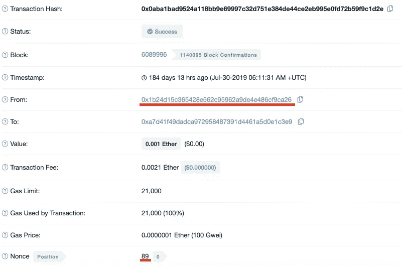
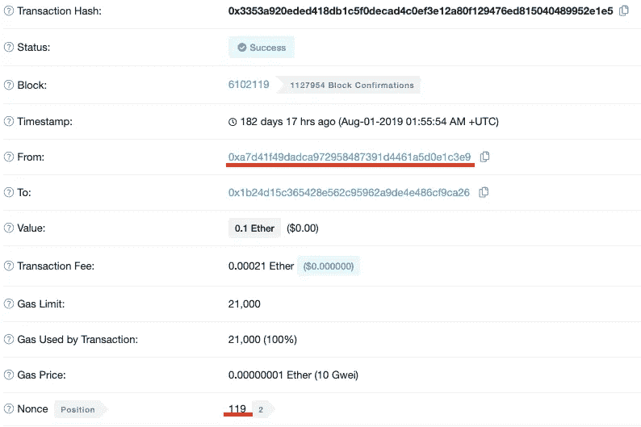

# 以太坊的账号 Nonce 解释

> 原文：<https://medium.com/coinmonks/the-account-nonce-in-ethereum-explained-c087bd4a3c29?source=collection_archive---------1----------------------->

我知道这令人困惑，但以太坊中有两种随机数。矿工试图找到的工作随机数的证明，以解决哈希难题和
2。账户现时作为每个账户中的交易计数器

在这篇文章中，我将解释什么是账户随机数。

当你发送一个交易，一旦它被挖掘出来，你的账户就会增加一个名为 nonce 的值。nonce 跟踪发送方在一段时间内发送了多少交易。

注意，nonce 是发送地址的事务计数器。它不包括该地址收到的交易。

假设你拥有这个地址 `[0x1b24d15c365428e562c95962a9de4e486cf9ca26](https://etherscan.io/address/0x1b24d15c365428e562c95962a9de4e486cf9ca26)`。您可以在这里看到与此地址[相关的交易列表。](https://ropsten.etherscan.io/txs?a=0x1b24d15c365428e562c95962a9de4e486cf9ca26&ps=100&p=1)

在下面的[交易](https://ropsten.etherscan.io/tx/0x0aba1bad9524a118bb9e69997c32d751e384de44ce2eb995e0fd72b59f9c1d2e)中，随机数是`89`。你可以看到它是从你的地址发出的。因此，这意味着您的地址至此已经发送了`90`笔交易(从`0`开始)。

下面我们来看看[另一笔交易](https://ropsten.etherscan.io/tx/0x3353a920eded418db1c5f0decad4c0ef3e12a80f129476ed815040489952e1e5)。该交易的随机数为`119`。这是否意味着到目前为止您的地址已经发送了`120`笔交易？不可以。因为交易是从 `0xa7d41f49dadca972958487391d4461a5d0e1c3e9`发送的，nonce 是这个地址的计数器，不是你的。

您可以看到进出您地址的交易都有帐户 nonce，但不要混淆。只有外发交易影响你的现时。你可以在新交易中看到的随机数是针对其他账户的。

有一些原因可以解释为什么帐号随机数是有用的。首先，它允许我们按顺序发送事务。

如果没有 nonce，您发送事务的顺序可能会被忽略。假设您在 10 秒钟内发送了两个事务。你可能会认为矿工按顺序加工它们。但是在一个分布式系统中，不能保证他们首先收集你的第一个事务，然后第二个一秒钟。然而，如果您有帐户 nonce，矿工需要按顺序处理它们。随机数为`1`的第二个交易不能被处理，直到随机数为`0`的第一个交易被处理。

第二，它保护我们免受重放攻击。如果没有 nonce，发送方可能会通过两次发送相同的交易来重复花费。假设 Alice 签署了一项交易，向 Bob 发送了一些以太网。如果没有随机数，Bob 可以复制这个签名的交易，并继续传播它，直到 Alice 失去所有的钱。由于事务在没有 nonce 的情况下不是唯一的，Bob 可以复制事务。他甚至不必签名，因为他已经可以在网络中找到签名的交易。

当事务包含随机数时，每个事务都是唯一的。也就是说，即使有相同的金额和相同的收件人地址。以太坊网络不会接受具有相同 nonce 的新的传出交易。这保护我们免受重放攻击。如果 Bob 复制一个事务并再次传播它，它将被拒绝。

如果你想了解更多，你可以在这里了解规格[。](https://github.com/ethereum/EIPs/blob/master/EIPS/eip-155.md)

> [在您的收件箱中直接获得最佳软件交易](https://coincodecap.com/?utm_source=coinmonks)

